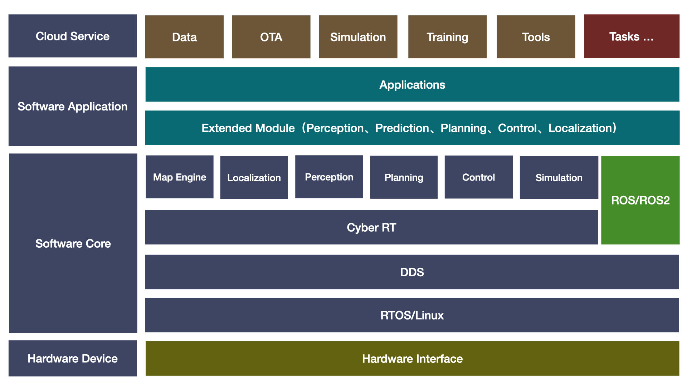

# autonomy
## :seedling:  Introduction



**<font color='green'>autonomy</font>** is a robotic system framework. It does not depend on **<font color='red'>ROS/ROS2 (can coexist with them)</font>** and is designed to establish a Linux system-level algorithmic framework with distributed, <font color='darkkhaki'>**high-throughput, and low-latency capabilities, while also prioritizing easy deployment, easy debugging, and high performance**</font>.

## :tractor: <font color='blue'>**System Overview**</font>

- [x] **Core Architecture**
  - [x] Based on autolink communication framework
  - [x] Supports modular dynamic library plugins
- [x] **Communication Support**
  - [x] Network communication:, gRPC、autolink
  - [x] Message compatibility: Native ROS/ROS2 message formats
- [ ] **Hardware & Drivers**
  - [ ] LiDAR：
  - [ ] IMU：
  - [ ] Cameras: RealSense D435i, RealSense D455
- [ ] **Mapping & Localization**
  - [ ] Multi-sensor data fusion
  - [ ] Laser-based SLAM mapping
  - [ ] Visual SLAM mapping
- [x] **Navigation & Control**
  - [x] Path planning: 2D/2.5D/3D occupancy grid-based global planning
  - [ ] Motion control: 3D path tracking and object following
- [ ] **Perception & Prediction**
  - [ ] LiDAR/Visual perception and prediction
  - [ ]  Target recognition and instance segmentation
- [ ] **Development & Deployment**
  - [x] Supports ROS/ROS2 data ecosystem interoperability
  - [x] Docker cross-platform support (x86-64 & Arm64)
  - [x] Local web visualization (Foxglove)
  - [x] CMake & Bazel build system 
- [x] **Documentation**
  - [x] [Comprehensive user manuals and documentation provided](https://openbot-doc.readthedocs.io/en/latest/)

* :link: **Video Links:**  [bilibili](TODO) (TODO)
* :link: **Code Links:**  [Gitee](https://gitee.com/quanduyong/autonomy.git)
* :link: **Code Links:**  [Github](https://github.com/quandy2020/autonomy.git ) 

## :house_with_garden: Usage

**<font color='green'>Online Documentation Reference</font>** ：[autonomy documents](https://openbot-doc.readthedocs.io/en/latest/)

```bash
# gitee
git clone https://gitee.com/quanduyong/autonomy.git

# github
git clone https://github.com/quandy2020/autonomy.git
```

## :leaves: License

Autonomy is released under the [Apache 2.0 license](https://github.com/AibotBeginer/openbot/blob/main/LICENSE).

## :turtle: Acknowledgments

In the development of Autonomy, we stand on the shoulders of the following repositories:

* [Autoware Universe](https://github.com/autowarefoundation/autoware.universe): Autoware Universe serves as a foundational pillar within the Autoware ecosystem, playing a critical role in enhancing the core functionalities of autonomous driving technologies. This repository is a pivotal element of the Autoware Core/Universe concept, managing a wide array of packages that significantly extend the capabilities of autonomous vehicles.
* [cartographer](https://github.com/cartographer-project/cartographer):  **Cartographer** is a system that provides real-time simultaneous localization and mapping ([SLAM](https://en.wikipedia.org/wiki/Simultaneous_localization_and_mapping)) in 2D and 3D across multiple platforms and sensor configurations.
* [navigation2](https://github.com/ros-navigation/navigation2): **Nav2** is the professionally-supported successor of the ROS Navigation Stack deploying the same kinds of technology powering Autonomous Vehicles brought down, optimized, and reworked for mobile and surface robotics. This project allows for mobile robots to navigate through complex environments to complete user-defined application tasks with nearly any class of robot kinematics. Not only can it move from Point A to Point B, but it can have intermediary poses, and represent other types of tasks like object following, complete coverage navigation, and more. Nav2 is a production-grade and high-quality navigation framework trusted by 100+ companies worldwide.
* [ROS2](https://github.com/ros2): The Robot Operating System (ROS) is a set of software libraries and tools that help you build robot applications. From drivers to state-of-the-art algorithms, and with powerful developer tools, ROS has what you need for your next robotics project. And it's all open source. Full project details on [ROS.org](https://ros.org/)
