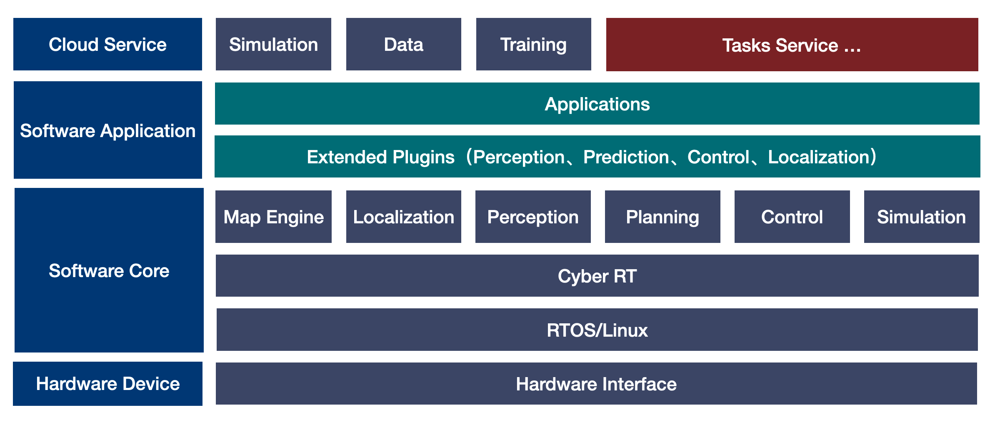

# autonomy

## Introduction



**autonomy** is an autonomous robot software framework. The core library **`libautonomy`** is built with **CMake + C++17** and does not require ROS/ROS2 or the former Autolink middleware at link time (it can still interoperate with ROS-style messages and tooling where supported).

Design goals: modular libraries, behavior-tree task orchestration, 2D navigation stack (costmap, planning, control), and optional bridge layers (gRPC, etc.) for integration.

| Item | Link |
|------|------|
| Documentation | [Read the Docs](https://autonomy.readthedocs.io/en/latest/index.html) |
| Gitee | https://gitee.com/quanduyong/autonomy.git |
| GitHub | https://github.com/quandy2020/autonomy.git |

## System overview

- **Build**
  - [x] CMake 3.20+, C++17, Ninja recommended
  - [x] Lua configuration, Protobuf messages
  - [x] [BehaviorTree.CPP](https://github.com/BehaviorTree/BehaviorTree.CPP) for task plugins
- **Navigation & control**
  - [x] 2D costmap, global planning (e.g. NavFn), controller server
  - [x] In-process behavior-tree navigator (`BtActionServer`)
- **Communication (optional)**
  - [x] gRPC bridge (when `BUILD_GRPC=ON`)
  - [x] ROS/ROS2 message types via `commsgs` (ecosystem compatibility)
- **Deployment**
  - [x] Docker images (x86_64 / aarch64)
  - [x] Dependency installer: `scripts/install_dependency.py`

## Requirements

- Ubuntu 22.04 (recommended; matches Docker images)
- Compiler: GCC 11+ or Clang with C++17
- Dependencies: see `scripts/install_dependency.py` and `docker/dockerfile/autonomy.x86_64.dockerfile`

Main third-party libraries (often installed under `/usr/local` via `docker/install/*.sh`):

- Eigen3, Ceres, glog, gflags, OpenCV, OSQP, yaml-cpp, Lua 5.3, Protobuf
- BehaviorTree.CPP 4.x (required for the `tasks` module)
- Optional: gRPC, Ipopt, ADOLC, ONNX Runtime

## Quick start

### 1. Clone

```bash
git clone https://github.com/quandy2020/autonomy.git
cd autonomy
```

### 2. Install dependencies

On Ubuntu (host or inside a dev container):

```bash
# APT packages + third-party scripts (glog, Ceres, OpenCV, BT.CPP, …)
python3 scripts/install_dependency.py

# APT only
python3 scripts/install_dependency.py --apt-only

# List APT package names
python3 scripts/install_dependency.py --list-apt
```

### 3. Configure and build

```bash
mkdir -p build && cd build
cmake -G Ninja ..
ninja
```

Artifacts:

- Shared library: `build/lib/libautonomy.so`
- Binaries (if enabled): `build/bin/`

### 4. Docker (optional)

From the repository root, use the helper in `docker/` (see `docker/run_autonomy.py`). Mount the repo at `/workspace/autonomy` and build under `src/autonomy/build`:

```bash
export AUTONOMY_ENV=/path/to/autonomy   # repo root containing src/autonomy/
python3 src/autonomy/docker/run_autonomy.py -p x86_64
```

Inside the container:

```bash
cd /workspace/autonomy/src/autonomy/build
cmake -G Ninja ..
ninja
```

## CMake options

| Option | Default | Description |
|--------|---------|-------------|
| `BUILD_GRPC` | ON | gRPC bridge support |
| `BUILD_TEST` | ON | Unit tests |
| `BUILD_DOCS` | ON | Sphinx docs (if found) |
| `BUILD_PROMETHEUS` | OFF | Prometheus metrics |
| `BUILD_ONNXRUNTIME` | ON | ONNX network wrappers (if runtime found) |

## Project layout

```text
autonomy/
├── autonomy/          # C++ source (map, planning, control, tasks, transform, …)
├── config/            # Lua / YAML configuration
├── cmake/             # CMake modules and helpers
├── docker/            # Dockerfiles and install scripts
├── docs/              # Sphinx documentation
├── scripts/           # install_dependency.py, utilities
└── CMakeLists.txt
```

## Documentation

Online manual: [autonomy.readthedocs.io](https://autonomy.readthedocs.io/en/latest/index.html)

Local build:

```bash
cd build && cmake -DBUILD_DOCS=ON .. && ninja
```

## Version

Current version is defined in [`version.json`](version.json) (e.g. **0.1.1**). See [`CHANGELOG.rst`](CHANGELOG.rst) for release notes.

## License

Released under the [Apache 2.0 license](LICENSE).

## Acknowledgments

Autonomy builds on ideas and code from the wider robotics open-source community, including:

- [Autoware Universe](https://github.com/autowarefoundation/autoware.universe)
- [Cartographer](https://github.com/cartographer-project/cartographer)
- [Navigation2](https://github.com/ros-navigation/navigation2)
- [ROS 2](https://github.com/ros2)
- [BehaviorTree.CPP](https://github.com/BehaviorTree/BehaviorTree.CPP)
