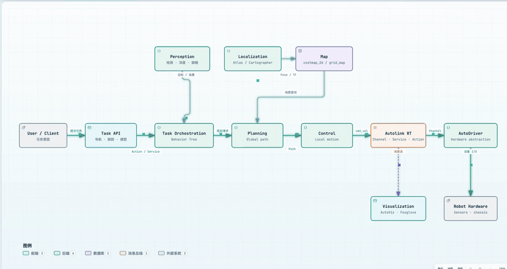
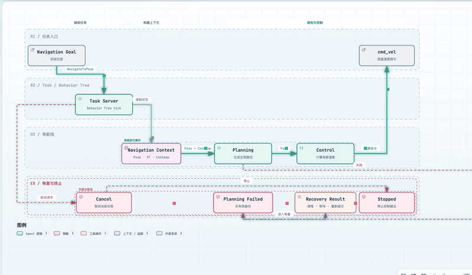
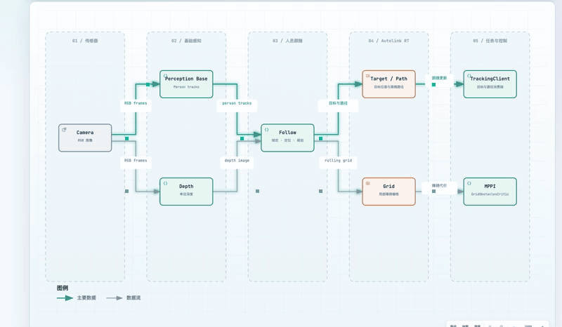

# AUTONOMY

### A modular intelligence framework for autonomous mobile robots

Built with modern C++, Autolink RT, and behavior trees. Designed for production-grade robotics without a ROS runtime dependency.

[](version.json)
[](CMakeLists.txt)
[](docs/source/02_Installation/00_guide.md)
[](LICENSE)

**[Documentation](https://autonomy.readthedocs.io/en/latest/index.html)** ·
**[Installation](docs/source/02_Installation/00_guide.md)** ·
**[Quick Start](docs/source/04_Running/02_quickstart.md)** ·
**[Architecture](docs/source/01_Instructions/03_system_architecture.md)**


`PERCEPTION` · `LOCALIZATION` · `MAPPING` · `PLANNING` · `CONTROL` · `ORCHESTRATION`

---

## Overview

Autonomy is an autonomous software framework for mobile robots operating in indoor and structured environments. It embeds [Autolink](https://github.com/quandy2020/autolink) as its communication runtime and combines unified messages, plugin interfaces, Lua / YAML configuration, and behavior-tree task orchestration. Perception, localization, mapping, planning, control, and hardware integration remain separate modules that can evolve independently.

The framework draws on engineering patterns from Navigation2, Autoware, and Cartographer, while keeping its core runtime independent of ROS / ROS 2. Optional gRPC, Foxglove, and compatible message conventions provide integration points for external ecosystems.

## Why Autonomy

| **Runtime Independent** | **Modular by Design** | **Production Oriented** |
|:---|:---|:---|
| Node, Channel, Service, Action, Parameter, and record / replay without a ROS runtime dependency. | Stable boundaries and plugin interfaces across algorithms, tasks, messages, drivers, simulation, and visualization. | Configuration-driven builds, cross-platform deployment, observability, and hardware abstraction. |

Autonomy brings the complete robotics toolchain into one coherent runtime:

- **Extend with confidence** — planners, controllers, and behavior-tree nodes follow common plugin interfaces.
- **Configure consistently** — Lua, YAML, and Protobuf cover launch, runtime, and interface definitions.
- **Deploy across platforms** — Docker and Ansible workflows support x86_64 and ARM64 environments.
- **Operate as one system** — AutoDriver, AutoSim, AutoViz, evaluation tools, and Foxglove share Autolink RT.

## Capabilities

| Area | Module | Capabilities |
|---|---|---|
| Communication | `autolink/` | In-process transport, shared memory, optional RTPS, Service, Action, and Parameter |
| Messages | `automsgs/` | ROS-style Protobuf messages, services, actions, and C++ / Python code generation |
| Perception | `autonomy/perception/` | Object detection and tracking, monocular depth, and person-following perception |
| Localization | `autonomy/localization/` | Atlas visual SLAM and Cartographer lidar SLAM |
| Mapping | `autonomy/map/` | `costmap_2d`, `grid_map`, occupancy grids, and map services |
| Planning | `autonomy/planning/` | Global planning with NavFn, Dijkstra, Theta\*, and related planners |
| Control | `autonomy/control/` | MPPI, Graceful, Pure Pursuit, and controller state checking |
| Tasks | `autonomy/task/` | Behavior-tree orchestration for navigation, tracking, mapping, teleoperation, and charging |
| Audio | `autonomy/audio/` | Audio capture, inference interfaces, and an optional Sherpa-ONNX backend |
| Hardware | `autodriver/` | Camera, LiDAR, IMU, GPS, CAN bus, and chassis HAL |
| Simulation | `autosim/` | Habitat-Sim sensor–actuator bridge, simulation clock, ground truth, and teleoperation |
| Visualization | `autoviz/` | Native Qt / OpenGL 3D visualization connected directly to Autolink |

> Module availability depends on build options and locally installed dependencies. Some hardware, inference, and bridge backends are optional.

## Architecture

### Runtime Architecture

[](docs/architecture/archify/autonomy-runtime.architecture.html)

### Task and Data Flows

| Navigation Task Workflow | Person-Following Data Flow |
|:---:|:---:|
| [](docs/architecture/archify/navigation-task.workflow.html) | [](docs/architecture/archify/person-following.dataflow.html) |
| Goal, planning, recovery, cancellation | RGB, tracks, depth, target path, local grid |

### Explore the System

The interactive Archify views support route tracing, node focus, light and dark themes, and presentation mode. Select any diagram above or open its definition below.

| View | Trace | Definition |
|:---|:---|:---:|
| **[Runtime Architecture](docs/architecture/archify/autonomy-runtime.architecture.html)** | Task request → behavior tree → algorithms → hardware | [JSON](docs/architecture/archify/autonomy-runtime.architecture.json) |
| **[Navigation Workflow](docs/architecture/archify/navigation-task.workflow.html)** | Goal → planning → recovery → completion or cancellation | [JSON](docs/architecture/archify/navigation-task.workflow.json) |
| **[Person-Following Flow](docs/architecture/archify/person-following.dataflow.html)** | RGB and depth → tracking → target path → local control | [JSON](docs/architecture/archify/person-following.dataflow.json) |

See the [system architecture guide](docs/source/01_Instructions/03_system_architecture.md) for module relationships, configuration pipelines, and runtime data flows.

## Quick Start

### Prerequisites

- Recommended: Ubuntu 22.04 Docker development environment
- Source build: Ubuntu 22.04, CMake 3.20+, GCC 11+ or Clang, and C++17
- Build system: Ninja

### 1. Clone

```bash
git clone --recurse-submodules https://github.com/quandy2020/autonomy.git
cd autonomy
```

If the repository was cloned without submodules:

```bash
git submodule update --init --recursive
```

### 2. Enter the Development Environment

```bash
export AUTONOMY_ENV=/path/to/autonomy
python3 docker/run_autonomy.py -p x86_64
```

### 3. Configure and Build

```bash
cd /workspace/autonomy
cmake -S . -B build -G Ninja
cmake --build build -j"$(nproc)"
```

See the [Docker installation guide](docs/source/02_Installation/05_docker.md) for image, GPU, and ARM64 configuration.

#### Build Directly on the Host

```bash
cd scripts
python3 -m install_deps
cd ..

cmake -S . -B build -G Ninja
cmake --build build -j"$(nproc)"
```

### 4. Run a Minimal Navigation Check

After building, run the ROS-independent behavior-tree navigation test:

```bash
export AUTONOMY_BT_PLUGIN_PATH="$PWD/build/lib"
export GLOG_logtostderr=1

./build/bin/autonomy_nav_test \
  --configuration_directory=config \
  --start_x=1 --start_y=1 --start_yaw=0 \
  --goal_x=5 --goal_y=5 --goal_yaw=0 \
  --use_bt=true \
  --timeout_sec=120
```

The start and goal positions must lie in free space in `config/data/map.pgm`. See [Quick Run](docs/source/04_Running/02_quickstart.md) and [Troubleshooting](docs/source/04_Running/08_troubleshooting.md) for details.

## Project Structure

```text
autonomy/
├── autonomy/      # Autonomous algorithms, tasks, system, and common C++ libraries
├── autolink/      # Communication runtime (Git submodule)
├── automsgs/      # Protobuf messages, services, and actions
├── autodriver/    # Sensor and chassis hardware abstraction
├── autosim/       # Habitat-Sim bridge
├── autoviz/       # Native 3D visualization
├── config/        # Lua / YAML runtime configuration
├── docker/        # Development images and dependency installation
├── ansible/       # Bare-metal and fleet deployment
├── docs/          # Sphinx documentation and architecture assets
├── scripts/       # Dependency, formatting, and packaging tools
└── CMakeLists.txt # Top-level build entry point
```

### Component Guides

- [Autolink](autolink/README.md) — communication runtime
- [AutoMsgs](automsgs/README.md) — messages and code generation
- [AutoDriver](autodriver/README.md) — hardware abstraction layer
- [AutoSim](autosim/README.md) — simulation bridge
- [AutoViz](autoviz/README.md) — native visualization
- [Ansible](ansible/README.md) — build and fleet deployment
- [Scripts](scripts/README.md) — development and CI tools

## Common CMake Options

| CMake option | Default | Description |
|---|---:|---|
| `BUILD_TEST` | `ON` | Build unit tests |
| `BUILD_TOOLS` | `ON` | Build command-line and validation tools |
| `BUILD_DOCS` | `ON` | Build Sphinx documentation |
| `BUILD_GRPC` | `ON` | Build the gRPC Bridge |
| `BUILD_AUTODRIVER` | `ON` | Embed AutoDriver in the root build |
| `BUILD_AUTOVIZ` | `ON` | Build AutoViz |
| `BUILD_AUTOSIM` | `ON` | Install and integrate AutoSim |
| `BUILD_ONNXRUNTIME` | `ON` | Enable the ONNX Runtime perception backend |
| `BUILD_TENSORRT` | `ON` | Enable the TensorRT perception backend |
| `BUILD_SHERPA_ONNX` | `OFF` | Enable the Sherpa-ONNX speech-recognition backend |
| `BUILD_PROMETHEUS` | `OFF` | Enable Prometheus monitoring support |

Example:

```bash
cmake -S . -B build -G Ninja \
  -DBUILD_DOCS=OFF \
  -DBUILD_AUTOVIZ=OFF \
  -DBUILD_TENSORRT=OFF
```

## Deployment

Ansible workflows cover bare-metal installation, artifact distribution, configuration updates, and service restarts:

```bash
cd ansible
pip install "ansible>=8,<10"

./deploy.sh check robots
./deploy.sh deploy robots -e autonomy_artifact_path="$PWD/../dist/autonomy.tar.gz"
```

Configure robot addresses and SSH access in `ansible/inventory/robots/hosts.yml` before deployment. See the [Ansible deployment guide](ansible/README.md) for the complete workflow.

## Documentation

| Topic | Guide |
|---|---|
| Installation and dependencies | [Installation](docs/source/02_Installation/00_guide.md) |
| Communication | [Communication](docs/source/03_Communication/00_guide.md) |
| Building and running | [Running](docs/source/04_Running/00_guide.md) |
| Localization and SLAM | [Localization](docs/source/06_Localization/index.rst) |
| Mapping | [Map](docs/source/07_Map/index.rst) |
| Planning | [Planning](docs/source/08_Planning/index.rst) |
| Control | [Control](docs/source/09_Control/index.rst) |
| Perception | [Perception](docs/source/10_Perception/index.rst) |
| Simulation | [Simulation](docs/source/12_Simulation/index.rst) |
| Visualization | [Visualization](docs/source/13_Visualization/index.rst) |
| Task system | [Tasks](docs/source/17_Tasks/index.rst) |
| Frequently asked questions | [FAQs](docs/source/19_FAQs/index.rst) |

> **Full documentation:** [autonomy.readthedocs.io](https://autonomy.readthedocs.io/en/latest/index.html)

## Contributing

Issues, documentation improvements, and pull requests are welcome. Before modifying a module, read its local README and preserve the existing interface, configuration, and test boundaries.

See the existing module guides for ownership boundaries and validation instructions before submitting a change.

## License

This project is licensed under the [Apache License 2.0](LICENSE).

## Acknowledgments

Autonomy builds on ideas and components from the following open-source projects:

- [Autoware Universe](https://github.com/autowarefoundation/autoware.universe)
- [Cartographer](https://cartographer-project.org/)
- [Navigation2](https://github.com/ros-navigation/navigation2)
- [ROS 2](https://github.com/ros2)
- [BehaviorTree.CPP](https://github.com/BehaviorTree/BehaviorTree.CPP)

---

> **Autonomy** — engineered for modular, observable, and deployable robot intelligence.
> Copyright © Autonomy Contributors
