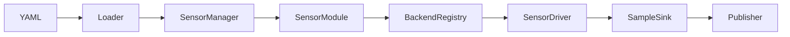

# 架构与模块化

一句话：**模态 Module 固定，厂商 Driver 可插拔**（Registry 工厂）。路径细节见 [数据流](dataflow.md)；Attach 见 [生命周期](lifecycle.md)。

## 分层（职责）

| 层 | 代码 | 职责 | 扩展 |
|---|---|---|---|
| 配置 | `config_loader` | YAML → `Config::Sensor`；`params_file` 合并；`camera` 折叠展开 | 新字段 / 折叠语法 |
| 编排 | `SensorManager`、`SensorHub`、udev | Attach/Detach、对齐、热插拔 | 一般不改 |
| 模态 | `modules.cpp` 中 `*Module` | 按 `SensorType` 调 Registry 建驱动 | **通常不改** |
| 驱动 | `camera|lidar|imu|…/<vendor>/` | `SensorDriver` 实现 | **加厂商在此** |
| 传输 | `common::Stream`、`canbus`、厂商 SDK | 字节 / 帧 | 复用即可 |
| 发布 | `SampleSink` / `bridge::Publisher` | Autolink Writer | 可换自定义 Sink |



## Module ↔ Registry ↔ 默认 backend

| Module | YAML 键 | Registry | 默认 backend | id 前缀 |
|---|---|---|---|---|
| `ImuModule` | `imu` | （串口/CAN 直建；板载走相机 backend） | `serial` | `imu/` |
| `GpsModule` | `gps` | 同上 | `serial` | `gps/` |
| `CameraModule` | `camera` | `CameraBackendRegistry` | `realsense` | `camera/` |
| `PointCloudModule` | `point_cloud` / 折叠 `point_clouds` | PointCloud 注册表 | `realsense` | `camera/` |
| `Lidar2dModule` | `lidar_2d` | `Lidar2dBackendRegistry` | `rplidar` | `lidar/` |
| `Lidar3dModule` | `lidar_3d` | `LidarBackendRegistry` | `velodyne` | `lidar/` |
| `RadarModule` | `radar` | `RadarBackendRegistry` | `conti` | `radar/` |
| `MicrophoneModule` | `microphone` | Mic 注册表 | `respeaker` | `mic/` |
| `RangeModule` | `range` | — | — | `range/`（attach-only） |

内置类名须与 YAML `module`（legacy）或 typed 键推导一致：`CLASS_LOADER_REGISTER_CLASS` 在 `modules.cpp`。

## 注册宏

| 宏 | 头文件 |
|---|---|
| `REGISTER_CAMERA_BACKEND` / `REGISTER_POINTCLOUD_BACKEND` | `camera/backend_register.hpp` |
| `REGISTER_LIDAR_BACKEND` | `lidar/backend_register.hpp` |
| `REGISTER_LIDAR2D_BACKEND` | `lidar/lidar_2d_backend_register.hpp` |

工厂：`shared_ptr<SensorDriver>(const SensorId&, const DriverParams&)`。同名再注册会覆盖并打 WARN。

## SensorDriver 契约

```cpp
GetType() / GetSensorId()
Start() / Stop() / IsRunning()
SetSampleCallback(SampleCallback)  // unique_ptr<SensorSample>，驱动线程调用
```

3D lidar 另可继承 `LidarComponentBase`（`InitPacket`/`WritePointCloud`/`InjectScan`）与可选 `MotionPoseSink`。

## 样本类型（`types/sensor_sample.hpp`）

| SensorType | 样本 | 消息 |
|---|---|---|
| `kImu` | `ImuSample` | `sensor_msgs/Imu` |
| `kGps` | （GPS sample） | `NavSatFix` |
| `kCamera` | `ImageSample` | `Image`（+ camera_info） |
| `kLidar2d` | （LaserScan sample） | `LaserScan` |
| `kLidar3d` | `LidarCloud` / `LidarPacketScan` | `PointCloud2` / 原始 Scan |
| `kRadar` | `RadarSample` | PointCloud2 占位 |
| `kMicrophone` | `MicrophoneSample` | Image PCM 占位 |
| `kRangeFinder` | — | Range |

## 加厂商清单

**相机**：`camera/<v>/` hub+driver → `REGISTER_*` → CMake（`AUTODRIVER_WITH_*`）→ `config/camera/<v>/*.yaml`。  
**3D 激光**：`lidar/<v>/` → `REGISTER_LIDAR_BACKEND` → 点云 `point_step=24`（`x,y,z,intensity,timestamp`）→ `config/lidar/<v>/`。  
**2D 激光**：`REGISTER_LIDAR2D_BACKEND`。  
**勿改** `*Module` / `SensorManager`（除非改编排语义）。

## 进程胶水

`main.cpp`：`LoadConfig` → `Publisher` → `SensorManager` → `PoseFeeder` → 信号退出。库嵌入见 [使用方式](usage.md)。

## 目录

```
autodriver/autodriver/
  config_loader.*  sensor_manager.*  sensor_hub.*  modules.cpp
  common/  canbus/  bridge/  types/
  camera/  lidar/  imu/  gps/  radar/  microphone/  smartereye/
```
