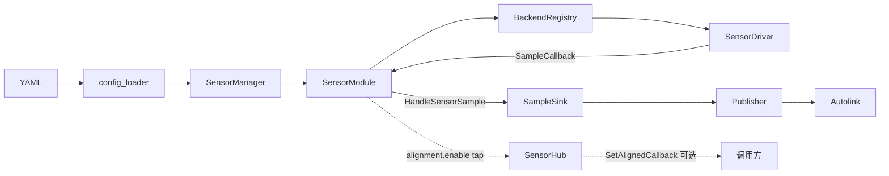
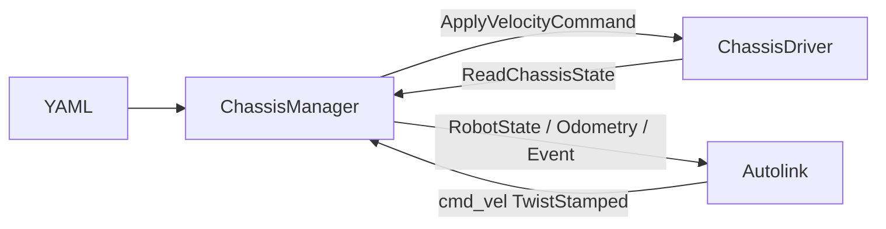

# 架构与模块化

**核心原则**：模态对应的 Module 固定编入库内；厂商 Driver 经 Registry 与 `autolink::common::Factory` 插拔。

本页回答：双域如何划界、分层谁改谁、Registry 如何插拔、如何加厂商。术语见 [术语](glossary.md)。

> 本章结论来自源码与配置的静态分析；分层图与启动顺序与当前 `main.cpp` / 头文件一致，尚未在本文档维护流程中做运行时验证。

| 想了解 | 去读 |
|---|---|
| 字节 → 话题 | [数据流](dataflow.md) |
| Attach / udev / enable | [生命周期](lifecycle.md) |
| YAML 字段 | [配置](configuration.md) |
| 厂商 SDK / Stream | [后端](backends.md) · [传感器手册](../sensor/index.md) |
| C++ 入口 | [API 概览](../api/overview.md) |

---

## 1. 非目标

- 不做 ROS 节点包装；发布面是 Autolink + automsgs。  
- 底盘 **不链** `autonomy/vehicle`（运动学 / 任务层留在 autonomy）。  
- `RangeModule` 为仅 Attach 占位，无 Registry、无真实采集。

---

## 2. 双域边界

| 域 | 编排 | 驱动接口 | 数据方向 |
|---|---|---|---|
| **传感** | `SensorManager` + `*Module` | `SensorDriver` | 硬件 → `SensorSample` → Autolink Writer |
| **本体** | `ChassisManager` | `ChassisDriver` | `/cmd_vel` → SDK；状态 → `/robot_state` `/odom` |

同属 `autodriver` 进程，可共享 Autolink `Node`；**互不** `#include` 对方 SDK。

板载 IMU：可写在折叠配置 `camera.imu`（随相机 backend），或独立 `imu` + `backend: realsense`（`ImuBackendRegistry`）。见 [配置](configuration.md)。

---

## 3. 分层

| 层 | 代码 | 职责 | 谁改 |
|---|---|---|---|
| 配置 | `config_loader` | YAML → `Config`；`params_file`；`camera` 折叠 | 新字段 / 折叠语法 |
| 编排 | `SensorManager`、`SensorHub`、udev | Attach/Detach、对齐旁路、热插拔 | 一般不改 |
| 模态 | `modules.cpp` 中 `*Module` | 按 `SensorType` 调对应 Registry | **通常不改** |
| 工厂 | `BackendRegistry`（`common/backend_registry.hpp`）+ Policy | `backend` 名 → Creator | 加宏注册即可 |
| 驱动 | `…/<vendor>/`、`chassis/<vendor>/` | 实现 `SensorDriver` / `ChassisDriver` | **加厂商在此** |
| 传输 | `common::Stream`、`SerialByteDriverBase` / `CanSensorDriverBase`、`canbus`、厂商 SDK | 字节 / 帧 | 复用 |
| 传感发布 | `SampleSink` / `bridge::Publisher` | 样本 → Autolink Writer | 可换自定义 Sink |
| 本体 IO | `ChassisManager` | cmd_vel / state / odom / event | 一般不改 |

### 3.1 传感路径



| 点 | 事实 |
|---|---|
| 热路径 | Driver → Module → Sink → Publisher（**不经** Hub） |
| 对齐旁路 | `alignment.enable` 时额外 `hub.PushSample`；`publish_raw` / `publish_aligned` 见 [数据流 §2.2](dataflow.md#22-对齐旁路可选) |
| 采集线程 | 样本回调在驱动采集线程 |
| 发布线程 | `Publisher` 有界异步队列独立 `Write`（满则丢最旧） |
| 所有权 | Creator 返回 owning `Product*`；Registry `CreateDriver` 收成 `SharedPtr` |
| 锁 | `SensorManager` 用读写锁保护 Attach/Detach 与 module 表 |

### 3.2 本体路径（消息体 = `vehicle_msgs`）



限速、cmd_vel 看门狗、周期发布在 `ChassisManager` 内完成。

---

## 4. Registry 机制

```text
REGISTER_*_BACKEND(tag, "name", CreateFn, "alias"...)
        │  static init
        ▼
*BackendRegistry::Instance()
        │  NamedProductFactory
        ▼
autolink::common::Factory  (name → Creator)
        │  CreateDriver(backend, id, params)
        ▼
SharedPtr<SensorDriver|ChassisDriver>
```

| 约定 | 说明 |
|---|---|
| Creator | `Product*(const Id&, const DriverParams&)`，owning raw；stub 可 `nullptr` |
| `CreateDriver` | 对外 `SharedPtr`（`NamedProductFactory::CreateShared`） |
| YAML 省略 `backend` | `config_loader` 按模态填入默认值（见 §5「YAML 默认」） |
| Create 时 `backend` 为空 | Registry 再填入与 YAML 默认一致的值（见下） |
| 别名 | `RegisterBackendAlias` / 宏可变参（如 `udp`→`velodyne`） |
| 覆盖 | 同名再注册先 Unregister，打 WARN |

Create 时空串默认：imu/gps→`serial`，camera/point_cloud→`realsense`，lidar3d→`velodyne`，lidar2d→`rplidar`，radar→`conti`，mic→`respeaker`，chassis→`stub`。

封装头：`common/named_factory.hpp`。GPS **语句解析**另有 `GnssParserRegistry`（`NamedProductFactory0`），与 `GpsBackendRegistry`（传输后端）正交。

### 4.1 外置插件

| 类型 | 规则 |
|---|---|
| 内置 | `modules.cpp` 编入 `libautodriver`，`CLASS_LOADER_REGISTER_CLASS` |
| 外置 | YAML `library` 非空时加载 `.so`；搜索 `plugin_dir` / `AUTODRIVER_PLUGIN_DIR` |

见 [生命周期](lifecycle.md) · [FAQ](../faq.md)。

---

## 5. Module ↔ Registry ↔ 默认 backend

| Module / 编排 | YAML 键 | Registry | YAML 默认 | id 前缀 |
|---|---|---|---|---|
| `ImuModule` | `imu` | `ImuBackendRegistry` | `serial` | `imu/` |
| `GpsModule` | `gps` | `GpsBackendRegistry` | `serial` | `gps/` |
| `CameraModule` | `camera` | `CameraBackendRegistry` | `realsense` | `camera/` |
| `PointCloudModule` | `point_cloud` / 折叠 `point_clouds` | `PointCloudBackendRegistry` | `realsense` | `camera/` |
| `Lidar2dModule` | `lidar_2d` | `Lidar2dBackendRegistry` | `rplidar` | `lidar/` |
| `Lidar3dModule` | `lidar_3d` | `LidarBackendRegistry` | `velodyne` | `lidar/` |
| `RadarModule` | `radar` | `RadarBackendRegistry` | `conti` | `radar/` |
| `MicrophoneModule` | `microphone` | `MicrophoneBackendRegistry` | `respeaker` | `mic/` |
| `RangeModule` | `range` | —（仅 Attach） | — | `range/` |
| `ChassisManager` | `chassis` | `ChassisBackendRegistry` | `stub` | `chassis/` |

「YAML 默认」：loader 在条目未写 `backend` 时写入的值；Registry 在 Create 时若 `backend` 为空字符串，再填入同一默认。两套规则已对齐。

---

## 6. 注册宏

| 宏 | 头文件 |
|---|---|
| `REGISTER_IMU_BACKEND` | `imu/backend_register.hpp` |
| `REGISTER_GPS_BACKEND` | `gps/backend_register.hpp` |
| `REGISTER_CAMERA_BACKEND` / `REGISTER_POINTCLOUD_BACKEND` | `camera/backend_register.hpp` |
| `REGISTER_LIDAR_BACKEND` | `lidar/backend_register.hpp` |
| `REGISTER_LIDAR2D_BACKEND` | `lidar/lidar_2d_backend_register.hpp` |
| `REGISTER_RADAR_BACKEND` | `radar/backend_register.hpp` |
| `REGISTER_MICROPHONE_BACKEND` | `microphone/backend_register.hpp` |
| `REGISTER_CHASSIS_BACKEND` | `chassis/backend_register.hpp` |

```cpp
#include "autodriver/lidar/backend_register.hpp"
REGISTER_LIDAR_BACKEND(myvendor, "myvendor", CreateMyDriver, "alias");
```

---

## 7. 驱动契约

### 7.1 SensorDriver（传感）

```cpp
GetSensorType() / GetSensorId()
Start() / Stop() / IsRunning()
SetSampleCallback(SampleCallback)  // unique_ptr<SensorSample>，驱动线程
```

3D lidar 可另继承 `LidarComponentBase`（`InitPacket` / `WritePointCloud` / `InjectScan`）与可选 `MotionPoseSink`（`PushPose`）。补偿链见 [数据流 · 运动补偿](dataflow.md#5-运动补偿3d-激光可选)。

### 7.2 ChassisDriver（本体）

```cpp
GetChassisId()
Start() / Stop() / IsRunning()
ApplyVelocityCommand(TwistStamped)   // 零速 = soft stop
ReadChassisState(RobotState*)
TriggerEmergencyStop()
SetEventCallback(optional)           // RobotEvent
```

消息体即 automsgs（`TwistStamped` / `RobotState` / `RobotEvent`），见 `chassis/types.hpp`。

---

## 8. 样本类型

定义见 `types/sensor_sample.hpp`；与 [术语 §5](glossary.md#5-样本类型) 一致。

| SensorType | 样本类型 | 典型 Autolink 消息 |
|---|---|---|
| `kImu` | `ImuSample` | `sensor_msgs/Imu` |
| `kGps` | `GpsSample` | `sensor_msgs/NavSatFix` |
| `kCamera` | `CameraFrame` | `sensor_msgs/Image`（+ `camera_info`） |
| `kLidar2d` | `LidarScan` | `sensor_msgs/LaserScan` |
| `kLidar3d` | `LidarCloud` / `LidarPacketScan` | `PointCloud2` / 原始 Scan |
| `kRadar` | `RadarSample` | PointCloud2（占位） |
| `kMicrophone` | `MicrophoneSample` | Image 承载 PCM（占位） |
| `kRangeFinder` | — | Range（仅 Attach，无采集） |

通道缺省：`ResolveChannel`（`sensor_traits.hpp`）。图像旁路 `camera_info`：`bridge::CameraInfoChannelForImage`（`bridge/channels.hpp`）。

---

## 9. 加厂商清单

**共同步骤**

1. 实现驱动（Creator 返回 owning raw，`return new …`）。  
2. 文件末 `REGISTER_*_BACKEND`。  
3. CMake：源文件进 `libautodriver`；可选 `AUTODRIVER_WITH_*` + `find_package`。  
4. `config/<模态>/<vendor>/*.yaml`，条目通过 `params_file` 引用。  
5. **请勿修改** `*Module` / `SensorManager` / `ChassisManager` 的编排语义（除非有意调整编排本身）。

| 模态 | 要点 |
|---|---|
| 相机 / 点云 | `camera/<v>/` hub + driver；`REGISTER_CAMERA_*` / `POINTCLOUD_*` |
| 3D 激光 | `lidar/<v>/` + `UdpScanDriverBase`（UDP 厂商）；`point_step=24` |
| 2D 激光 | `REGISTER_LIDAR2D_BACKEND` |
| IMU / GPS | `SerialByteDriverBase` / `CanSensorDriverBase`；NMEA 经 `GnssParserRegistry` |
| 底盘 | `chassis/<v>/`；`REGISTER_CHASSIS_BACKEND`；消息使用 vehicle_msgs |
| Radar / Mic | 先以 stub（Create 返回 `nullptr`）占位注册，再替换为真实实现 |

厂商参数与 SDK 细节见 [后端](backends.md)。

---

## 10. 进程启动顺序

与 `main.cpp` 一致：

```text
LoadConfig
  → Publisher::Initialize
  → SensorManager::{SetSampleSink, Initialize, Start}
  → PoseFeeder::Start              // compensator.pose_channel 空 → no-op
  → ChassisManager::Start(node)    // chassis.enable=false → no-op
  → 等待信号
  → Stop：Chassis → PoseFeeder → SensorManager   // 与启动逆序
```

`PoseFeeder`：订 Odometry → `SensorManager::PushLidarPose` → 驱动侧 `MotionPoseSink`。见 [数据流 · 运动补偿](dataflow.md#5-运动补偿3d-激光可选)。

库嵌入（自建 Node / Sink）见 [使用方式](usage.md)。

---

## 11. 源码树（概要）

```text
autodriver/
  autodriver/                 # 传感 HAL + bridge
    config_loader.*  sensor_manager.*  sensor_hub.*  modules.cpp
    common/                   # Stream、BackendRegistry、Serial/CAN CRTP、named_factory
    canbus/  bridge/  types/
    camera/  lidar/  imu/  gps/  radar/  microphone/  smartereye/
  chassis/                    # 本体：registry、manager、stub/
  config/  launch/  docs/
```

产物：共享库 `libautodriver`；进程目标 `autodriver_main` → 二进制 `autodriver`。
