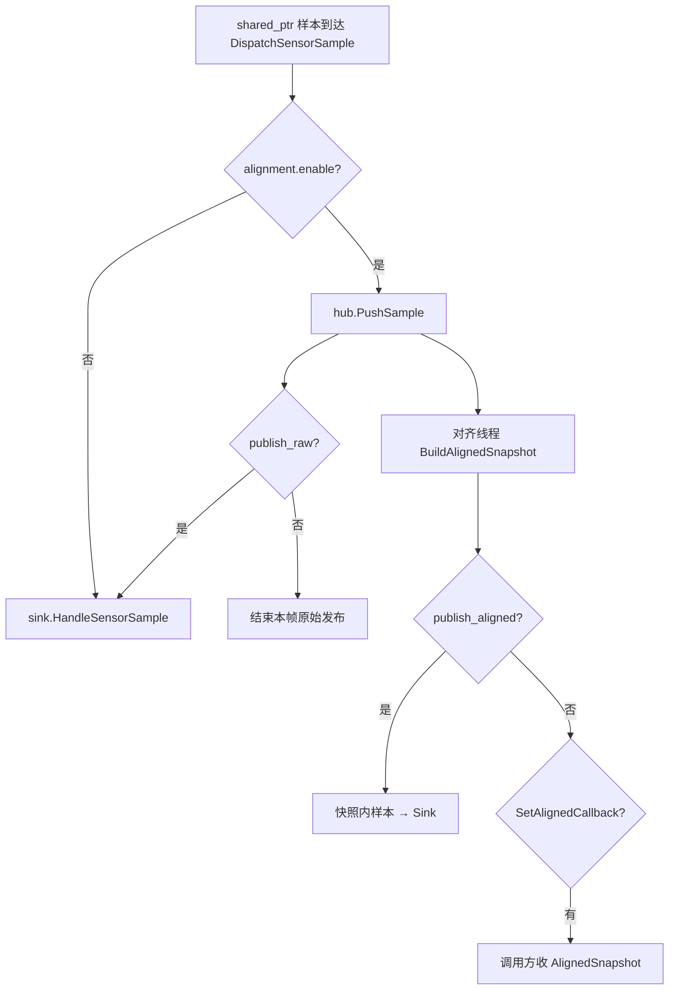

# 数据流

本页回答三件事：

1. **样本从哪来、到哪去**（传感热路径与可选对齐旁路）  
2. **各模态字节如何变成 Autolink 消息**  
3. **本体（底盘）与传感是否共用同一条样本链**（否；仅共享进程内 Node）

> 路径与样本类型以源码为准：`types/sensor_sample.hpp`、`SensorManager::DispatchSensorSample`、`bridge::Publisher`。结论来自静态分析。术语见 [术语](glossary.md)。

| 相关 | 链接 |
|---|---|
| 分层 / Registry | [架构](architecture.md) |
| YAML / channel / alignment | [配置](configuration.md) |
| Attach / Detach | [生命周期](lifecycle.md) |
| 厂商参数 | [后端](backends.md) · [传感器手册](../sensor/index.md) |

---

## 1. 双域总览

| 域 | 编排 | 数据方向 | 是否经 `SampleSink` |
|---|---|---|---|
| **传感** | `SensorManager` + `*Module` + `SensorDriver` | 硬件 → `SensorSample` → Autolink Writer | 是（默认经 `Publisher`） |
| **本体** | `ChassisManager` + `ChassisDriver` | `/cmd_vel` → 驱动；状态 → `/robot_state` 等 | 否（Manager 直接写 Node） |

同进程可共享 `Publisher::GetNode()`；传感样本路径与底盘 IO **互不经过对方**。

---

## 2. 传感公共路径

### 2.1 热路径（默认）

**热路径**（见术语）：Driver → Module → `SensorManager::DispatchSensorSample` → `SampleSink` → Autolink。**默认不经** `SensorHub`。


| 阶段 | 发生什么 | 线程（源码确认） |
|---|---|---|
| 采集 | 驱动解析字节/帧，构造样本 | 驱动采集线程 |
| 回调 | `SampleCallback(unique_ptr)` → Module → Manager | 同上 |
| 发布 | `Publisher` 入队后独立线程 `Write`；队列满丢最旧 | 发布线程 |
| 所有权 | Driver 交出 `unique_ptr`；Module 升为 `shared_ptr` 再进 Manager | — |

Attach 顺序：`module.Init(hook)` → `sink.HandleSensorAttach` → `module.Start`。Detach 逆序关 Writer。细节见 [生命周期](lifecycle.md)。

### 2.2 对齐旁路（可选）

仅当 `alignment.enable: true` 时启用。与热路径的关系由两个开关决定（`config.hpp` / `DispatchSensorSample`）：

| `publish_raw` | `publish_aligned` | 行为 |
|---|---|---|
| `true`（默认） | `false`（默认） | 样本进 Hub **且** 进 Sink（原始流照常发布） |
| `false` | `false` | 仅 tap Hub；**不**进 Sink（无原始发布） |
| `true`/`false` | `true` | Hub 周期快照内各样本再推 Sink；可与 `SetAlignedCallback` 并存（先 Sink，再用户回调） |



调参键：`alignment_window_ms`、`publish_period_ms`、`buffer_capacity`（见 [配置](configuration.md)）。`SensorManager::Start` 在启用对齐时调用 `hub.Start()`。

### 2.3 样本类型 → 典型消息

| SensorType | 样本类型 | Publisher 典型写出 |
|---|---|---|
| `kImu` | `ImuSample` | `sensor_msgs/Imu` |
| `kGps` | `GpsSample` | `sensor_msgs/NavSatFix` |
| `kCamera` | `CameraFrame` | `sensor_msgs/Image`（+ 可选 `camera_info`） |
| `kLidar2d` | `LidarScan` | `sensor_msgs/LaserScan` |
| `kLidar3d` | `LidarCloud` / `LidarPacketScan` | `PointCloud2` / 原始 Scan |
| `kRadar` | `RadarSample` | PointCloud2（占位） |
| `kMicrophone` | `MicrophoneSample` | Image 承载 PCM（占位） |
| `kRangeFinder` | — | 仅 Attach，无样本 |

通道：YAML `channel`（可为数组）或 `ResolveChannel`（`sensor_traits.hpp`）。

---

## 3. 发布（`bridge::Publisher`）

| 钩子 | 时机 | 动作 |
|---|---|---|
| `HandleSensorAttach` | Attach 成功前 | 按 `SensorType` 打开 Writer |
| `HandleSensorSample` | 每帧样本 | 按 `sample->id()` 查表写入对应 Writer |
| `HandleSensorDetach` | Detach | 擦除该 id 的 Writer |
| `HandleDiagnostic` | 诊断上报 | 写 `/diagnostics`（可改 channel） |

| 细节 | 说明 |
|---|---|
| 多 channel | YAML 数组中每个名字开一个 Writer |
| 异步 | `HandleSensorSample` 只入队；独立线程 `Write` |
| camera_info | 每个 image channel 另开一路；仅当帧上 `has_camera_info` 时写入；话题名由 `CameraInfoChannelForImage` 推导 |

---

## 4. 分模态路径

下列每节结构相同：**输入 → 处理 → 样本 → 说明**。厂商 YAML 细节见对应传感器页。

### 4.1 相机（RealSense / Orbbec）

```text
USB → DeviceHub（同机多流共享）
    ├─ CameraDriver     → CameraFrame（+ 可选 CameraInfo）
    ├─ PointCloudDriver → LidarCloud（PointCloud2）
    └─ ImuDriver（板载）→ ImuSample
         → Publisher
```

| 项 | 事实 |
|---|---|
| 配置 | 折叠 `streams` / `point_clouds` / `imu` → 多条 `Config::Sensor`；或扁平单流 |
| Registry | `CameraBackendRegistry` / `PointCloudBackendRegistry` |
| 板载 IMU | 折叠 `camera.imu`，或独立 `imu` + `backend: realsense` |
| SDK 缺失 | Create 返回 `nullptr`（取决于 `AUTODRIVER_HAVE_*`） |

[RealSense](../sensor/camera/realsense.md) · [Orbbec](../sensor/camera/orbbec.md)

### 4.2 RPLidar（2D）

```text
tty → rplidar_sdk → convert → LidarScan → Publisher
```

| 项 | 事实 |
|---|---|
| Registry | `Lidar2dBackendRegistry`（`rplidar` / 别名 `slamtec`） |
| 参数 | `port` / `baud` + `params_file`（`config/lidar/slamtec/a*.yaml`） |
| A3 | 波特率常用 256000 |

[RPLidar](../sensor/lidar/rplidar.md)

### 4.3 Velodyne / Hesai（3D UDP）

```text
UDP → ReadLoop → PacketQueue → ProcessLoop → 切帧（方位角 / 包数）
    → [可选 publish_scan: LidarPacketScan]
    → Convert → [可选 MotionCompensator] → LidarCloud → Publisher
```

| 模式 | 行为 |
|---|---|
| `online`（默认） | 绑定 `data_port`；收包与处理双线程 |
| `raw_packet` | 不绑定网卡；回放用 `PushRawPacket` / `PushScan` |

| 项 | 事实 |
|---|---|
| Registry | `LidarBackendRegistry`（`velodyne`/`udp`，`hesai`/`pandar`） |
| 点云布局 | `point_step=24`：`x,y,z,intensity,timestamp` |
| Hesai XT32 | 包长 1080B；距离分辨率 4mm；校准仰角单位为**度**（勿与 Velodyne 的 rad 混用） |
| 队列满 | 丢最旧包 |

[Velodyne](../sensor/lidar/velodyne.md) · [Hesai](../sensor/lidar/hesai.md)

### 4.4 Livox（3D SDK）

```text
SDK UDP 回调 → FrameAssembler(publish_freq) → PointsToPointCloud → LidarCloud → Publisher
```

| 代 | 机型例 | 关键参数 |
|---|---|---|
| SDK2 | Mid-360 / HAP / Mid360s / Avia2 | `host_ip` / `lidar_ip` 或 `config_path` |
| SDK1 | Mid-40/70 / Horizon / Avia / Tele | `broadcast_code`（空字符串表示全部接收） |

进程内各代 SDK 当前按**单实例**使用。[Livox](../sensor/lidar/livox.md)

### 4.5 串口 / CAN（IMU · GPS）

```text
backend → ImuBackendRegistry | GpsBackendRegistry → Driver
    SerialStream | CanReceiver
        → WitMotion / GnssParser / ProtocolData
        → ImuSample | GpsSample → Publisher
```

| 项 | 事实 |
|---|---|
| IMU backends | `serial`、`can`、`realsense`（依赖 librealsense） |
| GPS backends | `serial`（NMEA）、`can` |
| 语句解析 | `GnssParserRegistry`（`nmea` / `nmea0183`），与传输后端正交 |
| 断线 | 串口可经 `ReconnectStream` 退避重连 |

[IMU/GPS](../sensor/imu_gps.md)

### 4.6 Radar / Microphone / Range（占位）

| 模态 | 路径 | 状态 |
|---|---|---|
| Radar | `RadarBackendRegistry` → Conti stub | Create 通常返回 `nullptr` |
| Microphone | `MicrophoneBackendRegistry` → Respeaker stub | 同上 |
| Range | `RangeModule` | 仅 Attach；无 Driver、无样本 |

[Stub](../sensor/stubs.md)

---

## 5. 运动补偿（3D 激光可选）

与样本热路径正交：位姿从 Autolink 注入驱动侧缓冲，仅 `enable_compensator` 的 3D 驱动在 Convert 后使用。

```text
Autolink Odometry（compensator.pose_channel）
  → PoseFeeder
  → SensorManager::PushLidarPose(id, t, pose)
  → MotionPoseSink / PoseBuffer
  → MotionCompensator
```

| 项 | 事实 |
|---|---|
| 进程级开关 | `compensator.pose_channel` 非空才订阅 |
| 驱动级开关 | `enable_compensator` |
| 无通道 | `PoseFeeder::Start` 立即成功（no-op） |
| 失败 | id 未 Attach，或驱动非 `MotionPoseSink` → `PushLidarPose` 返回 `false` |

---

## 6. 本体（底盘）

不经 `SampleSink`；与传感共用进程内 Autolink `Node`（若由同一 `Publisher` 提供）。

```text
Autolink /cmd_vel（TwistStamped）
  → ChassisManager（限速 + watchdog）
  → ChassisDriver::ApplyVelocityCommand

ChassisDriver::ReadChassisState（周期）
  → /robot_state（RobotState）
  → /odom（Odometry，可选）
  → /robot_event（RobotEvent，可选）
```

| 项 | 事实 |
|---|---|
| 建驱动 | `ChassisBackendRegistry`（YAML 默认 `stub`） |
| 看门狗 | `watchdog_ms` 内无新 cmd → 下发零速（soft stop） |
| 周期 | `odom_period_ms` 读状态并发布 |

见 [架构 · 双域边界](architecture.md#双域边界)。
