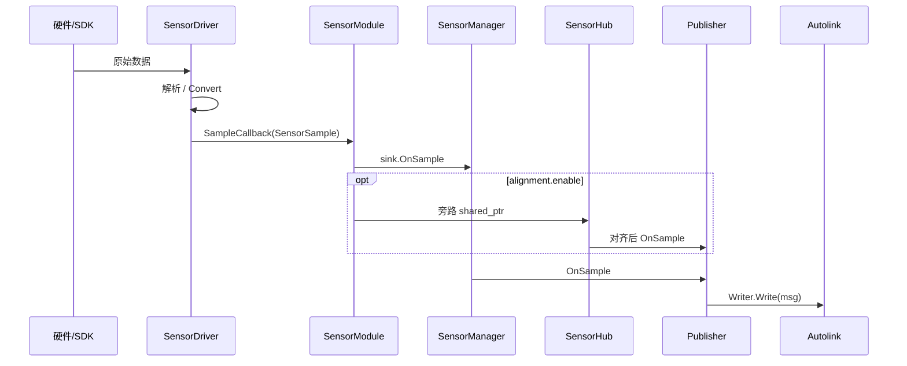

# 数据流

从硬件字节到 Autolink 话题的路径，按模态分开说明。

## 总路径



热路径（对齐关闭）：**stamp → SampleSink → Writer**，不经过 Hub。

---

## 相机（RealSense / Orbbec）

```text
USB 设备
  → DeviceHub（同机多流合并）
      → CameraDriver / PointCloudDriver / ImuDriver
          → ImageSample / LidarCloud / ImuSample
              → Publisher（Image + camera_info Writer）
```

| 步骤 | 说明 |
|---|---|
| 配置 | 折叠 `streams` / `point_clouds` / `imu` → 多个 `Config::Sensor` |
| Registry | `CameraBackendRegistry` / PointCloud 表按 `backend` 建驱动 |
| Hub | 一台物理机一个 pipeline；多 stream 共享 |

通道由 YAML `channel` 决定；camera_info 由 `CameraInfoChannelForImage` 推导。

---

## 2D 激光（RPLidar）

```text
串口 /dev/ttyUSB* 或 /dev/rplidar
  → rplidar_sdk（grab HQ nodes）
      → convert → LaserScan
          → LidarScan / 对应 Sample → Publisher
```

参数：`port`/`baud` + `params_file`（型号波特率、`scan_mode`）。

---

## 3D 激光 · UDP（Velodyne / Hesai）

```text
UDP data_port
  → ReadLoop → PacketQueue（有界，满丢最旧）
      → ProcessLoop → 方位角切帧（scan_cut）
          → optional LidarPacketScan（publish_scan）
          → ConvertPacketsToPointCloud
          → optional MotionCompensator（PoseBuffer / PoseFeeder）
          → LidarCloud (PointCloud2) → Publisher
```

| 模式 | 行为 |
|---|---|
| `source_type: online` | 起读包/处理线程 |
| `raw_packet` | 不绑网卡；`PushRawPacket` / `PushScan` 回放 |

点云布局：`point_step=24`（`x,y,z,intensity` f32 + `timestamp` f64 ns）。

---

## 3D 激光 · SDK（Livox）

```text
以太网 UDP（SDK 内部）
  → Livox-SDK1 或 SDK2 点云回调
      → FrameAssembler（按 publish_freq 组帧）
          → PointsToPointCloud → LidarCloud → Publisher
```

SDK2：`config_path` JSON 或由 `host_ip`/`lidar_ip` 生成临时配置。  
SDK1：广播发现 + `broadcast_code` 白名单。

---

## 串口 IMU / GPS

```text
SerialStream.Read
  → WitMotion parser / NMEA parser（或 GnssParserRegistry）
      → ImuSample / NavSatFix sample
          → Publisher
```

CAN 路径：`CanClient` → `CanReceiver` → `ProtocolData::Parse` → 同上。

---

## 发布与通道

`bridge::Publisher`：

1. `OnAttach`：按 `SensorType` 打开 Writer（相机可再开 camera_info）  
2. `OnSample`：写入 `channels[0]`（多 channel 时由 traits / ResolveChannel 决定）  
3. `OnDetach`：关闭 Writer  

默认话题规则见 `sensor_traits.hpp` 的 `ResolveChannel`。

## 运动补偿旁路

```text
compensator.pose_channel (Odometry)
  → PoseFeeder → SensorManager.PushLidarPose
      → MotionPoseSink / PoseBuffer
          → Compensate(PointCloud2)
```

仅 `enable_compensator: true` 的 3D lidar 驱动使用。

## 相关

- [架构](architecture.md)
- [生命周期](lifecycle.md)
- [传感器手册](../sensor/index.md)
