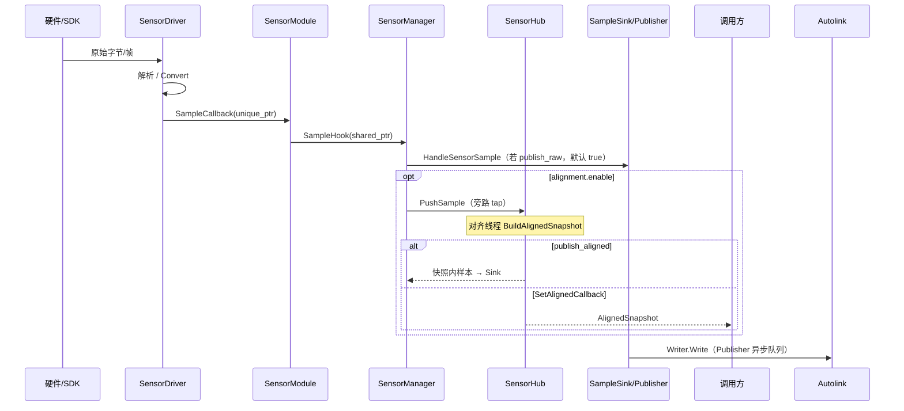

# 数据流

硬件 → 驱动线程回调 → `SensorManager` 分发 → `SampleSink`（`Publisher`）→ Autolink。

| 相关 | 链接 |
|---|---|
| 分层 / Registry | [架构](architecture.md) |
| YAML / channel | [配置](configuration.md) |
| Attach / Detach | [生命周期](lifecycle.md) |
| 厂商参数 | [后端](backends.md) · [传感器手册](../sensor/index.md) |

## 总路径（传感）



| 点 | 事实 |
|---|---|
| 热路径 | Driver → Module → `DispatchSensorSample` → Sink；**默认不经 Hub** |
| `alignment.enable` | **额外** `hub.PushSample` |
| `publish_raw` | 默认 true：原始样本仍进 Sink；false 时只 tap Hub |
| `publish_aligned` | 默认 false；true 时 Manager 把快照内各样本再推 Sink |
| 对齐快照回调 | `SetAlignedCallback` 可与 `publish_aligned` 并存（先 Sink 再用户回调） |
| 线程 | 驱动采集线程回调 → Manager；`Publisher` 异步 Write；Hub 另有对齐线程 |
| 所有权 | Driver 交 `unique_ptr`；Module 升为 `shared_ptr` 再进 Manager |

Attach 时顺序：`module.Init(hook)` → `sink.HandleSensorAttach` → `module.Start`。Detach 逆序关 Writer。见 [生命周期](lifecycle.md)。

## 发布（`bridge::Publisher`）

| 钩子 | 动作 |
|---|---|
| `HandleSensorAttach` | 按 `SensorType` 开 Writer；channel 来自 YAML 或 `ResolveChannel` |
| `HandleSensorSample` | 按 `sample->id()` 查表写对应 Writer |
| `HandleSensorDetach` | 擦除该 id 的 Writer |
| `HandleDiagnostic` | `/diagnostics`（`DiagnosticArray`；可改 channel） |

| 细节 | 说明 |
|---|---|
| 多 channel | YAML `channel` 可为数组；每个开一个 Writer |
| 异步发布 | `HandleSensorSample` 入队；独立线程 Write；队列满丢最旧 |
| camera_info | 每个 image channel 再开一路；帧级仅当 `has_camera_info` 时写入；名由 `CameraInfoChannelForImage` |
| 缺省话题 | `sensor_traits.hpp` → `ResolveChannel(id, type, stream)` |

## 相机 RealSense / Orbbec

```text
USB → DeviceHub（同机多流共享）
    → CameraDriver      → ImageSample (+ 可选 CameraInfo)
    → PointCloudDriver  → LidarCloud (PointCloud2)
    → ImuDriver（板载） → ImuSample
    → Publisher
```

| 项 | 事实 |
|---|---|
| 配置 | 折叠 `streams` / `point_clouds` / `imu` → 多条 `Config::Sensor`；或扁平单流 |
| 建驱动 | `CameraBackendRegistry` / `PointCloudBackendRegistry`；`backend` 键 |
| 板载 IMU | 折叠进相机，或独立 `imu` + `backend: realsense` |
| Orbbec | 无 SDK 时 Create→`nullptr`；RealSense 同理取决于 `AUTODRIVER_HAVE_*` |

厂商页：[RealSense](../sensor/camera/realsense.md) · [Orbbec](../sensor/camera/orbbec.md)。

## RPLidar（2D）

```text
tty → rplidar_sdk grab HQ → convert → LaserScan sample → Publisher
```

| 项 | 事实 |
|---|---|
| Registry | `Lidar2dBackendRegistry`（`rplidar` / 别名 `slamtec`） |
| 参数 | `port`/`baud` + `params_file`（`config/lidar/slamtec/a*.yaml`） |
| A3 | 波特率常 256000 |

详见 [RPLidar](../sensor/lidar/rplidar.md)。

## Velodyne / Hesai（3D UDP）

```text
UDP → ReadLoop → PacketQueue → ProcessLoop → 方位角切帧
    → [publish_scan: LidarPacketScan]
    → Convert → [MotionCompensator?] → LidarCloud → Publisher
```

| 模式 | 行为 |
|---|---|
| `online`（默认） | 绑 `data_port`；收包 + 处理双线程 |
| `raw_packet` | 不绑网卡；回放用 `PushRawPacket` / `PushScan` |

| 项 | 事实 |
|---|---|
| Registry | `LidarBackendRegistry`（`velodyne`/`udp`，`hesai`/`pandar`） |
| 点云布局 | `point_step=24`：`x,y,z,intensity,timestamp` |
| Hesai XT32 | 包长 1080B；距离分辨率 4mm |
| 队列 | 满则丢最旧包 |
| 补偿 | `enable_compensator` + 下方运动补偿链 |

详见 [Velodyne](../sensor/lidar/velodyne.md) · [Hesai](../sensor/lidar/hesai.md)。

## Livox（3D SDK）

```text
SDK UDP 回调 → FrameAssembler(publish_freq) → PointsToPointCloud → LidarCloud
```

| 代 | 选型 | 关键参数 |
|---|---|---|
| SDK2 | Mid-360 / HAP / Mid360s / Avia2 | `host_ip`/`lidar_ip` 或 `config_path` |
| SDK1 | Mid-40/70 / Horizon / Avia / Tele | `broadcast_code`（空=全收） |

进程内各代 SDK 当前按**单实例**使用。详见 [Livox](../sensor/lidar/livox.md)。

## 串口 / CAN IMU·GPS

```text
YAML backend → ImuBackendRegistry | GpsBackendRegistry → Driver
    SerialStream | CanReceiver
        → WitMotion / GnssParser / ProtocolData
        → ImuSample | Gps sample → Publisher
```

| 项 | 事实 |
|---|---|
| IMU backends | `serial`、`can`、`realsense`（需 librealsense） |
| GPS backends | `serial`（NMEA）、`can` |
| GNSS 句解析 | `GnssParserRegistry::CreateParser("nmea"|"nmea0183")`，与传输解耦 |
| 断线 | 串口驱动可走 `ReconnectStream` 退避重连 |

详见 [IMU/GPS](../sensor/imu_gps.md)。

## Radar / Microphone / Range

| 模态 | 路径 | 状态 |
|---|---|---|
| Radar | `RadarBackendRegistry` → Conti stub | Create 常为 `nullptr` |
| Microphone | `MicrophoneBackendRegistry` → Respeaker stub | 同上 |
| Range | `RangeModule` attach-only | 无 Driver / 无样本 |

见 [Stub](../sensor/stubs.md)。

## 运动补偿

```text
Autolink Odometry(compensator.pose_channel)
  → PoseFeeder
  → SensorManager::PushLidarPose(id, t, pose)
  → MotionPoseSink / PoseBuffer
  → MotionCompensator（仅 enable_compensator 的 3D 驱动）
```

| 项 | 事实 |
|---|---|
| 开关 | 进程级 `compensator.pose_channel`；驱动级 `enable_compensator` |
| 无通道 | `PoseFeeder::Start` 立即成功（no-op） |
| 失败 | id 未 attach 或驱动非 `MotionPoseSink` → `PushLidarPose` 返回 false |

## 本体（底盘）

与传感样本路径独立，同进程共享 `Publisher::GetNode()`：

```text
Autolink /cmd_vel (TwistStamped)
  → ChassisManager（限速 + watchdog）
  → ChassisDriver::ApplyVelocityCommand
ChassisDriver::ReadChassisState（周期）
  → /robot_state (RobotState)
  → /odom (Odometry，可选)
  → /robot_event (RobotEvent，可选)
```

| 项 | 事实 |
|---|---|
| 建驱动 | `ChassisBackendRegistry`（默认 `stub`） |
| 看门狗 | `watchdog_ms` 内无新 cmd → 零速 soft stop |
| 周期 | `odom_period_ms` 读状态并发布 |

详见 [架构 · 本体](architecture.md#双域边界) · `chassis/README.md`。

## 时间对齐旁路（可选）

当 `alignment.enable: true`：

1. `SensorManager::Start` 调 `hub.Start()`（对齐发布线程）。  
2. 每个样本：`hub.PushSample`；若 `publish_raw`（默认 true）再 `sink.HandleSensorSample`。  
3. Hub：时间同步 → 环形缓冲 → 周期 `BuildAlignedSnapshot`。  
4. 若 `publish_aligned: true`，快照内样本经 Sink 发布；`SetAlignedCallback` 可同时收到完整快照。

调参：`publish_raw` / `publish_aligned` / `alignment_window_ms` / `publish_period_ms` / `buffer_capacity`（见 [配置](configuration.md)）。
