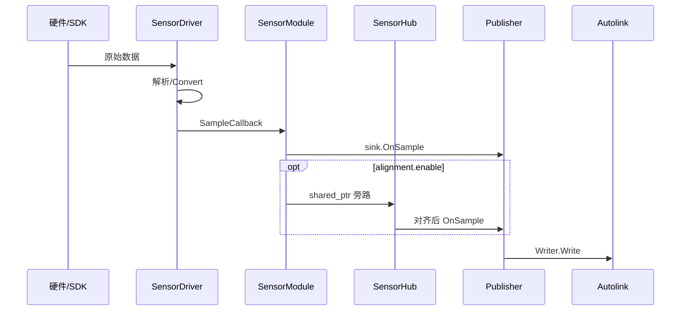

# 数据流

硬件 → 驱动回调 → `SampleSink` → Autolink。架构分层见 [架构](architecture.md)。

## 总路径



- 对齐 **关**：热路径不经 Hub。  
- 回调在**驱动线程**；Publisher 侧需线程安全 Writer。

## 相机 RealSense / Orbbec

```text
USB → DeviceHub（同机多流）→ Camera/PointCloud/Imu Driver
    → ImageSample | LidarCloud | ImuSample → Publisher
```

| 项 | 事实 |
|---|---|
| 配置 | 折叠 `streams`/`point_clouds`/`imu` → 多条 `Config::Sensor`；或扁平单流 |
| 建驱动 | `CameraBackendRegistry` / PointCloud 表，`backend` 键 |
| camera_info | `OnAttach` 可开第二 Writer；通道由 `CameraInfoChannelForImage` |
| RealSense Writer | color 等开 camera_info（以 Publisher 实现为准） |

## RPLidar（2D）

```text
tty → rplidar_sdk grab HQ → convert → LaserScan sample → Publisher
```

`port`/`baud` + `params_file`（`lidar/slamtec/a*.yaml`）。A3 波特率 256000。

## Velodyne / Hesai（3D UDP）

```text
UDP → ReadLoop → PacketQueue → ProcessLoop → 方位角切帧
    → [publish_scan: LidarPacketScan]
    → Convert → [MotionCompensator] → LidarCloud → Publisher
```

| 模式 | 行为 |
|---|---|
| `online` | 绑 `data_port`，双线程 |
| `raw_packet` | 无网卡；`PushRawPacket` / `PushScan` |

点云：`point_step=24`。Hesai XT32 包 1080B、距离 4mm。队列满丢最旧。

## Livox（3D SDK）

```text
SDK UDP 回调 → FrameAssembler(publish_freq) → PointsToPointCloud → LidarCloud
```

| 代 | 选型 | 关键参数 |
|---|---|---|
| SDK2 | Mid-360/HAP/Mid360s/Avia2 | `host_ip`/`lidar_ip` 或 `config_path` |
| SDK1 | Mid-40/70/Horizon/Avia/Tele | `broadcast_code`（空=全收） |

进程内各代 SDK 当前按单实例使用。

## 串口 / CAN IMU·GPS

```text
SerialStream | CanReceiver → Parser/ProtocolData → Imu/Gps sample → Publisher
```

GNSS 工厂：`GnssParserRegistry::Create("nmea"|"nmea0183")`。

## 发布

| 钩子 | 动作 |
|---|---|
| `OnAttach` | 开 Writer（按 `SensorType`） |
| `OnSample` | 写 `channels`（缺省见 `ResolveChannel`） |
| `OnDetach` | 关 Writer |
| `OnDiagnostic` | `/diagnostics`（`DiagnosticArray`） |

## 运动补偿

```text
Odometry(compensator.pose_channel) → PoseFeeder → PushLidarPose
  → PoseBuffer → MotionCompensator（仅 enable_compensator 的 3D 驱动）
```
