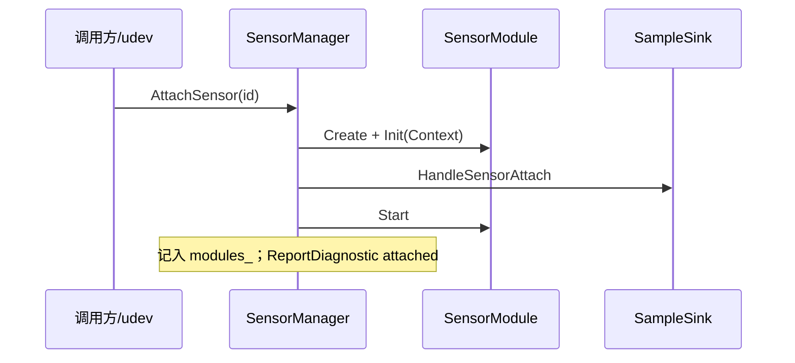

# 生命周期

`SensorManager` 管理传感：配置 → Attach/Detach → 可选 udev 热插拔。样本经 `SampleSink`（通常 `bridge::Publisher`）发布。底盘由 `ChassisManager` 独立启停，见文末。

> Attach/Detach 顺序与 udev 条件来自 `SensorManager` 及相关源码的静态分析。

| 相关 | 链接 |
|---|---|
| 进程参数 / 嵌入 | [使用方式](usage.md) |
| YAML `enable` / `match` | [配置](configuration.md) |
| 样本与对齐 | [数据流](dataflow.md) |
| udev 排障 | [FAQ](../faq.md) |
| 术语 | [术语](glossary.md) |

## 进程流程（传感）

与 `main.cpp` 一致时，传感相关片段：

```text
LoadConfig(YAML)
  → Publisher.Initialize()              # Autolink Node
  → SensorManager(config)
  → SetSampleSink(&publisher)
  → Initialize()                        # 查重 id 等
  → Start()
       ├─ alignment.enable → hub.Start()
       ├─ 对 autostart==true 的条目 AttachSensor(id)
       └─ hotplug.udev → StartUdev()（仅 Linux + AUTODRIVER_HAVE_UDEV）
  → … 运行（可再 Attach / Detach / HandleDeviceEvent）…
  → Stop()
       ├─ 对已 Attach 全部 DetachSensor
       ├─ hub.Stop()
       └─ StopUdev()（join 监控线程）
```

`Initialize` 失败则不应 `Start`。`Start` 前未 `Initialize` 时会先尝试 `Initialize`。

## enable / autostart 语义

typed YAML（`imu` / `camera` / …）中：

| `enable` | 行为 |
|---|---|
| `true`（或旧别名 `attach_on_start: true`） | 条目进入 `Config.sensors`，且 **`autostart=true`**，`Start()` 时自动 Attach |
| `false` / 省略 | **不进入 Config**，之后也无法 `AttachSensor` / udev 命中 |

折叠子项（`streams` 等）：子节点可单独 `enable`；未写时继承父级「已启用」语义（见 loader）。

因此：

- 热插拔仅作用于 **已加载进 Config 且带有效 `match`** 的条目。  
- 若需「平时 Detach、插入后再 Attach」，仍须设置 **`enable: true`** 并配置 `match`；拔出触发 Detach，再插入触发 Attach。  
- 运行中亦可在代码中调用 `AttachSensor` / `DetachSensor`（id 必须已在 Config 中）。

## Attach / Detach

| 性质 | 说明 |
|---|---|
| 幂等 | 已 Attach 再 Attach → 成功；未 Attach 再 Detach → no-op |
| 并发 | Manager 用读写锁；Attach/Detach 持写锁 |
| 失败 | 未知 id、CreateClassObj / Init / Start / sink Attach 失败 → 返回 `false`，进程可继续 |

成功路径（源码确认的顺序）：



### AttachSensor(id) 顺序

1. 在 `Config.sensors` 中查找 id。  
2. **内置**：`library` 空 → `ClassLoaderManager` 按 `module` 名创建（编在 `libautodriver`）。  
3. **外置**：`library` 非空 → 按 `plugin_dir` / `AUTODRIVER_PLUGIN_DIR` 解析路径，`ClassLoader` 加载 `.so`。  
4. `Init(Context{sensor, hook})`：hook → `DispatchSensorSample`。  
5. `sink->HandleSensorAttach`（打开 Writer）；失败则回滚 module。  
6. `module->Start()`（启动硬件 / 采集线程）；失败则 `HandleSensorDetach` 并卸载。  
7. 记入 `modules_`；诊断 `kOk` / `"attached"`。

### DetachSensor(id) 顺序

1. `module->Stop()`，从 `modules_` 移除。  
2. `sink->HandleSensorDetach`（关闭 Writer）。  
3. `hub.DropSampleBuffer(id)`。  
4. 外置库若无其它传感器引用，则 unload。  
5. 诊断 `kDisconnected` / `"detached"`。

## udev 热插拔

前提（同时满足）：

1. YAML `hotplug.enable_udev: true`（默认多为 true）  
2. 编译定义 `AUTODRIVER_HAVE_UDEV`（Linux 找到 libudev）  
3. 传感器已 `enable` 并进入 Config，且 `match` 非空（或 serial 自动补全，见下文）

流程：

```text
udev ADD/REMOVE
  → 填 DeviceMatch（subsystem / DEVNAME / idVendor / idProduct / serial）
  → Config::FindId(observed)   # 首个 MatchDevice 命中的传感器
  → ADD → AttachSensor；REMOVE → DetachSensor
```

macOS / 无 udev：监控线程不启动；可用测试 API `HandleDeviceEvent(added, match)` 注入。

### MatchDevice 规则

| 规则 | 行为 |
|---|---|
| `rule` 全空 | **永不**匹配 |
| 非空字段 | 须全部满足（AND） |
| `vendor` / `product` | 十六进制比较；可带 `0x`；大小写不敏感 |
| `subsystem` / `device` / `serial` | 精确字符串匹配 |

`FindId`：按 `sensors` 顺序返回**第一个**命中的 id；多传感器共用同一 USB 特征时注意规则要可区分。

### serial 自动 match

backend 为串口且未写 `match` 时，若已有 `params.device`（YAML `port`），loader 自动：

```text
match.subsystem = tty
match.device    = <port 路径>
```

便于 USB 转串口插拔。相机 USB 等须在 YAML 显式写 `match`。

## 对齐旁路

`alignment.enable: true` 时（术语见 [术语 · 对齐旁路](glossary.md)）：

| 行为 | 说明 |
|---|---|
| `Start` | 调用 `hub.Start()`（对齐发布线程）；按配置连接 `publish_aligned` |
| 每个样本 | `hub.PushSample`；`publish_raw`（默认 true）时仍进入 Sink |
| 对齐快照 | `publish_aligned` 经 Sink；或通过 `SetAlignedCallback` 自行获取 |
| `Stop` | `hub.Stop()`；Detach 时调用 `DropSampleBuffer` |

关闭对齐时热路径只有 stamp → sink。细节见 [数据流 · 时间对齐](dataflow.md#时间对齐旁路可选)。

## 诊断

Attach/Detach 成功失败会 `ReportDiagnostic` → Sink `HandleDiagnostic`（Publisher 写 `/diagnostics`）。字段含 id、状态（ok / disconnected / error）、message。

## 本体（ChassisManager）

与传感并行、同进程：

| 阶段 | 行为 |
|---|---|
| Start | `chassis.enable` 为 false → 立即成功；否则 Registry 建驱动 + Autolink Reader/Writer + 发布线程 |
| 运行 | cmd_vel → 限速 / watchdog → `ApplyVelocityCommand`；周期 `ReadChassisState` |
| Stop | 停线程；可选 E-stop；释放驱动与 Writer |

无 udev；不参与 `SensorManager` Attach 表。见 [架构](architecture.md) · [使用方式](usage.md)。

## 相关

- [配置 · 热插拔匹配](configuration.md)  
- [API · SensorManager](../api/overview.md)  
- [快速开始](quickstart.md)
