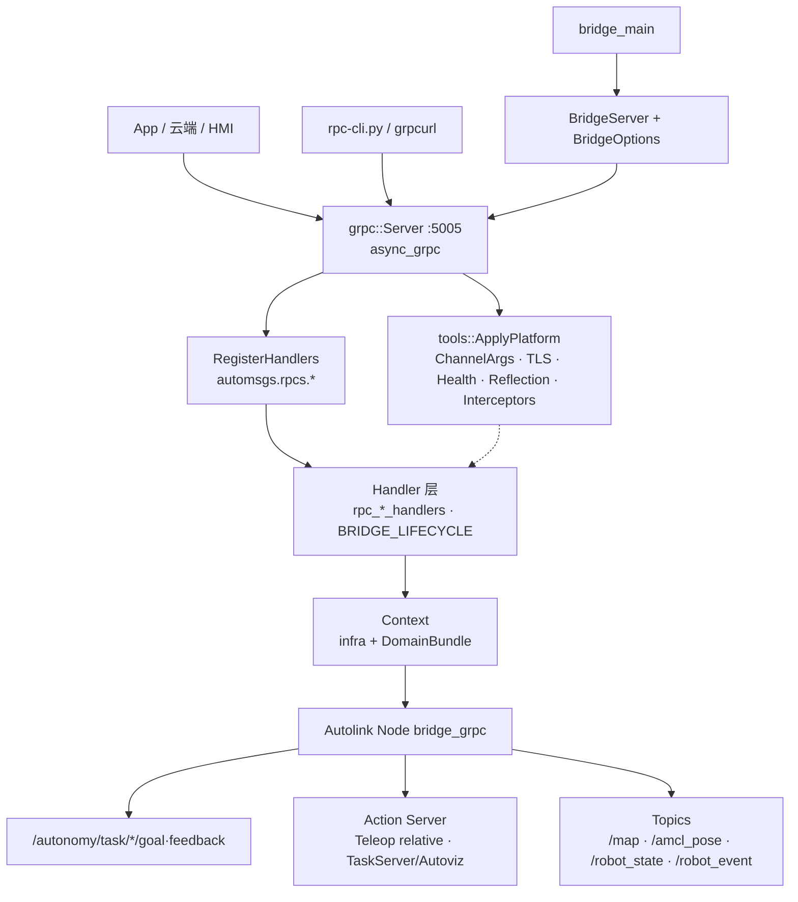
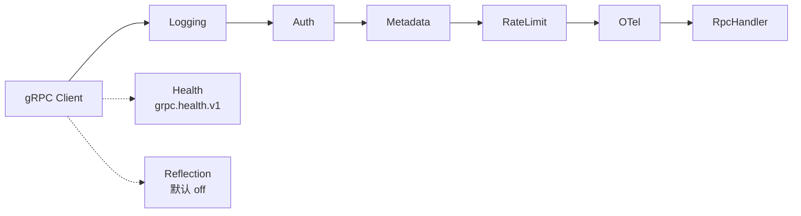
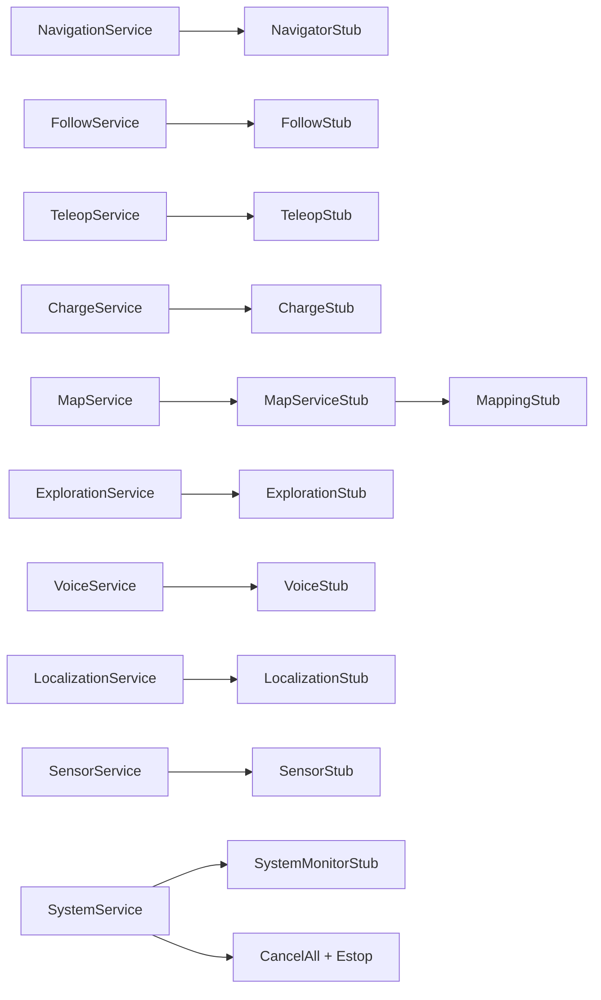
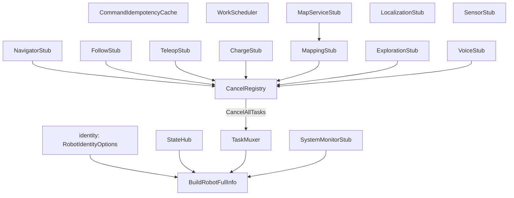
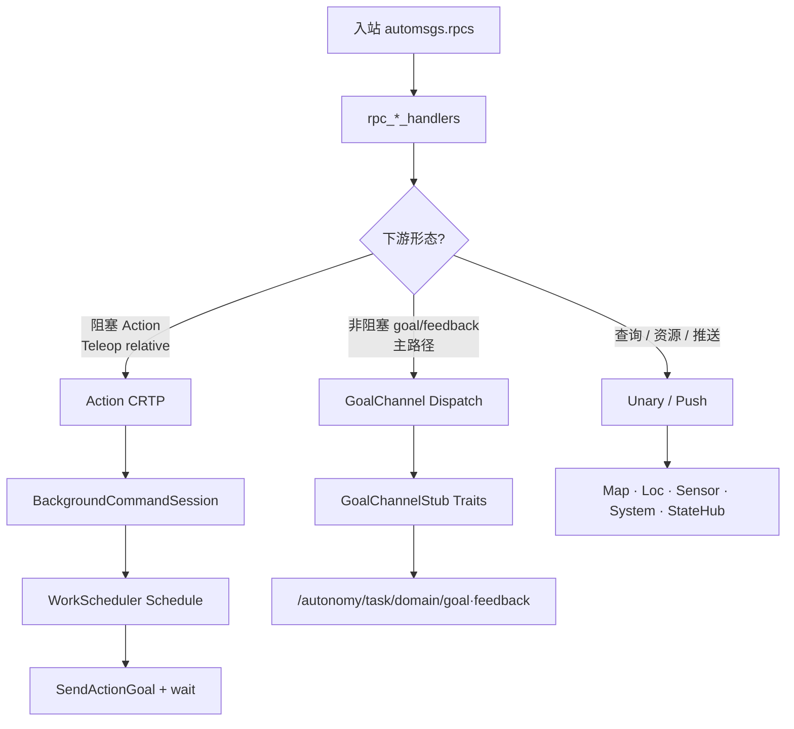
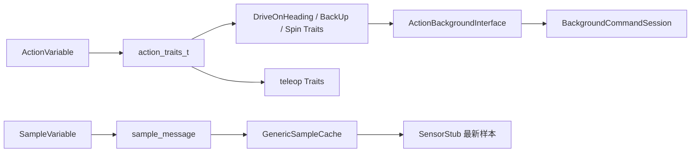
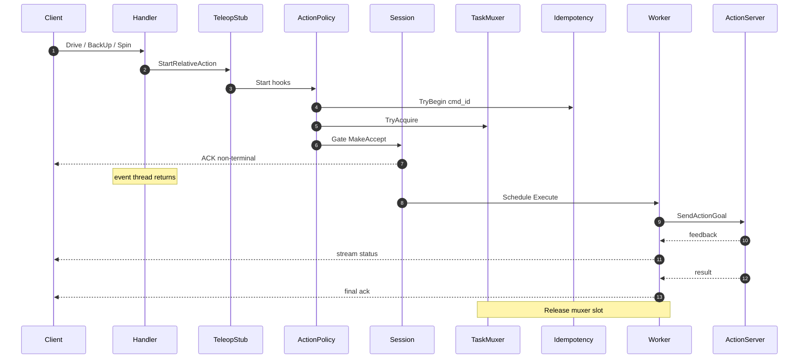
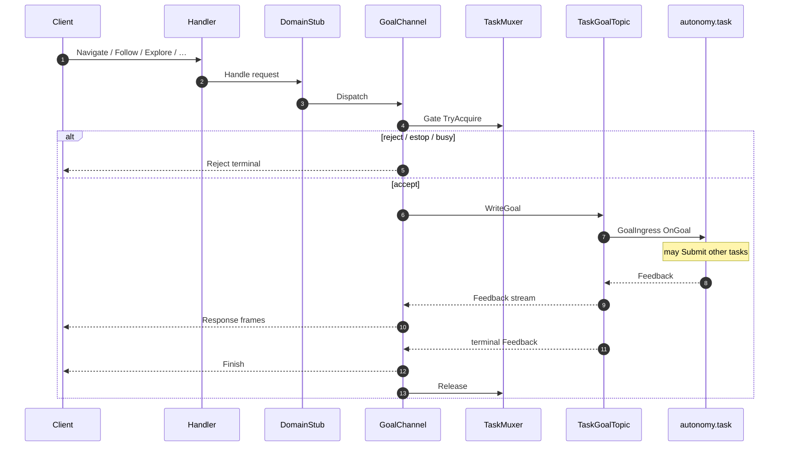
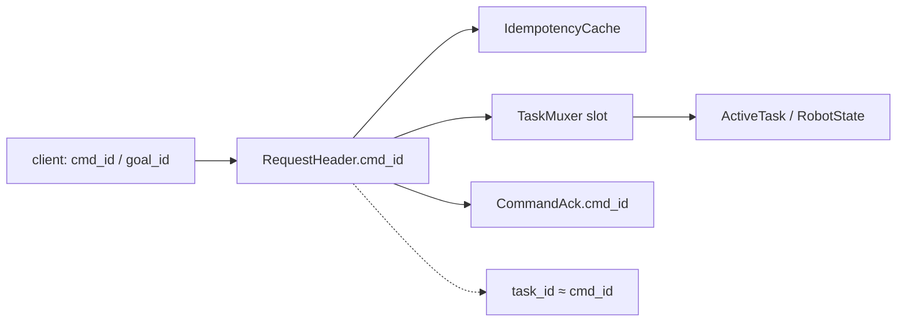

# autonomy/bridge

机载 gRPC 对外接口。默认监听 `127.0.0.1:5005`（见 `config/bridge/`、`conf/bridge.pb.txt`）。

Bridge **不是**业务执行器，而是「外部协议 ↔ 内部 Autolink」的适配层：

- **Handler 薄、Stub 真 · 单一触发**：GoalChannel 写 `/autonomy/task/*/goal`（常量见 `constants.hpp`）
- **编排下沉**到对端 `autonomy.task` 进程；Bridge **只**依赖 `automsgs/task` 线协议，**不** include / 链接 `autonomy/task`
- **Context** = 共享 infra（Muxer SharedPtr · Hub/Idempotency UniquePtr · WorkScheduler）+ 值成员 `DomainBundle`（Stub UniquePtr + CancelRegistry）
- **平台横切**：`policy/`（决策）+ `tools/`（Health / Reflection / 拦截器 / ChannelArgs / TLS·OTel 接口），由 `tools::ApplyPlatform` 在 Server `Build()` 前装配

例外：`TeleopStub` 的 Drive / BackUp / Spin 仍走 Action CRTP（与 Velocity GoalChannel 同属一个 Stub）；TaskServer 侧仍可为 Autoviz 暴露 `/navigate_to_pose` 等 Action Server（与 Bridge 无关）。

| 文档 | 内容 |
|------|------|
| [`grpc/DESIGN.md`](grpc/DESIGN.md) | 业务四层 · 不变量 · 失败路径 · 测试清单 |
| [`docs/README.md`](docs/README.md) | 平台能力（policy / tools / 配置 / 安全 / OTel / 测试） |

---

## 架构

### 0. 一句话定位

```text
外部 gRPC 客户端
        │  automsgs.rpcs.*  （唯一对外表面）
        ▼
  平台拦截器链（可选）  Logging → Auth → Metadata → RateLimit → OTel
        │  旁路：Health / Reflection（不经业务 Handler）
        ▼
  薄 Handler（rpc_*_handlers → Stub）
        ▼
  Context = infra + DomainBundle
        │
        ├─ GoalChannel（主路径）→ /autonomy/task/<domain>/{goal,feedback}
        ├─ Action CRTP（Teleop 相对运动）→ Action Server
        └─ 查询 / 资源 → Unary / 缓存 / StateHub
        ▼
  autonomy.task（编排 · BT · 再 Submit 域任务）
```

Bridge **不做**规划、控制与跨域编排；只做协议适配、任务互斥、阻塞路径卸荷与状态聚合。

### 1. 进程与分层总览

下图刻意压平嵌套、避免 `A --> B & C` 多目标语法，以便 GitHub / IDE Mermaid 稳定渲染。



**线程模型**（与上图正交，由 `GrpcOptions` 配置）：

| 线程池 | 选项 | 职责 |
|--------|------|------|
| gRPC CQ | `num_grpc_threads` | completion queue |
| Event | `num_event_threads` | Handler 回调（不得阻塞） |
| Worker | `num_worker_threads`（`0` → `max(2, event/2)`） | `WorkScheduler`：Teleop relative / Sensor `RunRecordLoop` |

### 2. 平台横切（policy + tools）

业务四层之上的准入与旁路服务。细节见 [`docs/01_grpc_platform_overview.md`](docs/01_grpc_platform_overview.md)。



| 层 | 目录 | 职责 |
|----|------|------|
| policy | `policy/` | Bearer / 元数据校验 / 令牌桶 / deadline 规则 |
| tools | `tools/` | `ApplyPlatform`、拦截器工厂、ChannelArgs、Credentials、Health/Reflection 辅助 |

### 3. automsgs.rpcs → DomainBundle

对外 **仅** `automsgs.rpcs.*`。一对一映射；`TeleopService` 内 Velocity（GoalChannel）与 Drive/BackUp/Spin（Action）共用 `TeleopStub`。



| Service | Stub | 下游 |
|---------|------|------|
| NavigationService | NavigatorStub | `/autonomy/task/navigation/*` → NavigationTask |
| FollowService | FollowStub | `/autonomy/task/tracking/*` → TrackerTask |
| TeleopService | TeleopStub | Velocity → TeleopTask；relative → Action |
| ChargeService | ChargeStub | `/autonomy/task/charging/*` → ChargingTask |
| MapService | MapServiceStub → MappingStub | mapping goal + `/map` 缓存 |
| ExplorationService | ExplorationStub | ExplorationTask（再调 mapping/nav） |
| VoiceService | VoiceStub | VoiceTask（再分发域任务） |
| LocalizationService | LocalizationStub | pose 缓存；SetInitialPose → LocalizationTask |
| SensorService | SensorStub | catalogue / params / record |
| SystemService | SystemMonitorStub + Muxer/Hub | Heartbeat · Health · FullInfo · CancelAll |

### 4. Context 内部结构



**构造依赖**：`MappingStub` → `MapServiceStub`；其余命令 Stub / Loc / Voice 各自独立 GoalChannel（**不**在 Bridge 聚合域 Stub）；各命令 Stub 向 `CancelRegistry` 注册 cancel hook。

**编排下沉（task 内再 Submit）**：

| Bridge Stub | Task | 再调 |
|-------------|------|------|
| VoiceStub | VoiceTask | nav / follow / charge / explore |
| ExplorationStub | ExplorationTask | mapping + navigation |
| LocalizationStub（SetInitialPose） | LocalizationTask | mapping `SET_INITIAL_POSE` |
| NavigatorStub | NavigationTask | BT（Action Server 由 TaskServer 暴露给 Autoviz） |

### 5. 请求路径决策（命令流二选一）



| 路径 | 覆盖 |
|------|------|
| **P1 Action** | TeleopStub Drive / BackUp / Spin |
| **P2 GoalChannel** | Navigate · Follow · Charge · TeleopVel · Mapping · Explore · Voice |
| **P3 查询资源** | MapService · Loc（GetPose/GetStatus） · Sensor · System · FullInfo · States/Events |

### 6. 编译期：Variable → Traits → 运行时



命令域 GoalChannel **统一版式**（对齐 `charge_stub`）：

```text
BRIDGE_CHANNEL_TRAITS* → class XxxStub : public GoalChannelCommandStub<XxxTraits>
  AUTONOMY_SMART_PTR_DEFINITIONS
  using GoalChannelCommandStub::…
  Handle* → HandleRequest / 特例写在 .cpp
```

`.cpp`：`XxxTraits::ConvertToGoal` / `ConvertFromFeedback` / `MakeResponse` / `IsTerminal`。

| 例外 | 原因 |
|------|------|
| TeleopStub 相对运动 | Drive / BackUp / Spin 仍 Action CRTP（与 Velocity 同 Stub） |
| MapServiceStub / SensorStub / SystemMonitorStub | 查询 / 资源门面，非命令 GoalChannel |

### 7. 时序：阻塞 Action（Teleop 相对运动）



### 8. 时序：非阻塞 GoalChannel



### 9. 追踪主键（cmd_id 贯穿）



查询对齐：`GetActiveGoal` · `GetStatus` · `GetRobotFullInfo` · `GetCapabilities`；关联键为 `goal_id` / `cmd_id`。

### 10. 执行模型速查

| 路径 | 机制 | 覆盖 |
|------|------|------|
| **GoalChannel（主）** | `BRIDGE_CHANNEL_TRAITS*` + `GoalChannelCommandStub` | Navigate · Follow · Charge · TeleopVel · Mapping · Explore · Voice |
| **Action CRTP（例外）** | `teleop::*Traits` → `ActionBackgroundInterface::StartAction` | Teleop Drive / BackUp / Spin |
| **后台会话** | `BackgroundCommandSession`（含 `cmd_id` 幂等） | Teleop 相对运动公共外壳 |
| **变量缓存** | `GenericSampleCache<Vars...>` | Sensor 最新样本 |
| **池上长循环** | `WorkScheduler::Schedule` | Sensor `RunRecordLoop` |
| **Rpc 生命周期** | `handler_templates.hpp` / `BRIDGE_LIFECYCLE` | Cancel / Pause / Resume / GetStatus |
| **查询 / 资源** | Unary · Push（**不**走命令流模板） | MapService · Loc · Sensor · System · StateHub |
| **平台装配** | `tools::ApplyPlatform` | Health · Reflection · Interceptors · ChannelArgs · Credentials |

Handler 经 `RegisterHandlers<Hs...>` 包注册到 `automsgs.rpcs.*`。

### 11. 扩展硬规则

新 **命令流**（Unary→Stream / Bidi）**必须二选一**，禁止第三套手写 acquire / WriteGoal / Finish：

1. **GoalChannel** — `BRIDGE_CHANNEL_TRAITS*` + `GoalChannelCommandStub`（默认）
2. **Action CRTP** — `teleop::*Traits` + `ActionBackgroundInterface::StartAction`（仅 Teleop 相对运动）

跨域编排（Voice / Explore / Loc 初值等）**禁止**在 Bridge Stub 内调其他域 Stub；写入对应 Task Goal，由 `autonomy/task` 再 `Submit`。

Handler：`rpc_*_handlers` 直接转发 Stub（无 adapt 层）。

**例外（非命令流，勿硬套上述模板）**：

| 面 | 例子 | 模式 |
|----|------|------|
| Map | `MapService` List/Get/Save/StartMapping… | Unary → `MapServiceStub` / `MappingStub` |
| Loc | GetPose / GetStatus | Unary + 缓存；`SetInitialPose` → LocalizationGoal |
| Sensor | catalogue / params / record | Unary + `Schedule(RunRecordLoop)` |
| System | Heartbeat / GetHealth / FullInfo | Unary |

配置：`GrpcOptions`（含平台开关）见 [`docs/06_configuration.md`](docs/06_configuration.md)；样例 `conf/bridge.pb.txt`；身份 / 能力见 `BridgeOptions.identity` / `capabilities`。

---

## 构建

### 命令行（CLI11）

```bash
# 服务端
autonomy.bridge -h
autonomy.bridge -V
autonomy.bridge -c bridge.pb.txt
autonomy.bridge -n                 # dry-run
autonomy.bridge -t                 # ApplyPlatform self-test

# 客户端：列出 / 描述 / 调用任意 RPC（JSON 参数）
autonomy.bridge list
autonomy.bridge list SystemService
autonomy.bridge describe SystemService/Heartbeat
autonomy.bridge call SystemService/Heartbeat -d '{"sequence":1}'
autonomy.bridge call SystemService/GetInfo -d '{}' --target 127.0.0.1:5005
autonomy.bridge call NavigationService/Navigate -d @nav.json
autonomy.bridge call SystemService/Heartbeat --bearer secret --robot-id robot-1
```

`call` 支持 unary 与 server-streaming；client/bidi streaming 请用 `grpcurl` 或 `automsgs/tools/cli/rpc-cli.py`。

平台开关（health / reflection / auth …）写在 conf；见 [`docs/06_configuration.md`](docs/06_configuration.md)。

### 超工程（仓库根）

```bash
cmake -B build -DBUILD_GRPC=ON
cmake --build build --target autonomy.bridge -j
```

可选 FEATURE（见 `cmake/README.md`）：`grpc_reflection`、`otel`（缺库降级，不红 CI）。

### 单独工程（已安装 autonomy）

前置：先安装带 gRPC 的 autonomy（`BUILD_GRPC=ON`）。

```bash
cmake -S autonomy/bridge -B build-bridge \
  -DCMAKE_PREFIX_PATH=<autonomy-install-prefix> \
  -DCMAKE_MODULE_PATH=<autonomy-workspace>/cmake
cmake --build build-bridge -j
cmake --install build-bridge
```

### 测试

用例矩阵与手工 `grpc_health_probe` / `grpcurl` 步骤见 [`docs/08_testing.md`](docs/08_testing.md)。

```bash
ctest --test-dir build -R bridge --output-on-failure
```

---

## 部署资产

| 路径 | 用途 |
|------|------|
| `launch/bridge.launch` | 独立启动 `autonomy.bridge`（respawn） |
| `conf/bridge.pb.txt` | BridgeOptions / GrpcOptions 默认值 |
| `dag/bridge.dag` | Autolink 通道拓扑说明（**非** mainboard DAG） |
| `config/bridge/*.lua` | 运行时入口（`bridge_options.lua`） |

```bash
export PATH=$PWD/build/bin:$PATH
export AUTOLINK_LAUNCH_PATH=$PWD/autonomy/bridge/launch
autolink_launch bridge.launch
```

---

## 对外 API

| 表面 | 包名 | 用途 |
|------|------|------|
| **automsgs.rpcs.\*** | `automsgs.rpcs.*` | App / 云端 / `rpc-cli.py` |

旁路（非业务 Handler）：`grpc.health.v1.Health`；可选 `grpc.reflection.v1alpha.ServerReflection`。

Stub → Autolink GoalChannel / Action，并由 `TaskMuxer` 互斥。

---

## 业务覆盖

| 业务 | automsgs.rpcs | Bridge Stub | 下游 Task / 通道 |
|------|---------------|-------------|------------------|
| 单点/多点导航 | NavigationService | NavigatorStub | `/autonomy/task/navigation/*` → NavigationTask |
| 人体跟随 | FollowService | FollowStub | `/autonomy/task/tracking/*` → TrackerTask |
| 遥操 | TeleopService | TeleopStub | Velocity → TeleopTask；Drive/BackUp/Spin → Action |
| 自动回充 | ChargeService | ChargeStub | `/autonomy/task/charging/*` → ChargingTask |
| 地图管理 | MapService | MapServiceStub | MappingStub + `/map` 缓存 |
| 探索建图 | ExplorationService | ExplorationStub | ExplorationTask（再调 mapping/nav） |
| 定位 | LocalizationService | LocalizationStub | pose 缓存；SetInitialPose → LocalizationTask |
| 语音控制 | VoiceService | VoiceStub | VoiceTask（再分发域任务） |
| 传感器 | SensorService | SensorStub | 参数 KV + RecordWriter |
| 系统 / 画像 | SystemService（含 GetRobotFullInfo） | SystemMonitorStub | `/robot_state` + 身份/健康聚合 |

---

## 关键代码

| 区域 | 路径 |
|------|------|
| 构建 / 安装 | `CMakeLists.txt` |
| 进程 CLI（CLI11） | `options.hpp` / `options.cpp` · `bridge_main.cpp` |
| 业务设计备忘 | `grpc/DESIGN.md` |
| Server + ApplyPlatform | `grpc/server.*` · `tools/bootstrap.*` |
| Context / DomainBundle | `grpc/context.*` · `domains.*` |
| 调度 / 取消 / 会话 | `grpc/work_scheduler.*` · `cancel_registry.hpp` · `session.hpp` · `task_muxer.*` · `idempotency.*` · `state_hub.*` |
| Handler | `handlers/handler_templates.hpp` · `rpc_<domain>_handlers.*` · `util.hpp` |
| Stub / GoalChannel | `clients/goal_channel_*.hpp` · `*_stub.hpp` · `command_dispatch.hpp` |
| 平台 policy / tools | `policy/` · `tools/` |
| 平台文档 / 测试 | `docs/` · `test/` |
| 配置 proto | `proto/{bridge,grpc,robot_identity,capabilities}_options.proto` |
| 系统画像 | `grpc/profile.*` |
