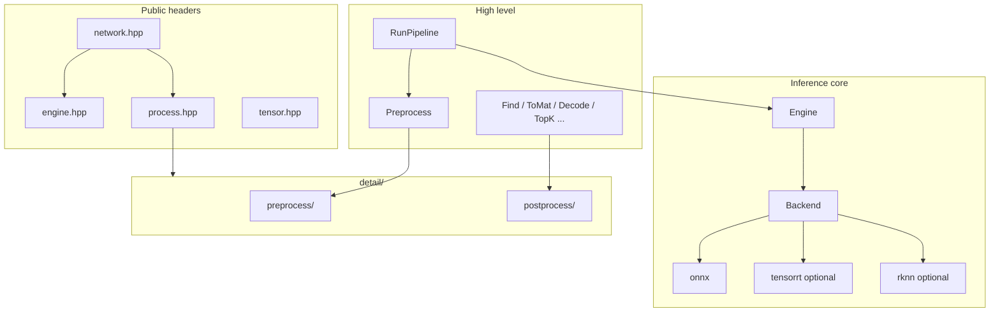

# common/network

模型推理与通用前后处理模块：加载 ONNX 等格式、查询张量元数据、执行前向推理，并提供与具体模型无关的图像预处理与输出后处理工具。

命名空间：`autonomy::common::network`。

## 设计原则

- **Engine 只做推理**：输入/输出为命名的 `float` 张量（`TensorMap`），不包含业务逻辑。
- **前后处理可组合**：通过 `PreprocessOptions` 配置 resize/归一化/layout，不绑定 YOLO、Depth 等专用类型。
- **实现隐藏在 `detail/`**：对外优先包含伞头头文件，避免依赖内部子模块路径。

## 架构



## 目录结构

```
network/
├── README.md                 # 本文件
├── network.hpp               # 伞头：engine + tensor + process
├── engine.hpp / engine.cpp   # 对外推理入口
├── process.hpp / process.cpp # 前后处理 API + RunPipeline
├── pipeline.hpp              # 已废弃，转发 process.hpp
├── tensor.hpp                # TensorShape、ModelTensorInfo、TensorMap
├── options.hpp               # InferenceOptions（后端/模型路径等）
├── backend.hpp               # Backend 抽象接口
├── inference.hpp             # 后端工厂
├── onnx.hpp / onnx.cpp       # ONNX Runtime 实现
├── tensorrt.hpp              # TensorRT（可选编译）
├── rknn.hpp                    # RKNN（可选编译）
└── detail/
    ├── process.hpp           # 前后处理子模块伞头
    ├── internal/error.hpp    # 共享错误写入工具
    ├── preprocess/           # 图像预处理实现
    │   ├── types.hpp         # Sample、PreprocessOptions、TransformMeta
    │   ├── policy.hpp        # Make / MakeUpperBound 模板配置
    │   ├── image.hpp         # Preprocess()
    │   ├── dims.hpp          # IsImage、SpatialSize
    │   └── internal/         # resize/shape/traits 等
    └── postprocess/          # 输出后处理
        ├── boxes.hpp         # Decode() 网格检测头
        ├── map.hpp           # Find / ToMat / Colorize
        ├── cls.hpp           # TopK()
        └── nms.hpp           # Nms()
```

## 头文件怎么选

| 需求 | 包含 |
|------|------|
| 推理 + 前后处理全流程 | `#include "autonomy/common/network/network.hpp"` |
| 仅加载模型、Run 张量 | `#include "autonomy/common/network/engine.hpp"` |
| 预处理 / 后处理 / RunPipeline | `#include "autonomy/common/network/process.hpp"` |
| 张量元数据、TensorMap | `#include "autonomy/common/network/tensor.hpp"` |

`engine.hpp` **不**依赖 OpenCV；需要图像处理时请包含 `process.hpp`。

## 快速开始

### 1. 仅推理（已有 float 输入）

```cpp
#include "autonomy/common/network/engine.hpp"

std::string error;
auto engine = autonomy::common::network::Engine::CreateEngine("model.onnx", "onnx", &error);
if (!engine) { /* error */ }

std::unordered_map<std::string, std::vector<float>> inputs;
inputs["images"] = input_tensor;

std::unordered_map<std::string, std::vector<float>> outputs;
if (!engine->Run(inputs, &outputs)) {
  const std::string& msg = engine->GetLastError();
}
```

### 2. 图像预处理 + 推理（推荐）

```cpp
#include "autonomy/common/network/process.hpp"

using namespace autonomy::common::network;

std::string error;
auto engine = Engine::CreateEngine("model.onnx", "onnx", &error);

PreprocessOptions opts = Make<ResizePolicy::kLetterbox>(640, 640);

RunResult result;
if (!RunPipeline(engine.get(), bgr_image, opts, &result, &error)) { /* ... */ }

// result.outputs：输出名 -> float 向量
// result.meta：用于后处理还原到原图坐标/尺寸
```

### 3. 稠密图输出（深度 / 分割等）

```cpp
int h = 518, w = 518;
SpatialSize(engine->GetInputInfos()[0], 518, &h, &w);

PreprocessOptions opts = MakeUpperBound(504, 14, h, w);  // upper_bound + patch 对齐 + ImageNet

RunResult result;
RunPipeline(engine.get(), image, opts, &result, &error);

std::string name;
const std::vector<float>* data = nullptr;
Find(result.outputs, engine->GetOutputInfos(), &name, &data, "depth", &error);

cv::Mat map;
ToMat(*data, /* 对应 output 的 ModelTensorInfo */, result.meta, &map, &error);

cv::Mat vis;
Colorize(map, &vis);
```

参考示例：`examples/apps/demo_depth_angthing_v3.cpp`。

### 4. 网格检测头输出

`Decode()` 适用于形状为 `[num_proposals, 4 + num_classes]` 或转置形式的 float 输出（见 `boxes.hpp` 说明）。

```cpp
PreprocessOptions opts = Make<ResizePolicy::kLetterbox>(640, 640);
RunResult result;
RunPipeline(engine.get(), image, opts, &result, &error);

BoxOptions box_opts;
box_opts.num_classes = 80;
box_opts.conf_threshold = 0.55f;
box_opts.nms_iou = 0.45f;

std::vector<Detection> boxes;
Decode(result.outputs.at("output0"), output_meta, result.meta, box_opts, &boxes, &error);
```

参考示例：`examples/apps/demo_yolo26_onnixruntime.cpp`。

## PreprocessOptions 字段

| 字段 | 含义 |
|------|------|
| `resize` | `kLetterbox` / `kStretch` / `kCenterCrop` / `kUpperBound` |
| `normalize` | `kZeroOne` / `kImageNet` / `kMinusOneToOne` / `kCustom` |
| `layout` | `kNCHW` / `kNHWC` / `kAuto`（按模型输入推断） |
| `default_height`, `default_width` | 模型未给出静态 H/W 时的默认值 |
| `bound_resize_target` | `kUpperBound` 时最长边目标像素 |
| `align_multiple` | 正数时把 H/W 对齐到该倍数（如 ViT patch 14） |
| `pad_value` | letterbox 填充值（默认 114） |
| `swap_red_blue` | blob 是否 BGR→RGB（默认 true） |

模板快捷配置（`detail/preprocess/policy.hpp`，经 `process.hpp` 导出）：

```cpp
auto a = Make<ResizePolicy::kLetterbox>(640, 640);
auto b = MakeUpperBound(504, 14, height, width);
```

## 主要 API 一览

### 推理（Engine）

- `Engine::CreateEngine(model_path, backend_id)` — `backend_id` 常用 `"onnx"`
- `GetInputInfos()` / `GetOutputInfos()` — `ModelTensorInfo` 列表
- `Run(inputs, &outputs)` — `TensorMap` 输入输出

### 预处理

- `Preprocess(image, input_info, options, &tensor, &meta, &error)`
- `Preprocess(sample, input_infos, options, &tensors, &meta, &error)`
- `SpatialSize(input_info, default_size, &h, &w)`

### 管线

- `RunPipeline(engine, image, options, &result, &error)`
- `RunPipeline(engine, sample, options, &result, &error)`

### 后处理

- `Find(outputs, infos, &name, &data, keyword, &error)` — 先精确名，再子串，再最大 spatial
- `ToMat(output, info, meta, &mat, &error)` — 稠密图还原到原图尺寸
- `Colorize(float_map, &bgr)`
- `Decode(output, info, meta, box_opts, &boxes, &error)`
- `TopK(logits, k, &scores)`
- `Nms(iou, &boxes)`

## 后端与编译选项

| CMake 选项 | 说明 |
|------------|------|
| `BUILD_ONNXRUNTIME` | ONNX Runtime 推理（默认 ON） |
| `BUILD_NETWORK_TENSORRT` | 注册 TensorRT 后端 |
| `BUILD_NETWORK_RKNN` | 注册 RKNN 后端 |

示例应用（需 `BUILD_ONNXRUNTIME` 且找到 OnnxRuntime）：

- `autonomy.examples.apps.demo_yolo26_onnixruntime`
- `autonomy.examples.apps.demo_depth_angthing_v3`

## 测试

单元测试：`autonomy/common/network/process_test.cpp`（随工程 `*_test.cpp` 自动注册）。

覆盖：`Find` 精确匹配、`TopK`、`ResolveShapeForFloatCount`、`MakeUpperBound`。

## 扩展后端

1. 实现 `Backend` 子类（`LoadFromFile`、`Run` 等）。
2. 在 `inference.cpp` / 注册表中注册 `backend_id`。
3. 通过 `Engine::CreateEngine(path, "your_id")` 使用。

## 注意事项

- 输入/输出缓冲区须为 **连续 row-major `float32`**，元素个数与模型 shape 一致（支持单动态维解析，见 `ResolveShapeForFloatCount`）。
- 5 维图像输入（如 `[B,N,C,H,W]`）在 `Preprocess` 内会构建单视角张量再 **复制** 到完整 batch/view。
- `Decode` 仅适用于固定格式的检测头，不是通用 NMS+anchor 解码器。
- 不要包含 `detail/` 下具体头文件，除非在模块内扩展；对外使用 `process.hpp` / `network.hpp`。
