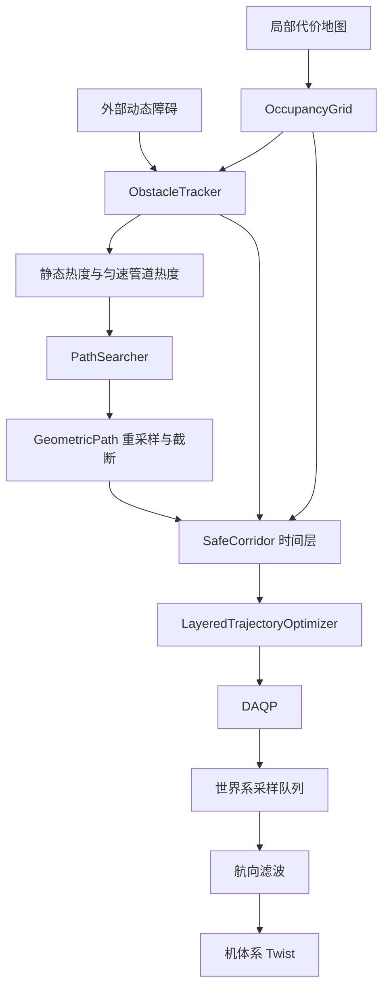

> 地面机器人上的 SANDO：热度加权 A* 给出几何路径，时空多面体走廊把未知和动态障碍收成半平面，三次 Bézier 最小急动度混合整数二次规划在走廊里选一段多项式。在线形式是滚动时域，提交前缀保留，新样本接在后面。平面、无高度通道。主文献是 Kondo, Tordesillas, How, arXiv:2604.07599。

一次规划按下面的顺序推进。每一步只使用上一步已经得到的东西。

1. 地图上的运动体收成带速度的盒子。
2. 热度把几何路径从危险格推开，起点仍可走。
3. 路径按时间切成层，每层的自由空间收成多面体。
4. 每一层用一条三次曲线填充，急动度是常数。
5. 曲线改写成 Bézier 控制点，约束从无穷多个点变成有限个点。
6. 二进制决定这段曲线进入该层的哪一块多面体，并压低急动度。
7. 段时长先取下界，再在因子窗口里放大到可行。
8. 只执行已提交的前缀，其余留给下一次重规划。

## 1. 这一周期要交出什么

输入是世界系位姿、机体系速度、局部代价地图，以及可选的外部动态障碍。输出是机体系速度指令。

多项式在世界系，描述有限时域内的平面位置。速度、加速度、急动度有界。位置要落在当前看得见的自由空间里，也要落在动态障碍最坏可达集之外。航向不进多项式，写出指令前再滤波。

每个控制周期取队列前端的设定点。需要重规划时，从已经提交的样本 $A$ 接一条新轨迹，只替换 $A$ 后面的队列。这一次优化失败，就继续走上一条；还没有上一条，就保持或进入悬停规避。

地面只有 $x,y$。论文里的高度和 26 邻接不在这条链上。

## 2. 第一步：先知道谁在动

代价地图只标出此刻哪些格子被占。动态障碍下一刻会离开这些格子，所以搜索和走廊都需要速度。

在机器人附近对占用格做连通域，得到质心和包围盒。测量是位移和速度差除以间隔，状态是旧值与测量的凸组合：

$$
\begin{aligned}
v_{\mathrm{meas}}&=\frac{c_{\mathrm{blob}}-c}{\Delta t},&
a_{\mathrm{meas}}&=\frac{v_{\mathrm{meas}}-v}{\Delta t},\\
v&\leftarrow\alpha v+(1-\alpha)v_{\mathrm{meas}},&
a&\leftarrow\alpha a+(1-\alpha)a_{\mathrm{meas}},\\
|v_i|&\le v_{\mathrm{obs,max}}.
\end{aligned}
$$

传感器常常只看见障碍的一面。两个半轴都取观测到的长边，$h_x=h_y=\tfrac12\max(\Delta x,\Delta y)$。低于阈值就当成静止结构：

$$
\lVert v\rVert_2<v_{\mathrm{th}}\;\text{且}\;\lVert a\rVert_2<a_{\mathrm{th}}
\implies v=0,\; a=0.
$$

外部障碍由控制线程在求解前直接写入，不跟这次聚类抢同一个编号。

这一步留下的是每个障碍的中心 $\hat c$、半轴 $h$ 和速度 $v$。热度用速度做外推；走廊只用速度的上界。

## 3. 第二步：用热度把路径推开

若把整个最坏可达集涂成不可走，下一周期机器人自己可能站在上一周期的禁区里，搜索没有起点。热度只增加经过该格的代价，不删掉这条边。

硬占用只留给两类格子：已知的静态障碍，以及动态障碍此刻所在的位置。两者都按机器人半径膨胀。未知格在这一步仍可走，第 4 步建走廊时才当成障碍。

### 3.1 静态表面

只让障碍表面发光。表面格中心 $c_b$，光晕半径 $R_s$，中心强度 $\alpha^s$。距离用平方衰减，超出光晕就是 0：

$$
H^s_b(q)=
\begin{cases}
\alpha^s\left(1-\dfrac{\lVert q-c_b\rVert_2}{R_s}\right)^{2}, & \lVert q-c_b\rVert_2\le R_s,\\
0, & \text{否则}.
\end{cases}
$$

好几块表面都照到同一个格子时，取最亮的那一块，再截断：

$H^s(q)=\min(\max_b H^s_b(q),\,H_{\max})$

相加会把窄通道里重叠的光晕算很多次，路径会被挤出通道。占用格已经不能扩展，不再写热度。

### 3.2 动态障碍的现在和稍后

第 $k$ 个障碍用第 2 步的中心 $\hat c_k$ 和半轴 $h_k$。先把外形和固定余量收成一个半径，再在预测时域 $T_h$ 上加上按最大速度能走出的距离：

$$
\begin{aligned}
R_{0,k}&=\max_i h_k^i+r_{\mathrm{margin}},\\
R^d_k&=R_{0,k}+v_{\mathrm{obs,max}}T_h.
\end{aligned}
$$

基热度从质心按欧氏距离衰减，到 $R^d_k$ 处为 0。$\alpha_0^d$ 是中心强度：

$$
H^{\mathrm{base}}_k(q)=
\begin{cases}
\alpha_0^d\left(1-\dfrac{\lVert q-\hat c_k\rVert_2}{R^d_k}\right)^{2}, & \lVert q-\hat c_k\rVert_2\le R^d_k,\\
0, & \text{否则}.
\end{cases}
$$

估计时保留了加速度，外推时只用速度，$\mu_k(t)=\hat c_k+v_k t$。加速度的估计跳动大，拉长以后不可靠。时域切成若干时刻 $t_j$。管道半径随 $t_j$ 变大，权重随 $t_j$ 变小：近处范围小、权重大，远处范围大、权重小。

$$
\begin{aligned}
R_{k,j}&=R_{0,k}+v_{\mathrm{obs,max}}\,t_j,\\
w(t)&=\exp\left(-t/(0.5\,T_h)\right),\\
H^{\mathrm{tube}}_k(q)&=\alpha_1^d\max_j\left(w(t_j)\left[\max\left(0,\,1-\frac{\lVert q-\mu_k(t_j)\rVert_2}{R_{k,j}}\right)\right]^{2}\right).
\end{aligned}
$$

一个障碍的热度是基热度加热度管道。多个障碍再取最大，避免两块热度叠在同一个格子上。最后和静态热度取最大，并截断：

$$
\begin{aligned}
H_k&=H^{\mathrm{base}}_k+H^{\mathrm{tube}}_k,\\
H^d&=\max_k H_k,\\
H(q)&=\min\big(\max(H^s(q),\,H^d(q)),\,H_{\max}\big).
\end{aligned}
$$

热度到这里为止只影响路径好不好走。碰不碰障碍，要等到走廊上的半平面。

### 3.3 沿热度搜索

平面格子用 8 邻接。论文在三维里用 26 邻接。一步代价是步长加热度，再加上未知格和方向项。启发式是到目标的欧氏距离乘权重 $w_h$：

$$
\begin{aligned}
c(q_i,q_{i+1})
&=\lVert q_{i+1}-q_i\rVert_2
+w_{\mathrm{heat}}\,H(q_{i+1})
+w_U\mathbf{1}_{\mathrm{unknown}}\\
&\quad+\mathrm{e}^{-n/n_d}\big(w_a\max(0,1-\cos\theta)+w_c\mathbf{1}_{\mathrm{cross}}\big),\\
h(q)&=w_h\,\lVert q-q_g\rVert_2.
\end{aligned}
$$

- **$w_{\mathrm{heat}} H$**：把路径从以后会变窄的区域推开，那些格子仍然可以走。
- **$w_U$**：未知格有额外代价。下一步建走廊时，这些格子会变成障碍。
- **$n$**：从起点数过的格子数。方向项只在路径前段起作用。

窗口里搜失败，就去掉窗口再搜一次。然后做视线捷径，删掉过短且转角过小的边，并从两个方向裁掉热度更高的拐角。

这一步留下一条折线。它还没有时间，也还没有保证曲线能塞进自由空间。

## 4. 第三步：按时间把自由空间收成多面体

折线重采样成 $N$ 段。第 $n$ 段将在时间层 $[t_0+nT,\,t_0+(n+1)T]$ 上执行，所以这一层的障碍要按该层结束时的最坏位置来胀。

走廊记为 $\mathcal{C}[n][p]$。$n$ 是时间层，$p$ 是这一层里的一块空间多面体。每一层、每一段路径都生成一块，包括「最后一层配第一段」这种未必被选中的组合。谁配谁要等第 6 步的二进制变量，这里还不能删。

一块多面体是有限个半平面的交。沿路径段做椭球，取支撑半平面，法向指向自由空间外侧。机器人半径为 $r$。法向已经单位化时内收半平面。曲线落在内收后的集合里，机器人圆盘就落在内收前的自由空间里：

$$
\mathcal{C}=\{x:Fx\le g\},
\qquad
\lVert f\rVert_2=1 \implies \gamma\leftarrow\gamma-r.
$$

### 4.1 障碍能走出多远

速度的每个轴不超过 $v_{\mathrm{obs,max}}$。从这一周期的估计位置积分：

$\big|c_i(t_0+t)-\hat c_i(t_0)\big|\le v_{\mathrm{obs,max}}\,t$

层 $n$ 必须盖住整层，所以 $t$ 取该层的结束时刻 $(n+1)T$，不取中点。论文式 (11)：

$r_n=v_{\mathrm{obs,max}}\,(n+1)T+\epsilon$

- **$\epsilon$**：位置估计误差的逐轴上界。实验里取 $0$。
- **$r_{\mathrm{margin}}$**：检测时已经加在半轴上的固定余量，用来吸收估计误差和跟踪误差。
- 地面实现把通信延迟 $t_{\mathrm{comm}}$ 乘上同一个速度上界，加进可达半径：$r_n=v_{\mathrm{obs,max}}\big((n+1)T+t_{\mathrm{comm}}\big)$。

胀开以后是一个轴对齐的盒子。中心仍是 $\hat c(t_0)$，半轴是原来的半轴加上 $r_n$：

$\hat{\mathcal{O}}^n_k=\big\{x:\ |x_i-\hat c_i(t_0)|\le h_k^i+r_n\big\}$

中心留在当前估计上。速度上界已经把各个方向的位移都包进 $r_n$。第 3 步里的预测曲线 $\mu(t)$ 只负责热度，不负责挪动这个中心。

### 4.2 还没看见的地方

未跟踪的运动体如果还在传感器没看见的体素里，这一步就把未知区域的边界当成它们可能出现的地方。边界 $\mathcal{B}_\mathcal{U}$ 与半径 $r_n$ 的 $L_\infty$ 球做闵可夫斯基和。这个球在平面上是边长 $2r_n$ 的正方形：

$\hat{\mathcal{U}}^n=\mathcal{U}(t_0)\cup\big(\mathcal{B}_\mathcal{U}(t_0)\oplus B_\infty(r_n)\big)$

每一块多面体都避开胀开后的动态障碍和未知区域，即论文式 (12)(13)：

$$
\mathcal{C}[n][p]\cap\hat{\mathcal{O}}^n_k=\emptyset,
\qquad
\mathcal{C}[n][p]\cap\hat{\mathcal{U}}^n=\emptyset.
$$

折线若伸进未知区，就沿着折线退到膨胀区域之外，得到一个更近的子目标。路程变短，$r_n$ 变小，走廊就更宽。

这一步留下的是每段、每层的一组半平面。下一段曲线必须整段落在其中某一块里面。

## 5. 第四步：每一层是一条三次曲线

要在一层的时间 $T$ 里从当前的位置、速度、加速度走到下一层，控制量取急动度。急动度在一段里取常数时，位置对时间是三次。论文式 (1) 写在物理时间 $\tau\in[0,T]$ 上：

$x_n(\tau)=a_n\tau^3+b_n\tau^2+c_n\tau+d_n$

实现把时间归一化成 $u=\tau/T\in[0,1]$，时长的幂吸进系数。两条式子是同一条曲线：

$$
\begin{aligned}
p(u)&=c_0+c_1 u+c_2 u^2+c_3 u^3,\\
c_0&=d,\quad c_1=c\,T,\quad c_2=b\,T^2,\quad c_3=a\,T^3.
\end{aligned}
$$

- **$a,b,c,d$**：式 (1) 里对 $\tau$ 的系数，每个轴一组。
- **$c_k$**：对 $u$ 的单项式系数。$k$ 是 $u$ 的幂。
- **$T$**：这一段的时长。同一次求解里，各段共用一个 $T$。

$u$ 对 $t$ 的导数是 $1/T$，所以 $k$ 阶物理导数比归一化导数少一个 $T^k$。三次曲线的三阶导数是常数 $6c_3$：

$$
\frac{\mathrm{d}^k p}{\mathrm{d}t^k}=T^{-k}\frac{\mathrm{d}^k p}{\mathrm{d}u^k},
\qquad
j=\frac{\mathrm{d}^3p}{\mathrm{d}t^3}=\frac{6c_3}{T^3}=6a.
$$

段与段的接点上，急动度可以跳。位置、速度、加速度不能跳，否则跟踪会在接点看到阶跃。

## 6. 第五步：用有限个控制点套住整条曲线

半平面是凸的。若对每个 $u$ 都写一条不等式，约束有无穷多条。Bernstein 基在 $[0,1]$ 上非负且和为 1，曲线是控制点的凸组合。控制点都在凸集 $\mathcal{C}$ 里，则 $p(u)\in\mathcal{C}$：

$$
\begin{aligned}
\beta_j(u)&=\binom{3}{j}(1-u)^{3-j}u^j,
&
\sum_{j=0}^{3}\beta_j(u)&=1,
&
\beta_j(u)&\ge 0,\\
p(u)&=\sum_{j=0}^{3}\beta_j(u)\,P_j
=(1-u)^3 P_0+3(1-u)^2 u P_1+3(1-u)u^2 P_2+u^3 P_3.
\end{aligned}
$$

再和 $c_0+c_1 u+c_2 u^2+c_3 u^3$ 比较同次幂：

$$
\begin{aligned}
u^0&: P_0=c_0,\\
u^1&: -3P_0+3P_1=c_1,\\
u^2&: 3P_0-6P_1+3P_2=c_2,\\
u^3&: -P_0+3P_1-3P_2+P_3=c_3.
\end{aligned}
$$

解出来就是论文式 (3)。换回 $\tau$ 的系数时，$P_1=(cT+3d)/3$，与式 (3) 一致：

$$
\begin{aligned}
P_0&=c_0,\\
P_1&=c_0+\tfrac13 c_1,\\
P_2&=c_0+\tfrac23 c_1+\tfrac13 c_2,\\
P_3&=c_0+c_1+c_2+c_3.
\end{aligned}
$$

速度对 $u$ 是二次，除以 $T$ 后是物理速度，同样有三个控制点。加速度是一次，有两个控制点。急动度已经是常数，直接约束它本身：

$$
\begin{aligned}
V_0&=\frac{c_1}{T},&
V_1&=\frac{c_1+c_2}{T},&
V_2&=\frac{c_1+2c_2+3c_3}{T},\\
A_0&=\frac{2c_2}{T^2},&
A_1&=\frac{2c_2+6c_3}{T^2}.
\end{aligned}
$$

- **$P_j$**：位置控制点，$j=0,1,2,3$。第 4 步的半平面写在这四个点上。
- **$V_j,A_j$**：速度和加速度的控制点。动力学上界写在这些点上，再由凸包传到段内每一个时刻。

上标表示段号。段的起点 $u=0$ 必须等于测量：$c_0$ 是位置，$c_1/T$ 是速度，$2c_2/T^2$ 是加速度。段的终点 $u=1$ 必须等于下一段的起点。这就是论文式 (2) 和式 (6)：

$$
\begin{aligned}
c_0^{(0)}&=p_{\mathrm{init}},&
\frac{c_1^{(0)}}{T}&=v_{\mathrm{init}},&
\frac{2c_2^{(0)}}{T^2}&=a_{\mathrm{init}},\\
c_0^{(n+1)}&=c_0^{(n)}+c_1^{(n)}+c_2^{(n)}+c_3^{(n)},\\
c_1^{(n+1)}&=c_1^{(n)}+2c_2^{(n)}+3c_3^{(n)},\\
c_2^{(n+1)}&=c_2^{(n)}+3c_3^{(n)}.
\end{aligned}
$$

要在终点停下时，再令最后一段的 $V_2=0$、$A_1=0$。滚动执行通常在到达这个停止状态之前就会重算。停止约束只在目标已经进入末端球，或者正在悬停时打开。

## 7. 第六步：数学问题

第 5 步已经把一段曲线收成系数 $c_0,c_1,c_2,c_3$。第 4 步已经把每一层收成若干块多面体。这一步把两者合成一个优化问题：系数决定曲线形状，二进制决定这段曲线进哪一块，目标是急动度尽量小。

先看完整问题，再逐行解释。$n$ 是段，也是时间层。$p$ 是该层的第 $p$ 块多面体。$P_{n,j}$ 是第 $n$ 段的第 $j$ 个位置控制点。

$$
\begin{aligned}
\min_{c,z}\quad
& \sum_{n=0}^{N-1}\int_0^{T}\lVert j_n\rVert_2^2\,\mathrm{d}t \\
\text{s.t.}\quad
& p_0(0)=p_{\mathrm{init}},\quad
  \dot p_0(0)=v_{\mathrm{init}},\quad
  \ddot p_0(0)=a_{\mathrm{init}},\\
& p_{n+1}(0)=p_n(1),\quad
  \dot p_{n+1}(0)=\dot p_n(1),\quad
  \ddot p_{n+1}(0)=\ddot p_n(1),\\
& \sum_{p=0}^{P-1} z_{n,p}\ge 1,\qquad z_{n,p}\in\{0,1\},\\
& z_{n,p}=1 \implies F_{np} P_{n,j}\le g_{np},
  \quad j\in\{0,1,2,3\},\\
& \lVert V_{n,j}\rVert_\infty\le v_{\max},\quad
  \lVert A_{n,j}\rVert_\infty\le a_{\max},\quad
  \lVert j_n\rVert_\infty\le j_{\max}.
\end{aligned}
$$

$x$ 和 $y$ 各有一套系数。半平面和范数把两个轴连在一起，所以不能拆成两个独立的标量问题。论文式 (8) 就是上面这个混合整数二次规划。

### 7.1 变量一共有多少

一段、一个轴有 4 个系数。平面两个轴、$N$ 段。一层有 $P$ 块多面体时，二进制是每段对每一块的选择：

$$
n_c=2\cdot N\cdot 4=8N,
\qquad
n_z=NP.
$$

$z_{n,p}=1$ 表示第 $n$ 段采用第 $p$ 块，$z_{n,p}=0$ 表示不采用。多个 $z_{n,p}=1$ 时，曲线落在这些多面体的交集里。约束是 $\sum_p z_{n,p}\ge 1$，不是 $\sum_p z_{n,p}=1$。

### 7.2 目标只看 $c_3$

急动度 $j=6c_3/T^3$ 是常数，而且式子里没有 $c_0,c_1,c_2$。这三个系数只用来满足起点、接点和半平面，目标不对它们收费。

一段、一个轴上，把常数急动度积满时长 $T$：

$$
\int_0^{T} j^2\,\mathrm{d}t
=\int_0^{T}\left(\frac{6c_3}{T^3}\right)^2\mathrm{d}t
=\frac{36\,c_3^2}{T^5}.
$$

两个轴加起来就是 $\int\lVert j\rVert_2^2\,\mathrm{d}t=36\lVert c_3\rVert_2^2/T^5$。论文写的是不积分的 $\lVert j\rVert_2^2=36\lVert c_3\rVert_2^2/T^6$。$T$ 在这一次求解里是常数，两者只差因子 $1/T$，使目标最小的系数相同。

求解器最小化 $\tfrac12 x^\top Hx$。令 $\tfrac12 H_{c_3} c_3^2$ 等于 $w_j$ 乘上面的积分：

$$
\frac12 H_{c_3} c_3^2 = w_j\cdot\frac{36\,c_3^2}{T^5}
\quad\Longrightarrow\quad
H_{c_3}=w_j\cdot\frac{72}{T^5}.
$$

其余系数在 $H$ 里是 0，这时 $H$ 只是半正定。DAQP 遇到非正定的 Hessian 就不做分支。对角上再加一个很小的正数，零特征值被抬起来，$H$ 成为正定。这个正数不改变「只惩罚急动度」的方向。

### 7.3 等式：接上测量，接上下一段

这些等式就是第 5 步末尾的关系，写成系数：

$$
\begin{aligned}
c_0^{(0)}&=p_{\mathrm{init}},&
\frac{c_1^{(0)}}{T}&=v_{\mathrm{init}},&
\frac{2c_2^{(0)}}{T^2}&=a_{\mathrm{init}},\\
c_0^{(n+1)}&=c_0^{(n)}+c_1^{(n)}+c_2^{(n)}+c_3^{(n)},\\
c_1^{(n+1)}&=c_1^{(n)}+2c_2^{(n)}+3c_3^{(n)},\\
c_2^{(n+1)}&=c_2^{(n)}+3c_3^{(n)}.
\end{aligned}
$$

需要停住时，最后一段再加 $V_{N-1,2}=0$、$A_{N-1,1}=0$。目标球还没看见、也不是悬停时，这两条不加。下一次重规划通常来得及，不必在这一段末端停死。

### 7.4 二进制怎样把曲线送进多面体

一条半平面写成 $f^\top P\le \gamma$。指示约束是

$$
z_{n,p}=1 \implies f^\top P_{n,j}\le \gamma,\qquad j\in\{0,1,2,3\}.
$$

凸包再把控制点之间的整段曲线带进去。DAQP 只接受线性不等式。同一条式子盖住 $z$ 的两种取值：

$$
f^\top P_{n,j}+M z_{n,p}\le \gamma+M.
$$

代入后：

$$
\begin{aligned}
z_{n,p}=1 &\implies f^\top P_{n,j}\le \gamma,\\
z_{n,p}=0 &\implies f^\top P_{n,j}\le \gamma+M.
\end{aligned}
$$

$M$ 要大到第二条对路径盒子里的点自动成立。盒子是包住这段路径的矩形，四个角记为 $\mathrm{corner}$。

$$
M=\max\left\{1,\;\max_{\mathrm{corner}}\left(f^\top\mathrm{corner}-\gamma\right)\right\}.
$$

$z=0$ 时，盒子里超出半平面最多的那个角也不再违反不等式。

四个位置控制点被限制在同一个盒子里，优化器拿不到盒子外的点，$M$ 不会偏小。空多面体的二进制固定为 0，不能用来凑 $\sum_p z_{n,p}\ge 1$：

$$
P_{n,j}\in[x_{\min},x_{\max}]\times[y_{\min},y_{\max}],
\qquad
\mathcal{C}[n][p]=\emptyset \implies z_{n,p}=0.
$$

### 7.5 速度、加速度、急动度

位置进了多面体，还可能飞得太快。论文式 (7) 把界写在控制点上，默认逐轴 $L_\infty$：

$$
\begin{aligned}
\lVert V_{n,j}\rVert_\infty&\le v_{\max},& j&\in\{0,1,2\},\\
\lVert A_{n,j}\rVert_\infty&\le a_{\max},& j&\in\{0,1\},\\
\lVert j_n\rVert_\infty&\le j_{\max},& j_n&=\frac{6c_3}{T^3}.
\end{aligned}
$$

三种范数都写成线性不等式。控制点满足以后，凸包保证段内每一个 $u$ 也满足。$L_2$ 取单位圆上 $m$ 个切点 $(\cos\theta_\ell,\sin\theta_\ell)$：

$$
\begin{aligned}
L_\infty&: \pm V_x\le v_{\max},\;\pm V_y\le v_{\max},\\
L_1&: \pm V_x\pm V_y\le v_{\max},\\
L_2&: \cos\theta_\ell\, V_x+\sin\theta_\ell\, V_y\le v_{\max}.
\end{aligned}
$$

### 7.6 等式可以消掉，这里没有消

上面的问题能解，但等式很多。论文先把等式解出来，再只把剩下的自由变量交给求解器。

$$
\begin{aligned}
n_{\mathrm{coeff}}&=4N,\\
n_{\mathrm{eq}}&=3(N-1)+6=3N+3,\\
n_{\mathrm{free}}&=4N-(3N+3)=N-3.
\end{aligned}
$$

$N=4$ 时，$n_{\mathrm{coeff}}=16$，$n_{\mathrm{eq}}=15$，$n_{\mathrm{free}}=1$，剩下的是最后一段的 $d$。论文对 $N\in\{4,5,6,7\}$ 把这个消元事先算好。地面实现不消元：全部系数和全部等式一起交给 DAQP。

## 8. 第七步：段不能太短，也不能太长

$T$ 太短，动力学上界无解。$T$ 太长，轨迹过慢。先忽略走廊，在每个轴上估计最短时间，再除以段数，得到 $T_0$。因子 $f\ge 1$ 把它放大：

$T=f\max(T_0,\,2\Delta t_c)$

$2\Delta t_c$ 保证一段里至少有两个控制周期。三个下界都取最小正根，再对 $x,y$ 取最大。真正使用的 $T$ 满足 $T\ge T_0$。$s=\mathrm{sign}(x_f-x_0)$ 指向目标：

$$
\begin{aligned}
T_v&=\frac{|x_f-x_0|}{v_{\max}},\\
x_0+v_0 T_a+\tfrac12 s\,a_{\max} T_a^2&=x_f,\\
x_0+v_0 T_j+\tfrac12 a_0 T_j^2+\tfrac16 s\,j_{\max} T_j^3&=x_f,\\
T_0&=\frac{1}{N}\max_{i\in\{x,y\}}\max(T_v,T_a,T_j).
\end{aligned}
$$

$f$ 在上一次成功值附近的窗口里，从小到大试。$T$ 一变，$r_n$ 就变，所以每个 $f$ 都要重新建第 4 步的走廊，再解第 7 步。第一个落在动力学界内的解，成为下一次窗口的中心。窗口里全部失败，就把中心上移一步；超出上界后回到区间中部。求解成功但超出动力学界的第一次结果先留着，作为后备。

## 9. 第八步：只执行已经提交的那一截

采样队列按控制周期 $\Delta t_c$ 往前走。两次调用的间隔是 $\Delta t$ 时，丢掉的样本数是

$$
n_{\mathrm{pop}}=\left\lfloor\frac{\Delta t}{\Delta t_c}\right\rfloor.
$$

$n_{\mathrm{pop}}=0$ 时重复队列前端。

重规划保留前缀 $A$，只替换 $A$ 之后的样本。前缀的长度要盖住求解还没有返回的那段时间，避免把正在执行的点提前丢掉。长度可以固定，也可以用最近几次求解耗时来估计。

计划的末端已经进入目标球，就不再重规划。机器人真正到达终端，才报告到达。悬停时先锁住终端点；威胁靠近，就沿斥力挪开工作目标，到达标志保持为假。队列短于 5，并且不在转向或悬停时，线速度和航向速率置零，航向保持上一次的值。

多项式给出的是世界系速度。航向 $\psi$ 把它转到机体系，这才是发给底盘的量：

$$
\begin{aligned}
v_{x,b}&=\cos\psi\, v_{x,w}+\sin\psi\, v_{y,w},\\
v_{y,b}&=-\sin\psi\, v_{x,w}+\cos\psi\, v_{y,w}.
\end{aligned}
$$

差分驱动令 $v_{y,b}=0$；横向的世界速度过大时，也可以把 $v_{x,b}$ 置零。四足、人形和轮足保留两个平移通道。里程计里的速度是机体系，进入第 2 步之前先做逆旋转：

$$
\begin{aligned}
v_{x,w}&=\cos\psi\, v_{x,b}-\sin\psi\, v_{y,b},\\
v_{y,w}&=\sin\psi\, v_{x,b}+\cos\psi\, v_{y,b}.
\end{aligned}
$$

## 10. 把八步合在一起看安全

第 4 步的不相交、第 7 步的 $z_{n,p}=1$ 和第 5 步的凸包串在一起。时间落在该层，$t\in[t_0+nT,\,t_0+(n+1)T]$，膨胀用的是结束时刻的 $r_n$：

$$
\begin{aligned}
&z_{n,p}=1
\implies P_{n,j}\in\mathcal{C}[n][p]
\implies p_n(u)\in\mathcal{C}[n][p],\\
&\mathcal{C}[n][p]\cap\hat{\mathcal{O}}^n_k=\emptyset,
\qquad
\mathcal{C}[n][p]\cap\hat{\mathcal{U}}^n=\emptyset.
\end{aligned}
$$

因此在这一段时间里，满足 $| \dot c_i |\le v_{\mathrm{obs,max}}$ 的已跟踪障碍，以及从未知边界以同一上界冒出来的障碍，都到不了 $p_n(u)$。机器人半径已经在 $\gamma\leftarrow\gamma-r$ 里扣过。

论证只覆盖这一次求解的时域。下一周期障碍移动以后，旧走廊可以不再包住新的起点。求解失败时靠第 9 步留下的前缀继续走。前缀用完仍然没有新解，上面的论证就不再适用。

## 11. 这些步骤落在哪些类上

`SandoController` 实现 `ControllerInterface`，在 `ControllerServer` 里以 `sando_controller` / `SandoController` 注册。选项来自 `ControllerOptions.sando_controller_options`。它只做第 9 步末尾的速度旋转，规划交给 `SandoPlanner`。

| 步骤 | 类 |
|---|---|
| 地图、占用、热度 | `OccupancyGrid` |
| 第 2 步，跟踪 | `ObstacleTracker` |
| 第 3 步，搜索与裁剪 | `PathSearcher` |
| 折线重采样，并从未知区退回 | `GeometricPath` |
| 第 4 步，走廊 | `SafeCorridor` |
| 第 5–6 步，控制点 | `CubicControlPoint` |
| 第 7 步，编码与求解 | `LayeredTrajectoryOptimizer`，`miqp::Solver` |
| 有走廊时走混合整数规划，否则走惩罚二次规划；采样与限幅 | `TrajectoryOptimizer` |
| 第 8–9 步，以及航向、悬停 | `SandoPlanner`，`HoverMonitor`，`PositionSafety` |
| 非正数选项的地面默认值 | `SandoDefaults` |

`State` 是 `CartesianPoint`，带位姿、速度和加速度。半平面和动态障碍是 `sando_controller.proto` 里的消息。一段多项式是 `Piece`：时长加上 `coefficients[4][2]`。

## 12. 数据流

一次 `ComputeVelocityCommands` 就是把上面八步走一遍：

1. 读代价地图，聚类，刷新热度。预测位置可以另外标成占用。
2. 状态不是转向、计划末端还在目标球外、也没有因为靠近目标且速度很低而停下来，才重规划。
3. 从已提交的状态出发，搜索，重采样，对窗口里的每个因子建走廊并求解。
4. 新样本接在前缀后面。按墙钟丢掉过期样本，取出队列前端。
5. 单独计算航向，把世界速度转到机体系后写出。不写位置指令。

失败并且队列空，返回无有效指令或路径阻塞。到达要同时满足规划状态、距离和航向容差。悬停规避期间，到达判断为假。

## 13. 与论文实现的差别

| | 论文 | 地面实现 |
|---|---|---|
| 空间 | 三维，26 邻接 | 平面，8 邻接 |
| 整数约束 | Gurobi 指示约束 | 大 $M$，DAQP |
| 决策变量 | 每轴消元到 $N-3$ 个 | 全部系数，外加等式 |
| 因子窗口 | 并行；每个因子单独建走廊 | 串行；每个因子单独建走廊 |
| 跟踪 | 9 状态自适应扩展卡尔曼滤波 | $\alpha$ 滤波 |
| 未知格 | 全局搜索当成自由 | 全局搜索仍加代价 |

论文也不声称递归可行。安全只在一个时域内，见第 10 节。

## 14. 参考文献

1. K. Kondo, J. Tordesillas, J. P. How. SANDO: Safe Autonomous Trajectory Planning for Dynamic Unknown Environments. arXiv:2604.07599, 2026.
2. D. Arnström, A. Bemporad, D. Axehill. A Dual Active-Set Solver for Embedded Quadratic Programming Using Recursive LDL Updates. IEEE Transactions on Automatic Control, 2022. DAQP，本目录 `miqp/daqp`。
