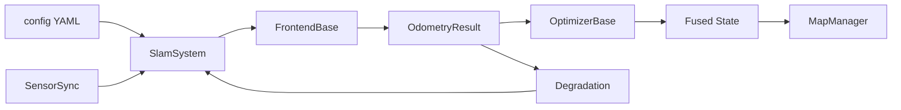

# 结构设计

> 对应代码根：`autonomy/localization/atla2/`  
> 原则：**一套后端 + 地图，多种前端按配置装配**；核心无 ROS / 厂商 SDK 依赖。

## 1. 设计目标

| 目标 | 实现手段 |
|------|----------|
| 模式可切换 | `FrontendMode` + factory，同一 `SlamSystem` |
| 传感器可扩展 | `SensorBase` + `SensorSuite`，驱动在子目录 |
| 后端可替换 | `OptimizerBase` → IEKF / Graph(Ceres) |
| 可降级 | `fusion/degradation`：LIVO→LIO/VIO→IMU |
| 可测试 | 离线 `apps/offline_runner` + `test/` + `tools/benchmark` |

## 2. 分层结构

```text
┌─────────────────────────────────────────────┐
│ apps / interface(ROS·gRPC·viz 规划中)        │  进程入口 / 适配
├─────────────────────────────────────────────┤
│ pipeline (SlamSystem + StateMachine)         │  编排
├──────────┬──────────┬──────────┬────────────┤
│ frontend │ backend  │ map      │ fusion     │  算法核心
├──────────┴──────────┴──────────┴────────────┤
│ sensor (abstract + sync + suite)             │  感知输入
├─────────────────────────────────────────────┤
│ common (types / time / transform / config)   │  基础设施
└─────────────────────────────────────────────┘
```

依赖方向：**自上而下单向**。`frontend` 不依赖 `backend`；`backend` 只认 `OdometryResult`；`map` 由 pipeline 写入。

## 3. 目录职责

| 目录 | 职责 | 关键产物 |
|------|------|----------|
| `common/` | 无业务类型、时间、外参树、配置 | `types.hpp` `Atla2Config` `TransformTree` |
| `sensor/` | 驱动抽象、预处理、软同步 | `SensorData` `SensorSync` |
| `frontend/` | VO/VIO/LIO/LIVO | `FrontendBase` `CreateFrontend` |
| `backend/` | IEKF / 滑动窗口图 / 因子 | `OptimizerBase` `CreateOptimizer` |
| `map/` | 关键帧、路标、点云、高程、占据 | `MapManager`（子模块待拆分） |
| `fusion/` | EKF / 因子图融合 / 门控 / 降级 | `DegradationManager` `MultiSourceEkf` |
| `pipeline/` | 系统状态与一步处理 | `SlamSystem::Step` |
| `config/` | 传感器 / 前端 / 后端 / 平台 YAML | `platforms/*.yaml` |
| `apps/` | 可执行入口 | offline / node / calib / bench |
| `tools/benchmark/` | 数据集评测 | metrics + runners |
| `test/` | 单测 / 集成 / 仿真夹具 | `*_test.cpp` |
| `docs/` | 本文档体系 | — |

## 4. 模块依赖图（逻辑）



## 5. 前端 / 后端矩阵

| 前端 | 典型后端 | 地图侧重 |
|------|----------|----------|
| VO | Ceres graph | landmarks |
| VIO | Ceres graph | landmarks + bias |
| LIO | IEKF | local / voxel cloud |
| LIVO (loose) | IEKF | landmarks + cloud |
| LIVO (tight) | Graph（规划） | 统一因子 |

## 6. 配置结构

```text
config/
├── sensors/{camera,imu,lidar,gps,barometer,optical_flow}/
├── frontend/{vo,vio,lio,livo}.yaml
├── backend/{iekf,graph,ceres}.yaml
├── map/default.yaml
└── platforms/{drone_*,vtol_*}.yaml   ← 运行时入口
```

平台 YAML 选择 mode / fusion / backend；传感器细节引用 `sensors/` 下文件（路径字段，加载器可逐步支持 include）。

## 7. 演进约定

1. **新传感器**：只加 `sensor/<name>/` + `config/sensors/<name>/`，不改 `FrontendBase` 签名。
2. **新前端模式**：实现 `FrontendBase`，注册 factory，补平台 YAML。
3. **新后端**：实现 `OptimizerBase`，`CreateOptimizer` 分支。
4. **地图子模块**：从 `MapManager` 迁入 `map/landmark|keyframe|point_cloud/...`，保持对外 API 稳定。
5. **空目录**：保留 `README.md` 说明职责，避免“幽灵文件夹”。

## 8. 相关文档

- [architecture.md](architecture.md) — 运行时架构与状态机
- [../interface/analysis.md](../interface/analysis.md) — 接口契约
- [../framework.md](../framework.md) — 完整历史设计树
