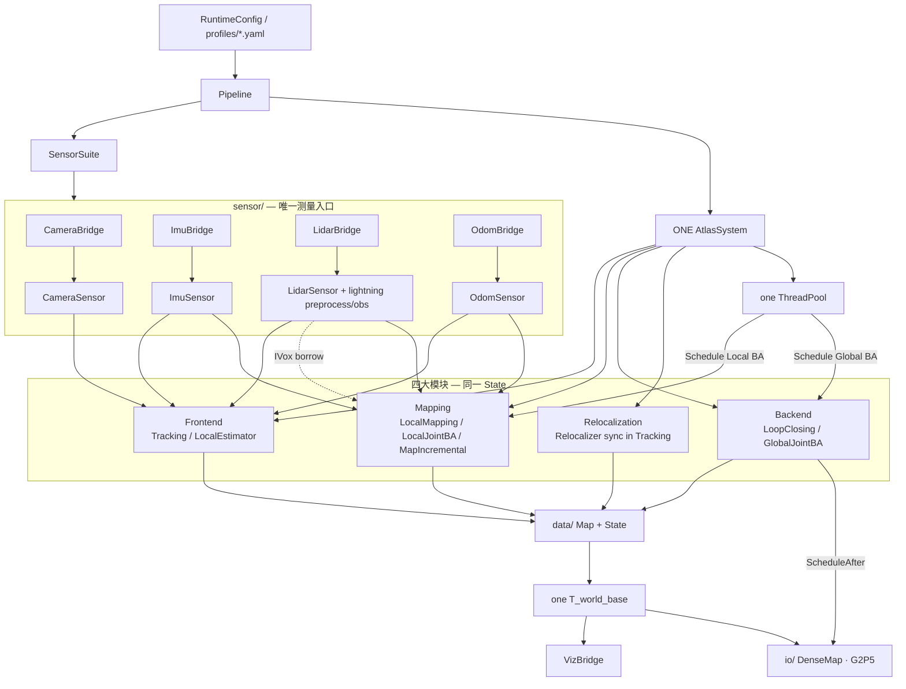
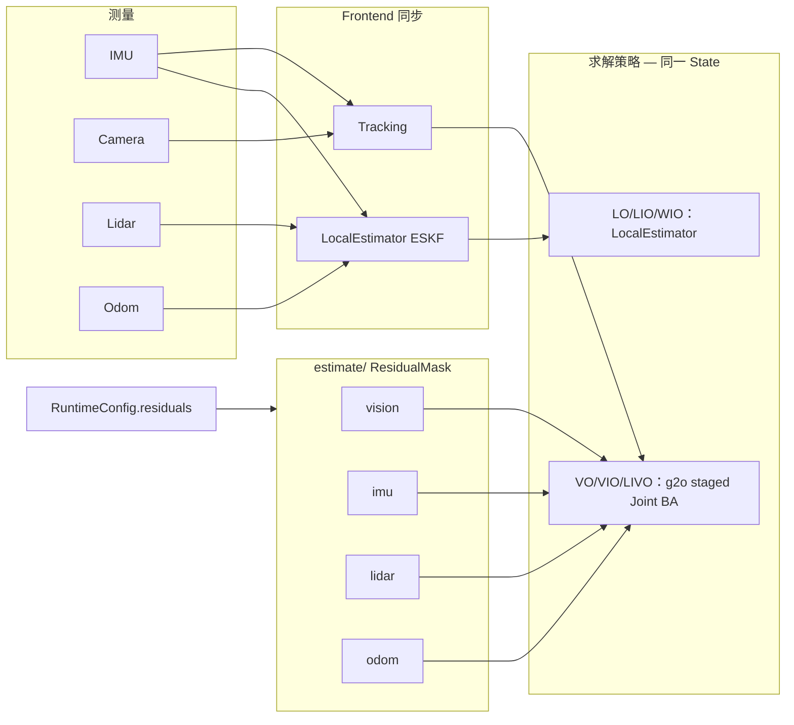
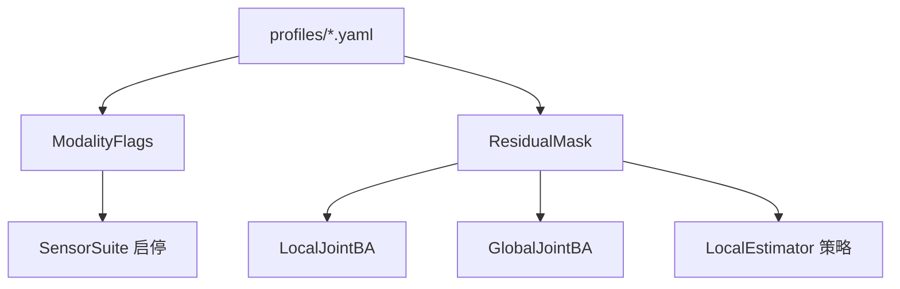

# Atlas — 只要一套 multimodal SLAM

**唯一系统：** `atlas::system` + `sensor::SensorSuite` + `Pipeline::AttachSystem`。  
模态 `vo|vio|lo|lio|livo|wio|lwio|lvwio` = **同一套系统上的传感器/残差掩码**，不是多套可执行体。

## 架构总览



## 数据与估计流



## 目录树（实际）

```text
atlas/
├── system.* / pipeline.* / runtime_config.* / config.*
├── sensor/
│   ├── imu/          # ImuSensor · ImuBridge · buffer/preintegrator
│   ├── camera/       # CameraSensor · CameraBridge · 相机模型
│   ├── lidar/        # LidarSensor · LidarBridge · preprocess · obs_model
│   └── odom/         # OdomSensor · OdomBridge
├── frontend/         # Tracking · LocalEstimator · initializer/ · eskf/ · lio/
│   ├── feature/ · match/ · solve/ · plp/ · initialize/
│   ├── eskf/         # frontend::Eskf
│   └── lio/          # MeasureGroup · ImuProcess · LidarImuSync
├── mapping/          # LocalMapping · LocalJointBA · MapIncremental · ivox/ · lidar_keyframe
│   └── ivox/         # mapping::IVox
├── backend/          # LoopClosing · LoopDetector · LidarLoopDetector · LidarPoseGraph · GlobalJointBA
├── relocalization/   # Relocalizer
├── estimate/         # ResidualMask · residual_{vision,imu,lidar,odom}
├── data/             # frame · keyframe · map_database · BoW
├── io/               # DenseMap · G2P5 · occupancy/cloud/octree…（计划中的 map/）
├── optimize/         # g2o 实现（冻结，经 estimate/ 暴露）
├── util/             # modality · schedule · publishers · converter…（计划中的 common/）
└── viz_bridge.*
```

| 路径 | 说明 |
|------|------|
| `sensor/` | 统一测量入口；**全部 ROS IO 经 `*Bridge`** |
| `frontend/` | Tracking + LocalEstimator + `eskf/` + feature/match/solve/plp/initialize |
| `mapping/` | LocalMapping + LocalJointBA + **MapIncremental** + `ivox/`（live IVox 所有者） |
| `backend/` | LoopClosing + GlobalJointBA |
| `relocalization/` | Relocalizer（BoW **同步**于 Tracking） |
| `estimate/` | ResidualMask + residual_* |
| `data/` | 唯一稀疏图 State |
| `io/` | DenseMap / G2P5 等侧路 |
| `optimize/` | g2o，**冻结不膨胀** |
| `util/` | schedule / modality / publishers |

## Canonical 类名

| §2b | 主类名（旧名兼容别名） |
|-----|-----------|
| `frontend/tracking.*` | `Tracking`（`using tracking_module = Tracking`） |
| `mapping/local_mapping.*` | `LocalMapping`（`using mapping_module = LocalMapping`） |
| `backend/loop_closing.*` | `LoopClosing`（`using global_optimization_module = LoopClosing`） |
| `frontend/eskf/` | `frontend::Eskf` |
| `mapping/ivox/` | `mapping::IVox` |
| `sensor/lidar/.../preprocess` | `sensor::Preprocess` |
| `sensor/lidar/obs_model` | `sensor::ObsModel` |
| `mapping/local_joint_ba.hpp` | `mapping::LocalJointBA` |
| `backend/global_joint_ba.*` | `backend::GlobalJointBA` |
| `mapping/map_incremental.hpp` | `mapping::MapIncremental`（`IntegrateScan` 插入；LidarSensor `set_ivox` 只读） |
| `relocalization/relocalizer.*` | `relocalization::Relocalizer` |
| `estimate/residual_*.hpp` | 共享残差 + `ResidualMask` |

## 模态与残差掩码



| Profile | 传感器 | 位姿权威 | 说明 |
|---------|--------|----------|------|
| **vo** | Cam | Tracking | 纯视觉 |
| **vio** | Cam+IMU | Tracking + IMU | 视觉惯性 |
| **lo** | Lidar | LocalEstimator | 雷达 ESKF update |
| **lio** | Lidar+IMU | LocalEstimator | PredictImu + UpdateLidar |
| **wio** | Odom+IMU | LocalEstimator | PredictImu + UpdateOdom |
| **lwio** | Lidar+Odom+IMU | LocalEstimator | 三源进同一 ESKF 路径 |
| **livo** | Cam+Lidar+IMU | Tracking + staged JointBA | mask 驱动 Local/Global |
| **lvwio** | 全开 | Tracking + JointBA + odom | 同上 + odom residual |

## Lidar LIO 进度（toward lightning-lm，无第二套 SLAM）

| 项 | 状态 | 说明 |
|----|------|------|
| **P0.1** MapIncremental owns insert | ✅ | `IntegrateScan`；`FeedWithPose` 只建残差；`LidarBridge::SetMapIncremental` |
| **Deskew** IMU 轨迹去畸变 | ✅ | `BuildImuPoses` + `UndistortByImuTrajectory`；无点时均匀 `t_rel` 近似；`<2` poses 回退 constant-ω |
| **Calib** 相机畸变 + 外参 | ✅ | `util/calibration`：`CalibrationBundle` / `undistort.hpp`；profile `calibration_path` |
| **IEKF** 解析 H | ✅ | `UpdateLidar` 迭代（`max_iekf_iter=4`）点面 H；信息形式 6×6 + Joseph；`PredictImu` Φ≈I+Fdt |
| **Lidar loop** | ✅ | PCL 多分辨率 NDT + `LidarPoseGraph`（g2o SE3，lightning-lm 风格）；ICP 回退；**不**并入 vision LoopClosing；`use_lidar_loop` 默认 false |
| **Preprocess** | ✅ | 扁平 `sensor/lidar/preprocess`；`LidarModel` + `t`/`time` 字段解码 |
| **IVox / TiledMap** | ✅ | Morton key 可选；面邻域 + capacity stats；`tiled_map.hpp` chunk 路由 |

Deferred（相对 lightning-lm，两边均无 Scan Context）：
- LIO 侧：`IMUInit` 重力初始化、ESKF 退化投影 / Anderson / 点到点 ICP、IVox **PHC/Hilbert**（现 Morton）、TiledMap **PCD Load/Save** 与动静态层
- 产品层：`localization/` 纯激光 NDT 定位 + ~100Hz 外推、雷达回环接入 vision 全局 BA（现仅 lidar SE3 图）、Livox CustomMsg / RoboSense 驱动级预处理
- 说明：lightning 外参亦为固定；“外参入状态”两边都未做；重力 lightning 有 IMUInit，Atlas deskew 仍硬编码 -9.81

## 约定

- 无双系统 / PoseFusion / 独立 Lightning Start。
- 残差由 Pipeline `ResidualMask::FromRuntime` 注入 Local/Global Joint BA。
- JointBA：同 mask + State；单次 `optimize()` 可分阶段（vision/imu → lidar/odom refine）。
- ThreadPool：`Schedule` / `ScheduleAfter`（回环 BA 后 DenseMap `RequestRebuild`）。
- Reloc 保持 Frontend 同步（BoW 暂不 Schedule）。

## Runtime profiles

`conf/atlas/profiles/`：`vo` `vio` `lo` `lio` `livo` `wio` `lwio` `lvwio`。

新代码请 include §2b 路径与 `Tracking` / `LocalMapping` / `LoopClosing` 别名。
