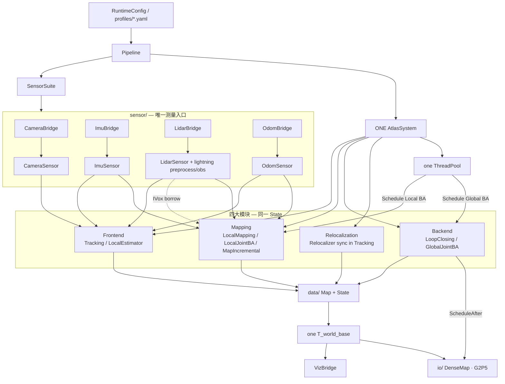
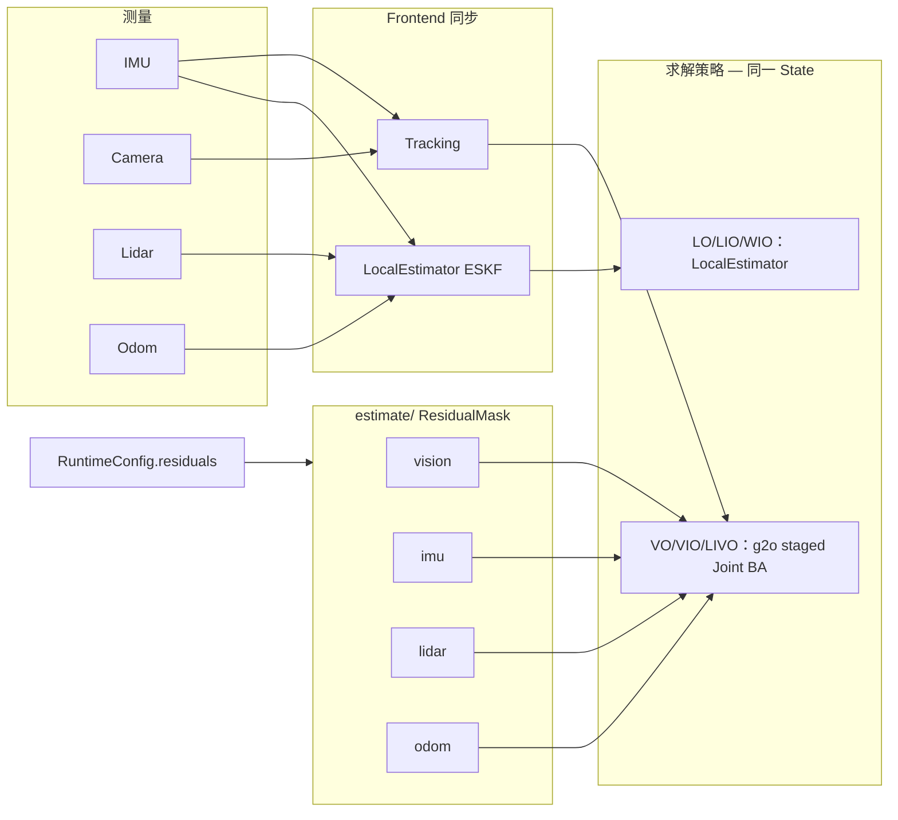
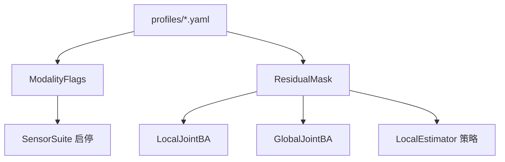

# Atlas — 只要一套 multimodal SLAM

**唯一系统：** `atlas::system` + `sensor::SensorSuite` + `Pipeline::AttachSystem`。  
模态 `vo|vio|lo|lio|livo|wio|lwio|lvwio` = **同一套系统上的传感器/残差掩码**，不是多套可执行体。

## 架构总览



## 数据与估计流



## 目录树（实际）

```text
atlas/
├── system.* / pipeline.* / runtime_config.* / config.*
├── sensor/
│   ├── imu/          # ImuSensor · ImuBridge · buffer/preintegrator
│   ├── camera/       # CameraSensor · CameraBridge · 相机模型
│   ├── lidar/        # LidarSensor · LidarBridge · preprocess · obs_model
│   └── odom/         # OdomSensor · OdomBridge
├── frontend/         # Tracking · LocalEstimator · initializer/ · eskf/ · lio/ · lidar_loc/
│   ├── feature/ · match/ · solve/ · plp/ · initialize/
│   ├── eskf/         # frontend::Eskf (+ AndersonAcceleration)
│   ├── lio/          # MeasureGroup · ImuProcess · LidarImuSync
│   └── lidar_loc/    # LidarLocator · PoseExtrapolator（先验图定位骨架）
├── mapping/          # LocalMapping · LocalJointBA · MapIncremental · TiledMap · ivox/ · lidar_keyframe
│   └── ivox/         # mapping::IVox (+ hilbert.hpp)
├── backend/          # LoopClosing · LoopDetector · LidarLoopDetector · LidarPoseGraph · GlobalJointBA
├── relocalization/   # Relocalizer
├── estimate/         # ResidualMask · residual_{vision,imu,lidar,odom}
├── data/             # frame · keyframe · map_database · BoW
├── io/               # DenseMap · G2P5 · occupancy/cloud/octree…（计划中的 map/）
├── optimize/         # g2o 实现（冻结，经 estimate/ 暴露）
├── util/             # modality · schedule · publishers · converter…（计划中的 common/）
└── viz_bridge.*
```

| 路径 | 说明 |
|------|------|
| `sensor/` | 统一测量入口；**全部 ROS IO 经 `*Bridge`** |
| `frontend/` | Tracking + LocalEstimator + `eskf/` + feature/match/solve/plp/initialize |
| `mapping/` | LocalMapping + LocalJointBA + **MapIncremental** + **TiledMap** + `ivox/`（live IVox 所有者） |
| `backend/` | LoopClosing + GlobalJointBA |
| `relocalization/` | Relocalizer（BoW **同步**于 Tracking） |
| `estimate/` | ResidualMask + residual_* |
| `data/` | 唯一稀疏图 State |
| `io/` | DenseMap / G2P5 等侧路（显示/导航，不参与定位） |
| `optimize/` | g2o，**冻结不膨胀** |
| `util/` | schedule / modality / publishers |

## Canonical 类名

| §2b | 主类名（旧名兼容别名） |
|-----|-----------|
| `frontend/tracking.*` | `Tracking`（`using tracking_module = Tracking`） |
| `mapping/local_mapping.*` | `LocalMapping`（`using mapping_module = LocalMapping`） |
| `backend/loop_closing.*` | `LoopClosing`（`using global_optimization_module = LoopClosing`） |
| `frontend/eskf/` | `frontend::Eskf`（可选 Anderson AA + dx clip） |
| `frontend/lidar_loc/` | `frontend::LidarLocator` · `PoseExtrapolator` |
| `mapping/ivox/` | `mapping::IVox`（Morton / Hilbert key） |
| `sensor/lidar/.../preprocess` | `sensor::Preprocess` |
| `sensor/lidar/obs_model` | `sensor::ObsModel` |
| `mapping/local_joint_ba.hpp` | `mapping::LocalJointBA` |
| `backend/global_joint_ba.*` | `backend::GlobalJointBA` |
| `mapping/map_incremental.hpp` | `mapping::MapIncremental`（`IntegrateScan` 插入；可选 `set_tiled_map`） |
| `mapping/tiled_map.*` | `mapping::TiledMap`（chunk key / PCD+`index.yaml` Save·Load / `LoadOnPose`） |
| `relocalization/relocalizer.*` | `relocalization::Relocalizer` |
| `estimate/residual_*.hpp` | 共享残差 + `ResidualMask` |

## 模态与残差掩码



| Profile | 传感器 | 位姿权威 | 说明 |
|---------|--------|----------|------|
| **vo** | Cam | Tracking | 纯视觉 |
| **vio** | Cam+IMU | Tracking + IMU | 视觉惯性 |
| **lo** | Lidar | LocalEstimator | 雷达 ESKF update |
| **lio** | Lidar+IMU | LocalEstimator | PredictImu + UpdateLidar |
| **wio** | Odom+IMU | LocalEstimator | PredictImu + UpdateOdom |
| **lwio** | Lidar+Odom+IMU | LocalEstimator | 三源进同一 ESKF 路径 |
| **livo** | Cam+Lidar+IMU | Tracking + staged JointBA | mask 驱动 Local/Global |
| **lvwio** | 全开 | Tracking + JointBA + odom | 同上 + odom residual |

## Lidar LIO 进度（toward lightning-lm，无第二套 SLAM）

| 项 | 状态 | 说明 |
|----|------|------|
| **P0.1** MapIncremental owns insert | ✅ | IEKF → 选择插入；**sync 失败整帧跳过**；spin/拒更时不写图；no-NN 限流 |
| **Deskew** IMU 轨迹去畸变 | ✅ | `BuildImuPoses` + `UndistortByImuTrajectory`；无点时均匀 `t_rel` 近似；`<2` poses 回退 constant-ω |
| **Calib** 相机畸变 + 外参 | ✅ | `util/calibration`：`CalibrationBundle` / `undistort.hpp`；profile `calibration_path` |
| **IEKF** 解析 H | ✅ | 点面 + 可选点到点；信息形式 6×6 + Joseph；步长 **0.5 m / 5°**（对齐 lightning） |
| **IMUInit** 重力 + bg | ✅ | `ImuProcess::TryImuInit`（~20 帧均值）；`Eskf::State::gravity`；未就绪前跳过 deskew / UpdateLidar |
| **ESKF degeneracy** | ✅ | HTH 特征值投影 + inflation；可选 Anderson AA（默认 off） |
| **前端门控** | ✅ | 仅 **surf&lt;20** 跳过更新（lightning `obs.valid_`）；无 mean_res/spin 预拒；拒更后仍选插图 |
| **Lidar loop** | ✅ | NDT + `LidarPoseGraph`；Optimize → **重建 IVox** + `SetPose`；LIO 用 `lio_full.yaml`（`use_lidar_loop: true`） |
| **G2P5** | ✅ | `io/g2p5` 全量对齐；OccupancyGrid Writer + Shutdown `SaveOccupancy` |
| **Preprocess** | ✅ | 扁平 `sensor/lidar/preprocess`；`LidarModel` + `t`/`time`/`offset_time`；无时间时可选 `ring` 合成 |
| **IVox / TiledMap** | ✅ | Nearby6/18/26；**esti_plane_threshold**；线性 / PHC；LRU；`GetClosestPoints` |
| **LidarLocator** | ✅ | 先验 TiledMap + PCL NDT；主环 `Align`；产品档 `lo_loc.yaml` |
| **High-rate pose / TF** | ✅ | IMU 只推进外推器本地态；estimator PredictImu 仅 deskew；`body_flu_pose`；map→odom **雷达率** |
| **ObsModel 上游** | ✅ | `--atlas_enable_lightning_upstream=true` → 点面+ICP 残差进 IEKF |
| **LIO 轮速** | ✅ | `/odom` **仅 seed**（`apply_relative_odom=false`）；避免与雷达双重积分飞位 |

### Lightning 全产品对照（诚实）

| Lightning 产品能力 | Atlas LIO | 差距 |
|--------------------|-----------|------|
| 前端 LIO（IMUInit / deskew / IEKF / IVox） | ✅ 单系统主链 | — |
| 高周波姿 + map→odom | ✅ 雷达率 TF + IMU 轨迹 | 高周为本地外推，非 estimator 连续 Predict |
| 雷达回环 + 位姿图 | ✅ `lio_full` / yaml 开关 | 无 Scan Context（lightning 亦无） |
| G2P5 栅格 | ✅ 发布 + 落盘 | — |
| 先验图 NDT 定位 | ✅ `lo_loc` + LidarLocator | 无 pclomp NDT-OMP |
| TiledMap 动静态 TTL | ✅ DynPolicy API + index.yaml | profile 默认 `maps.tiled=false` |
| Livox / RoboSense 原生 msg | ❌ preprocess 模型枚举有，无 CustomMsg IO | deferred |
| GPS / 离在线评测架 | ❌ | deferred |
| Vision GlobalBA ↔ 雷达回环 merge | ❌（故意：单系统不双 BA） | deferred |
| 独立 Lightning 进程 / PoseFusion | ❌（产品决策：不合入） | N/A |

Deferred（相对 lightning-lm）：
- 产品层：pclomp NDT-OMP、vision GlobalBA↔雷达回环 merge、原生 Livox CustomMsg / RoboSense、离在线验证框架、GPS
- 说明：lightning 外参亦为固定；“外参入状态”两边都未做；用 g2o 替代 miao

## Lightning-lm `core/` ↔ Atlas

| Lightning | Atlas | 状态 |
|-----------|-------|------|
| `core/lio` | `frontend/{eskf,lio}` · `sensor/lidar/{preprocess,obs_model}` · `LocalEstimator` | 主链 ✅（AA/clip ✅；双重 PredictImu 已拆） |
| `core/ivox3d` | `mapping/ivox`（Nearby + 线性/PHC）· `MapIncremental` | ✅（先 IEKF 再 IntegrateScan） |
| `core/loop_closing` | `LidarLoopDetector` + `LidarPoseGraph`；视觉 `LoopClosing` | partial（vision GlobalBA merge 仍 deferred） |
| `core/maps` | `mapping/tiled_map` · `io/{cloud_map,dense_map_builder}` | partial（PCD+index + DynPolicy） |
| `core/system` | `system` · `pipeline` · `runtime_config` · ThreadPool | done（单系统） |
| `core/miao` | `optimize/*`（g2o）· `graph_optimizer` · `lidar_pose_graph` | done（不引入 miao） |
| `core/g2p5` | `io/g2p5` | done（OccupancyGrid Writer + `SaveOccupancy`） |
| `core/localization` | `frontend/lidar_loc`（LidarLocator + PoseExtrapolator） | product path（非第二套 SLAM） |

## 约定

- 无双系统 / PoseFusion / 独立 Lightning Start。
- 残差由 Pipeline `ResidualMask::FromRuntime` 注入 Local/Global Joint BA。
- JointBA：同 mask + State；单次 `optimize()` 可分阶段（vision/imu → lidar/odom refine）。
- ThreadPool：`Schedule` / `ScheduleAfter`（回环 BA 后 DenseMap `RequestRebuild`）。
- Reloc 保持 Frontend 同步（BoW 暂不 Schedule）。

## Runtime profiles

`conf/atlas/profiles/`：`vo` `vio` `lo` `lio` `lio_full` `livo` `wio` `lwio` `lvwio` · `lo_loc`（先验图定位）。

新代码请 include §2b 路径与 `Tracking` / `LocalMapping` / `LoopClosing` 别名。
