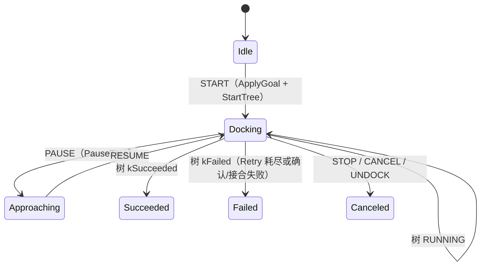
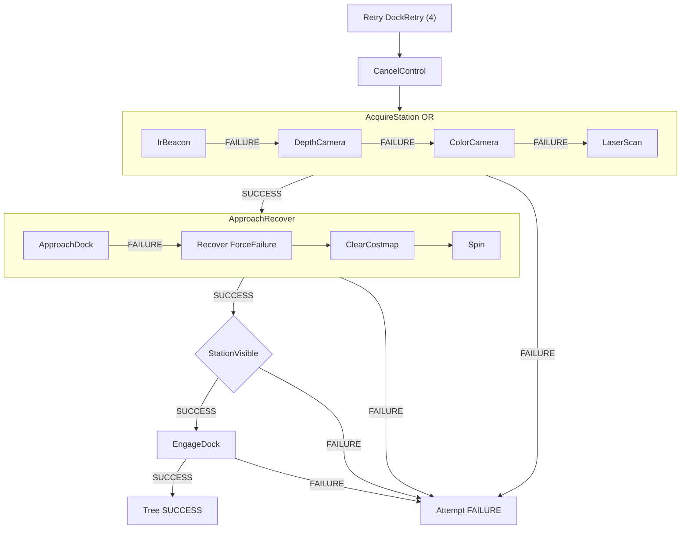

# 回充行为树

`dock.xml` 是 `ChargingTask` 的默认树：一次对接 = **获取桩位 → 接近 → 确认可见 → 接合**。接近段复用导航 `PlanPath` / `FollowPath`，失败则清图 + 原地转，再由外层 `Retry` 重试。

加载路径：`BtDefaults` → `task/behavior_tree/charging/dock.xml`。周期：`bt_loop_duration_ms = 10`。

当前树是**统一 XML**：红外 / RGB-D / RGB / 激光都挂在同一棵 `AcquireStation` 上。四个 `DockSearch` 走**同一个插件**；分模态检出尚未实现。

---

## 控制架构

四层。树只编排阶段，桩位与接合状态在 `ChargingClient`；运动走共享 `NavigationClient`。

```text
Bridge  SendDockCommand (START / PAUSE / RESUME / STOP / CANCEL / UNDOCK)
            │  ChargingGoal
            ▼
       ChargingTask        会话、黑板、生命周期 ↔ DockStatus
            │  StartTree / OnTreeTick / StopTree
            ▼
       BtRunner            10 ms tickOnce
            │  blackboard: charging_client, navigation_client, dock_pose, …
            ▼
       dock.xml            Acquire → Approach → Confirm → Engage
            │
            ├── ChargingClient     搜索桩、可见性启发式、接合标记
            └── NavigationClient   规划 / 平滑 / 跟踪 / 清图 / Spin
                    │
                    ▼
                 底盘 / costmap
```

| 层 | 职责 |
|---|---|
| `ChargingTask` | `DOCK_CMD_*`；`ApplyGoal`；树成败映射 `DockStatus`；进度条（运行中每拍 +0.02，封顶 0.95） |
| `dock.xml` | 一次尝试：取消残留控制 → 获取桩 → 接近（可恢复）→ 确认 → 接合 |
| `ChargingClient` | `max_search_radius`、目标（`dock_station_id` 或 `dock_pose`）、`search_complete_` / `charger_visible_` / `dock_connected_` |
| `NavigationClient` | 与导航任务共用。接近段与 `navigate_to_pose.xml` 同型 |

自定义节点在 `autonomy/task/apps/charging/plugins/`：

| XML | 插件 | 语义 |
|---|---|---|
| `DockSearch` | `dock_search_action.cpp` | `RunDockSearch()`。**桩：置 `search_complete_` 后恒 SUCCESS**；不读 `name=`，红外与激光无差别 |
| `ChargerVisible` | `dock_connect_action.cpp` | `IsChargerVisible()` |
| `DockConnect` | 同上 | `MarkConnected()`。端口 `battery_target_percent` **未消费** |
| `DockApproach` | 同上 | 仅当 `IsChargerVisible()` 时 SUCCESS。**当前 XML 未引用**；接近由导航节点完成 |

接近段标签与导航相同（`PlanPath`、`FollowPath` 等），注册在 `autonomy/task/apps/navigation/plugins/`。

---

## 运行流程

### 会话



- `START`：`EnsureChargingClient`（依赖已有 `shared_navigation`）→ `ApplyGoal` 清搜索/接合标志 → `StartTree`。
- `PAUSE` / `RESUME`：停/续树。Paused 时 `MapStatus` 报 `DOCK_STATUS_APPROACHING`（与「接近中」语义重叠，见待办）。
- `STOP` / `CANCEL` / `UNDOCK`：`CancelActiveMotion` + `StopTree`，一律 `CANCELED`。**没有独立脱桩树**。

`DockStatus` 中的 `SEARCHING` / `CHARGING` / `UNDOCKING` **从未由任务层写出**。运行中固定 `DOCKING`。

### 单次尝试（Tick）

`DockAttempt` 是普通 `Sequence`：阶段顺序执行，成功后不再回评上一阶段。接近段必须用 `ReactiveFallback`：跟踪 RUNNING 时仍可在失败后切到恢复。



名义路径：`CancelControl` → `AcquireStation`（四模态 OR）→ `ApproachDock` → `StationVisible` → `EngageDock`。

`ForceFailure Recover`：清图 + Spin 即使成功也返回 FAILURE，避免被当成接近成功。与导航树相同手法；回充恢复**没有** `BackUp` / `Wait`。

---

## `dock.xml` 节点

```xml
<Retry num_attempts="4" name="DockRetry">
  <Sequence name="DockAttempt">
    <CancelControl/>
    <ReactiveFallback name="AcquireStation"> …四路 DockSearch… </ReactiveFallback>
    <ReactiveFallback name="ApproachRecover">
      <Sequence name="ApproachDock"> TransformValid → PlanPath → SmoothPath
                                    → PathValid → FollowPath → GoalReached </Sequence>
      <ForceFailure name="Recover"> ClearCostmap → Spin </ForceFailure>
    </ReactiveFallback>
    <ChargerVisible name="StationVisible"/>
    <DockConnect name="EngageDock"/>
  </Sequence>
</Retry>
```

| 节点 | 类型 | 失败时 |
|---|---|---|
| `DockRetry` | Retry(4) | 四次 `DockAttempt` 都失败 → 树 FAILURE |
| `DockAttempt` | Sequence | 任一阶段失败则本轮结束，交给 Retry |
| `CancelControl` | Action | 取消上一拍残留跟踪 |
| `AcquireStation` | ReactiveFallback | 左起第一路 SUCCESS 即短路；四路全失败则本轮失败 |
| `IrBeacon` 等 | `DockSearch` + `name=` | 仅 Groot/日志标签；插件不读 `name` |
| `ApproachRecover` | ReactiveFallback | 接近失败才进 Recover |
| `ApproachDock` | Sequence | TF / 规划 / 平滑 / 路径 / 跟踪 / 到桩位容差（默认 0.15 m） |
| `Recover` | ForceFailure | 恢复成功也 FAILURE，触发外层 Retry |
| `StationVisible` | Condition | 启发式可见性失败则本轮失败（不回 Acquire） |
| `EngageDock` | SyncAction | `MarkConnected()` 失败则本轮失败 |

`Goal` 的 `max_retry_count` **未接入**；重试次数写死在 XML 的 `num_attempts="4"`（导航为 6）。

---

## 数据流

### Goal → Client → 黑板

`PopulateBlackboard` 在 `StartTree` 时写一次。接近用的 `dock_pose` 是当时 Client 里的值；搜索节点**不会**回写黑板。

```text
ChargingGoal
  command, max_search_radius, max_retry_count
  oneof dock_target: dock_station_id | dock_pose
        │
        ▼ ApplyGoal
ChargingClient
  max_search_radius_          默认 3 m（Goal≤0 时）
  dock_station_id_ / dock_pose_
  search_complete_            DockSearch 成功后 true
  charger_visible_            仅 MarkConnected 置 true
  dock_connected_
  battery_target_percent_     恒 100；Goal 无此字段
        │
        ▼ PopulateBlackboard
blackboard
  charging_client
  navigation_client
  global_frame = map
  robot_base_frame = base_link
  default_planner_id = navfn_planner
  default_controller_id = FollowPath
  default_smoother_id = simple_smoother
  goal_reached_tol = 0.15
  dock_pose, dock_station_id, battery_target_percent
  compute_path_error_* / follow_path_error_*   接近失败时由导航节点写入
```

### 可见性启发式（非感知）

`IsChargerVisible()`：

```text
search_complete_
  AND ( charger_visible_
        OR dock_station_id 非空
        OR dock_pose 的 x、y 不全为 0 )
```

含义：

| Goal 目标 | 搜索桩成功后 `StationVisible` |
|---|---|
| 有 `dock_station_id` | SUCCESS（不验证真看到桩） |
| 有 `dock_pose` 且 xy ≠ 原点 | SUCCESS |
| 未设目标（位姿默认原点） | FAILURE |

`charger_visible_` 在接合时才置位，因此确认段**用不上**真实「看到充电桩」。

### 接近目标

`PlanPath` / `GoalReached` 读黑板 `dock_pose`。若 Goal 只给了 `dock_station_id`、未给位姿，接近的是 Client 构造时的默认原点姿态（`map`、单位四元数），除非后续搜索把 `dock_pose_` **和黑板**一起更新（目前都没有）。

---

## 取消与停车

| 事件 | 行为 |
|---|---|
| `STOP` / `CANCEL` / `UNDOCK` | `CancelActiveMotion` + `StopTree` |
| 树 FAILURE | `OnTreeTick` 标 `kFailed`；**不**额外发零速（依赖导航 cancel / 控制器停） |
| `PAUSE` | 停树，不 cancel motion 以外的充电接触 |

回充失败应停靠或脱离接触，不要假定导航恢复能代替接合失败处理。

---

## 待办

相对「四阶段对接骨架」，XML 形状已闭合。相对可上机的多传感器回充，Client 与任务层仍是桩。

- [ ] **分模态检出**：四个 `DockSearch` 同一实现且恒 SUCCESS，Fallback 永远只跑 `IrBeacon`。按 `name=` 或拆 `IrBeacon` / `DepthCamera` / `ColorCamera` / `LaserScan` 独立节点，失败才试下一模态；单传感器机型只保留对应子节点。
- [ ] **搜索写回位姿**：检出成功后更新 `dock_pose_` 并写入黑板，否则 `dock_station_id` 路径会规划到原点。
- [ ] **真实可见性**：`ChargerVisible` 应看红外/视觉/反射板，而不是 id 非空或 xy≠0。
- [ ] **`DockConnect` 空转**：未发接合指令、未读电池、未等接触/电流；`battery_target_percent` 端口与 Client 字段均未与 Goal 对齐。
- [ ] **`max_retry_count`**：Goal 有字段，XML 写死 4；应注入 Retry 或任务层循环。
- [ ] **状态机与 Feedback**：运行中应区分 `SEARCHING` / `APPROACHING` / `DOCKING` / `CHARGING`；Paused 不应占用 `APPROACHING`；`battery_percent` Feedback 未填。
- [ ] **`UNDOCK`**：现与 CANCEL 相同。需要脱桩树（退出接触 → 后退 → 结束充电）。
- [ ] **接近恢复偏弱**：无 `BackUp` / `Wait`；桩前狭窄通道可能转圈撞桩。
- [ ] **未使用节点**：`DockApproach` 仍注册。接近已由导航序列承担，删除或改成精细对准（最后一米）。
- [ ] **确认失败不回搜索**：`StationVisible` 失败只 Retry 整轮；接近后再丢可见性应回到 `AcquireStation`，而不是从 `CancelControl` 重来。
- [ ] **共享导航**：回充依赖 `shared_navigation()`；导航任务未起来则 `START` 失败。热插拔/无 planner 时的降级未定义。

不要把遥操的看门狗速度环搬进本树。回充是有终态的对接，不是持续跟踪。
