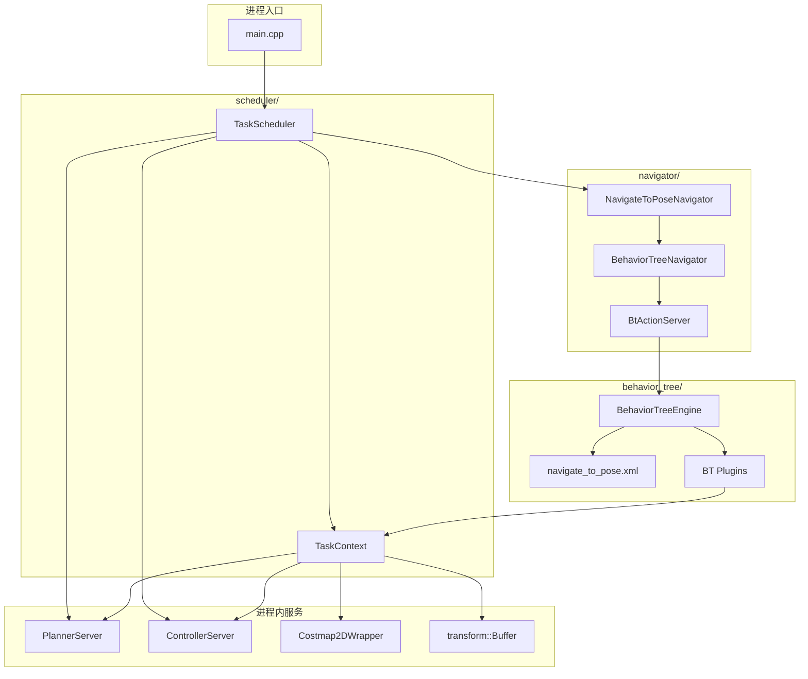
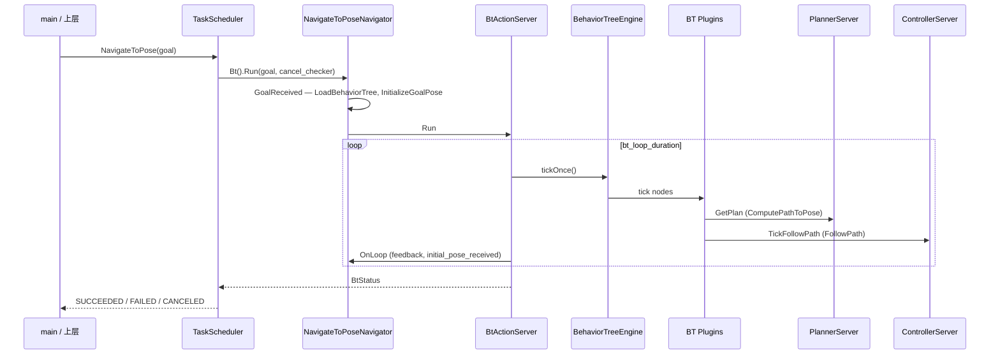

# 架构设计

## 设计目标

- **单进程**：`PlannerServer`、`ControllerServer`、行为树在同一进程内调度，不依赖 Autolink/Boost action/topic/service。
- **可配置 BT**：导航逻辑由 XML（如 `navigate_to_pose.xml`）描述，插件以动态库形式注册到 BehaviorTree.CPP。
- **共享上下文**：BT 插件通过 blackboard 上的 `task_context` 访问规划器、控制器与 costmap。

## 总体架构

## 核心组件

### TaskScheduler

| 职责 | 说明 |
|------|------|
| 配置加载 | `tasks/tasks.lua`、`planner/planner.lua`、`control/controller.lua` |
| 生命周期 | 创建并 `Start()` / `Shutdown()` planner 与 controller |
| 导航 API | `NavigateToPose(goal)`、`RequestCancel()` |
| Navigator 注册 | 按 `tasks.lua` 中 `navigators` 列表创建 `NavigateToPoseNavigator` |

实现：`scheduler/task_scheduler.{hpp,cpp}`

### TaskContext

进程内共享句柄，由 blackboard 键 `task_context` 注入各 BT 插件。

| 字段 | 用途 |
|------|------|
| `planner` | 全局路径规划 |
| `controller` | 路径跟踪控制 |
| `global_costmap` / `local_costmap` | 代价地图（清理、路径校验） |
| `tf` | 坐标变换 |
| `cancel_flag` | 与 `TaskScheduler::cancel_requested_` 联动 |
| `selected_planner_id` / `selected_controller_id` | 与 Selector 节点同步 |

实现：`common/task_context.hpp`

### BehaviorTreeNavigator / BtActionServer

- **BehaviorTreeNavigator**：加载 BT XML、初始化 blackboard、绑定 `GoalReceived` / `OnLoop` / `OnPreempt` 回调。
- **BtActionServer**：无 middleware action server；`Run(goal, is_canceling)` 内循环 `BehaviorTreeEngine::tickOnce()` 直至 SUCCESS / FAILURE / CANCELED。

实现：`common/behavior_tree_navigator.hpp`、`behavior_tree/behavior_tree_action_server*`

### BT 插件分类

详见 [blackboard_and_plugins.md](blackboard_and_plugins.md)。

| 类型 | 基类 | 典型节点 |
|------|------|----------|
| 进程内长运行 | `BtStatefulActionNode` | `ComputePathToPose`、`FollowPath`、`Wait` |
| 进程内同步 | `BtCostmapClearNode` 等 | `ClearEntireCostmap` |
| 条件 | `BT::ConditionNode` | `GoalReached`、`IsPathValid` |
| 遗留桩 | `BtActionNode` / `BtServiceNode` | `Spin`、`BackUp`（快速 SUCCESS，待迁移） |

## 一次 NavigateToPose 的时序

## 配置与路径解析

| 配置项 | 文件 | 说明 |
|--------|------|------|
| `TaskOptions` | `config/tasks/tasks.lua` | 坐标系、BT 插件库名、navigator 开关 |
| BT XML | `config/tasks/behavior_tree/*.xml` | 由 `bt_xml_path_resolver` 解析为绝对路径 |
| Planner | `config/planner/planner.lua` | `AUTONOMY_PLANNER` → `PlannerServer` |
| Controller | `config/control/controller.lua` | `AUTONOMY_CONTROLLER` → `ControllerServer` |

`TaskScheduler::SetupNavigators()` 将默认 BT 设为 `navigate_to_pose.xml`（可在 `tasks.lua` 的 `navigate_to_pose.default_behavior_tree_file` 覆盖）。

## 与历史架构的差异

| 维度 | 历史（Nav2 / Autolink 风格） | 当前单进程 |
|------|------------------------------|------------|
| 规划/控制调用 | Action client → topic | `TaskContext` 直接调用 C++ API |
| BT 长运行节点 | 异步 action 回调 | `BtStatefulActionNode::onRunning()` |
| Costmap 清理 | Service client | `costmap_clear_utils` + `Costmap2DWrapper` |
| 入口 | 多节点 + action server | `TaskScheduler` + `main` |

更多背景见 [single_process_design.md](single_process_design.md)。

## 扩展新 Navigator

1. 继承 `BehaviorTreeNavigator<ActionT>`，在构造时传入 navigator 名称与默认 BT 路径，并实现 `GoalReceived()` 等。
2. 在 `TaskScheduler::SetupNavigators()` 中按配置实例化。
3. 为新 BT 增加 `SetupXxxBlackboard()`（可参考 `bt_blackboard_setup.cpp`）。
4. 在 `tasks.lua` 的 `plugin_lib_names` 中注册所需插件库。
