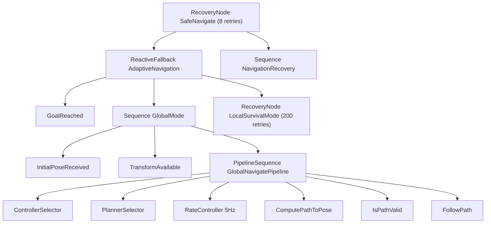

# navigate_to_pose.xml 执行说明

行为树文件：`config/tasks/behavior_tree/navigate_to_pose.xml`  
主树 ID：`MainTree`

## 树结构概览



## 模式 A：全局导航（GlobalMode）

当以下条件满足时走该分支：

1. `InitialPoseReceived` → blackboard `initial_pose_received == true`
2. `TransformAvailable` → `tf_buffer` 存在 `{robot_base_frame}` → `{global_frame}` 变换
3. `PipelineSequence` 依次执行规划管线

### Pipeline 步骤

| 顺序 | 节点 | 进程内实现 | 说明 |
|------|------|------------|------|
| 1 | `ControllerSelector` | `controller_selector_node` | 输出 `selected_controller`，默认 `FollowPath` |
| 2 | `PlannerSelector` | `planner_selector_node` | 输出 `selected_planner`，`GridBased` 映射为 `navfn_planner` |
| 3 | `RateController` | `rate_controller` | 5 Hz 限制 `ComputePathToPose` 重规划频率 |
| 4 | `ComputePathToPose` | **Stateful** → `PlannerServer::GetPlan` | 读 `{goal}`，写 `{path}` |
| 5 | `IsPathValid` | **Condition** → costmap 采样 | 校验路径点在全局 costmap 上可行 |
| 6 | `FollowPath` | **Stateful** → `ControllerServer::TickFollowPath` | 读 `{path}`、`{selected_controller}` |

### Goal 写入时机

`NavigateToPoseNavigator::InitializeGoalPose()` 在 `GoalReceived` 中：

- 将 goal 变换到 `global_frame`
- 写入 blackboard：`goal`、`path`（清空）
- 设置 `initial_pose_received = true`（若 TF 可用）

`OnLoop()` 周期更新 `initial_pose_received`（TF 丢失时置 `false`）。

## 模式 B：局部生存（LocalSurvivalMode）

当 GlobalMode 失败（如 TF 不可用）时，`ReactiveFallback` 尝试该分支：

- `Inverter(TimeExpired)`：在 `local_survival_timeout` 秒内为 SUCCESS，超时后失败
- `Inverter(TransformAvailable)`：定位仍失效时 SUCCESS，进入局部运动
- `RoundRobin`：`DriveOnHeading` / `Spin` / `BackUp`（当前多为 **Action 桩**，快速完成）

失败时进入子 Recovery：`ClearEntireCostmap` → `ReinitializeGlobalLocalization` → `Wait(0.2s)`。

## 顶层恢复（NavigationRecovery）

`SafeNavigate` 的 Recovery 子树：

1. 清理 local / global costmap  
2. `BackUp`  
3. `Spin`  
4. `ReinitializeGlobalLocalization`  

用于全局导航失败后的重试（最多 8 次，由 `RecoveryNode` 控制）。

## 与代码的对应关系

```
TaskScheduler::NavigateToPose(goal)
  └─ NavigateToPoseNavigator::Bt().Run(goal)
       ├─ LoadBehaviorTree(…/navigate_to_pose.xml)  // GoalReceived
       ├─ InitializeGoalPose → blackboard[goal, path, …]
       └─ BehaviorTreeEngine::Run → tick MainTree
```

默认预加载：构造 `BehaviorTreeNavigator` 时即 `LoadBehaviorTree` 默认 XML 路径（由 `TaskScheduler` 的 `bt_xml_path_resolver` 解析）。

## 运行前置条件

| 条件 | 不成立时的行为 |
|------|----------------|
| TF：`map` → `base_link` | GlobalMode 失败，可能进入 LocalSurvival |
| Costmap 已更新 | `GetPlan` / `IsPathValid` 可能失败 |
| `plugin_lib_names` 完整 | BT 工厂加载节点失败 |
| 有效 goal | `GoalReceived` 返回 false，任务不启动 |

## gflags 快速验证

```bash
--run_navigate_to_pose
--nav_goal_x=2.0 --nav_goal_y=1.0 --nav_goal_yaw=0.0
```

## 自定义行为树

Goal 中可指定 `behavior_tree` 字段（basename 或绝对路径）。相对名会通过 `FeedbackUtils::bt_xml_path_resolver` 解析为：

```
{configuration_directory}/tasks/behavior_tree/{filename}
```

若不指定，使用 `tasks.lua` / 代码默认的 `navigate_to_pose.xml`。
