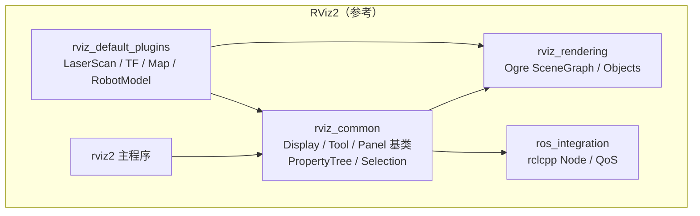
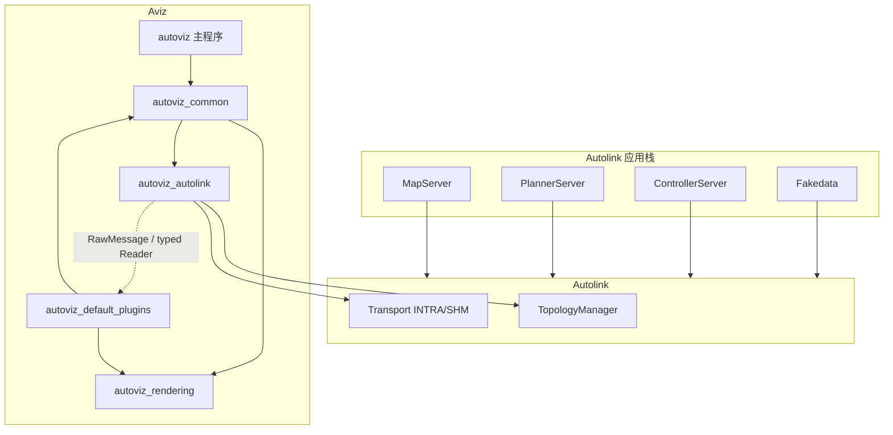
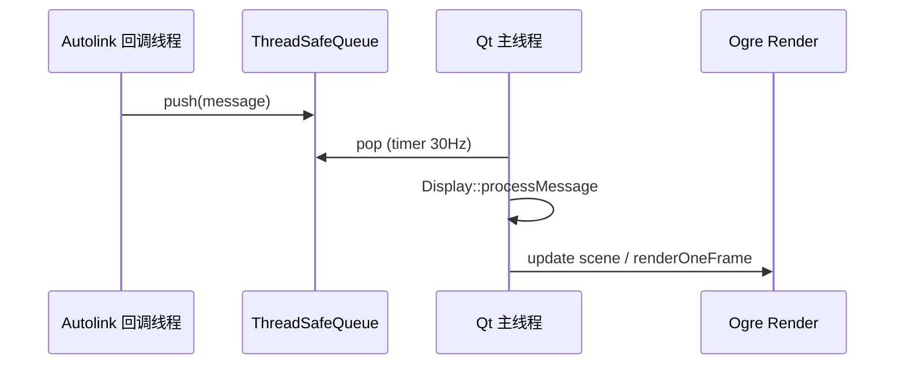
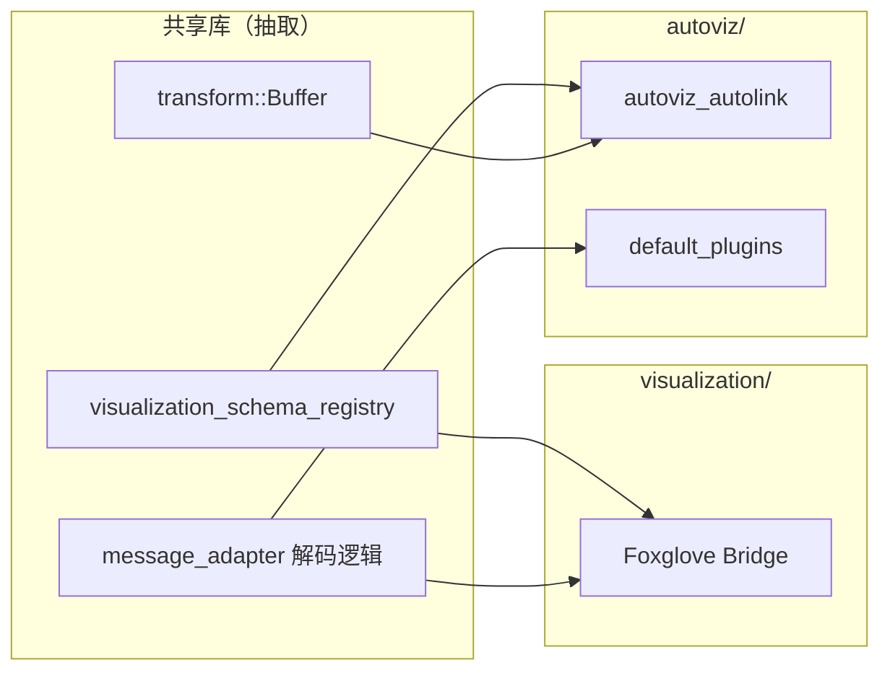

# Autoviz 架构设计

> 借鉴 [RViz2](https://github.com/ros2/rviz) 分层与插件模型，以 **Autolink** 替代 `ros_integration`，打造 Autonomy 栈原生、跨平台 3D 可视化工具。

---

## 1. 背景与目标

### 1.1 动机

Autonomy 以 Autolink 为内部总线，现有可视化有两条路径：

1. **ROS 2 + RViz2**：经 `autonomy_ros` 桥接，依赖完整 ROS 2 栈；
2. **Foxglove Bridge**：WebSocket 转发，适合远程与 MCAP，但缺少 RViz 级本地交互（Fixed Frame 拖拽、Tool、Display 属性树）。

Autoviz 填补 **原生 Autolink 直连 + 桌面 3D 交互** 的空白。

### 1.2 设计目标

| 目标 | 说明 |
|------|------|
| **Autolink 原生** | 零 ROS 2 依赖；`CreateNode` + `RawMessage` / 强类型 Reader |
| **RViz2 体验对齐** | Display / Tool / Panel / ViewController 插件体系 |
| **跨平台** | Linux / Windows / macOS（Qt6 + Ogre） |
| **可扩展** | 动态插件加载；用户可写自定义 Display |
| **复用现有资产** | 共享 `visualization_schema_registry`、message adapter、TF buffer |

### 1.3 非目标（首版）

- 替代 Foxglove（远程协作、MCAP Studio 面板）
- 100% RViz2 插件兼容（API 不同，概念对齐）
- 内置 SLAM / 导航编辑（仅可视化）

---

## 2. RViz2 架构对照

RViz2 采用 **渲染与逻辑分离、通信可插拔** 的分层：



| RViz2 包 | 职责 | Autoviz 对应 |
|----------|------|-----------|
| `rviz2` | 主程序、`main()`、配置加载 | `autoviz` |
| `rviz_common` | 应用框架、插件基类、DisplayContext | `autoviz_common` |
| `rviz_rendering` | Ogre 封装、几何体、RenderWindow | `autoviz_rendering` |
| `ros_integration` | ROS 2 Node、Topic 订阅 | **`autoviz_autolink`** |
| `rviz_default_plugins` | 内置 Display/Tool 等 | `autoviz_default_plugins` |
| `pluginlib` | 运行时插件发现 | `autoviz_plugin_loader`（内嵌于 common） |

**关键借鉴点：**

- `Display` 持有 `Ogre::SceneNode`，在 `onInitialize()` 中挂载可视化对象；
- `RosTopicDisplay<T>` → Autoviz 的 `AutolinkChannelDisplay<T>`；
- `FrameTransformer` 可插拔 → 默认 `AutolinkTfTransformer`（订阅 `/tf`）；
- 主线程 Qt UI + 独立渲染/update 队列（避免回调线程直接操作 Ogre）。

---

## 3. Autoviz 总体架构



### 3.1 数据流

```
Writer (任意进程)
  → Autolink channel (/scan, /tf, /marker, …)
    → TopologyManager 发现 writer JOIN
      → autoviz_autolink::ChannelManager 注册候选 channel
        → Display 启用时 CreateReader<RawMessage>
          → MessageDispatcher（回调线程）
            → ThreadSafeQueue
              → Qt timer / VisualizationManager::update（UI 线程）
                → Display::processMessage()
                  → Ogre SceneNode 更新
                    → RenderWindow 帧绘制
```

与 Foxglove Bridge 的差异：Autoviz 在 **Display 层** 做反序列化与 Ogre 渲染，而非 WebSocket 转发。

---

## 4. 包级设计

### 4.1 `autoviz` — 主程序

对标 `rviz2` 包，职责单一：

- 解析命令行 / 加载 `.autoviz` 配置文件（YAML，对标 `.rviz`）；
- 初始化 `QApplication`、`RenderSystem`、`VisualizationManager`；
- 启动 Autolink：`Init()` → `CreateNode("autoviz")`；
- 加载默认插件库 + 用户插件路径；
- 主窗口：`VisualizationFrame`（菜单、工具栏、Display 列表、3D 视口）。

```text
autoviz/
├── main.cpp
├── visualization_frame.{hpp,cpp}
└── config/
    └── default.autoviz
```

### 4.2 `autoviz_common` — 核心框架

对标 `rviz_common`，**不依赖 Ogre 具体类型暴露给插件以外的模块**（插件通过 rendering 头文件使用几何体）。

#### 4.2.1 核心类

| 类 | 职责 | RViz2 对应 |
|----|------|------------|
| `VisualizationManager` | 全局协调：Display 生命周期、Fixed Frame、Clock | `VisualizationManager` |
| `DisplayContext` | 向插件暴露 Node、TF、Clock、FrameManager | `DisplayContext` |
| `Display` | 可视化插件基类；`SceneNode`、Status、Properties | `rviz_common::Display` |
| `AutolinkChannelDisplay<T>` | 模板基类：channel 选择、QoS、processMessage | `RosTopicDisplay<T>` |
| `Tool` | 鼠标交互工具（Measure、Goal Pose、Focus） | `rviz_common::Tool` |
| `Panel` |  dock 面板（Selection、Time、Transformation） | `rviz_common::Panel` |
| `ViewController` | 相机控制（Orbit、FPS、TopDown） | `rviz_common::ViewController` |
| `FrameTransformer` | 坐标变换抽象 | `transformation::FrameTransformer` |
| `Property` / `PropertyTreeModel` | Display 属性编辑器 | `rviz_common/properties/*` |
| `SelectionManager` | 3D 拾取与高亮 | `interaction/SelectionManager` |

#### 4.2.2 Display 生命周期

```cpp
// 伪代码 — 对齐 RViz2 Display 状态机
class Display {
  void initialize(DisplayContext* context);  // 创建 SceneNode
  void onEnable();                           // 订阅 channel
  void onDisable();                          // 取消订阅
  void reset();                              // 清空场景
  void update(float wall_dt, float ros_dt);  // 周期刷新（动画、衰减）
 protected:
  virtual void onInitialize();
  virtual void processMessage(const Msg& msg);  // AutolinkChannelDisplay
};
```

#### 4.2.3 插件加载

采用 **类加载器** 模式（可复用 Autolink 的 `class_loader` 或轻量自研）：

```xml
<!-- autoviz_default_plugins/plugins_description.xml -->
<library path="autoviz_default_plugins">
  <class type="autoviz::displays::LaserScanDisplay"
         base_class_type="autoviz::Display">
    <description>2D laser scan in 3D view</description>
  </class>
</library>
```

导出宏：

```cpp
AUTOVIZ_PLUGIN_EXPORT_CLASS(autoviz::displays::LaserScanDisplay, autoviz::Display)
```

### 4.3 `autoviz_rendering` — 渲染层

对标 `rviz_rendering`，封装 Ogre3D，**禁止插件直接 include Ogre 根目录**（仅通过 `autoviz_rendering/objects/*`）。

| 模块 | 内容 |
|------|------|
| `RenderSystem` | Ogre Root / RenderSystem 单例、GL3+ 后端 |
| `RenderWindow` | Qt 嵌入（`QWindow` + `createExternalWindow` 或 `QWidget` 容器） |
| `objects/` | Arrow, Axes, Grid, Line, PointCloud, Shape, MovableText, BillboardLine |
| `MaterialManager` | 材质与颜色方案 |
| `ViewportProjectionFinder` | 屏幕坐标 ↔ 世界射线 |
| `apply_visibility_bits` | Display 层级可见性 |

**跨平台渲染后端：**

| 平台 | Ogre RenderSystem | 窗口 |
|------|-------------------|------|
| Linux | GL3Plus | Qt6 `QOpenGLWidget` 或 native handle |
| Windows | GL3Plus / D3D11（可选） | 同上 |
| macOS | GL3Plus + Metal 桥（Ogre 2.x） | `QCocoaNativeContext` |

首版统一 **OpenGL 3.3+**，与 RViz2 路线一致，降低移植成本。

### 4.4 `autoviz_autolink` — 通信集成层

对标 RViz2 的 `ros_integration`，是 Autoviz 与 Autonomy 栈的 **唯一耦合点**。

#### 4.4.1 核心组件

```text
autoviz_autolink/
├── autolink_integration.{hpp,cpp}   # Init/Node 生命周期
├── channel_manager.{hpp,cpp}        # 拓扑发现 + Reader 池
├── message_dispatcher.{hpp,cpp}     # 回调 → 线程安全队列
├── qos_profile_mapping.{hpp,cpp}    # Autolink QoS ↔ Display 属性
├── clock_handler.{hpp,cpp}          # /clock 与 Wall time
└── tf/
    ├── autolink_tf_transformer.{hpp,cpp}  # 订阅 /tf, /tf_static
    └── tf_display_guard.hpp               # 对标 TransformerGuard
```

#### 4.4.2 ChannelManager

复用并抽取 `autonomy/visualization/transport/autolink_discovery` 逻辑：

```cpp
class ChannelManager {
 public:
  void StartDiscovery(int poll_interval_ms);
  void AddChangeListener(TopologyCallback cb);
  std::vector<ChannelInfo> ListChannels() const;
  std::vector<ChannelInfo> ListChannelsByType(const std::string& type_prefix);

  // Display 订阅时调用
  std::shared_ptr<ReaderHandle> Subscribe(
      const std::string& channel,
      const std::string& message_type,
      RawMessageCallback cb,
      const QosProfile& qos);
};
```

**与 Foxglove Bridge 共享：**

- `ChannelSnapshot` / `BridgeFilter` 可迁入 `autoviz_autolink` 或抽到 `autonomy/visualization/common/` 作为公共库；
- `VisualizationSchemaRegistry` 用于判断 Display 是否支持某 `message_type`。

#### 4.4.3 AutolinkChannelDisplay 模板

```cpp
template<typename MessageT>
class AutolinkChannelDisplay : public Display {
 protected:
  void onEnable() override {
    reader_ = context_->channelManager()->Subscribe<MessageT>(
        channel_property_->getStdString(),
        [this](const std::shared_ptr<MessageT>& msg) {
          queue_.push(msg);
        });
  }
  void update(float, float) override {
    std::shared_ptr<MessageT> msg;
    while (queue_.pop(msg)) processMessage(*msg);
  }
  virtual void processMessage(const MessageT& msg) = 0;
};
```

无 ROS 时的差异：channel 名即 Autolink channel（如 `/scan`），QoS 来自 `ReaderConfig`。

#### 4.4.4 TF 集成

默认 `AutolinkTfTransformer`：

- 订阅 `tf2_msgs.TFMessage`（`/tf`）与 static TF channel；
- 内部维护 `autoviz::transform::Buffer`（内置 tf2 BufferCore）；
- `DisplayContext::getFrameManager()` 提供 `lookupTransform(fixed_frame, target_frame, time)`。

### 4.5 `autoviz_default_plugins` — 默认插件

首版 Display 优先级（与 Foxglove registry 对齐）：

| Display | 消息类型 | 渲染 |
|---------|----------|------|
| **Grid** | 无（内置） | 地面网格 |
| **TF** | `tf2_msgs.TFMessage` | 坐标轴树 |
| **LaserScan** | `sensor_msgs.LaserScan` | 扇形点/线 |
| **PointCloud2** | `sensor_msgs.PointCloud2` | 点云 |
| **Map** | `map_msgs.OccupancyGrid` | 纹理平面 |
| **Path** | `planning_msgs.Path` | 折线 |
| **Odometry** | `planning_msgs.Odometry` | 箭头 + 协方差 |
| **Marker** | `visualization_msgs.Marker` | 全套 shape |
| **RobotModel** | URDF / 参数 | 网格模型 |
| **Camera** | `sensor_msgs.Image` | 视锥 + 图像面板 |

Tool：`Interact`、`Measure`、`FocusCamera`、`GoalPose`（发布 `PoseStamped`）

Panel：`Displays`、`Selection`、`Time`、`Transformation`

ViewController：`Orbit`、`FPS`、`TopDownOrtho`、`XYOrbit`

---

## 5. 线程与并发模型



| 规则 | 说明 |
|------|------|
| Ogre 仅 UI/渲染线程访问 | Autolink 回调只入队 |
| `VisualizationManager::update` | QTimer ~30 Hz 驱动 |
| 重计算（点云解码） | `QtConcurrent` 或 worker 线程，完成后 `QMetaObject::invokeMethod` 回 UI |
| Autolink `Init` | 主线程，`WaitForShutdown` 与 Qt event loop 集成 |

---

## 6. 配置与持久化

### 6.1 会话文件 `.autoviz`

YAML 格式，对标 `.rviz`：

```yaml
Visualization Manager:
  Class: ""
  Displays:
    - Class: autoviz_default_plugins/LaserScan
      Name: Scan
      Channel: /scan
      Enabled: true
    - Class: autoviz_default_plugins/TF
      Name: TF
      Enabled: true
  Global Options:
    Fixed Frame: map
    Background Color: 48; 48; 48
  Tools:
    - Class: autoviz_default_plugins/Interact
  View Controller:
    Class: autoviz_default_plugins/Orbit
    Distance: 10.0
```

### 6.2 命令行

```bash
autoviz [--config default.autoviz] [--fixed-frame map] [--autolink-path /path/to/conf]
```

---

## 7. 与现有模块的关系



| 模块 | 关系 |
|------|------|
| `autonomy/visualization/` | 可共享 registry / discovery；Foxglove 与 Autoviz 并行 |
| `automsgs/` | Display 消息 protobuf 来源 |
| `autoviz/transform/` | TF Buffer（tf2） |
| `autonomy_ros/` | **不依赖**；Autoviz 直连 Autolink |
| `autolink` | 唯一 IPC |

---

## 8. 跨平台策略

| 层面 | 策略 |
|------|------|
| GUI | Qt6（Core, Widgets, OpenGLWidgets） |
| 渲染 | Ogre 2.x GL3Plus，统一着色器路径 |
| 插件 | 动态库：`.so` / `.dylib` / `.dll` |
| 安装 | CMake `install()` + 可选 AppImage / DMG 打包脚本 |
| CI | GitHub Actions：ubuntu + windows + macos 编译 smoke test |

---

## 9. 目录树（完整规划）

```text
src/autonomy/autoviz/
├── CMakeLists.txt
├── README.md
├── cmake/
│   ├── autoviz_plugin_macros.cmake
│   └── FindOgre.cmake
├── autoviz/
│   ├── CMakeLists.txt
│   ├── main.cpp
│   ├── visualization_frame.{hpp,cpp}
│   └── resources/           # icons, default.autoviz
├── autoviz_common/
│   ├── CMakeLists.txt
│   ├── include/autoviz_common/
│   │   ├── display.{hpp,cpp}
│   │   ├── display_context.{hpp,cpp}
│   │   ├── visualization_manager.{hpp,cpp}
│   │   ├── tool.{hpp,cpp}
│   │   ├── panel.{hpp,cpp}
│   │   ├── view_controller.{hpp,cpp}
│   │   ├── properties/
│   │   └── interaction/
│   └── src/
├── autoviz_rendering/
│   ├── CMakeLists.txt
│   ├── include/autoviz_rendering/
│   │   ├── render_system.{hpp,cpp}
│   │   ├── render_window.{hpp,cpp}
│   │   └── objects/
│   └── src/
├── autoviz_autolink/
│   ├── CMakeLists.txt
│   ├── include/autoviz_autolink/
│   └── src/
├── autoviz_default_plugins/
│   ├── CMakeLists.txt
│   ├── plugins_description.xml
│   ├── displays/
│   ├── tools/
│   ├── panels/
│   └── view_controllers/
├── test/
│   └── rendering/
└── docs/
    └── ARCHITECTURE.md
```

---

## 10. 构建集成

根 `CMakeLists.txt` 增加选项：

```cmake
option(BUILD_AUTOVIZ "Build native 3D visualization (autoviz)" OFF)

if(BUILD_AUTOVIZ)
  add_subdirectory(automsgs)
  add_subdirectory(autoviz)
endif()
```

Autoviz **不加入** `libautonomy` 单体库；独立 target 链接 **automsgs**（消息 protobuf）+ **autolink** + Qt6。TF 使用内置 `autoviz/transform/`（tf2 BufferCore）。

---

## 11. 分阶段路线图

| 阶段 | 交付 | 验收 |
|------|------|------|
| **M0 骨架** | 空窗口 + Ogre 网格 + Autolink Init | 编译通过，三平台 CI |
| **M1 通信** | ChannelManager + 拓扑列表 Panel | 发现 fakedata channel |
| **M2 核心 Display** | TF + LaserScan + Marker + Fixed Frame | fakedata 全显示 |
| **M3 地图/路径** | Map + Path + Odometry | 接 navigation 栈 |
| **M4 交互** | Tool + Selection + `.autoviz` 保存 | 对标 RViz 基础操作 |
| **M5 插件 API 稳定** | 文档 + 示例插件 + RobotModel | 第三方 Display 可加载 |
| **M6 生产化** | 录制联动（autolink_recorder）、性能优化 | 10Hz 点云 + 多 Display |

---

## 12. 风险与决策

| 议题 | 决策 | 理由 |
|------|------|------|
| Ogre vs 现代引擎 | **Ogre 2.x** | RViz2 成熟方案；几何体可移植 |
| Qt5 vs Qt6 | **Qt6** | 长期支持；跨平台一致 |
| 是否 fork RViz2 | **否** | ROS 耦合深；Autolink API 差异大；自研更清晰 |
| 消息解码 | 强类型 + `ProtobufFactory` 兜底 | 与 bridge 一致 |
| 性能 | 点云 VBO 批量上传；Display 降采样属性 | 大图/大点云场景 |

---

## 13. 参考文献

1. [RViz2 README — Pluggable transformation](https://github.com/ros2/rviz/blob/ros2/README.md)
2. [RViz2 Plugin Development Guide](https://github.com/ros2/rviz/blob/ros2/docs/plugin_development.md)
3. [Autolink README](../../autolink/README.md)
4. [Foxglove Bridge](../autonomy/visualization/README.md)
5. [Autonomy Visualization 架构](../../docs/source/13_Visualization/05_architecture.md)
