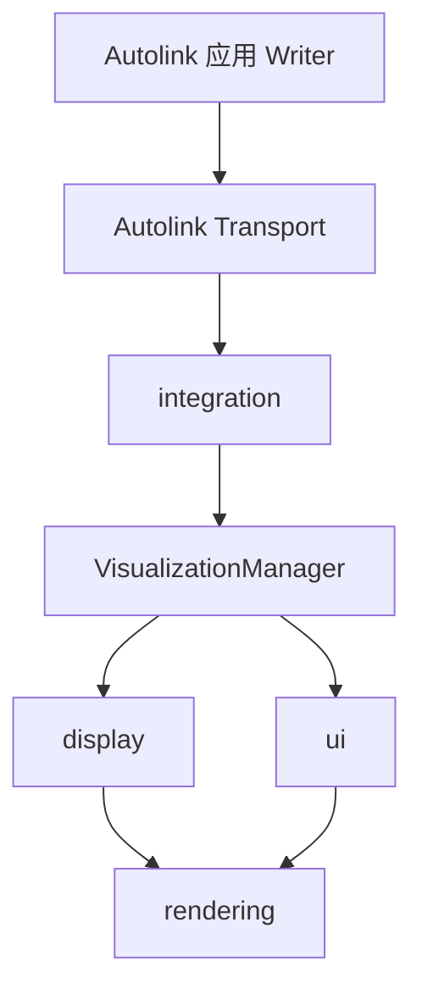
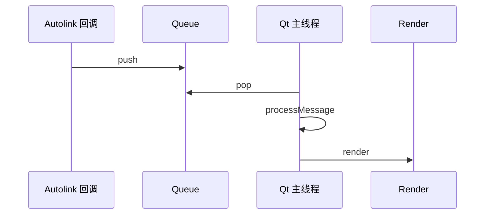

# 架构总览

Autoviz 借鉴 RViz2 的分层与插件模型，以 Autolink 替代 `ros_integration`。实现上为**单包**：共享库 `libautoviz` + 入口 `bin/autoviz`。

## 与 RViz2 对照

| RViz2 | Autoviz |
|-------|---------|
| `rviz2` 主程序 | `main.cpp` + `ui/` |
| `rviz_common` | `common/` + `ui/` |
| `rviz_rendering` | `rendering/`（**Ogre 1.x** 视口） |
| `ros_integration` | `integration/` |
| `rviz_default_plugins` | `display/` + `tools/`（内建注册） |
| pluginlib | `DisplayRegistry` / `ToolRegistry` + `AUTOVIZ_PLUGIN_PATH` |

## 逻辑分层



| 层 | 职责 |
|----|------|
| `ui/` | 主窗口、Dock、属性面板、主题与 i18n |
| `common/` | VisualizationManager、DisplayContext、会话、插件注册 |
| `display/` | Display 实现与消息绘制 |
| `integration/` | Autolink Node、Channel、回放 |
| `rendering/` | 视口、后端、几何与拾取 |
| `tools/` | 交互工具 |
| `transform/` | TF Buffer（vendored tf2） |

## 数据流

```text
Writer
  → Autolink channel
    → integration（Reader / 拓扑发现）
      → 线程安全队列
        → VisualizationManager::update（UI 线程，约 30 Hz）
          → Display::processMessage
            → rendering 更新场景
              → 帧绘制
```

与 Foxglove Bridge 的差异：Autoviz 在 Display 层反序列化并本地渲染，不经 WebSocket。

## 线程模型

| 规则 | 说明 |
|------|------|
| Autolink 回调 | 仅入队，不直接改渲染场景 |
| UI / 渲染线程 | `QTimer` 驱动 `update` 与绘制 |
| 重计算 | 可放到 worker，完成后回到 UI 线程提交 |



## 配置

会话文件 `.autoviz`（YAML）保存 Displays、Global Options、Tools、ViewController。支持导入 `.rviz`（只读映射）。

## 相关文档

- [源码模块](modules.md) · [渲染后端](../rendering/backends.md) · [RViz 对齐](../parity/README.md)
