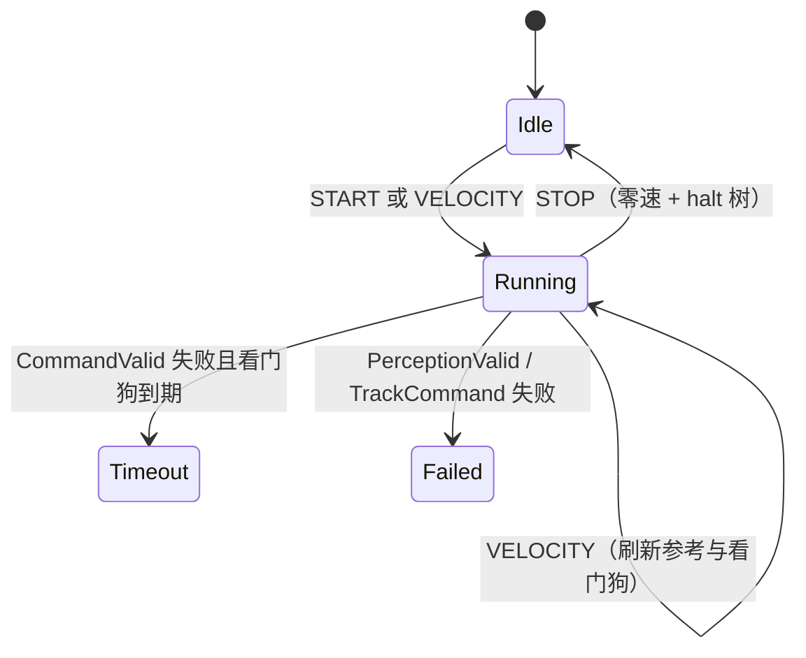
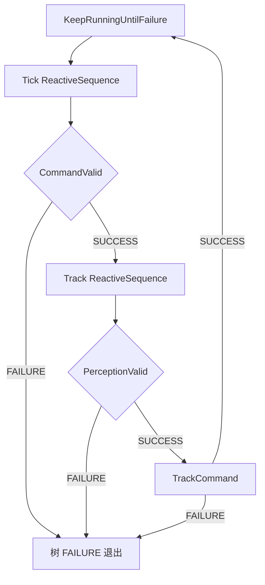

# 遥操行为树

`teleop.xml` 是 `TeleopTask` 的默认树：在指令与感知门控都成立时，按 50 ms 周期把操作员速度跟踪到 `/cmd_vel`。任一扇门失败则退出环；**不**做导航式 Retry / Spin / BackUp。

加载路径：`BtDefaults` → `task/behavior_tree/teleop/teleop.xml`。周期：`bt_loop_duration_ms = 50`。

---

## 控制架构

三层，树只调度门控与跟踪，不持有速度状态。

```text
Bridge  SendTeleopCommand (START / VELOCITY / STOP)
            │  TeleopGoal
            ▼
       TeleopTask          会话、限幅、看门狗计时、生命周期
            │  StartTree / OnTreeTick / StopTeleop
            ▼
       BtRunner            50 ms tickOnce
            │  blackboard: teleop_client
            ▼
       teleop.xml          CommandValid → PerceptionValid → TrackCommand
            │
            ▼
       TeleopClient        钳位、TouchWatchdog、PublishVelocity
            │
            ├── assist 关 / bypass    透传 twist
            └── TeleopMppiAssist      点云 costmap + 路径库 + MPPI
                    │
                    ▼
                 /cmd_vel
```

| 层 | 职责 |
|---|---|
| `TeleopTask` | `START`/`VELOCITY`/`STOP`；`ApplyGoalParams`（限速、看门狗窗、`disable_collision_checks`）；树成败映射 `TeleopStatus` |
| `teleop.xml` | 每拍：指令是否仍有效 → 感知是否仍有效 → 跟踪参考 |
| `TeleopClient` | 保存最近 `vx, ωz`；看门狗时间戳；写 `/cmd_vel` |
| `TeleopMppiAssist` | 可选。`config/task/teleop_assist.lua` 默认 `assist_enabled = false` |

自定义节点注册名（与 XML 标签一致）在 `autonomy/task/apps/teleop/plugins/`：

| XML | 插件 | 语义 |
|---|---|---|
| `CommandValid` | `teleop_watchdog_ok_condition.cpp` | 距上次指令 ≤ `watchdog_timeout_sec`（默认 0.5 s） |
| `PerceptionValid` | `teleop_perception_ok_condition.cpp` | assist 开且未 bypass 时点云新鲜；否则恒 SUCCESS |
| `TrackCommand` | `apply_teleop_velocity_action.cpp` | `PublishVelocity()`；assist 开时经 MPPI |
| `ZeroCommand` | `apply_teleop_hold_stop_action.cpp` | 发零速、保留意图。**当前 XML 未引用** |

---

## 运行流程

### 会话



- `START` / `VELOCITY`：`TouchWatchdog()` 后若树未在跑则 `StartTree()`。
- `STOP` / `Shutdown`：`PublishZeroVelocity()` 再停树。
- 树失败：`OnTreeTick` 见 `kFailed`。若此时看门狗已过期 → `TELEOP_STATUS_TIMEOUT` 并再发一次零速；否则 → `teleop failed`。

### 单拍 Tick

`KeepRunningUntilFailure` 把同步 SUCCESS 锁成 RUNNING。内层必须用 `ReactiveSequence`：每拍从左重评，禁止普通 `Sequence`（否则门控只评一次）。



名义路径：`CommandValid` → `PerceptionValid` → `TrackCommand` → 回到 `KeepRunningUntilFailure`。

---

## `teleop.xml` 节点

```xml
<KeepRunningUntilFailure>
  <ReactiveSequence name="Tick">
    <CommandValid/>
    <ReactiveSequence name="Track">
      <PerceptionValid/>
      <TrackCommand error_code_id="{teleop_error_code}"
                    error_msg="{teleop_error_msg}"/>
    </ReactiveSequence>
  </ReactiveSequence>
</KeepRunningUntilFailure>
```

| 节点 | 类型 | 失败时 |
|---|---|---|
| `KeepRunningUntilFailure` | Decorator | 子节点 SUCCESS → 自身 RUNNING；FAILURE → 结束会话环 |
| `Tick` | ReactiveSequence | `CommandValid` 失败则不进入 `Track` |
| `CommandValid` | Condition | 操作员指令超时 |
| `Track` | ReactiveSequence | 感知无效则不发速度 |
| `PerceptionValid` | Condition | 防护传感超时（assist 关时不生效） |
| `TrackCommand` | SyncAction | `/cmd_vel` 写出失败。`error_*` 写入 blackboard，树内无后续分支 |

`Track` 再套一层 ReactiveSequence 的原因：感知与跟踪必须同拍绑定；外层 `Tick` 把「指令门」与「运动」分开，指令无效时本拍不调用 `TrackCommand`。

---

## 停车发生在哪里

树上**没有** `ZeroCommand`。停轮依赖任务层：

| 事件 | 谁发零速 |
|---|---|
| `STOP` / `Shutdown` | `TeleopTask::StopTeleop` / `Shutdown` |
| 看门狗导致树 FAILURE | `OnTreeTick` → `PublishZeroVelocity` |
| 感知或发布失败 | `OnTreeTick` 只标 `kFailed`，**不保证**零速 |
| assist 开且点云陈旧 | `Track` 失败，树退出；assist 的 Tick 零速路径此时已走不到 |

---

## 待办

相对「看门狗门控的速度环」，XML 形状已闭合。相对单 RGB-D 安全遥操，仍缺策略与任务层对齐。

- [ ] **感知门控空转**：`teleop_assist.lua` 默认 `assist_enabled = false` 时 `PerceptionValid` 恒 SUCCESS，树上看似有防护。单相机场景应打开 assist，或让无传感时失败而非直通。
- [ ] **失败路径零速**：指令/感知/发布失败时在树内（或 `OnTreeTick` 统一）发 `ZeroCommand`，不要只靠 STOP。
- [ ] **`session_timeout`**：Goal 有字段，`TeleopTask` 未读。
- [ ] **失败分类**：`kFailed` 在非看门狗时仍可能被反馈成 TIMEOUT；`error_code_id` 未消费。
- [ ] **TF 门控**：assist 用 `base_link` rolling costmap，树上无 `TfAvailable`。
- [ ] **单相机盲区**：倒车、原地转（`|vx| < 0.02` 跳过 MPPI）、侧后无点云，不在树上，属 assist 策略。
- [ ] **Blackboard 陈旧**：`linear_x` / `angular_z` 只在 `PopulateBlackboard` 写一次，节点走 `TeleopClient`，blackboard 仅调试用。
- [ ] **协议**：`VELOCITY` 可在无 `START` 时开会话；与文档「需会话 ACTIVE」不完全一致。
- [ ] **未使用节点**：`ZeroCommand` 仍注册，XML 已去掉。恢复失败停车时再挂回，或删除插件以免死代码。

不要把导航的 Retry / Spin / BackUp 搬进本树。遥操失败应停车，不是自恢复。
