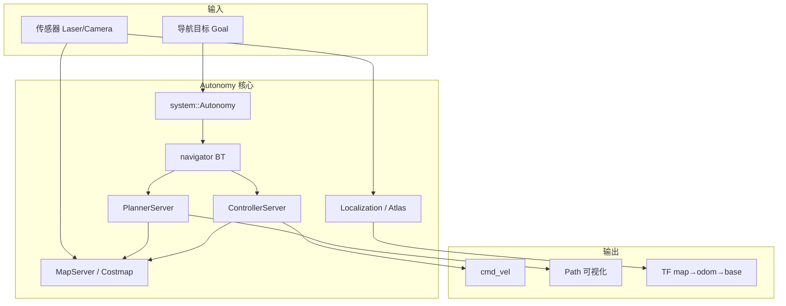

# 3. 系统架构

本文描述 Autonomy 的逻辑分层、核心模块关系与运行时数据流。


上图自上而下分为四层：**Cloud Service**（仿真 / 数据 / 训练 / Tasks）、**Software Application**（应用与扩展插件）、**Software Core**（地图 / 定位 / 感知 / 规划 / 控制 / 仿真 + Autolink + OS）、**Hardware Device**（硬件接口）。下文 HTML 架构图与文档各章节一一对应。

## 3.1 设计目标

1. **分层解耦**：感知/定位 → 地图 → 规划 → 控制 → 底盘，各层通过接口与消息通信
2. **统一入口**：`system::Autonomy` 构造并持有各 Server，对外提供 `NavigateToPose` 等 API
3. **配置集中**：`config/autonomy.lua` 聚合各子系统 Lua 配置
4. **通信抽象**：算法模块使用 C++ struct（`commsgs`），跨进程经 Autolink 序列化

## 3.2 分层架构

<div class="plan-arch-diagram">

  <div class="plan-arch-layer plan-arch-app">
    <div class="plan-arch-header">
      <span class="plan-arch-badge">应用层</span>
      <span class="plan-arch-title">用户 / Bridge / 测试工具</span>
      <span class="plan-arch-sub">nav_test、gRPC Client、上层业务</span>
    </div>
    <div class="plan-arch-body">
      <div class="nav-body-block">
        <div class="nav-body-label">典型入口</div>
        <div class="nav-chip-list">
          <span class="nav-chip">Autonomy::NavigateToPose</span>
          <span class="nav-chip">navigate_to_pose action</span>
          <span class="nav-chip">gRPC NAV_CMD</span>
        </div>
      </div>
    </div>
  </div>

  <div class="plan-arch-pipe"><span>导航意图 / 传感器数据</span></div>

  <div class="plan-arch-layer plan-arch-server">
    <div class="plan-arch-header">
      <span class="plan-arch-badge">编排层</span>
      <span class="plan-arch-title">system::Autonomy + navigator</span>
      <span class="plan-arch-sub">任务生命周期 · 行为树 · 直驱规划</span>
    </div>
    <div class="plan-arch-body plan-arch-body-cols">
      <div class="nav-body-block">
        <div class="nav-body-label">持有组件</div>
        <div class="nav-chip-list">
          <span class="nav-chip">MapServer</span>
          <span class="nav-chip">PlannerServer</span>
          <span class="nav-chip">ControllerServer</span>
          <span class="nav-chip">tf_buffer</span>
        </div>
      </div>
      <div class="nav-body-block">
        <div class="nav-body-label">配置</div>
        <div class="nav-chip-list">
          <span class="nav-chip">autonomy.lua</span>
          <span class="nav-chip">NavigatorOptions</span>
        </div>
      </div>
    </div>
  </div>

  <div class="plan-arch-pipe"><span>Action / 服务调用</span></div>

  <div class="plan-arch-split">
    <div class="plan-arch-layer plan-arch-plugin">
      <div class="plan-arch-header">
        <span class="plan-arch-badge">算法层</span>
        <span class="plan-arch-title">Planning / Control / Localization</span>
      </div>
      <div class="plan-arch-body">
        <div class="nav-body-block">
          <div class="nav-body-label">插件</div>
          <div class="nav-chip-list">
            <span class="nav-chip">GlobalPlanner</span>
            <span class="nav-chip">ControllerInterface</span>
            <span class="nav-chip">Atlas VSLAM</span>
          </div>
        </div>
      </div>
    </div>

    <div class="plan-arch-link">
      <span class="plan-arch-link-arrow">◄</span>
      <span class="plan-arch-link-text">读写<br/>地图</span>
      <span class="plan-arch-link-arrow">►</span>
    </div>

    <div class="plan-arch-layer plan-arch-map">
      <div class="plan-arch-header">
        <span class="plan-arch-badge">地图层</span>
        <span class="plan-arch-title">map / costmap_2d</span>
      </div>
      <div class="plan-arch-body">
        <div class="nav-body-block">
          <div class="nav-body-label">能力</div>
          <div class="nav-chip-list">
            <span class="nav-chip">OccupancyGrid</span>
            <span class="nav-chip">static/obstacle/inflation</span>
            <span class="nav-chip">grid_map</span>
          </div>
        </div>
      </div>
    </div>
  </div>

  <div class="plan-arch-pipe"><span>传感器 / TF</span></div>

  <div class="plan-arch-layer plan-arch-post">
    <div class="plan-arch-header">
      <span class="plan-arch-badge">基础层</span>
      <span class="plan-arch-title">autolink · commsgs · transform · sensor</span>
    </div>
    <div class="plan-arch-body">
      <div class="nav-body-block">
        <div class="nav-body-label">职责</div>
        <div class="nav-chip-list">
          <span class="nav-chip">DDS 通信</span>
          <span class="nav-chip">消息定义</span>
          <span class="nav-chip">坐标变换</span>
          <span class="nav-chip">传感器同步</span>
        </div>
      </div>
    </div>
  </div>

</div>

## 3.3 模块地图

| 目录 | 职责 | 文档 |
|------|------|------|
| `autolink/` | 通信运行时 | [03 Communication](../03_Communication/00_guide.md) |
| `autonomy/system/` | 顶层 `Autonomy` 进程 | [04 Running](../04_Running/00_guide.md) |
| `autonomy/localization/` | 定位 / VSLAM | [06 Localization](../06_Localization/index.rst) |
| `autonomy/map/` | 地图与代价地图 | [07 Mapping](../07_Map/index.rst) |
| `autonomy/planning/` | 全局路径规划 | [08 Planning](../08_Planning/index.rst) |
| `autonomy/control/` | 局部运动控制 | [09 Control](../09_Control/index.rst) |
| `autonomy/navigator/` | 行为树**导航编排** | [16 Navigator](../16_Navigator/index.rst) |
| `autonomy/bridge/` | gRPC 等外部桥接 | [15 Bridge](../15_Bridge/index.rst) |
| `autonomy/commsgs/` | 消息类型 | [14 Commsgs](../14_Commsgs/index.rst) |
| `autonomy/transform/` | TF 缓冲与变换 | — |
| `autonomy/sensor/` | 传感器同步 | — |
| `autonomy/perception/` | 感知（扩展） | [10 Perception](../10_Perception/index.rst) |
| `autonomy/prediction/` | 预测（扩展） | [11 Prediction](../11_Prediction/index.rst) |

## 3.4 配置管线

```
config/autonomy.lua
  ├── include map/map.lua
  ├── include planner/planner.lua
  ├── include controller/controller.lua
  ├── include navigator/navigator.lua
  └── include localization/localization.lua
        │
        ▼
system::CreateOptions("config")
        │
        ▼
AutonomyOptions (protobuf)
        │
        ▼
system::Autonomy(options)
```

## 3.5 运行时数据流



## 3.6 线程与进程

| 场景 | 策略 |
|------|------|
| 单进程部署 | `Autonomy` 内所有 Server 同进程，Autolink 进程内通信 |
| 地图更新 vs 规划 | Costmap mutex，规划时复制快照 |
| Atlas VSLAM | Tracking 主线程 + Mapping / GBA 独立线程 |
| BT tick | 单线程 `tickOnce` 循环（默认 100 Hz） |

## 3.7 相关文档

- [§4 导航栈全景](04_navigation_stack.md)
- [§5 工程结构](05_project_layout.md)
- [05 Framework](../05_Framework/index.rst)
