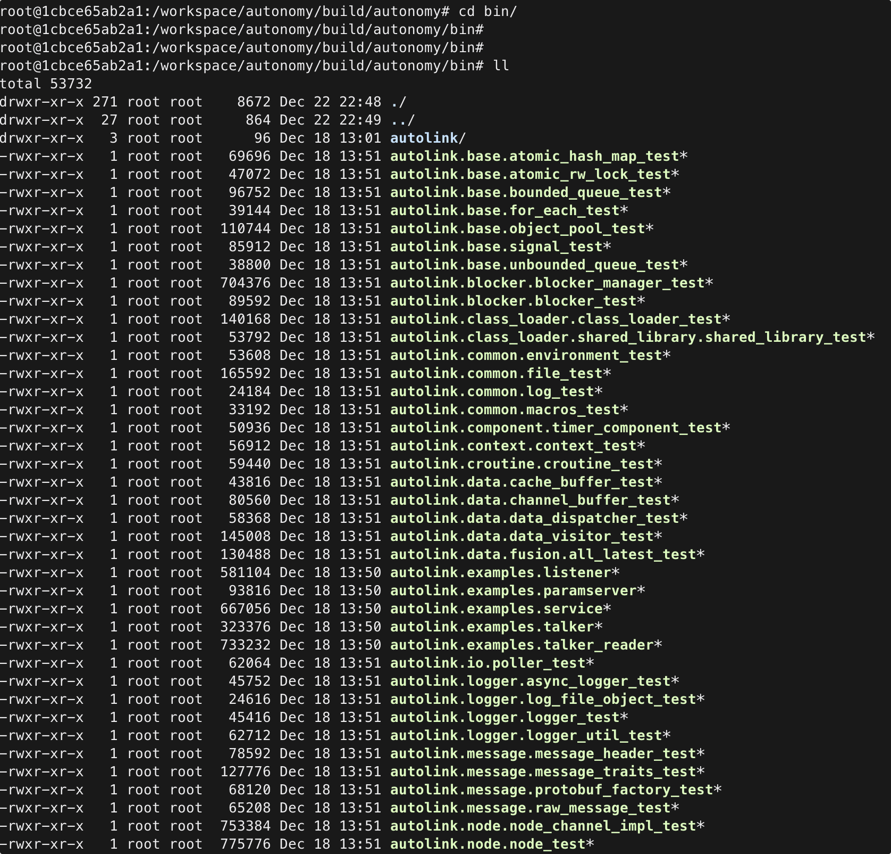

# 6. 编译构建

### 6.1 标准编译流程

```bash
cd autonomy
mkdir -p build && cd build
cmake -G Ninja ..
ninja
```

产物：

```bash
ls lib/libautonomy.so    # 核心库
ls bin/                  # 可执行文件（若启用）
```

### 6.2 CMake 选项

| 选项 | 默认 | 说明 |
|------|------|------|
| `BUILD_GRPC` | ON | gRPC Bridge 支持 |
| `BUILD_TEST` | ON | 单元测试（`ninja test`） |
| `BUILD_DOCS` | ON | Sphinx 文档（需 `sphinx-build`） |
| `BUILD_PROMETHEUS` | OFF | Prometheus 指标 |
| `BUILD_ONNXRUNTIME` | ON | ONNX 推理（需找到运行时） |

示例：

```bash
cmake -G Ninja .. \
  -DBUILD_GRPC=ON \
  -DBUILD_TEST=ON \
  -DBUILD_DOCS=OFF
ninja
```

### 6.3 获取源码

```bash
# GitHub（推荐 --recurse-submodules）
git clone --recurse-submodules https://github.com/quandy2020/autonomy.git

# Gitee（国内）
git clone https://gitee.com/quanduyong/autonomy.git
cd autonomy && git submodule update --init --recursive
```

### 6.4 运行测试

```bash
cd build
CTEST_OUTPUT_ON_FAILURE=1 ninja test
# 或
ctest --output-on-failure
```

### 6.5 构建文档

```bash
cd docs
pip install -r requirements.txt
sphinx-build -b html source build
```

或在 CMake 中启用 `BUILD_DOCS=ON` 后通过 Ninja 目标构建（若已配置）。

### 6.6 增量编译

```bash
cd build
ninja -j$(nproc)    # 并行编译
ninja clean         # 清理产物后全量重编
```

修改 `CMakeLists.txt` 或新增源文件后建议重新 `cmake ..`。

### 6.7 安装到系统（可选）

```bash
cd build
sudo ninja install    # 若项目定义了 install 规则
```

默认开发流程直接使用 `build/lib` 与 `build/bin`，无需 install。

### 6.8 验证编译



```bash
# 检查核心库
file lib/libautonomy.so

# 导航离线测试（若已编译）
./bin/nav_test --help
```

### 6.9 与旧版 colcon 说明

历史文档中的 `colcon build --symlink-install` 针对 **autonomy_ros** 工作空间。当前 **`libautonomy` 主路径为 CMake + Ninja**，不依赖 colcon。若需 ROS 2 叠加层，见 [04 Running](../04_Running/06_ros2_integration.md)。

### 6.10 相关文档

- [§4 依赖安装](04_dependencies.md)
- [§7 环境配置](07_environment.md)
