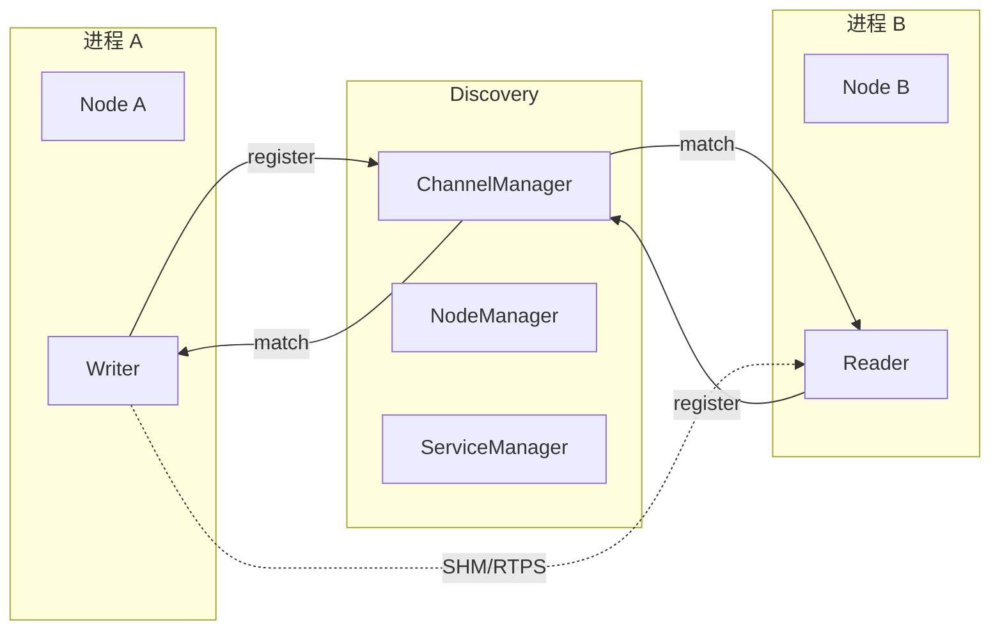

# 3. 通信概念与模型

本章建立 autolink 的核心术语与数据流模型，为后续 API 与架构阅读打基础。

## 3.1 核心术语

| 术语 | 定义 | 类比 |
|------|------|------|
| **Node** | 通信基本单元；持有 Reader/Writer/Service/Client | ROS 2 Node |
| **Channel** | 具名数据通道；同 channel + 同消息类型自动建连 | ROS topic |
| **Writer** | 向 Channel 发送消息 | Publisher |
| **Reader** | 从 Channel 接收消息并触发回调 | Subscription |
| **Service / Client** | 请求-响应式双向 RPC | ROS Service |
| **Action** | 目标-反馈-结果式长任务通信 | ROS 2 Action |
| **Component** | 封装算法逻辑的可加载模块，由 DAG 描述输入输出 | Cyber Component |
| **Task / CRoutine** | 用户态协程，由 Scheduler 调度执行 | Cyber CRoutine |
| **RoleAttributes** | 描述节点角色（channel 名、QoS、ID 等）的 proto 结构 | ROS QoS + topic 元数据 |
| **Topology** | 全局 Channel / Node / Service 注册表 | DDS graph |
| **DAG** | 描述组件拓扑与依赖的配置文件 | launch + component 描述 |

## 3.2 通信模式

### 3.2.1 发布-订阅（Channel）

```
Writer ──publish──▶ Channel ──dispatch──▶ Reader₁
                              └──dispatch──▶ Reader₂
```

- **多对多**：多个 Writer、多个 Reader 可共存于同一 Channel
- **类型安全**：`CreateWriter<T>` 与 `CreateReader<T>` 的 `T` 必须一致
- **异步回调**：Reader 注册 `std::function<void(const std::shared_ptr<T>&)>`

### 3.2.2 请求-响应（Service）

```
Client ──request──▶ Service ──response──▶ Client
         (同步/异步)          (单次)
```

- 适用于**短耗时**操作：查询状态、计算、参数读写
- Client 可 `SendRequest`（阻塞）或 `AsyncSendRequest`（future）

### 3.2.3 长任务（Action）

```
Client ──Goal──▶ Server
Client ◀─Feedback── Server  (执行中，可多次)
Client ◀─Result──── Server  (终态)
Client ──Cancel──▶ Server   (可选)
```

- 适用于导航、路径跟踪等**可取消、需进度反馈**的任务
- Action 类型须定义嵌套 `Goal` / `Feedback` / `Result`（proto3）

### 3.2.4 参数服务（Parameter）

基于 Service/Client 实现的全局键值参数访问：

```
ParameterClient ──Get/Set/List──▶ ParameterServer
```

## 3.3 消息模型

autolink 传输层接受任意满足序列化要求的类型，Autonomy 栈统一约定：

| 层级 | 类型 | 使用场景 |
|------|------|----------|
| 算法内部 | `autonomy::commsgs::*` C++ struct | 零拷贝、Eigen 友好 |
| 通信边界 | `google::protobuf::Message` 或 commsgs 对应 proto | Writer/Reader 模板参数 |
| 原始字节 | `RawMessage` | 调试、非类型化通道 |

**转换边界**：在模块对外接口调用 `ToProto()` / `FromProto()`，算法核心不直接依赖 protobuf。详见 [commsgs §3](../14_Commsgs/03_schema.md)。

## 3.4 拓扑与服务发现

autolink 采用**去中心化**发现模型（无 master 节点）：



- **ChannelManager**：维护 channel → writers/readers 映射
- **NodeManager**：节点加入 / 离开
- **ServiceManager**：服务名 → service/client 映射
- 底层通过 **UDP** 广播拓扑变更（与 Cyber RT 一致）

## 3.5 传输模式选择

| 模式 | 枚举 | 适用场景 |
|------|------|----------|
| **INTRA** | `OptionalMode::INTRA` | 同进程内，零拷贝指针传递 |
| **SHM** | `OptionalMode::SHM` | 同机跨进程，共享内存段 |
| **RTPS** | `OptionalMode::RTPS` | 跨机、跨网络，基于 DDS |

默认创建 Transmitter/Receiver 时倾向 **SHM**；同进程 Reader/Writer 可自动降级为 INTRA。

## 3.6 QoS 概要

通过 `RoleAttributes` 或 `ReaderConfig` 配置：

| 参数 | 含义 | 典型值 |
|------|------|--------|
| `depth` | 历史缓存深度 | 传感器 10，控制 1 |
| `mps` | 每秒最大消息数限制 | 高频激光可设限 |
| `qos_profile` | 可靠性 / 持久性策略 | 见 `qos_profile_conf` |

## 3.7 时间与定时

| 类型 | 说明 |
|------|------|
| `autolink::Time` | 单调 / 系统时间，纳秒精度 |
| `autolink::Duration` | 时间间隔 |
| `autolink::Rate` | 固定频率循环（`Sleep()` 补偿漂移） |
| `autolink::Timer` | 单次 / 周期回调，由调度器驱动 |

仿真模式下可通过 `Clock` 注入仿真时间（与 bag 回放配合）。

## 3.8 生命周期

```
Init(binary_name)
    │
    ├─▶ 日志、信号处理、Transport 单例
    ├─▶ Scheduler 初始化（读取 conf）
    ├─▶ ServiceDiscovery 启动
    │
CreateNode(name) ──▶ NodeChannelImpl + NodeServiceImpl
    │
CreateWriter/Reader/Service/...
    │
OK() 循环 / WaitForShutdown()
    │
Clear() / 析构 ──▶ 反注册拓扑、关闭传输
```

**约束**：

1. `Init()` 之前不得调用 `CreateNode`
2. 同进程内 `node_name` 全局唯一
3. 拓扑对象（node/reader/writer）名称不可重复

## 3.9 Action 类型约束（Proto3）

Action message 必须包含三个嵌套 message 及三个顶层字段：

```protobuf
message NavigateToPoseAction {
    message Goal   { /* ... */ }
    message Feedback { /* ... */ }
    message Result { /* ... */ }

    Goal goal = 1;
    Feedback feedback = 2;
    Result result = 3;
}
```

C++ 使用：`using ActionT = pkg::NavigateToPoseAction;`

完整规范见 [§4.9 Action 定义](04_usage.md#49-action-类型定义) 与 [commsgs Action proto](../14_Commsgs/08_nav_planning_msgs.md)。
