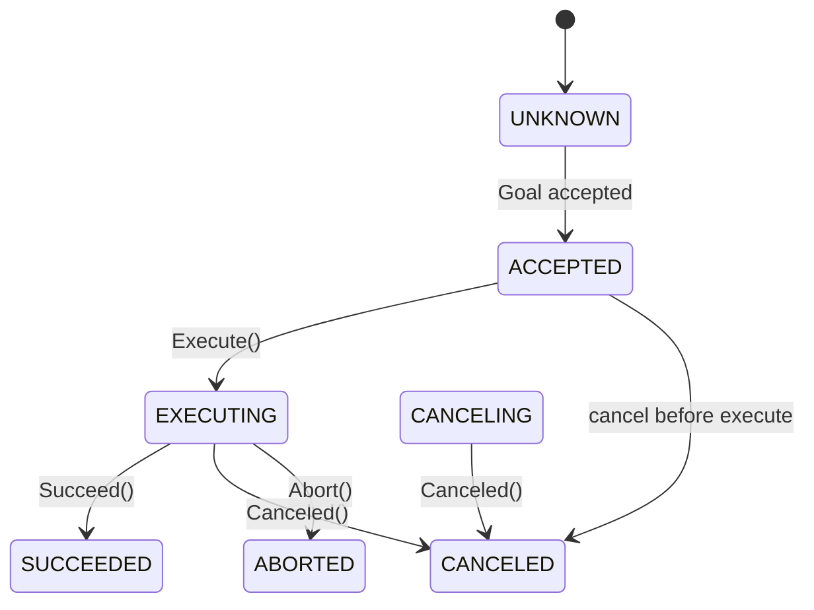

# 7. Service 与 Action

本章覆盖 RPC 式 Service/Client、长任务 Action，以及 Parameter 参数服务。

## 7.1 Service / Client 架构

```
┌─────────────┐    request     ┌─────────────┐
│   Client    │ ─────────────▶ │   Service   │
│  (Node 内)  │ ◀───────────── │  (Node 内)  │
└─────────────┘    response    └─────────────┘
        │                              │
        └──────── ServiceManager ──────┘
                    (服务发现)
```

- 基于 **Channel 之上的请求-响应协议** 实现
- `ServiceManager` 维护 `service_name` → Service 实例映射
- Client 通过 `WaitForService()` 等待 Server 注册完成

## 7.2 Service API

```cpp
template <typename Request, typename Response>
auto Node::CreateService(
    const std::string& service_name,
    const ServiceCallback<Request, Response>& service_callback)
    -> std::shared_ptr<Service<Request, Response>>;
```

**回调签名**：

```cpp
void(const std::shared_ptr<Request>& request,
     std::shared_ptr<Response>& response);
```

- `response` 由回调分配并填充
- 回调在 Service 线程执行，应保持简短

## 7.3 Client API

| 方法 | 行为 |
|------|------|
| `SendRequest(req, timeout)` | 同步，阻塞至响应或超时 |
| `AsyncSendRequest(req)` | 返回 `std::shared_future<shared_ptr<Response>>` |
| `WaitForService(timeout)` | 阻塞等待 Server 上线 |
| `ServiceIsReady()` | 非阻塞检查 |

**超时处理**：同步调用超时返回 `nullptr`，应检查返回值。

## 7.4 Service 与 Action 选型

| 维度 | Service | Action |
|------|---------|--------|
| 持续时间 | 毫秒级 | 秒～分钟级 |
| 反馈 | 无 | Feedback 流 |
| 取消 | 不支持 | `CancelGoal` |
| 并发 | 多请求可排队 | 多 Goal 并行（按 Server 策略） |
| 典型用例 | 查询代价、计算路径片段 | FollowPath、NavigateToPose |

## 7.5 Action 状态机

### 7.5.1 Goal 生命周期



### 7.5.2 Server 三回调

| 回调 | 职责 | 注意 |
|------|------|------|
| `handle_goal` | 接受 / 拒绝 / 延迟 | 同步，快速决策 |
| `handle_cancel` | 是否允许取消 | 同步 |
| `handle_accepted` | 启动执行逻辑 | **必须**另起线程，内部调用 `Execute()` |

### 7.5.3 ServerGoalHandle

```cpp
gh->GetGoal();           // 只读目标
gh->GetGoalId();         // UUID
gh->Execute();           // ACCEPTED → EXECUTING
gh->PublishFeedback(fb); // 执行中多次
gh->Succeed(result);     // 终态
gh->Canceled(result);
gh->Abort(result);
gh->IsCanceling();
gh->IsActive();
```

### 7.5.4 Client 异步流程

```cpp
auto client = autolink::action::CreateClient<ActionT>(node, name);

SendGoalOptions opts;
opts.goal_response_callback = ...;
opts.feedback_callback = ...;
opts.result_callback = ...;

auto gh = client->AsyncSendGoal(goal, opts).get();
auto wrapped = client->AsyncGetResult(gh).get();
// wrapped.code: SUCCEEDED | CANCELED | ABORTED
```

也可在 `result_callback` 中处理终态，无需阻塞 `get()`。

## 7.6 Action 在导航栈中的应用

```
Navigator (BT)
    │
    ▼ AsyncSendGoal
autolink::action::Client<FollowPathAction>
    │
    ▼
ControllerServer (Action Server)
    │
    ├─▶ Feedback: 剩余距离、当前速度
    └─▶ Result: 成功 / 超时 / 碰撞
```

Action 类型定义在 `autonomy/commsgs` 或各模块 `proto/` 下，须符合 [§3.9](03_concepts.md#39-action-类型约束proto3) 规范。

## 7.7 Parameter 服务

### 7.7.1 模型

全局 `ParameterServer` 节点提供键值存储，任意 `ParameterClient` 可读写：

```cpp
autolink::Parameter param("robot_radius", 0.35);
param_client.SetParameter(param);

std::vector<autolink::Parameter> all;
param_client.ListParameters(&all);
```

### 7.7.2 类型

Parameter 支持 `int64`、`double`、`string`、`bool`、`protobuf` 等，内部 proto 序列化。

### 7.7.3 与 Lua 配置关系

| 配置方式 | 时机 | 适用 |
|----------|------|------|
| Lua → Server Options | 启动时 | 算法参数、插件列表 |
| Parameter 服务 | 运行时 | 动态调参、可视化工具 |

## 7.8 SimpleActionServer 辅助类

对仅需单 Goal 顺序执行的 Server，可使用 `simple_action_server.hpp` 简化线程与状态管理（内部封装 `Execute` 循环与取消检查）。

## 7.9 错误处理建议

1. **Service**：response 中携带 `error_code` / `error_msg` 字段
2. **Action Result**：使用专用 `XxxActionErrorCode` 枚举
3. **Client**：始终检查 `nullptr` / `WrappedResult.code`
4. **取消**：Server 在循环中轮询 `IsCanceling()`，及时退出

## 7.10 示例索引

| 示例路径 | 内容 |
|----------|------|
| `autolink/examples/cpp/action_talker*.cpp` | Action 发布 |
| `autolink/examples/python/py_action_client.py` | Python Action |
| `docs/.../04_usage.md` §4.6 | 完整代码片段 |
