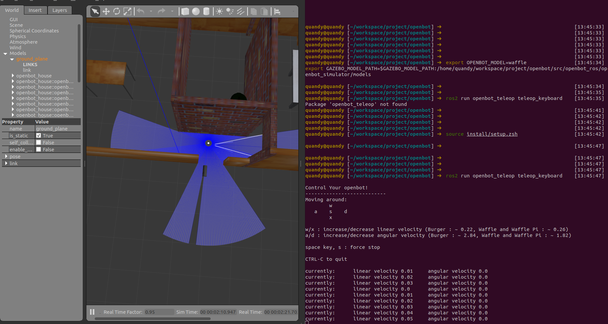

# 6. ROS 2 集成（可选）

> **可选路径**：`libautonomy` 可独立运行，**不强制依赖 ROS 2**。本节面向需要 RViz2、Gazebo 或与现有 ROS 2 栈共存的场景。

### 6.1 定位说明

| 组件 | 说明 |
|------|------|
| `libautonomy` | 核心 C++ 库，CMake 构建 |
| `autonomy_ros`（外部/可选） | ROS 2 包装层，提供 launch、Topic 桥接 |
| `commsgs` | 与 ROS 消息结构兼容的 C++ 类型 |

若仓库中未包含 `autonomy_ros` 工作空间，以下命令需在对应 overlay 环境中执行。

### 6.2 环境变量

```bash
### Autonomy ###
export GLOG_logtostderr=1
export GLOG_colorlogtostderr=1
export GLOG_minloglevel=0

### ROS 2 ###
source /opt/ros/humble/setup.bash
source /path/to/autonomy/install/setup.bash   # 若使用 colcon overlay
```

### 6.3 Launch 启动（autonomy_ros）

```bash
ros2 launch autonomy_ros autonomy.launch.py
```

| 参数 | 默认 | 说明 |
|------|------|------|
| `use_sim_time` | `true` | 仿真时钟 |
| `use_gazebo` | `false` | Gazebo 仿真 |
| `world_type` | `house` | 世界类型 |
| `x_pose` / `y_pose` | `-2.0` / `-0.5` | 初始位姿 |

```bash
ros2 launch autonomy_ros autonomy.launch.py use_gazebo:=true world_type:=house
```



### 6.4 Gazebo 仿真（可选）

```bash
ros2 launch autonomy_gazebo empty_world.launch.py gui:=true spawn_robot:=true
ros2 launch autonomy_gazebo autonomy_house.launch.py gui:=true spawn_robot:=true
```

详见 [12 Simulation](../12_Simulation/index.rst)。

### 6.5 Docker + ROS 2

```bash
docker exec -it SpaceHero /bin/bash
source /opt/ros/humble/setup.bash
source /workspace/autonomy/install/setup.bash
ros2 launch autonomy_ros autonomy.launch.py
```

### 6.6 与纯 C++ 路径的选择

| 场景 | 推荐 |
|------|------|
| 算法验证、CI | `autonomy_nav_test`（§4） |
| 生产嵌入式 | `system::Autonomy` 进程内 API |
| 可视化调试 | ROS 2 + RViz2 |
| 仿真 | Gazebo + ROS 2 launch |

### 6.7 相关文档

- [§7 运行验证](07_verification.md)
- [01 Instructions · 生态集成](../01_Instructions/06_ecosystem.md)
