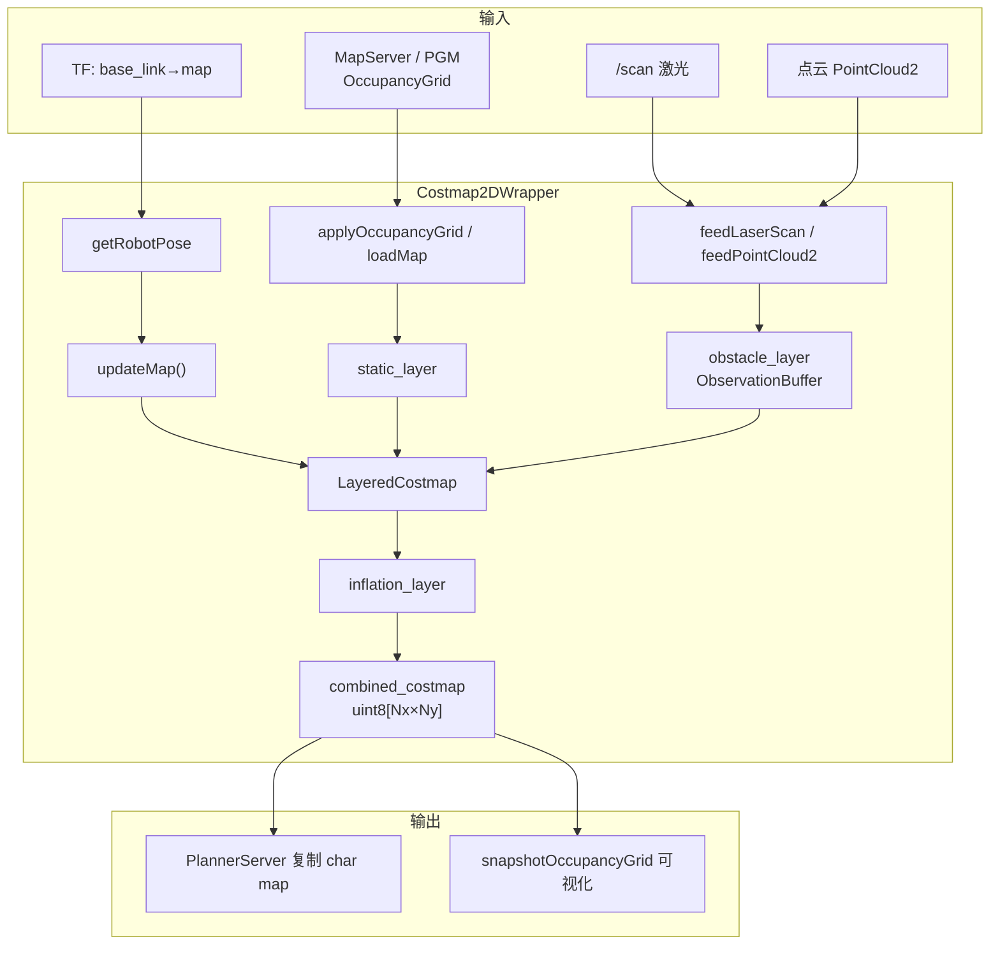

# 6. Costmap2D 代价地图

`Costmap2D` 是 Autonomy 的**二维代价栅格地图**实现，源自 Nav2 `nav2_costmap_2d`。它将静态地图、动态障碍与安全膨胀融合为一张 `uint8` 栅格，是**路径规划与碰撞检测的标准输入**。

> 模块级架构见 [05_architecture.md §5.3](05_architecture.md#53-costmap2d-架构重点)；数学公式见 [§3 数学原理](03_math.md#36-膨胀层inflationlayer数学)。

---

## 6.1 何时使用 Costmap2D

| 场景 | 是否适用 | 说明 |
|------|----------|------|
| 全局/局部路径规划 | ✅ | `PlannerServer` 已集成 |
| 激光动态避障 | ✅ | `obstacle_layer` + `feedLaserScan` |
| 静态 SLAM 地图融合 | ✅ | `static_layer` + `applyOccupancyGrid` |
| 地形高程/坡度 | ❌ | 用 [GridMap](07_grid_map.md) |
| 3D 体素占据 | 部分 | `voxel_layer` 投影到 2D |

---

## 6.2 架构：从 Wrapper 到栅格

### 6.2.1 对象层级

```
你的代码
  │
  ▼
Costmap2DWrapper          ← 持有、Start/Stop、feed 传感器
  │
  ├── LayeredCostmap     ← 插件调度、双缓冲
  │     ├── plugins_[0] StaticLayer
  │     ├── plugins_[1] ObstacleLayer
  │     ├── plugins_[2] InflationLayer
  │     └── combined_costmap_ (Costmap2D)  ← getCostmap() 返回此对象
  │
  ├── TF Buffer          ← getRobotPose()
  └── 后台线程            ← Start() 后周期性 updateMap()
```

**不要直接 new `Costmap2D`**：生产环境始终通过 `Costmap2DWrapper` 使用，由它负责插件加载、线程与 TF。

### 6.2.2 一张图看懂数据流



### 6.2.3 双缓冲机制

| 模式 | 行为 |
|------|------|
| 无 filter（常见） | 插件直接写入 `combined_costmap_`，`getCostmap()` 即最终结果 |
| 有 filter | 插件 → `primary_costmap_` → `copyWindow` → `combined_costmap_` → filter 修改 |

每次 `updateMap` 在更新窗口 $(x_0,y_0)…(x_n,y_n)$ 内先 `resetMap`（置 `default_value_`），再按插件顺序写入，**不是增量叠加到旧值上**。

---

## 6.3 详细使用指南

### 6.3.1 方式 A：通过 PlannerServer（推荐）

最常见路径——无需直接操作 costmap：

```lua
-- config/autonomy.lua
AUTONOMY = { planning = AUTONOMY_PLANNER }

-- config/planner/planner.lua 内已含 costmap 块
```

`PlannerServer` 构造时自动创建 `Costmap2DWrapper` 并 `Start()`。你只需：

1. 确保 `MapServer` 发布 `/map` 或调用 `applyOccupancyGrid`
2. 确保激光数据通过 ROS bridge 调用 `feedLaserScan`
3. TF 树中 `map` ↔ `base_link` 可用

### 6.3.2 方式 B：独立使用 Costmap2DWrapper

```cpp
#include "autonomy/map/map_options.hpp"
#include "autonomy/map/costmap_2d/costmap_2d_wrapper.hpp"

// 1. 加载配置
auto opts = autonomy::map::CreateCostmap2DOptions("config");

// 2. 构造（此时 init() 已执行：创建 LayeredCostmap、加载插件）
auto costmap = std::make_shared<autonomy::map::costmap_2d::Costmap2DWrapper>(
    opts, "global_costmap");

// 3. 注入静态地图（二选一）
costmap->loadMap("config/map/warehouse.yaml");           // 从 YAML+PGM
// 或
costmap->applyOccupancyGrid(*map_server->GetStaticMapShared());

// 4. 启动后台更新线程
costmap->Start();

// 5. 传感器回调中喂数据
costmap->feedLaserScan(laser_scan_msg);

// 6. 读取（规划前加锁复制）
{
    std::unique_lock lock(*costmap->getCostmap()->getMutex());
    const auto* data = costmap->getCostmap()->getCharMap();
    unsigned int mx, my;
    costmap->getCostmap()->worldToMap(x, y, mx, my);
    unsigned char c = data[my * size_x + mx];
}

// 7. 停止
costmap->Stop();
```

### 6.3.3 关键 API 速查

| API | 调用时机 | 作用 |
|-----|----------|------|
| `Start()` | 一切就绪后 | 启动后台线程：`updateMap` + `publishMap` |
| `Stop()` | 退出前 | 停止线程、deactivate 插件 |
| `applyOccupancyGrid(grid)` | 静态地图到达时 | 写入 `StaticLayer` |
| `feedLaserScan(scan)` | 每次激光回调 | 缓存到 `ObstacleLayer` |
| `getCostmap()` | 读取代价值 | 返回 `combined_costmap_` 指针 |
| `getMutex()` | 读取/规划前 | 线程安全锁 |
| `isReady()` | 规划前检查 | 是否至少更新过一次 |
| `isCurrent()` | 规划前检查 | 图层是否在超时内更新 |
| `snapshotOccupancyGrid(out)` | 可视化 | cost → OccupancyGrid 反向映射 |

### 6.3.4 全局图 vs 局部滚动图

| 配置 | `rolling_window` | 地图尺寸 | 适用 |
|------|------------------|----------|------|
| 全局代价地图 | `false` | 覆盖整个环境（或由 static_layer resize） | 室内导航、已知地图 |
| 局部代价地图 | `true` | 固定 $W \times H$（如 20m×20m），随机器人平移 | 大地图、动态环境 |

局部模式下 `updateMap` 每帧将 origin 设为 $(x_{\text{robot}} - W/2,\; y_{\text{robot}} - H/2)$，重叠区域数据保留，移出窗口的格重置。

### 6.3.5 完整配置示例

```lua
costmap = {
    enabled = true,
    name = "global_map",
    frame_id = "map",
    resolution = 0.05,          -- 5 cm/cell
    width = 20.0,                 -- 物理宽度 [m]
    height = 20.0,
    update_frequency = 5.0,       -- 后台 updateMap 频率
    rolling_window = false,
    robot_radius = 0.22,
    footprint = {
        {x = 0.18, y = 0.14}, {x = 0.18, y = -0.14},
        {x = -0.18, y = -0.14}, {x = -0.18, y = 0.14},
    },
    plugins = {"static_layer", "obstacle_layer", "inflation_layer"},

    static_layer = {
        enabled = true,
        map_topic = "map",
        subscribe_to_updates = false,
    },
    obstacle_layer = {
        enabled = true,
        footprint_clearing_enabled = true,
        sensor_sources = {
            scan = {
                topic = "scan",
                data_type = "LaserScan",
                marking = true,
                clearing = true,
                obstacle_max_range = 3.0,
                raytrace_max_range = 3.5,
            },
        },
    },
    inflation_layer = {
        enabled = true,
        inflation_radius = 0.35,
        cost_scaling_factor = 3.0,
    },
}
```

### 6.3.6 启动检查清单

| 步骤 | 检查 | 期望 |
|------|------|------|
| 1 | 日志 `Costmap2D update thread started` | 线程已启动 |
| 2 | `costmap->isReady()` | `true` |
| 3 | `costmap->isCurrent()` | `true`（TF 正常时） |
| 4 | 可视化快照 | 墙壁=深色，自由区=浅色，膨胀=渐变 |
| 5 | 机器人脚下格 | `FREE_SPACE` 或低代价（footprint clearing 生效） |

---

## 6.4 核心数据结构

路径：`autonomy/map/costmap_2d/costmap_2d.hpp`

| 成员 | 类型 | 含义 |
|------|------|------|
| `size_x_`, `size_y_` | `unsigned int` | 栅格尺寸（cell） |
| `resolution_` | `double` | 分辨率 [m/cell] |
| `origin_x_`, `origin_y_` | `double` | 地图左下角世界坐标 |
| `costmap_` | `unsigned char[]` | 一维代价值数组 |
| `default_value_` | `unsigned char` | 重置默认值 |
| `access_` | `recursive_mutex` | 线程锁 |

辅助结构：`MapLocation { unsigned int x, y }`

## 6.5 坐标变换

### 6.5.1 Map ↔ World

**世界 → 栅格**：

$$
m_x = \left\lfloor \frac{x - x_0}{\Delta} \right\rfloor, \quad
m_y = \left\lfloor \frac{y - y_0}{\Delta} \right\rfloor
$$

**栅格 → 世界**（cell 中心）：

$$
x = x_0 + \left(m_x + \frac{1}{2}\right) \Delta, \quad
y = y_0 + \left(m_y + \frac{1}{2}\right) \Delta
$$

**线性索引**：

$$
\mathrm{idx} = m_y \cdot N_x + m_x
$$

### 6.5.2 边界与有效性

- `worldToMap`：坐标在地图外返回 `false`
- `worldToMapEnforceBounds`：裁剪到边界
- `worldToMapNoBounds`：不检查边界（内部算法用）

## 6.6 代价值体系

路径：`autonomy/map/costmap_2d/cost_values.hpp`

<div class="nav-stack-pipeline">

<div class="nav-layer-row" style="border-color: #c8e6c9; background: linear-gradient(135deg, #f1f8e9 0%, #ffffff 100%);">
  <div class="nav-layer-meta">
    <span class="nav-layer-badge" style="background: #e8f5e9; color: #2e7d32;">FREE</span>
    <div class="nav-layer-title">自由空间</div>
    <div class="nav-layer-sub">0</div>
  </div>
  <div class="nav-layer-body">
    <div class="nav-body-block">
      <div class="nav-body-label">语义</div>
      完全可通行，规划器无额外代价
    </div>
  </div>
  <div class="nav-layer-meta">
    <span class="nav-layer-badge" style="background: #fff3e0; color: #e65100;">GRADIENT</span>
    <div class="nav-layer-title">膨胀梯度</div>
    <div class="nav-layer-sub">1 – 252</div>
  </div>
</div>

<div class="nav-layer-row" style="border-color: #ffccbc; background: linear-gradient(135deg, #fbe9e7 0%, #ffffff 100%);">
  <div class="nav-layer-meta">
    <span class="nav-layer-badge" style="background: #ffebee; color: #c62828;">LETHAL</span>
    <div class="nav-layer-title">致命障碍</div>
    <div class="nav-layer-sub">254</div>
  </div>
  <div class="nav-layer-body">
    <div class="nav-body-block">
      <div class="nav-body-label">语义</div>
      不可通行；膨胀种子点
    </div>
  </div>
  <div class="nav-layer-meta">
    <span class="nav-layer-badge" style="background: #eceff1; color: #546e7a;">UNKNOWN</span>
    <div class="nav-layer-title">未知</div>
    <div class="nav-layer-sub">255</div>
  </div>
</div>

</div>

| 常量 | 值 | 规划行为 |
|------|-----|----------|
| `FREE_SPACE` | 0 | 自由通行 |
| `1 … 252` | 梯度 | 距障碍越近代价越高 |
| `INSCRIBED_INFLATED_OBSTACLE` | 253 | 内切区，机器人中心不可进入 |
| `LETHAL_OBSTACLE` | 254 | 阻塞 |
| `NO_INFORMATION` | 255 | 由 `allow_unknown` 决定 |

## 6.7 LayeredCostmap 多层架构

路径：`layered_costmap.hpp` / `layered_costmap.cpp`

### 6.7.1 双缓冲

| 缓冲区 | 写入者 | 读取者 |
|--------|--------|--------|
| `primary_costmap_` | 插件（static / obstacle / inflation） | filter 输入 |
| `combined_costmap_` | filter 输出 | `getCostmap()` 对外 |

### 6.7.2 updateMap 主循环

```
updateMap(robot_x, robot_y, robot_yaw)
  │
  ├─ [rolling] updateOrigin(new_origin)
  │
  ├─ foreach plugin: updateBounds(min_x, min_y, max_x, max_y)
  │
  ├─ world bounds → cell bounds (x0, y0, xn, yn)
  │
  ├─ resetMap(x0, y0, xn, yn)
  │
  ├─ foreach plugin: updateCosts(master, x0, y0, xn, yn)
  │
  └─ [filters] copy primary → combined → filter updateCosts
```

## 6.8 InflationLayer 详解

路径：`layers/inflation_layer.hpp` / `.cpp`

### 6.8.1 代价函数

$$
c(d) =
\begin{cases}
254 & d = 0 \\
253 & d \cdot \Delta \leq r_i \\
\left\lfloor 252 \cdot e^{-\lambda (d \cdot \Delta - r_i)} \right\rfloor & \mathrm{otherwise}
\end{cases}
$$

默认参数：`inflation_radius_ = 0.55` m，`cost_scaling_factor_ = 10.0`，$r_i$ 由 footprint 自动计算。

### 6.8.2 传播算法

1. 扫描更新区域内所有格，将 `LETHAL_OBSTACLE`（及可选 `NO_INFORMATION`）作为种子
2. 按整数距离矩阵 $D_{ij} = \sqrt{i^2+j^2}$ 排序的等级 BFS
3. 4-邻域扩展，取 $\max(c_{\text{current}}, c_{\text{neighbor}})$ 写入
4. `updateBounds` 向外扩展 $R$ 保证边界正确

### 6.8.3 参数调优

| 参数 | 增大效果 | 减小效果 |
|------|----------|----------|
| `inflation_radius` | 更大安全裕度，窄通道难通过 | 路径更贴近障碍 |
| `cost_scaling_factor` | 代价衰减更快，远离障碍迅速变自由 | 更大范围保持高代价 |

## 6.9 图层详解

### 6.9.1 StaticLayer

| 模式 | 规则 |
|------|------|
| Trinary（默认） | $o \geq \tau_{\mathrm{lethal}} \Rightarrow \mathrm{LETHAL}$，否则 $\mathrm{FREE}$ |
| Scale | $c = (o / \tau_{\mathrm{th}}) \cdot 254$ |

非 rolling 模式下可 resize 整个 layered costmap 以匹配静态地图。

### 6.9.2 ObstacleLayer

**Marking**：障碍点 → `LETHAL_OBSTACLE`

**Clearing**：传感器原点 → 障碍点 Bresenham 射线 → `FREE_SPACE`

**ObservationBuffer**：多传感器观测缓存，按时间戳与范围过滤。

**Footprint clearing**：机器人 footprint 多边形区域清除障碍。

### 6.9.3 VoxelLayer

- `VoxelGrid`：每 XY cell 一个 `uint32`，最多 16 个 Z slice
- 3D 点云标记体素后投影到 2D costmap
- 配置：`z_voxels`, `z_resolution`, `origin_z`, `unknown_threshold`, `mark_threshold`

### 6.9.4 DenoiseLayer

- 连通域分析（4/8 连通）
- 过滤小于 `denoise_radius`（minimal_group_size）的孤立障碍簇
- 注意：过强去噪可能移除窄墙，导致穿墙规划

### 6.9.5 Filters

| Filter | 功能 |
|--------|------|
| `KeepoutFilter` | 禁行区（来自 filter mask） |
| `SpeedFilter` | 速度限制区 |
| `BinaryFilter` | 二值化过滤 |

## 6.10 Rolling Window

局部代价地图以机器人为中心滑动：

$$
x_0^{\text{new}} = x_{\text{robot}} - \frac{W}{2}, \quad
y_0^{\text{new}} = y_{\text{robot}} - \frac{H}{2}
$$

`updateOrigin` 算法：

1. 栅格对齐偏移 $\delta = \lfloor (x_0^{\text{new}} - x_0) / \Delta \rfloor$
2. 计算重叠区域，copy 到临时 buffer
3. 全图 reset → 更新 origin → 重叠数据写回
4. 非重叠区域 = `default_value_`

## 6.11 Footprint

路径：`footprint.hpp` / `footprint.cpp`

- 支持多边形 footprint 或 `robot_radius` 圆形近似
- 内切半径 $r_i$ 决定 `INSCRIBED_INFLATED_OBSTACLE` 边界
- 外接半径 $r_c$ 用于碰撞检测

配置示例（`planner.lua`）：

```lua
footprint = {
    {x = 0.18, y = 0.14},
    {x = 0.18, y = -0.14},
    {x = -0.18, y = -0.14},
    {x = -0.18, y = 0.14},
},
robot_radius = 0.22,
```

## 6.12 Costmap2DWrapper 运行时

| 功能 | 说明 |
|------|------|
| `mapUpdateLoop` | 后台线程，按 `update_frequency` 调用 `updateMap` |
| `feedLaserScan` | 激光 → `ObservationBuffer` → ObstacleLayer |
| `applyOccupancyGrid` | 静态地图 → StaticLayer |
| `snapshotOccupancyGrid` | 导出可视化用 OccupancyGrid |

## 6.13 配置参考

完整示例见 `config/planner/planner.lua` 的 `costmap` 块。关键字段：

```lua
costmap = {
    resolution = 0.05,
    width = 20.0,
    height = 20.0,
    update_frequency = 5.0,
    rolling_window = false,  -- 全局图
    plugins = {"static_layer", "obstacle_layer", "inflation_layer"},
    -- 各图层参数块 ...
}
```

## 6.14 相关文档

- [数学原理 · 膨胀与坐标](03_math.md)
- [模块架构设计](05_architecture.md)
- [使用指南](04_usage.md)
- [Planning · Costmap 消费](../08_Planning/05_architecture.md#523-地图层-costmap2dwrapper)
