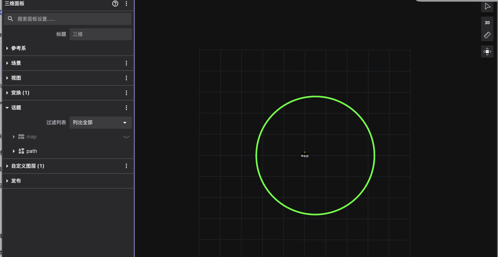
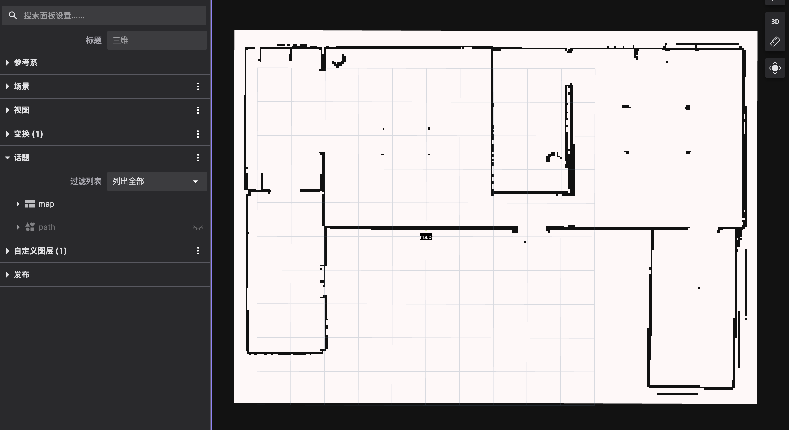

# 3. 数据类型

可视化工具消费的数据均来自 **commsgs** 命名空间，与 ROS 消息语义对齐。

### 3.1 按类别

#### sensor_msgs

| 类型 | 用途 |
|------|------|
| `LaserScan` | 2D 激光雷达 |
| `PointCloud` / `PointCloud2` | 点云 |
| `Image` / `CompressedImage` | 相机图像 |
| `Imu` | IMU |
| `Range` | 超声波/红外距离 |

#### geometry_msgs

| 类型 | 用途 |
|------|------|
| `PoseStamped` / `PoseArray` | 位姿 |
| `TransformStamped` | TF |
| `Point` / `Polygon` | 几何图元 |

#### map_msgs

| 类型 | 用途 |
|------|------|
| `OccupancyGrid` | 静态/代价地图栅格 |
| `OccupancyGridUpdate` | 地图增量更新 |
| `GridMap` | 多层栅格地图 |

#### planning_msgs / nav_msgs

| 类型 | 用途 |
|------|------|
| `Path` | 全局/局部路径 |
| `Odometry` | 里程计 |

#### visualization_msgs

| 类型 | 用途 |
|------|------|
| `Marker` | 箭头、立方体、线段等 |
| `MarkerArray` | 批量 Marker |
| `InteractiveMarker` | 交互式标记（RViz 风格） |

定义见 `autonomy/commsgs/proto/visualization_msgs.proto`。

#### vision_msgs

| 类型 | 用途 |
|------|------|
| `Detection2DArray` / `Detection3DArray` | 检测结果 |
| `BoundingBox2DArray` / `BoundingBox3DArray` | 包围框 |

### 3.2 实现完整度

| 包 | struct | proto | ToProto/FromProto |
|----|--------|-------|-------------------|
| sensor_msgs | ✅ | ✅ | ✅ |
| map_msgs | ✅ | ✅ | ✅ |
| planning_msgs | ✅ | ✅ | ✅ |
| visualization_msgs | ✅ | ✅ | ❌ stub |

详见 [14 Commsgs · 综述](../14_Commsgs/09_survey.md)。

### 3.3 路径可视化示例

规划路径使用 `planning_msgs::Path`，在 RViz / Foxglove 3D 面板中显示为折线：

### 3.4 地图可视化示例

代价地图/占据栅格使用 `OccupancyGrid`：

### 3.5 相关文档

- [14 Commsgs 文档](../14_Commsgs/index.rst)
- [§6 Foxglove · 面板配置](06_foxglove.md)
