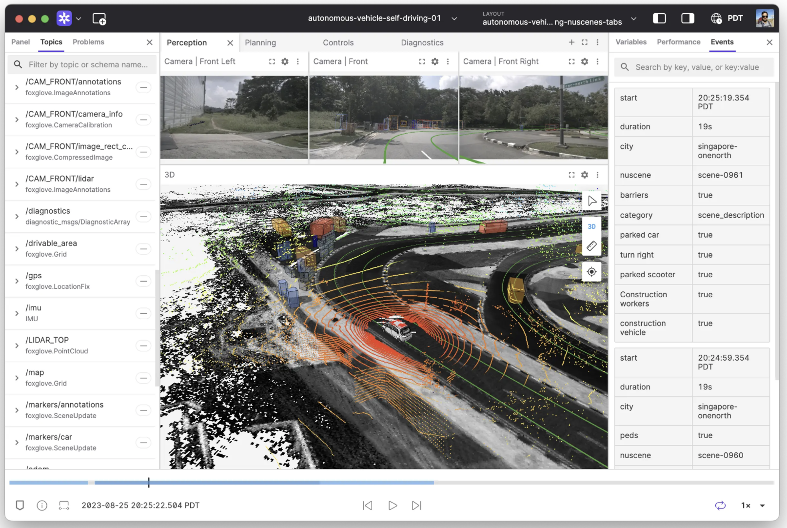
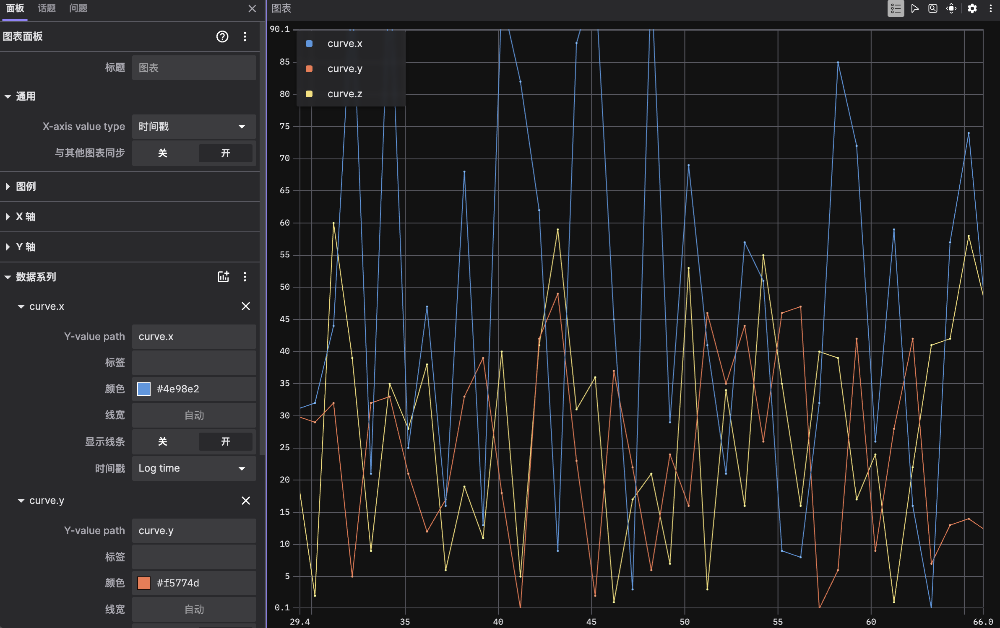

# 6. Foxglove

[Foxglove Studio](https://foxglove.dev/) 是面向机器人的多模态数据可视化与调试工具，支持 ROS 1/2、MCAP 及 WebSocket 实时连接。

### 6.1 核心能力

| 功能 | 说明 |
|------|------|
| 多模态面板 | 3D 视图、点云、图像、Plot、日志 |
| 数据源 | 实时 WebSocket、离线 bag/MCAP 拖拽 |
| 协作 | 布局保存与共享 |
| 扩展 | 自定义 JavaScript 面板 |



### 6.2 与 Autonomy 的接入方式

Autonomy **当前无内置 Foxglove 服务**。推荐路径：

```
libautonomy
    → autonomy_ros（ROS 2 话题）
        → ros-foxglove-bridge
            → ws://host:8765
                → Foxglove Studio
```

#### 安装 foxglove_bridge

Docker 镜像构建时可选安装（`docker/install/install_ros2.sh`）：

```bash
sudo apt install ros-humble-foxglove-bridge
# 或
ros2 run foxglove_bridge foxglove_bridge
```

#### 连接 Studio

1. 下载 [Foxglove Studio](https://foxglove.dev/download)
2. **Open connection → Foxglove WebSocket**
3. 输入 `ws://localhost:8765`（Docker 已映射时）

离线调试：将 MCAP / bag 文件拖入 Studio 窗口。

### 6.3 推荐面板布局

| 面板 | 订阅 | 用途 |
|------|------|------|
| 3D | `/map`, `/plan`, `/scan`, TF | 导航全貌 |
| Plot | `/cmd_vel`, odom 速度 | 控制曲线 |
| Image | `/sensor/camera` | 视觉 |
| Raw Messages | 任意 | 排错 |



### 6.4 规划 API（未实现）

历史文档中的 `VisualizationServer` 为**设计示例**，头文件 `autonomy/visualization/visualization_server.hpp` **不存在**：

```cpp
// 规划 API — 尚未实现
#include "autonomy/visualization/visualization_server.hpp"

auto server = std::make_shared<VisualizationServer>(options);
server->Publish<commsgs::planning_msgs::Path>("/planning/path", std::move(path));
```

接入后将从 `config/visualization/visualization.lua` 读取 host/port 与 topic 列表。

### 6.5 MCAP

`docker/install/install_mcap.sh` 安装 Foxglove MCAP C++ 头与 Python 包，供未来录制回放；**当前 C++ 代码无 MCAP API 调用**。

### 6.6 相关文档

- [§4 配置](04_configuration.md)
- [15 Bridge · 综述](../15_Bridge/08_survey.md)（与 foxglove_bridge 对标）
