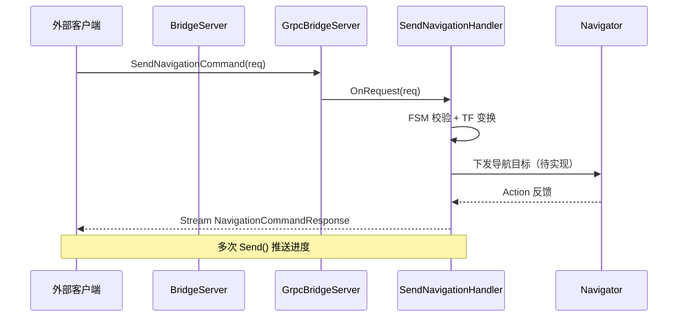

# 5. Bridge 模块架构设计

本文描述 `autonomy/bridge` 的逻辑架构、核心组件关系与运行时数据流。

## 5.1 设计目标

Bridge 模块遵循以下设计原则：

1. **协议与业务解耦**：传输层（gRPC / MQTT）与指令语义（导航 / 探索 FSM）分离，便于新增传输插件
2. **配置驱动**：Lua → Protobuf 配置管线，与 planning / control 模块统一
3. **异步非阻塞**：基于 `async_grpc` Completion Queue，避免阻塞导航主线程
4. **流式反馈**：Server Streaming 推送执行进度，而非单次 Request-Response
5. **安全可扩展**：预留 SSL、OAuth、uplink 云端同步接口

## 5.2 实现状态

| 组件 | 实现度 | 说明 |
|------|--------|------|
| `BridgeServer` 调度 | ✅ | 构造、Start、WaitForShutdown |
| `GrpcBridgeServer` | ✅ | Server Builder、Handler 注册、后台线程 |
| Navigation / Exploration Handler | ⏳ | 已注册，OnRequest 为空 |
| BotStates / BotEvents 流 | ❌ | Proto 已定义，Handler 未实现 |
| `MqttBridge` | ❌ | 空壳 |
| `GrpcBridgeContextInterface` | ⏳ | 继承 ExecutionContext，无业务字段 |
| `NavigatorStub` | ❌ | 空壳 |
| Lua 配置接线至 Server Builder | ⏳ | options 已解析，未传入 GrpcBridgeServer |

## 5.3 分层架构

<div class="plan-arch-diagram">

  <div class="plan-arch-layer plan-arch-app">
    <div class="plan-arch-header">
      <span class="plan-arch-badge">外部层</span>
      <span class="plan-arch-title">移动端 / 云平台 / 调度系统</span>
      <span class="plan-arch-sub">Bridge 模块的调用方，不隶属于 autonomy 包</span>
    </div>
    <div class="plan-arch-body">
      <div class="nav-body-block">
        <div class="nav-body-label">接入方式</div>
        <div class="nav-chip-list">
          <span class="nav-chip">gRPC + Protobuf</span>
          <span class="nav-chip">MQTT Pub/Sub</span>
          <span class="nav-chip">grpcurl / 自研 SDK</span>
        </div>
      </div>
    </div>
  </div>

  <div class="plan-arch-pipe"><span>RPC / MQTT 消息</span></div>

  <div class="plan-arch-layer plan-arch-server">
    <div class="plan-arch-header">
      <span class="plan-arch-badge">服务层</span>
      <span class="plan-arch-title">BridgeServer</span>
      <span class="plan-arch-sub">模块唯一对外服务入口 · 调度传输插件</span>
    </div>
    <div class="plan-arch-body plan-arch-body-cols">
      <div class="nav-body-block">
        <div class="nav-body-label">核心职责</div>
        <ul>
          <li>读取 <code>BridgeOptions</code>，按标志位启动 gRPC / MQTT</li>
          <li>管理插件生命周期（Start / Shutdown / WaitForShutdown）</li>
          <li>统一配置入口（Lua → Protobuf）</li>
        </ul>
      </div>
      <div class="nav-body-block">
        <div class="nav-body-label">配置来源</div>
        <div class="nav-chip-list">
          <span class="nav-chip">config/bridge/bridge.lua</span>
          <span class="nav-chip">BridgeOptions</span>
          <span class="nav-chip">use_grpc / use_mqtt</span>
        </div>
      </div>
    </div>
  </div>

  <div class="plan-arch-pipe"><span>插件调度</span></div>

  <div class="plan-arch-split">
    <div class="plan-arch-layer plan-arch-plugin">
      <div class="plan-arch-header">
        <span class="plan-arch-badge">传输层</span>
        <span class="plan-arch-title">gRPC / MQTT 插件</span>
      </div>
      <div class="plan-arch-body">
        <div class="nav-body-block">
          <div class="nav-body-label">gRPC 组件</div>
          <div class="nav-chip-list">
            <span class="nav-chip">GrpcBridgeServer</span>
            <span class="nav-chip">async_grpc::Server</span>
            <span class="nav-chip">RpcHandler</span>
          </div>
        </div>
        <div class="nav-body-block">
          <div class="nav-body-label">MQTT 组件（规划）</div>
          <div class="nav-chip-list">
            <span class="nav-chip">MqttBridge</span>
            <span class="nav-chip">topic 映射</span>
          </div>
        </div>
      </div>
    </div>

    <div class="plan-arch-link">
      <span class="plan-arch-link-arrow">◄</span>
      <span class="plan-arch-link-text">指令<br/>翻译</span>
      <span class="plan-arch-link-arrow">►</span>
    </div>

    <div class="plan-arch-layer plan-arch-map">
      <div class="plan-arch-header">
        <span class="plan-arch-badge">处理层</span>
        <span class="plan-arch-title">Handler + Context</span>
      </div>
      <div class="plan-arch-body">
        <div class="nav-body-block">
          <div class="nav-body-label">RPC Handler</div>
          <div class="nav-chip-list">
            <span class="nav-chip">SendNavigationHandler</span>
            <span class="nav-chip">SendExplorationHandler</span>
          </div>
        </div>
        <div class="nav-body-block">
          <div class="nav-body-label">共享上下文</div>
          <div class="nav-chip-list">
            <span class="nav-chip">GrpcBridgeContextInterface</span>
            <span class="nav-chip">NavigatorStub</span>
            <span class="nav-chip">TF Buffer</span>
          </div>
        </div>
      </div>
    </div>
  </div>

  <div class="plan-arch-pipe"><span>内部服务调用</span></div>

  <div class="plan-arch-layer plan-arch-post">
    <div class="plan-arch-header">
      <span class="plan-arch-badge">导航栈</span>
      <span class="plan-arch-title">Navigator / Exploration / Commsgs</span>
      <span class="plan-arch-sub">Bridge 的下游依赖，不属于 bridge 包</span>
    </div>
    <div class="plan-arch-body">
      <div class="nav-body-block">
        <div class="nav-body-label">目标模块</div>
        <div class="nav-chip-list">
          <span class="nav-chip">Navigator BT</span>
          <span class="nav-chip">Planning</span>
          <span class="nav-chip">Control</span>
          <span class="nav-chip">vehicle_msgs</span>
        </div>
      </div>
    </div>
  </div>

  <div class="plan-arch-pipe plan-arch-pipe-out"><span>状态流上行 · RobotState / RobotEvent</span></div>

</div>

## 5.4 核心组件

### 5.4.1 服务层 — `BridgeServer`

`BridgeServer` 是模块对外的唯一 C++ 入口：

```cpp
class BridgeServer {
    const proto::BridgeOptions options_;
    plugins::grpc::GrpcBridgeServer::UniquePtr grpc_bridge_;
};
```

| 职责 | 实现要点 |
|------|----------|
| 插件创建 | 默认构造时 `make_unique<GrpcBridgeServer>()` |
| 条件启动 | `use_grpc()` / `use_mqtt()` 分支（MQTT 待实现） |
| 优雅退出 | `WaitForShutdown()` 委托给 `grpc_bridge_` |

### 5.4.2 传输层 — `GrpcBridgeServer`

继承 `GrpcBridgeServerInterface`，封装 `async_grpc::Server`：

| 配置项 | 当前值 | 来源 |
|--------|--------|------|
| 监听地址 | `127.0.0.1`（硬编码） | 待接 `grpc.host:port` |
| gRPC 线程 | 4 | 待接 `num_grpc_threads` |
| 事件线程 | 4 | 待接 `num_event_threads` |
| 最大消息 | 100 MB | `kMaxMessageSize` |

后台 `task_thread_` 运行 `ProcessSensorDataQueue()`（当前为 5 秒周期日志占位，预留给传感器上行队列）。

### 5.4.3 处理层 — RPC Handler

Handler 通过 `DEFINE_HANDLER_SIGNATURE` 宏绑定 RPC 路径：

```cpp
DEFINE_HANDLER_SIGNATURE(
    SendNavigationSignature,
    proto::NavigationCommandRequest,
    async_grpc::Stream<proto::NavigationCommandResponse>,
    "/autonomy.bridge.proto.AutonomyService/SendNavigationCommand")
```

所有 Handler 继承 `RpcHandler<Signature>`，实现 `OnRequest()` 处理客户端请求，通过 `Send()` 推送流式响应。

### 5.4.4 配置层 — `LoadOptions`

```
bridge.lua (AUTONOMY_BRIDGE)
        │
        ▼
LuaParameterDictionary
        │
        ▼
common::LoadOptions()
        │
        ├── use_grpc / use_mqtt
        ├── CreateGrpcOptions()
        └── CreateMqttOptions()
        │
        ▼
proto::BridgeOptions
```

## 5.5 gRPC 服务注册

当前已注册 Handler：

| RPC 路径 | Handler 类 | 请求类型 | 响应类型 |
|----------|-----------|----------|----------|
| `/AutonomyService/SendNavigationCommand` | `SendNavigationHandler` | `NavigationCommandRequest` | `Stream<NavigationCommandResponse>` |
| `/AutonomyService/SendExplorationCommand` | `SendExplorationHandler` | `ExplorationCommandRequest` | `Stream<ExplorationCommandResponse>` |

待注册：

| RPC | 说明 |
|-----|------|
| `ReceiveBotStates` | Server Stream `RobotState` |
| `ReceiveBotEvents` | Server Stream `RobotEvent` |

## 5.6 运行时数据流



### 5.6.1 导航指令流

1. 客户端发送 Unary `NavigationCommandRequest`（含 `command` + 可选 `poses`）
2. `SendNavigationHandler::OnRequest` 解析指令，校验 FSM 合法性
3. `NAV_CMD_START`：将 `PoseArray` 变换到全局坐标系，调用 Navigator
4. 执行过程中多次 `Send(NavigationCommandResponse)` 推送进度
5. RPC 结束时 `Finish(OK)` 或 `Finish(NOT_FOUND)` 等 gRPC 状态码

### 5.6.2 状态上行流（规划）

1. 客户端调用 `ReceiveBotStates(Empty)`
2. Bridge 订阅内部 `RobotState` 话题或定时轮询
3. 通过 Server Stream 持续推送 `vehicle_msgs.RobotState`
4. 客户端断开时 Handler `OnCancel()` 清理订阅

## 5.7 Proto 契约

**配置 Proto**（`bridge_options.proto`）：

| Message | 字段 |
|---------|------|
| `GrpcOptions` | host, port, threads, uplink, ssl, auth |
| `MqttOptions` | host, port |
| `BridgeOptions` | use_grpc, use_mqtt, grpc, mqtt |

**服务 Proto**（`external_command_service.proto`）：

| Message | 用途 |
|---------|------|
| `NavigationCommandRequest/Response` | 导航指令 |
| `ExplorationCommandRequest/Response` | 探索指令 |
| `AutonomyService` | gRPC 服务定义 |

## 5.8 线程模型

```
主线程
  ├── BridgeServer::Start()
  │     ├── GrpcBridgeServer::Start()
  │     │     ├── grpc_server_->Start()     → N_grpc 个 gRPC 线程
  │     │     └── task_thread_              → 传感器队列处理（占位）
  │     └── (MqttBridge::Start() 待实现)
  └── BridgeServer::WaitForShutdown()
        └── grpc_server_->WaitForShutdown()
```

`async_grpc::Server` 内部维护：

- **gRPC 线程池**：处理网络 I/O 与 Completion Queue 事件
- **Event 线程池**：执行 Handler 回调（`OnRequest` 等）

## 5.9 扩展点

| 扩展点 | 方式 |
|--------|------|
| 新 RPC 方法 | 修改 proto + 新增 Handler + RegisterHandler |
| 新传输协议 | 实现 `BridgeInterface` 子类，在 `BridgeServer` 中调度 |
| 认证中间件 | `async_grpc::Server::Builder` 拦截器（待封装） |
| 上行云端 | `uplink_server_address` + `NavigatorStub` 批量上传 |

## 5.10 目录与依赖关系

```
bridge_server
    └── grpc_bridge (GrpcBridgeServer)
            ├── async_grpc::Server
            ├── handlers::SendNavigationHandler
            ├── handlers::SendExplorationHandler
            └── grpc_bridge_context (ExecutionContext)
                    └── navigator_stub (待实现)
```

**外部依赖**：

| 包 | 用途 |
|----|------|
| `grpc++` | gRPC C++ 运行时 |
| `protobuf` | 消息序列化 |
| `autonomy/common/async_grpc` | 异步服务器框架 |
| `autonomy/commsgs/proto` | 几何与车辆消息 |
