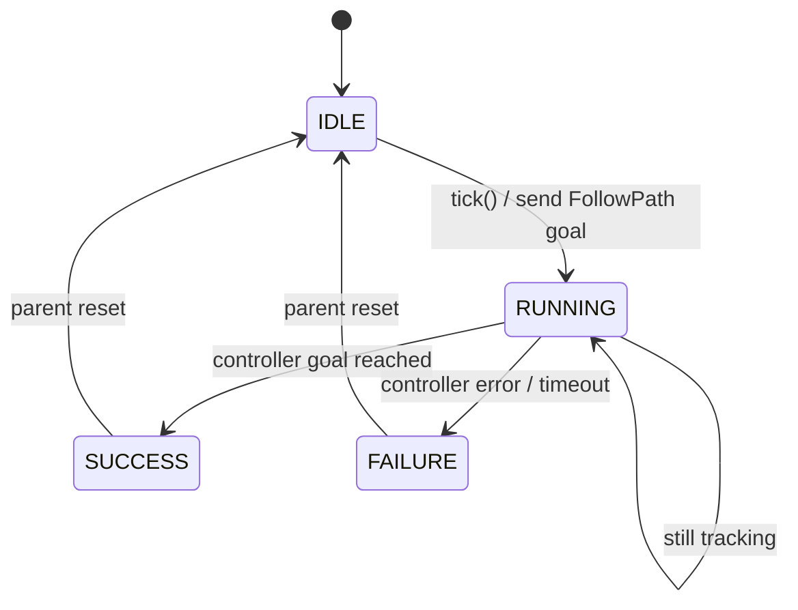
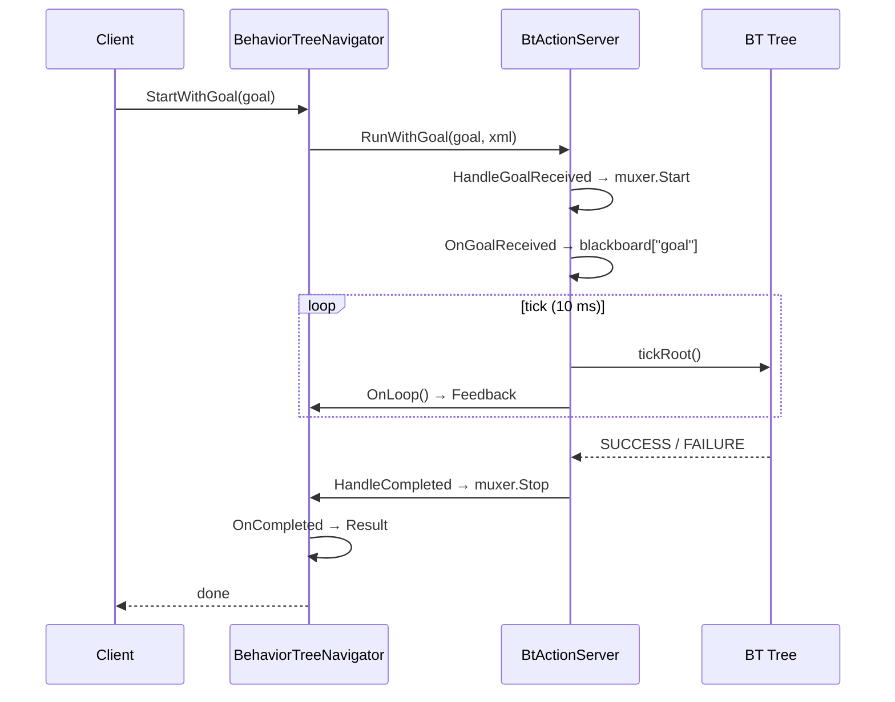
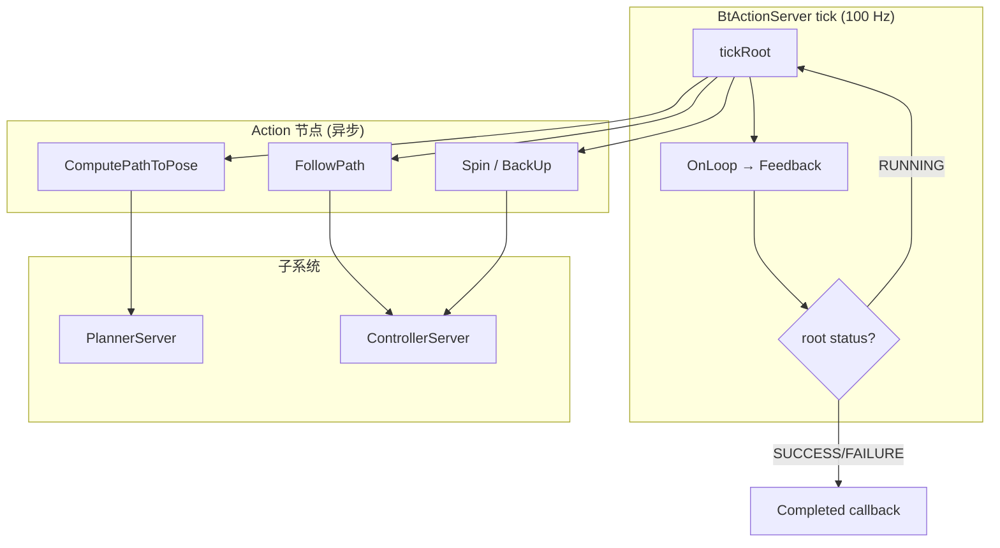

# 6. 行为树引擎

本文描述 `autonomy/navigator/behavior_tree/` 下的 BT 运行时引擎：工厂加载、Action 桥接、tick 循环与节点语义。当前实现待从历史 `tasks` 模块迁回，本文基于头文件引用、CHANGELOG 与 nav2 对齐设计编写。

## 6.1 组件概览

| 组件 | 文件 | 职责 |
|------|------|------|
| `BtEngine` | `bt_engine.hpp/.cpp` | 插件加载、XML 解析、`BehaviorTreeFactory` |
| `BtActionServer` | `bt_action_server.hpp` | Action ↔ BT 桥接、tick 主循环 |
| `BtContext` | `bt_context.hpp` | 共享 planner/controller/TF/options |
| `BehaviorTreeNavigator` | `common/behavior_tree_navigator.hpp` | Navigator 模板基类 |
| BT 插件 | `plugins/{action,condition,control,decorator}/` | 52 个节点 `.so` |

```
BtNavigator
  ├── BtEngine (factory + plugins)
  ├── BtContext (shared deps)
  └── BehaviorTreeNavigator<ActionT>
        └── BtActionServer<ActionT>
              ├── Tree (from XML)
              ├── Blackboard
              └── tick loop (10 ms)
```

## 6.2 BtEngine

### 6.2.1 职责

1. 从 `NavigatorOptions.plugin_lib_names` 加载动态库
2. 调用各库 `BT_REGISTER_NODES` 注册节点类型
3. 解析 BT XML 文件为 `BT::Tree`
4. 提供 `createTree(xml, blackboard)` 工厂方法

### 6.2.2 插件加载流程

```
navigator.lua (plugin_lib_names[52])
        │
        ▼
BtEngine::LoadPlugins(path, names)
        │
        ├── path = plugin_lib_path || AUTONOMY_BT_PLUGIN_PATH
        │
        ▼
for each name in names:
    dlopen(name + ".so")
    BT_REGISTER_NODES(factory)  // 静态注册
        │
        ▼
BehaviorTreeFactory 就绪
```

**环境变量**：`AUTONOMY_BT_PLUGIN_PATH` 指定 `.so` 搜索目录（`plugin_lib_path` 为空时使用）。

**Groot 模型**：`config/navigator/behavior_tree/autonomy_tree_nodes.xml` 定义全部节点端口，供 Groot2 可视化编辑。

### 6.2.3 XML 解析

```cpp
// 伪代码
BT::Tree tree = factory.createTreeFromFile(xml_path, blackboard);
// 或运行时字符串
BT::Tree tree = factory.createTreeFromText(xml_string, blackboard);
```

解析失败 → `NAV_TO_POSE_FAILED_TO_LOAD_BEHAVIOR_TREE`（9005）。

## 6.3 BtActionServer

### 6.3.1 设计定位

对标 `nav2_behavior_tree::BtActionServer`，但采用 **进程内** 实现（CHANGELOG 0.1.1）：

- 替换 ROS/Autolink `SimpleActionServer`
- Goal / Preempt / Cancel 通过内存回调传递
- `Run()` / `RunWithGoal()` 驱动 tick 循环

### 6.3.2 生命周期

| 阶段 | 方法 | 说明 |
|------|------|------|
| 配置 | `OnConfigure()` | 加载默认 XML、创建黑板 |
| 激活 | `OnActivate(node)` | 绑定 autolink 节点 |
| 运行 | `RunWithGoal(goal, xml)` | 阻塞直到 SUCCESS/FAILURE/CANCEL |
| 取消 | `Cancel()` | 中止子 Action、HALT 树 |
| 停用 | `OnDeactivate()` | 释放资源 |

### 6.3.3 回调链

`BehaviorTreeNavigator` 构造时注入：

```cpp
action_server_ = std::make_unique<BtActionServer<ActionT>>(
    engine_, context_, name_, default_tree_xml_,
    [this](GoalPtr goal) { return HandleGoalReceived(goal); },  // Goal
    [this]() { OnLoop(); },                                       // Loop
    [this](GoalPtr goal) { OnPreempt(goal); },                    // Preempt
    [this](ResultPtr result, RunStatus status) {                 // Completed
        HandleCompleted(result, status);
    });
```

| 回调 | 触发时机 | 典型操作 |
|------|----------|----------|
| Goal | 新 Goal 到达 | `OnGoalReceived` → 写黑板 `goal` |
| Loop | 每 tick 前 | 更新 `current_pose` → Feedback |
| Preempt | 新 Goal 抢占 | 更新黑板、重置子 Action |
| Completed | 树终止 | `OnCompleted` → Result 错误码 |

### 6.3.4 Goal 接收与 Muxer

```cpp
bool HandleGoalReceived(GoalPtr goal) {
    if (muxer_->IsNavigating()) return false;  // 拒绝并发
    if (!OnGoalReceived(goal)) return false;
    muxer_->StartNavigating(name_);
    return true;
}
```

## 6.4 BtContext

### 6.4.1 共享依赖

`BtContext` 持有 BT 插件访问子系统所需的指针（进程内直接调用，无需 autolink Client）：

| 字段 | 类型 | 用途 |
|------|------|------|
| `planner` | `PlannerServer*` | ComputePath* |
| `controller` | `ControllerServer*` | FollowPath / 恢复原语 |
| `tf_buffer` | `transform::Buffer*` | TransformAvailable |
| `navigator_options` | `NavigatorOptions` | 帧、容差、超时 |
| `autolink_node` | `autolink::Node*` | 分布式 Action Client（可选） |

插件通过 `config()` 或黑板 `autolink_node` 键获取上下文。

### 6.4.2 与 nav2 差异

nav2 BT 插件通过 autolink `Node` + Action Client 调用子服务器；Autonomy 0.1.1 起 **剥离 autolink 依赖**，插件直接读 `BtContext` 指针（CHANGELOG）。

## 6.5 Tick 循环

### 6.5.1 主循环

```cpp
// BtActionServer::Run() 伪代码
const auto loop_duration = std::chrono::milliseconds(options.bt_loop_duration()); // 10 ms
while (rclcpp::ok() && !cancel_requested_) {
    tree.tickRoot();           // BehaviorTree.CPP
    on_loop_callback_();       // Feedback 更新
    if (tree.rootNode()->status() != RUNNING) break;
    std::this_thread::sleep_for(loop_duration);
}
return MapStatusToRunStatus(tree.rootNode()->status());
```

**默认参数**：

| 参数 | 值 | 含义 |
|------|-----|------|
| `bt_loop_duration` | 10 ms | tick 周期 |
| `f_tick` | 100 Hz | 主循环频率 |
| `default_server_timeout` | 20000 ms | 子 Action 超时 |

### 6.5.2 RunStatus 映射

| BT 根状态 | `RunStatus` | Navigator 状态 |
|-----------|-------------|----------------|
| SUCCESS | `SUCCEEDED` | `kCompleted` |
| FAILURE | `FAILED` | `kFailed` |
| RUNNING | — | `kRunning`（继续 tick） |
| Cancel | `CANCELED` | `kCanceled` |

## 6.6 节点状态转移

BehaviorTree.CPP 节点状态：

$$
\mathcal{S} = \{ \mathrm{IDLE}, \mathrm{RUNNING}, \mathrm{SUCCESS}, \mathrm{FAILURE} \}
$$

### 6.6.1 Action 节点

```
IDLE ──tick()──→ RUNNING ──完成──→ SUCCESS
                      │
                      └──失败──→ FAILURE
```

Action 节点（如 `FollowPath`）在 RUNNING 期间每 tick 调用子 Action 并检查状态；子 Action 完成 → SUCCESS/FAILURE。

### 6.6.2 Condition 节点

```
每次 tick：瞬时判定 → SUCCESS 或 FAILURE（无 RUNNING）
```

### 6.6.3 状态转移图（FollowPath 示例）



## 6.7 控制节点语义

| 节点 | 代数语义 | tick 行为 | Autonomy 用途 |
|------|----------|-----------|---------------|
| `Sequence` | $N_1 \land N_2 \land \cdots$ | 顺序执行，一个 FAILURE 则 FAILURE | 恢复链 |
| `Fallback` | $N_1 \lor N_2 \lor \cdots$ | 一个 SUCCESS 则 SUCCESS | — |
| `ReactiveFallback` | 每 tick 重求 $N_1 \lor N_2 \lor \cdots$ | 从第一个子节点重新检验 | AdaptiveNavigation |
| `PipelineSequence` | 流水线激活 | 已完成子节点保持 SUCCESS，不再 tick | GlobalNavigatePipeline |
| `RecoveryNode` | $\mathrm{retry}(M, R, K)$ | $M$ 失败执行 $R$，最多 $K$ 次 | SafeNavigate |
| `RoundRobin` | 轮询 | 依次 tick 子节点，ForceFailure 跳过 | 局部运动循环 |
| `ReactiveSequence` | 每 tick 重检 | 从第一个 RUNNING 子节点继续 | — |

### PipelineSequence vs Sequence

| 特性 | `Sequence` | `PipelineSequence` |
|------|-----------|-------------------|
| 已完成子节点 | 不再 tick | SUCCESS 保持，不再 tick |
| FAILURE 传播 | 立即 FAILURE | 立即 FAILURE |
| 典型场景 | NavigationRecovery | Plan → Smooth → Follow |

### RecoveryNode 形式化

$$
\mathrm{RecoveryNode}(M, R, K):
\begin{cases}
\mathrm{SUCCESS}, & \mathrm{status}(M) = \mathrm{SUCCESS} \\
\mathrm{FAILURE}, & \mathrm{status}(M) = \mathrm{FAILURE} \land \mathrm{retries} \geq K \\
\mathrm{execute}(R);\; \mathrm{retries}{+}{+};\; \mathrm{retry}(M), & \mathrm{otherwise}
\end{cases}
$$

## 6.8 Decorator 节点

| Decorator | 行为 | 参数 | 典型用途 |
|-----------|------|------|----------|
| `RateController` | 限制子节点最大频率 | `hz` | ComputePath 5 Hz |
| `DistanceController` | 移动超过距离后 re-tick | `distance` | 降低重规划频率 |
| `SpeedController` | 根据速度限制 tick | `max_speed` | 高速时少规划 |
| `GoalUpdater` | 监听 goal 更新 | topic | 动态目标 |
| `GoalUpdatedController` | goal 更新时重置子节点 | — | 目标变更重规划 |
| `PathLongerOnApproach` | 接近时路径变长 → FAILURE | — | 异常检测 |
| `SingleTrigger` | 子节点仅执行一次 | — | 初始化步骤 |
| `Inverter` | 反转 SUCCESS/FAILURE | — | TimeExpired 取反 |

### RateController 数学

$$
T_{\min} = \frac{1}{f_{\max}}, \quad f_{\max} = \mathrm{hz}
$$

第 $k$ 次 tick：

$$
\mathrm{execute}(child) \iff t_k - t_{\text{last}} \geq T_{\min}
$$

否则返回子节点**上次状态**（不重新 tick）。

## 6.9 黑板键

### 6.9.1 系统常量

```cpp
constexpr char kBlackboardAutolinkNodeKey[] = "autolink_node";
```

`BehaviorTreeNavigator` 构造时写入：

```cpp
bb->set(kBlackboardAutolinkNodeKey, node);
```

### 6.9.2 配置注入（PopulateBlackboardDefaults）

| 键 | 来源 | 默认值 |
|----|------|--------|
| `global_frame` | `NavigatorOptions` | `map` |
| `robot_base_frame` | `NavigatorOptions` | `base_link` |
| `default_planner_id` | `NavigatorOptions` | `navfn_planner` |
| `default_controller_id` | `NavigatorOptions` | `FollowPath` |
| `default_goal_checker_id` | `NavigatorOptions` | `goal_checker` |
| `goal_reached_tol` | `NavigatorOptions` | `0.25` |
| `local_survival_timeout` | `NavigatorOptions` | `120.0` |
| `initial_pose_received` | 运行时 | `false` |

### 6.9.3 运行时键

| 键 | 写入者 | 读取者 |
|----|--------|--------|
| `goal` / `goals` | `OnGoalReceived` | ComputePath*, GoalReached |
| `path` | ComputePath*, SmoothPath | IsPathValid, FollowPath |
| `selected_planner` | PlannerSelector | ComputePath* |
| `selected_controller` | ControllerSelector | FollowPath |
| `selected_smoother` | SmootherSelector | SmoothPath |
| `compute_path_error_code` | ComputePathToPose | 恢复决策 |
| `follow_path_error_code` | FollowPath | 恢复决策 |

XML 端口引用：`{goal}`、`{path}` 等，由 BehaviorTree.CPP 黑板解析。

## 6.10 BehaviorTreeNavigator 生命周期



### 构造流程

1. 接收 `name`、`node`、`engine`、`context`、`muxer`、`default_tree_xml`
2. 创建 `BtActionServer`，注册四个回调
3. `OnConfigure()` — 加载默认树
4. `OnActivate(node)` — 绑定 autolink，写黑板 `autolink_node`
5. 失败则 `action_server_.reset()`，`IsInitialized() == false`

### 取消流程

```
Cancel() → BtActionServer::Cancel()
  → 取消进行中的 FollowPath / Spin / …
  → tree.halt()
  → muxer.StopNavigating()
  → RunStatus::CANCELED
```

## 6.11 插件加载与注册

### 6.11.1 命名规则

```
autonomy_behavior_tree_{category}_{stem}
```

| category | 数量 | 示例 |
|----------|------|------|
| `action` | 24 | `..._compute_path_to_pose_action` |
| `condition` | 16 | `..._goal_reached_condition` |
| `control` | 3 | `..._pipeline_sequence` |
| `decorator` | 7 | `..._rate_controller` |

### 6.11.2 注册宏

```cpp
// plugins/action/compute_path_to_pose_action.cpp
BT_REGISTER_NODES(factory) {
    factory.registerNodeType<ComputePathToPoseAction>("ComputePathToPose");
}
```

### 6.11.3 插件基类

| 基类 | 节点类型 | 接口 |
|------|----------|------|
| `BtActionNode` | Action | `on_tick()` → RUNNING/SUCCESS/FAILURE |
| `BtConditionNode` | Condition | `tick()` → SUCCESS/FAILURE |
| `BtControlNode` | Control | 子节点调度 |
| `BtDecoratorNode` | Decorator | 包装单个子节点 |

插件通过 `GetInputOrBlackboard<T>("port")` 读端口，通过 `setOutput()` 写端口。

## 6.12 与 Nav2 对照

| Nav2 组件 | Autonomy 组件 | 差异 |
|-----------|---------------|------|
| `nav2_behavior_tree::BtActionServer` | `BtActionServer` | 进程内，无 ROS Action Server |
| `nav2_behavior_tree::BtNavigator` | `BtEngine` + 插件加载 | 相同工厂模式 |
| `nav2_core::BehaviorTreeNavigator` | `BehaviorTreeNavigator<ActionT>` | 模板化，相同回调 |
| `nav2_core::NavigatorMuxer` | `NavigatorMuxer` | 相同互斥语义 |
| BT 插件 autolink Client | `BtContext` 直接指针 | 剥离 autolink 依赖 |
| `plugin_lib_names` | 52 个，与 nav2 对齐 | 同名节点端口 |
| `navigate_to_pose.xml` | 增强：局部生存模式 | nav2 无 TF 丢失分支 |
| `bt_loop_duration` | 10 ms | nav2 默认 10 ms |
| `goal_checker` | SimpleGoalChecker stateful | 相同 |

### 6.12.1 迁移注意事项

1. Autonomy BT 插件 **不持有** autolink `Node` 指针（除黑板可选注入）
2. Selector 节点简化：无 topic 订阅，进程内直接读配置默认
3. `BtNavigator` 接收 `NavigatorOptions`（非 nav2 的 ROS 参数服务器）
4. 错误码使用 `commsgs::proto::ErrorCode` 统一枚举

## 6.13 tick 与子 Action 交互



**子 Action 超时**：单次调用超过 `default_server_timeout`（20 s）→ 节点 FAILURE → 触发 RecoveryNode。

## 6.14 相关文档

- [数学原理 · Tick 时序](03_math.md#35-bt-tick-时序)
- [BT 插件节点](08_bt_plugins.md)
- [单点导航 BT](07_navigate_to_pose.md)
- [模块架构](05_architecture.md)
- [使用指南 · BT 插件环境](04_usage.md#47-bt-插件环境)
