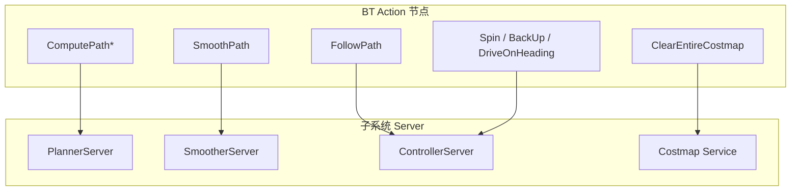

# 8. BT 插件节点

本文 catalog `autonomy/navigator/behavior_tree/plugins/` 下的全部行为树节点插件，以及 `navigate_through_poses.xml` 多点导航树。

## 8.1 插件体系

### 8.1.1 命名规则

```
autonomy_behavior_tree_{category}_{stem}
```

| 类别 | 数量 | 目录 |
|------|------|------|
| `action` | 24 | `plugins/action/` |
| `condition` | 16 | `plugins/condition/` |
| `control` | 3 | `plugins/control/` |
| `decorator` | 7 | `plugins/decorator/` |

### 8.1.2 加载配置

`config/navigator/navigator.lua` 的 `plugin_lib_names` 列出全部 52 个库名，须与 CMake 目标一致。

环境变量 `AUTONOMY_BT_PLUGIN_PATH` 指定 `.so` 搜索路径（`plugin_lib_path` 为空时使用）。

### 8.1.3 Groot 模型

`config/navigator/behavior_tree/autonomy_tree_nodes.xml` 定义全部节点的输入/输出端口，可用 [Groot2](https://github.com/BehaviorTree/Groot2) 可视化编辑。

---

## 8.2 Action 节点（24）

Action 节点调用 autolink Action Server 或 Service，执行期间返回 RUNNING。

### 8.2.1 规划类

| 节点 | 库名 | 调用目标 | 主要端口 |
|------|------|----------|----------|
| `ComputePathToPose` | `..._compute_path_to_pose_action` | `PlannerServer` | `goal`, `path`, `planner_id` |
| `ComputePathThroughPoses` | `..._compute_path_through_poses_action` | `PlannerServer` | `goals`, `path`, `planner_id` |
| `SmoothPath` | `..._smooth_path_action` | `SmootherServer` | `unsmoothed_path`, `smoothed_path`, `smoother_id` |
| `TruncatePath` | `..._truncate_path_action` | 本地路径裁剪 | `distance_forward`, `distance_backward` |
| `TruncatePathLocal` | `..._truncate_path_local_action` | 局部最近点裁剪 | `max_robot_pose_search_dist`, `angular_distance_weight` |
| `GetPoseFromPath` | `..._get_pose_from_path_action` | 从路径提取位姿 | `path`, `index` |

### 8.2.2 控制类

| 节点 | 库名 | 调用目标 | 主要端口 |
|------|------|----------|----------|
| `FollowPath` | `..._follow_path_action` | `ControllerServer` | `path`, `controller_id`, `goal_checker_id` |
| `Spin` | `..._spin_action` | `ControllerServer` | `spin_dist`, `time_allowance`, `is_recovery` |
| `BackUp` | `..._back_up_action` | `ControllerServer` | `backup_dist`, `backup_speed`, `time_allowance` |
| `DriveOnHeading` | `..._drive_on_heading_action` | `ControllerServer` | `dist_to_travel`, `speed`, `time_allowance` |
| `Wait` | `..._wait_action` | 定时等待 | `wait_duration` |

### 8.2.3 取消节点

| 节点 | 用途 |
|------|------|
| `SpinCancel` | 取消进行中的 Spin |
| `BackUpCancel` | 取消进行中的 BackUp |
| `DriveOnHeadingCancel` | 取消进行中的 DriveOnHeading |
| `WaitCancel` | 取消进行中的 Wait |
| `ControllerCancel` | 取消 FollowPath |

### 8.2.4 Selector 节点

| 节点 | Topic | 输出键 |
|------|-------|--------|
| `PlannerSelector` | `planner_selector` | `selected_planner` |
| `ControllerSelector` | `controller_selector` | `selected_controller` |
| `SmootherSelector` | `smoother_selector` | `selected_smoother` |
| `GoalCheckerSelector` | `goal_checker_selector` | `selected_goal_checker` |
| `ProgressCheckerSelector` | `progress_checker_selector` | `selected_progress_checker` |

### 8.2.5 服务类

| 节点 | 库名 | 调用目标 |
|------|------|----------|
| `ClearEntireCostmap` | `..._clear_costmap_service` | `*/clear_costmap` 服务（注册 3 种变体） |

### 8.2.6 航点管理

| 节点 | 用途 |
|------|------|
| `RemovePassedGoals` | 移除已通过的航点 |
| `RemoveInCollisionGoals` | 移除碰撞航点 |

---

## 8.3 Condition 节点（16）

Condition 节点瞬时判定，返回 SUCCESS 或 FAILURE。

### 8.3.1 导航判定

| 节点 | 判定逻辑 | 用于 |
|------|----------|------|
| `GoalReached` | $d_{xy} \leq \varepsilon_{xy}$ | 目标到达（仅 XY） |
| `TransformAvailable` | `canTransform(parent, child)` | TF 可用性 |
| `InitialPoseReceived` | `initial_pose_received == true` | AMCL 初始化 |
| `IsPathValid` | 路径碰撞检测 | Pipeline 验证 |
| `IsStuck` | 机器人卡住检测 | 恢复决策 |
| `IsStopped` | 速度低于阈值 | 停止判定 |
| `GoalUpdated` | goal 话题更新 | 动态目标 |
| `GloballyUpdatedGoal` | 全局 goal 更新 | 动态目标 |

### 8.3.2 时空判定

| 节点 | 判定逻辑 |
|------|----------|
| `TimeExpired` | $t_{\text{elapsed}} \geq T_{\mathrm{exp}}$（XML 端口 `seconds`） |
| `PathExpiringTimer` | 路径即将过期 |
| `DistanceTraveled` | 累计移动距离超过阈值 |
| `ArePosesNear` | 两位姿距离 < 阈值 |

### 8.3.3 恢复决策

| 节点 | 用途 |
|------|------|
| `WouldAPlannerRecoveryHelp` | 规划恢复是否有帮助 |
| `WouldAControllerRecoveryHelp` | 控制恢复是否有帮助 |
| `WouldASmootherRecoveryHelp` | 平滑恢复是否有帮助 |
| `AreErrorCodesPresent` | 检查错误码集合 |

### 8.3.4 电源（可选）

| 节点 | 用途 |
|------|------|
| `IsBatteryLow` | 电量低 |
| `IsBatteryCharging` | 正在充电 |

---

## 8.4 Control 节点（3）

| 节点 | 语义 | 用于 |
|------|------|------|
| `PipelineSequence` | 流水线按序执行，前 SUCCESS 才激活下一个 | 规划→平滑→跟踪 |
| `RecoveryNode` | 主分支 FAILURE 时执行恢复子树，限 retries | SafeNavigate、LocalSurvivalMode |
| `RoundRobin` | 轮询子节点，ForceFailure 跳过 | 局部运动循环 |

### PipelineSequence vs Sequence

| 特性 | `Sequence` | `PipelineSequence` |
|------|-----------|-------------------|
| 已完成子节点 | 不再 tick | 保持 SUCCESS 状态 |
| 适用场景 | 一次性步骤 | 持续运行的流水线 |
| 典型用途 | 恢复链 | 规划+跟踪 |

---

## 8.5 Decorator 节点（7）

| 节点 | 行为 | 典型参数 |
|------|------|----------|
| `RateController` | 限制子节点最大频率 | `hz="5.0"` |
| `DistanceController` | 移动超过距离后 re-tick | `distance="1.0"` |
| `SpeedController` | 根据速度限制 tick | `max_speed` |
| `GoalUpdater` | 监听 goal 更新 | topic 名 |
| `GoalUpdatedController` | goal 更新时重置子节点 | — |
| `PathLongerOnApproach` | 接近目标时路径变长则 FAILURE | — |
| `SingleTrigger` | 子节点仅执行一次 | — |

---

## 8.6 节点 → 子系统映射



---

## 8.7 多点导航树 `navigate_through_poses.xml`

### 8.7.1 结构

```
RecoveryNode [NavigateThroughPoses, retries=6]
├── PipelineSequence [NavigateThroughPosesWithReplanning]
│   ├── ControllerSelector
│   ├── PlannerSelector
│   ├── SmootherSelector
│   ├── RateController(10Hz) → ComputePathThroughPoses
│   ├── SmoothPath
│   ├── IsPathValid
│   └── FollowPath
└── Sequence [ThroughPosesRecovery]
    ├── ClearEntireCostmap(local + global)
    └── Wait(0.5s)
```

### 8.7.2 与单点树的差异

| 特性 | `navigate_to_pose` | `navigate_through_poses` |
|------|-------------------|--------------------------|
| 规划节点 | `ComputePathToPose` | `ComputePathThroughPoses` |
| 规划频率 | 5 Hz | 10 Hz |
| 目标键 | `{goal}` | `{goals}` |
| 局部生存模式 | ✅ | ❌ |
| GoalReached 前置 | ✅ ReactiveFallback 首位 | ❌（由 FollowPath 判定） |
| 恢复 retries | 8 | 6 |
| 恢复动作 | 清图 + BackUp + Spin | 清图 + Wait |

### 8.7.3 航点处理

`ComputePathThroughPoses` 接收 `goals` 数组，规划器生成贯穿所有航点的路径。可选节点：

- `RemovePassedGoals`：移除已到达航点
- `RemoveInCollisionGoals`：移除不可达航点
- `GoalUpdater`：运行时更新航点列表

---

## 8.8 扩展自定义节点

1. 在 `plugins/{category}/my_node.cpp` 实现节点类
2. 继承 `BtActionNode` / `BtConditionNode` / `BtControlNode` / `BtDecoratorNode`
3. 通过 `bt_context` 访问子系统
4. `BT_REGISTER_NODES(factory)` 注册
5. CMake 添加到 `behavior_tree_plugins.cmake`
6. 更新 `navigator.lua` 和 `autonomy_tree_nodes.xml`

## 8.9 相关文档

- [行为树引擎](06_bt_engine.md)
- [单点导航 BT](07_navigate_to_pose.md)
- [使用指南 · 自定义 BT](04_usage.md#48-自定义行为树)
