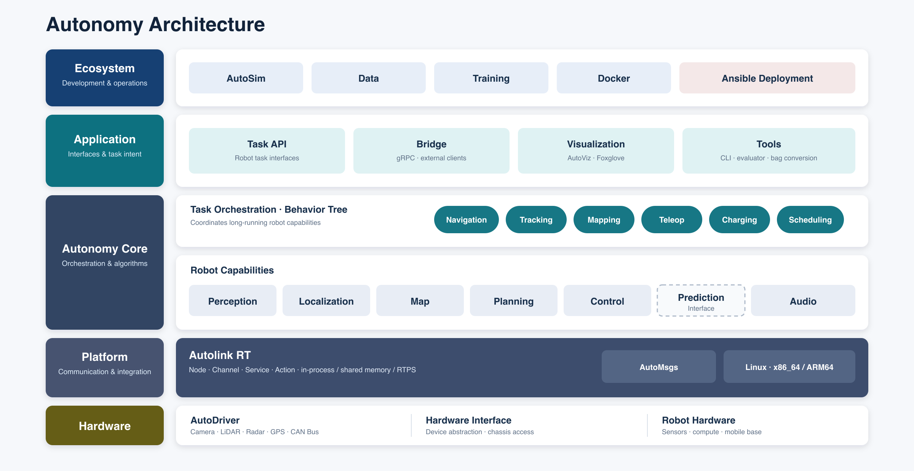
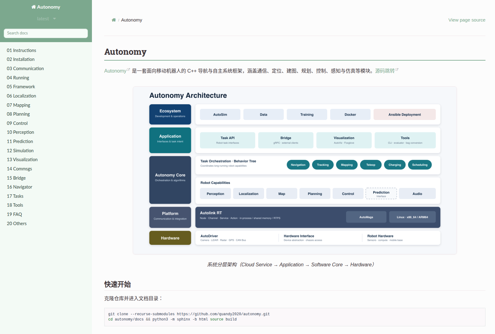

(instructions-overview)=
# 1. 概览

面向移动 / 操作机器人的 **CMake + C++17 整机软件系统**：驱动、SLAM、感知、导航、机械臂、任务编排与机上管理；可选 gRPC / ROS 2。可不依赖 ROS 2 独立运行；移动导航语义对齐 Navigation2。

## 1.1 阅读路径

| 目标 | 入口 |
|------|------|
| 跑起来 | [§2 快速上手](02_quickstart.md) → [Installation](../02_Installation/00_guide.md) → [Running](../04_Running/00_guide.md) |
| 懂结构 | [§3 架构](03_system_architecture.md) |
| 找代码 / 对接 | [§4 仓库与生态](04_repository.md) |

## 1.2 约定

| 约定 | 含义 |
|------|------|
| 源码根 | 含顶层 `CMakeLists.txt` 的目录 |
| 编排 | `autonomy/task`（文档章名 Navigator） |
| 管理面 | `autonomy/system` |
| 消息 | `automsgs/` |
| 驱动 | `autodriver/` |
| 启动 | `source scripts/setup_environment.bash` → `autolink_launch autonomy.launch` |

## 1.3 能力域

| 能力域 | 落点 |
|--------|------|
| 驱动 / 底盘 | `autodriver` · `vehicle` · `sensor` |
| SLAM / 定位 | `localization`（如 Atlas） |
| 感知 / 预测 | `perception` · `prediction` |
| 地图 / 导航 | `map` · `planning` · `control` |
| 机械臂 / 操作 | `manipulation` |
| 语音等 | `audio` |
| 任务编排 | `task`（BT：导航 / 跟踪 / 建图 / 遥操 / 回充…） |
| 管理面 | `system`（monitor / 安全 / OTA / launch） |
| 通信 · 消息 · 对外 | `autolink` · `automsgs` · `bridge`（gRPC） |

原则：`AUTONOMY_BUILD_*` 按域裁剪，`BUILD_*` 管产品子工程；插件化；conf + launch；x86-64 / aarch64，推荐 Ubuntu 22.04。

## 1.4 文档地图

顺序：**入门 → 安装/运行 → 通信 → 各能力域 → 工具/FAQ**。模块入口多为 `00_guide.md`。

| 章 | 内容 |
|----|------|
| 01–02 | 入门 · 安装 |
| 03–04 | 通信 · 运行 |
| 05–09 | 框架 · 定位/SLAM · 地图 · 规划 · 控制 |
| 10–13 | 感知 · 预测 · 仿真 · 可视化 |
| 14–16 | 消息 · Bridge · 任务编排（task） |
| 17–20 | Tasks · Tools · FAQ · Other |

| 角色 | 建议路径 |
|------|----------|
| 整机应用 | §2 → Installation → Running → 16 Navigator → 按需 08/09/10 |
| 导航 | §3 → 08 · 09 · 07 · 16 |
| SLAM / 感知 | 06 · 10 · autodriver |
| 中间件 | 03 Communication → 14 → 15 |

本地构建文档：`cd docs && pip install -r requirements.txt && sphinx-build -b html source build` · [在线](https://autonomy.readthedocs.io/en/latest/index.html)

## 1.5 版本

| | |
|--|--|
| 版本 | **0.2.0**（`version.json`） |
| 栈 | C++17 · CMake ≥ 3.20 · Apache 2.0 |
| 较成熟 | 通信 · 地图 · 规划 · 控制 · 任务 · 定位 · 管理面 · Bridge · 驱动骨架 |
| 深化中 | 感知 · 预测 · 机械臂 · 语音 |

变更见 [`CHANGELOG.rst`](https://github.com/quandy2020/autonomy/blob/main/CHANGELOG.rst)。贡献：`tools/clang_format_sources.py` → PR 附测试。

[GitHub](https://github.com/quandy2020/autonomy) · [Gitee](https://gitee.com/quanduyong/autonomy) · Apache 2.0

→ [§2 快速上手](02_quickstart.md)
