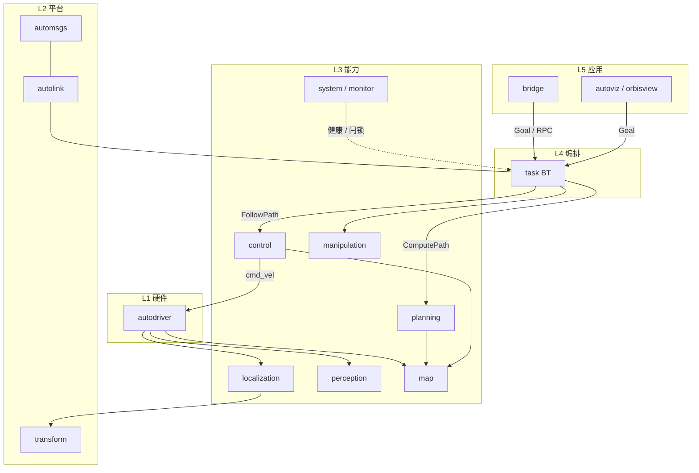

# 3. 架构与能力

本章回答三件事：**系统怎么分层、各能力域干什么、运行时数据怎么流**。彩色总图见 [§1](01_overview.md)；目录与开关见 [§4](04_repository.md)。

Autonomy 是**多进程整机软件**：算法与任务在各自进程中运行，经 **Autolink** 通信、**automsgs** 传消息；**不**依赖 ROS 2 运行时即可部署。移动导航语义对齐 Navigation2，但仓库还包含驱动、SLAM、感知、机械臂与机上管理。

## 3.1 设计要点

| 要点 | 含义 |
|------|------|
| 分层解耦 | 硬件 → 平台 → 能力 → 编排 → 应用；上层只依赖稳定接口 |
| 编排与管理分离 | `task` 跑业务 BT；`system` 管健康、安全闩锁、OTA、默认 launch |
| 多进程 | `autolink_launch` 拉起各二进制；进程间 Channel / Service / Action |
| 按域裁剪 | `AUTONOMY_BUILD_*` / `BUILD_*` 只编车上需要的域 |
| 配置一致 | 跨进程帧名、默认 planner/controller id 必须相同 |

## 3.2 分层（模块一览）

自上而下：**应用发令 → 任务 BT 编排 → 各能力域 → Autolink 平台 → 驱动/硬件**。

<div class="plan-arch-diagram">

  <div class="plan-arch-layer plan-arch-app">
    <div class="plan-arch-header">
      <span class="plan-arch-badge">L5</span>
      <span class="plan-arch-title">应用 / 运维</span>
      <span class="plan-arch-sub">发令 · 可视化 · 装机</span>
    </div>
    <div class="plan-arch-body">
      <div class="nav-chip-list">
        <span class="nav-chip">bridge</span>
        <span class="nav-chip">autoviz</span>
        <span class="nav-chip">orbisview</span>
        <span class="nav-chip">autosim</span>
        <span class="nav-chip">ansible</span>
      </div>
    </div>
  </div>

  <div class="plan-arch-pipe"><span>Goal / RPC / UI</span></div>

  <div class="plan-arch-layer plan-arch-orch">
    <div class="plan-arch-header">
      <span class="plan-arch-badge">L4</span>
      <span class="plan-arch-title">任务编排</span>
      <span class="plan-arch-sub">TaskServer · Behavior Tree</span>
    </div>
    <div class="plan-arch-body plan-arch-body-cols plan-arch-body-cols--2">
      <div class="nav-body-block">
        <div class="nav-body-label">编排引擎</div>
        <div class="nav-chip-list">
          <span class="nav-chip">task</span>
          <span class="nav-chip">TaskServer</span>
          <span class="nav-chip">BT tick</span>
        </div>
      </div>
      <div class="nav-body-block">
        <div class="nav-body-label">任务域</div>
        <div class="nav-chip-list">
          <span class="nav-chip">navigation</span>
          <span class="nav-chip">tracking</span>
          <span class="nav-chip">mapping</span>
          <span class="nav-chip">teleop</span>
          <span class="nav-chip">charging</span>
        </div>
      </div>
    </div>
  </div>

  <div class="plan-arch-pipe"><span>Action / Service</span></div>

  <div class="plan-arch-layer plan-arch-plugin">
    <div class="plan-arch-header">
      <span class="plan-arch-badge">L3</span>
      <span class="plan-arch-title">机器人能力</span>
      <span class="plan-arch-sub">按 AUTONOMY_BUILD_* 裁剪</span>
    </div>
    <div class="plan-arch-body plan-arch-body-cols">
      <div class="nav-body-block">
        <div class="nav-body-label">移动导航</div>
        <div class="nav-chip-list">
          <span class="nav-chip">map</span>
          <span class="nav-chip">planning</span>
          <span class="nav-chip">control</span>
        </div>
      </div>
      <div class="nav-body-block">
        <div class="nav-body-label">感知定位</div>
        <div class="nav-chip-list">
          <span class="nav-chip">localization</span>
          <span class="nav-chip">perception</span>
          <span class="nav-chip">prediction</span>
        </div>
      </div>
      <div class="nav-body-block">
        <div class="nav-body-label">操作 / 其它</div>
        <div class="nav-chip-list">
          <span class="nav-chip">manipulation</span>
          <span class="nav-chip">audio</span>
          <span class="nav-chip">vehicle</span>
          <span class="nav-chip">sensor</span>
        </div>
      </div>
      <div class="nav-body-block">
        <div class="nav-body-label">机上管理</div>
        <div class="nav-chip-list">
          <span class="nav-chip">system</span>
          <span class="nav-chip">monitor</span>
          <span class="nav-chip">ota</span>
        </div>
      </div>
    </div>
  </div>

  <div class="plan-arch-pipe"><span>Autolink · TF · 话题</span></div>

  <div class="plan-arch-layer plan-arch-map">
    <div class="plan-arch-header">
      <span class="plan-arch-badge">L2</span>
      <span class="plan-arch-title">平台</span>
      <span class="plan-arch-sub">通信运行时 · 消息 · 坐标</span>
    </div>
    <div class="plan-arch-body">
      <div class="nav-chip-list">
        <span class="nav-chip">autolink</span>
        <span class="nav-chip">automsgs</span>
        <span class="nav-chip">transform</span>
        <span class="nav-chip">common</span>
      </div>
    </div>
  </div>

  <div class="plan-arch-pipe"><span>驱动接口</span></div>

  <div class="plan-arch-layer plan-arch-post">
    <div class="plan-arch-header">
      <span class="plan-arch-badge">L1</span>
      <span class="plan-arch-title">硬件接入</span>
      <span class="plan-arch-sub">传感器 · 底盘 · 计算平台</span>
    </div>
    <div class="plan-arch-body">
      <div class="nav-chip-list">
        <span class="nav-chip">autodriver</span>
        <span class="nav-chip">camera / lidar / imu</span>
        <span class="nav-chip">chassis</span>
      </div>
    </div>
  </div>

</div>

### 各层职责

| 层 | 做什么 | 不做什么 |
|----|--------|----------|
| **L5 应用** | Bridge 远程 RPC、Autoviz/OrbisView 点目标、Ansible 装机 | 不算路径、不直接控电机 |
| **L4 编排** | `autonomy.task` 加载 BT，协调导航/跟随/建图/遥操/回充等任务生命周期 | 不实现具体规划器/控制器算法 |
| **L3 能力** | 地图、规划、控制、定位、感知、机械臂、monitor/OTA… | 一般不直接碰原始驱动寄存器 |
| **L2 平台** | Autolink 收发、automsgs 类型、TF、公共库 | 不含业务策略 |
| **L1 硬件** | `autodriver` 采传感器、发底盘速度 | 不含全局规划 |

## 3.3 能力域一览

整机按域组合部署；车上可只开子集（见 [Installation §6](../02_Installation/06_build.md)）。

| 域 | 模块 | 典型职责 | 深入 |
|----|------|----------|------|
| 驱动 | `autodriver` | 相机/雷达/IMU 采集，底盘 `cmd_vel` 下发 | — |
| SLAM / 定位 | `localization` | 建图、位姿估计、发布 TF | [06](../06_Localization/index.rst) |
| 感知 / 预测 | `perception` · `prediction` | 检测跟踪、障碍/意图 | [10](../10_Perception/index.rst) · [11](../11_Prediction/index.rst) |
| 地图 | `map` | Occupancy / Costmap2D（static·obstacle·inflation） | [07](../07_Map/00_guide.md) |
| 全局规划 | `planning` | `ComputePath` → Path | [08](../08_Planning/00_guide.md) |
| 局部控制 | `control` | `FollowPath` → 周期 `cmd_vel` | [09](../09_Control/00_guide.md) |
| 操作 | `manipulation` | 机械臂运动与约束 | — |
| 编排 | `task` | 多域 BT（文档章名 **Navigator**） | [16](../16_Navigator/00_guide.md) |
| 管理 | `system` | monitor 健康快照、安全闩锁、OTA、默认 launch | [04 Running](../04_Running/00_guide.md) |
| 对外 | `bridge` | gRPC：发令、查状态、运维类 RPC | [15](../15_Bridge/00_guide.md) |
| 通信 / 消息 | `autolink` · `automsgs` | IPC 与类型定义 | [03](../03_Communication/00_guide.md) · [14](../14_Commsgs/index.rst) |

## 3.4 移动导航流水线（最常用）

其它域（跟随、回充、操作）同样由 **task BT** 或独立进程调度；下面以 **A→B 导航** 说明协作方式。

```text
1. 用户 / Bridge / UI 下发 Goal（map 系）
2. task：检查 TF，加载 BT（如 navigate_to_pose.xml）
3. planning：在 Costmap 快照上 ComputePath → Path
4. （可选）平滑 / IsPathValid
5. control：FollowPath 循环输出 cmd_vel
6. GoalChecker 到达 → SUCCESS；失败则走 BT 恢复分支
```

```text
Goal → task(BT) → planning(Path) → control(FollowPath → cmd_vel)
              ↘ 读 Costmap2D / TF（map → odom → base_link）
                 ↑
         localization / autodriver（位姿与传感）
```

| 层 | 模块 | 频率量级 | 说明 |
|----|------|----------|------|
| 代价地图 | `map` | 1–10 Hz | 融合静态层与障碍层并膨胀 |
| 全局规划 | `planning` | 1–5 Hz | 事件触发为主，也可周期重规划 |
| 局部控制 | `control` | 10–50 Hz | 跟踪路径、避障、限速 |
| 编排 | `task` | tick / 事件 | 对标 Nav2 `bt_navigator` |

**坐标系**：`map`（全局目标/规划）→ `odom`（局部平滑）→ `base_link`（控制）。在 `navigator.pb.txt` 与各域 conf 中保持 `global_frame`、`robot_base_frame` 一致。

**与 Navigation2 对照**：

| Nav2 | Autonomy |
|------|----------|
| `nav2_bt_navigator` | `autonomy/task` |
| `nav2_planner` | `autonomy/planning` |
| `nav2_controller` | `autonomy/control` |
| `nav2_costmap_2d` | `autonomy/map` |
| `nav2_msgs` | `automsgs` |

## 3.5 模块索引（路径）

| 模块 | 源码路径 | 主要进程 / 产物 | 文档 |
|------|----------|-----------------|------|
| Autolink | `autolink/` | `autolink`、launch | [03 Communication](../03_Communication/00_guide.md) |
| AutoMsgs | `automsgs/` | 消息 / RPC 库 | [14 Commsgs](../14_Commsgs/index.rst) |
| AutoDriver | `autodriver/` | 驱动主进程 | — |
| Localization | `autonomy/localization/` | `autonomy.localization` 等 | [06 Localization](../06_Localization/index.rst) |
| Perception | `autonomy/perception/` | `autonomy.perception`、component | [10 Perception](../10_Perception/index.rst) |
| Prediction | `autonomy/prediction/` | | [11 Prediction](../11_Prediction/index.rst) |
| Map | `autonomy/map/` | costmap 相关库 / 服务 | [07 Map](../07_Map/index.rst) |
| Planning | `autonomy/planning/` | `autonomy.planning` | [08 Planning](../08_Planning/index.rst) |
| Control | `autonomy/control/` | `autonomy.control` | [09 Control](../09_Control/index.rst) |
| Manipulation | `autonomy/manipulation/` | | — |
| Task | `autonomy/task/` | `autonomy.task` | [16 Navigator](../16_Navigator/index.rst) |
| System | `autonomy/system/` | `autonomy.monitor`、`autonomy.ota`、launch | [04 Running](../04_Running/00_guide.md) |
| Bridge | `autonomy/bridge/` | `autonomy.bridge` | [15 Bridge](../15_Bridge/index.rst) |
| Autoviz / Autosim | `autoviz/` · `autosim/` | | [13](../13_Visualization/index.rst) · [12](../12_Simulation/index.rst) |

**配置落点**（细节见 [§4.4](04_repository.md)）：

| 类型 | 位置 |
|------|------|
| 系统 / 监控 / OTA | `autonomy/system/conf/*.pb.txt` |
| 任务 / BT | `autonomy/task/conf/`（含 `behavior_tree/`） |
| 各域算法 | `autonomy/<域>/conf/` |
| 驱动 | `autodriver/config/`、`launch/` |

## 3.6 运行时数据流



读图要点：

1. **传感上行**：`autodriver` → 定位 / 感知 / 地图  
2. **任务下行**：Bridge/UI → `task` → 规划 / 控制（或机械臂）  
3. **执行闭环**：`control` → `cmd_vel` → `autodriver` → 底盘  
4. **管理旁路**：`system`（monitor）采集健康，不替代 task 做导航决策  

## 3.7 推荐部署

| 场景 | 做法 |
|------|------|
| 桌面 / 车端全栈联调 | `source scripts/setup_environment.bash` → `autolink_launch autonomy.launch` |
| 只要导航三件套 | `autolink launch start task.launch`（勿与全栈同时开） |
| 只要感知 + 驱动 | 裁剪 CMake 后起对应 launch（见 Installation §6、各模块 README） |
| 内存紧 / 板端 | 减小 `-j`；`build` 放本地盘；关 GUI（`BUILD_AUTOVIZ=OFF` 等） |

→ [§4 仓库与生态](04_repository.md) · [§2 快速上手](02_quickstart.md)
