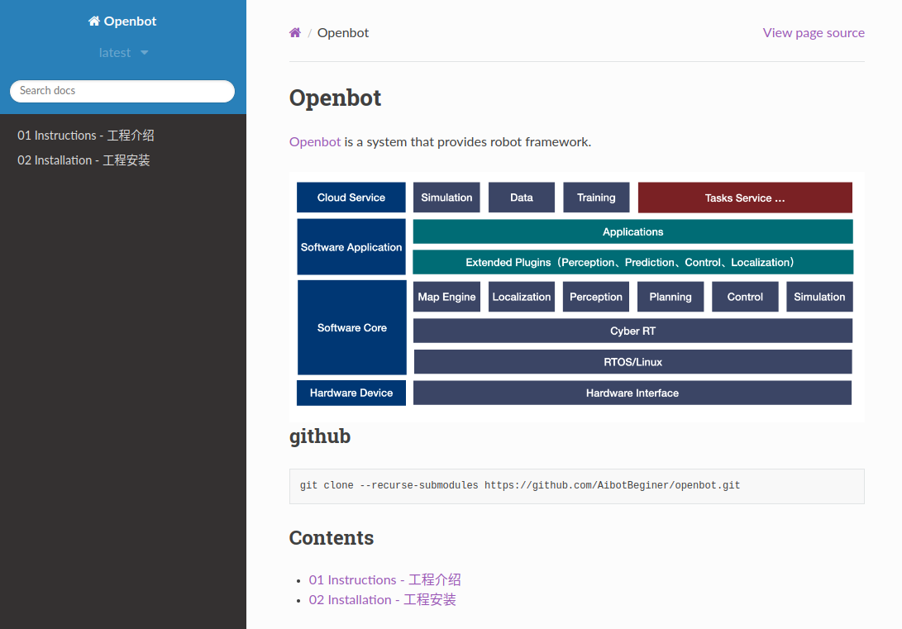

# 7. 文档导读



本手册按**入门 → 安装运行 → 通信框架 → 导航栈各模块 → 工具与 FAQ** 组织。各技术模块均采用统一的 **§1–§9** 文档结构。

## 7.1 全书目录

| 章节 | 路径 | 内容 |
|------|------|------|
| **01 入门** | `01_Instructions/` | 本指南：概览、架构、导航栈 |
| 02 安装 | `02_Installation/` | 依赖、Docker、编译环境 |
| 03 通信 | `03_Communication/` | **§0–§13**：指南、架构、Node/Channel/Service/Action/Parameter/Plugin/Log/Launch/Component/Timer 与 Time/Scheduler、综述 |
| 04 运行 | `04_Running/` | 启动、Docker、ROS 2 运行 |
| 05 框架 | `05_Framework/` | Framework 集成视角 |
| 06 定位 | `06_Localization/` | Atlas VSLAM、AMCL |
| 07 地图 | `07_Map/` | Costmap2D、GridMap |
| 08 规划 | `08_Planning/` | **§0–§6**：指南、架构、规划器总览、NavFn/Dijkstra/Theta*、综述 |
| 09 控制 | `09_Control/` | FollowPath、Checker、Smoother；§0–§6 主干 + §10–§20 专题 |
| 10–13 | Perception / Prediction / Simulation / Visualization | 扩展模块 |
| 14 消息 | `14_Commsgs/` | 消息类型与 Schema |
| 15 桥接 | `15_Bridge/` | gRPC Bridge |
| 16 编排 | `16_Navigator/` | **§0–§6**：指南、架构、BT 总览、引擎/单点/插件、综述 |
| 17–20 | Tasks / Tools / FAQ / Other | 工具与杂项 |

## 7.2 模块文档统一结构

每个技术模块（如 Planning、Control、Navigator）通常包含：

| 编号 | 文件 | 内容 |
|------|------|------|
| 00 | `00_guide.md` | 模块总入口与阅读路径 |
| §1 | 概览 / 架构 | 模块边界与数据流 |
| §2+ | 组件 / 算法 | 子专题（Planning §2 规划器总览 + §3–§5 算法；Control §3–§5 + §10–§20 深读） |
| 末章 | `*_survey.md` | 综述与选型（Planning §6、Control §6） |

**Navigator**（`16_Navigator/`）已对齐 Planning 结构：合并旧版 overview/quickstart/usage/math 为 **§0 指南**；架构见 `01_architecture.md`，BT 专题见 `02_bt_algorithms.md` + `03`–`05`。

**Planning**（`08_Planning/`）已合并旧版 overview/quickstart/usage/math 为 **§0 指南**；无独立 `03_math.md`。

**Control**（`09_Control/`）已合并旧版 `01_overview` 为 **§0 指南**（与 Planning 同型）；架构见 `02_architecture.md`。

**Map**（`07_Map/`）已合并旧版 overview/quickstart/usage/math 为 **§0 指南**；架构见 `01_architecture.md`，组件见 `02_map_components.md`。

入口为各目录的 `index.rst` 或 `00_guide.md`。

## 7.3 按角色阅读

### 机器人应用开发者

```
01 Instructions → 02 Installation → 04 Running
  → 16 Navigator → 08 Planning → 09 Control
```

### 算法工程师

```
对应模块 survey → 算法总览 → 算法子文档（Planning：`06_survey` → `02_planner_algorithms` → `03–05`）
```

### 通信 / 中间件工程师

```
03 Communication（全文）→ 14 Commsgs → 15 Bridge
```

### 定位 / SLAM 工程师

```
06 Localization → 07 Map → 04_navigation_stack
```

## 7.4 本地构建文档

```bash
cd docs
pip install -r requirements.txt
sphinx-build -b html source build
# 打开 build/index.html
```

或在 CMake 构建时启用 `BUILD_DOCS=ON`。

在线版本：[autonomy.readthedocs.io](https://autonomy.readthedocs.io/en/latest/index.html)

## 7.5 文档约定

| 约定 | 说明 |
|------|------|
| 代码路径 | `` `autonomy/planning/` `` 形式 |
| 配置路径 | `` `config/planner/planner.lua` `` |
| 对标 | Navigation2 / nav2_* 对照表 |
| 状态标记 | ✅ 已实现 / ⏳ 进行中 / ❌ 未开始 |
| 数学公式 | `03_math.md` 与各模块 §3 |

## 7.6 相关文档

- [§1 项目概览](01_overview.md)
- [§8 版本与路线](08_roadmap.md)
