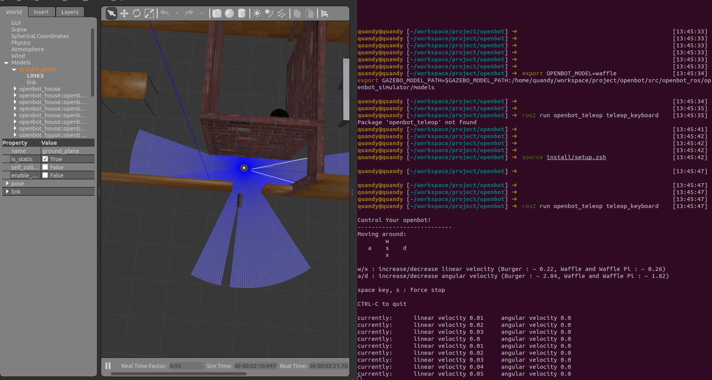

# 03 如何运行

## 1 启动gazebo

* 设置环境变量

```bash
### ROS2 ###
export OPENBOT_ENV=/home/quandy/workspace/project/openbot/ # 根据自己的目录修改
export CYBER_PATH=/usr/local/share/
export GLOG_logtostderr=1
export GLOG_alsologtostderr=0
export GLOG_colorlogtostderr=1
export GLOG_minloglevel=0

export OPENBOT_MODEL=waffle                                                                                          
export GAZEBO_MODEL_PATH=$GAZEBO_MODEL_PATH:/home/quandy/workspace/project/openbot/src/openbot_ros/openbot_simulator/models  # 根据自己的目录修改
```

*  启动opebot_house场景

```bash
 ros2 launch openbot_simulator opebot_house.launch.py
```

> 支持场景如下：
>
> * openbot_house
>
> * openbot_indoor
> * openbot_matterport
> * openbot_tunnel
> * openbot_world

如何运行自定义场景？请参考：TODO

## 2 键盘控制

```bash
cd openbot/docker/scripts
sudo ./install_docker.sh
```

## 3 运行结果


