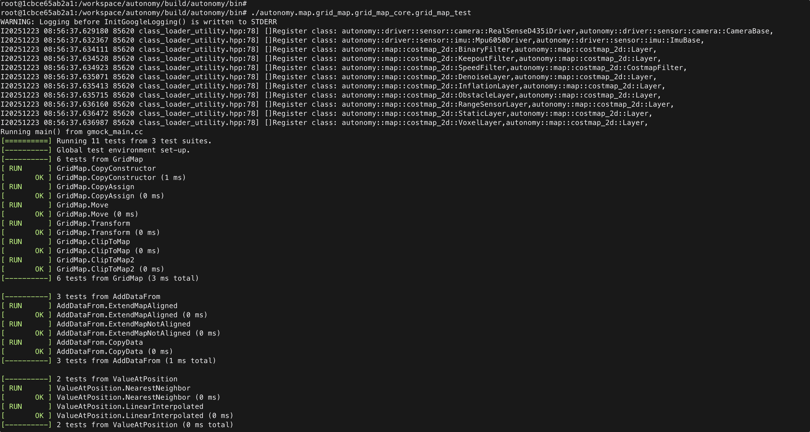

# 运行指南

本指南介绍如何运行 Autonomy 项目，包括 C++ 直接运行和 ROS2 集成运行两种方式。

---

## 1 C++ 直接运行

### 1.1 运行格式

C++ 可执行文件命名格式：`工程名.模块名.组件名.可执行文件名`

```bash
# 示例
./autonomy.map.grid_map.grid_map_core.grid_map_test
```


### 1.2 命令行运行

在编译完成后，进入可执行文件所在目录运行：

```bash
cd /workspace/autonomy/build/autonomy/bin
./autonomy.map.grid_map.grid_map_core.grid_map_test
```



---

## 2 ROS2 集成运行

### 2.1 环境变量配置

在运行 ROS2 节点之前，需要设置必要的环境变量。建议将其添加到 `~/.bashrc` 文件中：

```bash
### Autonomy 环境变量 ###
export GLOG_logtostderr=1           # 日志输出到标准错误
export GLOG_alsologtostderr=0       # 不同时写入日志文件
export GLOG_colorlogtostderr=1      # 启用彩色日志
export GLOG_minloglevel=0           # 最小日志级别 (0=INFO)
export AUTOLINK_PATH=/workspace/autonomy/src/autonomy/autolink/autolink

### Autonomy_ROS 环境变量 ###
export AUTONOMY_MODEL=waffle        # 机器人模型（可选）

### ROS2 环境 ###
source /opt/ros/humble/setup.bash
source /workspace/autonomy/install/setup.bash
```

使配置生效：

```bash
source ~/.bashrc
```

### 2.2 启动 Autonomy_ROS

使用 launch 文件启动 Autonomy_ROS 系统：

```bash
ros2 launch autonomy_ros autonomy.launch.py
```

**Launch 参数说明**:

| 参数 | 默认值 | 说明 |
|------|--------|------|
| `use_sim_time` | `true` | 是否使用仿真时间 |
| `use_gazebo` | `false` | 是否使用 Gazebo 仿真 |
| `world_type` | `house` | 仿真世界类型 (`house` 或 `world`) |
| `x_pose` | `-2.0` | 机器人初始 X 坐标 |
| `y_pose` | `-0.5` | 机器人初始 Y 坐标 |

**示例**:

```bash
# 使用 Gazebo 仿真
ros2 launch autonomy_ros autonomy.launch.py use_gazebo:=true world_type:=house

# 使用假节点（无仿真）
ros2 launch autonomy_ros autonomy.launch.py use_gazebo:=false
```


### 2.3 Gazebo 仿真（可选）

如果需要使用 Gazebo 进行仿真，可以使用以下命令：

```bash
# 空世界仿真
ros2 launch autonomy_gazebo empty_world.launch.py gui:=true spawn_robot:=true

# 房屋环境仿真
ros2 launch autonomy_gazebo autonomy_house.launch.py gui:=true spawn_robot:=true
```

---

## 3 验证运行状态

### 3.1 检查节点

```bash
# 查看所有运行中的节点
ros2 node list

# 查看特定节点信息
ros2 node info /<node_name>
```

### 3.2 查看话题

```bash
# 列出所有话题
ros2 topic list

# 查看话题内容
ros2 topic echo /<topic_name>

# 查看话题信息
ros2 topic info /<topic_name>
```

### 3.3 使用可视化工具

```bash
# 启动 RViz2
rviz2

# 启动 rqt
rqt
```

---

## 4 常见问题

### Q: 提示找不到可执行文件？

**A**: 确保已经完成编译，并且可执行文件路径正确。

```bash
# 检查编译是否成功
ls /workspace/autonomy/install/autonomy/bin/
```

### Q: ROS2 节点无法启动？

**A**: 检查环境变量是否已正确设置：

```bash
echo $GLOG_logtostderr
echo $AUTOLINK_PATH
```

### Q: Gazebo 仿真无法启动？

**A**: 确保已安装 Gazebo 和相关依赖：

```bash
# 检查 Gazebo
which gazebo
gazebo --version
```
