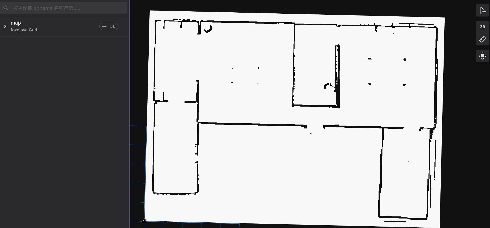

## 1 简介

* topic 通信
* client/service

## 2 使用方式

### 2.1 创建Node

```C++
#include "autonomy/common/cyclonedds/node.hpp"

using Node = ::autonomy::common::cyclonedds::Node;
auto node = std::make_shared<Node>("publisher_and_subscription_node");
```

[说明]

* Node： 类型为::autonomy::common::cyclonedds::Node
* Name: string 类型node名字

### 2.2 创建Publisher

```c++
#include "autonomy/common/cyclonedds/node.hpp"

auto node = std::make_shared<Node>("publisher_and_subscription_node");
auto pub = node->CreatePublisher<commsgs::sensor_msgs::Imu>("/sensor/imu");
// Publish data
commsgs::sensor_msgs::Imu imu;
imu.header.frame_id = "imu_frame";
imu.header.stamp.sec = 1234567890;
imu.header.stamp.nanosec = 123456789;
imu.linear_acceleration = {1.0, 2.0, 3.0};
imu.angular_velocity = {4.0, 5.0, 6.0};
pub->Publish(imu);
```

[说明]

* commsgs::sensor_msgs::Imu: 发布的消息类型
* Publish(): 消息发送

### 2.3 创建Subscription

```C++
auto node = std::make_shared<Node>("publisher_and_subscription_node");
auto sub = node->CreateSubscription<commsgs::sensor_msgs::Imu>("/sensor/imu",
        [](const autonomy::commsgs::sensor_msgs::Imu& msg) {
            LOG(INFO) << "[request] frame_id = " << msg.header.frame_id 
                      << ", angular x = " << msg.angular_velocity.x << ", y = " 
                      << msg.angular_velocity.y << ", z = " << msg.angular_velocity.z
                      << ",  linear x = " << msg.linear_acceleration.x << ", y = " 
                      << msg.linear_acceleration.y << ", z = " << msg.linear_acceleration.z;
        });

```

[说明]

* commsgs::sensor_msgs::Imu: 发布的消息类型
* Callback: 消息处理回调

### 2.4 创建 Client（TODO）

### 2.5 创建Service（TODO）

## 3 使用案列

### 3.1 发布地图并可视化

```C++
map_publisher_ = node_->CreatePublisher<commsgs::map_msgs::OccupancyGrid>("/map");

void Costmap2DWrapper::publishMap()
{
    occupancy_grid_.header.frame_id = global_frame_;
    occupancy_grid_.header.stamp = commsgs::builtin_interfaces::Time::Now();
    map_publisher_->Publish(occupancy_grid_);
    LOG(INFO) << "Publish map.";
}
```

运行结果如下：

```shell
I20251013 05:34:56.937294   748 planner_server.cpp:52] Received map with size: 310 x 221
I20251013 05:34:57.939733   749 costmap_2d_wrapper.cpp:331] Publish map.
I20251013 05:34:57.939965   748 planner_server.cpp:52] Received map with size: 310 x 221
```

可视化如下：



