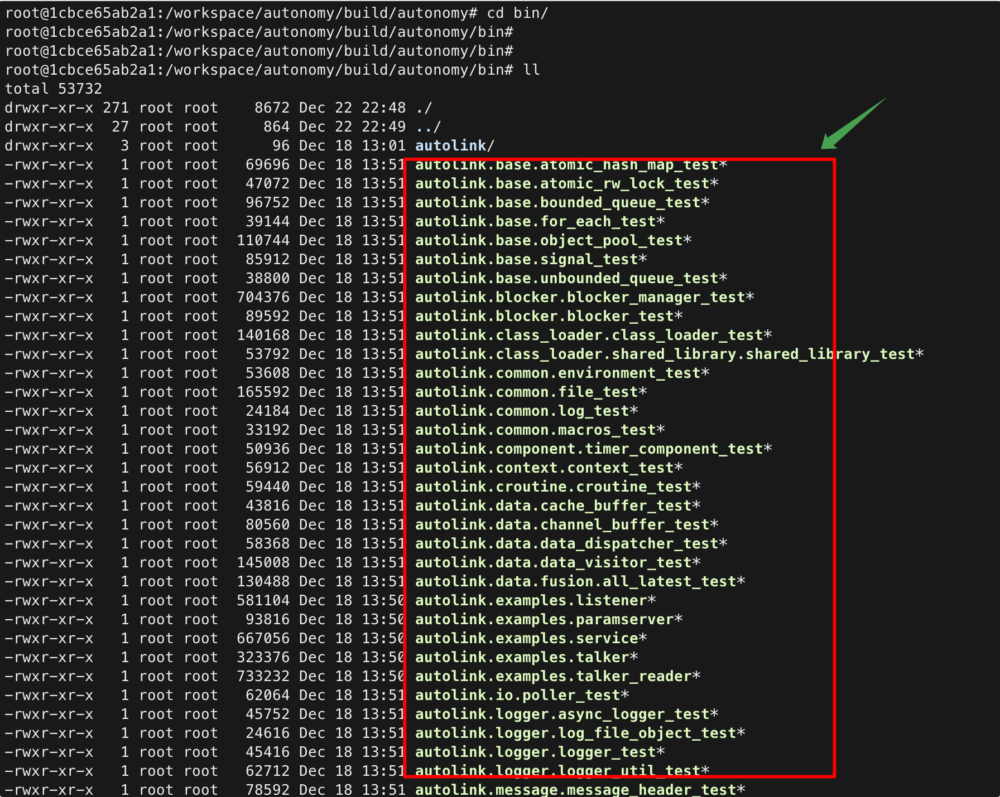
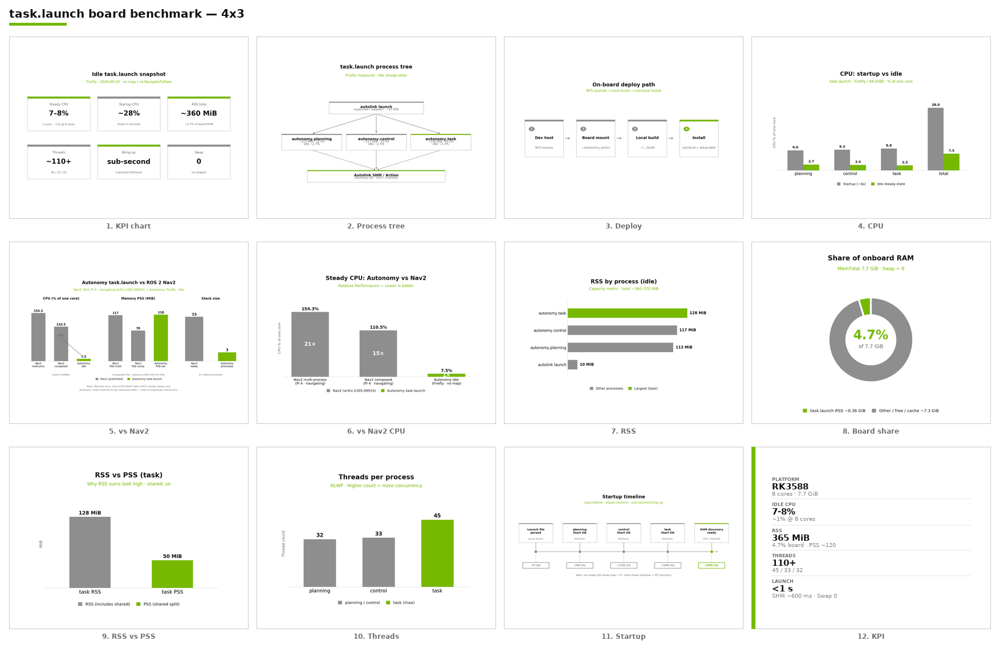

(running-troubleshooting)=
# 8. 故障排查

常见运行问题对照。完整板端资源与对比图见 [§9 板端 task.launch 资源报告](09_board_task_launch_benchmark.md)。



### 8.1 可执行文件

| 现象 | 原因 | 处理 |
|------|------|------|
| 找不到 `autonomy.planning` 等 | 未完整编译 | `ninja -C build`；检查模块 CMake |
| 找不到 `autolink_launch` | PATH 未含 `build/bin` | `export PATH=$PWD/build/bin:$PATH` |
| `libautonomy.so: cannot open` | 库路径未设置 | `export LD_LIBRARY_PATH=build/lib` 或从 `build/bin` 运行 |

### 8.2 导航 / BT

| 现象 | 原因 | 处理 |
|------|------|------|
| `Autonomy not ready` | BT 配置或插件失败 | 检查 `AUTONOMY_BT_PLUGIN_PATH`、`config/navigator/` |
| BT 插件 load 失败 | `.so` 不在搜索路径 | `export AUTONOMY_BT_PLUGIN_PATH=build/lib` |
| `GetPlan failed` | 起终点在障碍上 | 调整坐标；用 `autonomy_planning_test` 预检 |
| `planned path too short` | 起终点重合或不可达 | 增大起终点距离 |
| 超时 | 控制未收敛 | 增大 `--timeout_sec`；检查 controller 配置 |
| `TransformAvailable` 失败 | TF 未发布 | 确认 `global_frame` / `base_frame` 与配置一致 |
| `no robot pose` | 无里程计 | 由仿真 / Bridge 注入 odom+TF；检查 control `Start()` |

### 8.3 Docker


| 现象 | 原因 | 处理 |
|------|------|------|
| 容器内找不到代码 | `AUTONOMY_ENV` 错误 | `export AUTONOMY_ENV=/正确路径` |
| 数据盘不可写 | 未挂载卷 | `--data-volume /mnt/data4t` |
| `docker exec` 失败 | 容器名不对 | `docker ps`；检查 `AUTONOMY_CONTAINER_NAME` |
| GPU 不可用 | 缺 NVIDIA Toolkit | 见 [02 Installation](../02_Installation/08_troubleshooting.md) |

```bash
docker exec -it SpaceHero ls /workspace/autonomy
docker exec -it SpaceHero ls /mnt/data4t
```

### 8.4 ROS 2


| 现象 | 原因 | 处理 |
|------|------|------|
| 节点无法启动 | 未 source | `source /opt/ros/humble/setup.bash` |
| 无话题 | launch 未成功 | 检查 `ros2 launch` 日志 |
| Gazebo 失败 | 未安装 Gazebo | `which gazebo`；见 Simulation 文档 |

```bash
echo $GLOG_logtostderr
echo $AUTOLINK_PATH
ros2 node list
```

### 8.5 配置

| 现象 | 原因 | 处理 |
|------|------|------|
| `Configuration directory empty` | 未传 gflags | `--configuration_directory=config` |
| 帧名不一致 | `common.lua` 未同步 | 统一 `global_frame` / `robot_base_frame` |

### 8.6 板端资源异常（对照）

CPU/内存异常偏高时，先对照空闲基线：



| 现象 | 对照基线 | 处理 |
|------|----------|------|
| 空闲 CPU ≫ 8% 单核 | [§9.1](09_board_task_launch_benchmark.md) 合计 ≈7–8% | 查 map/导航是否在跑；杀残留 `autonomy.*` |
| RSS ≫ 400 MiB | [§9.1](09_board_task_launch_benchmark.md) 合计 ≈360–370 MiB | 查 costmap/地图尺寸/泄漏 |
| 启动很慢 | [§9.2](09_board_task_launch_benchmark.md) 亚秒级 fork/exec | 查磁盘/`setup.bash`/残留进程 |
| 与 Nav2 比异常 | [§9.3](09_board_task_launch_benchmark.md) | 确认工况（空闲 vs 导航中） |

详表与全量宫格：[§9 板端 task.launch 资源报告](09_board_task_launch_benchmark.md)。

### 8.7 相关文档

- [§9 板端资源报告](09_board_task_launch_benchmark.md)
- [02 Installation · 故障排查](../02_Installation/08_troubleshooting.md)
- [16 Navigator · 使用指南](../16_Navigator/00_guide.md)
- [19 FAQs](../19_FAQs/index.rst)
