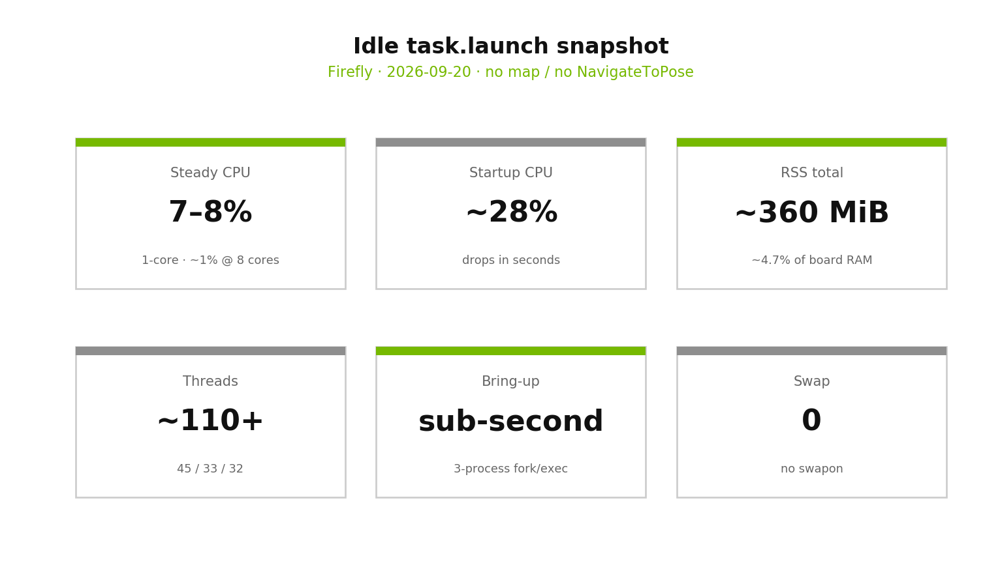
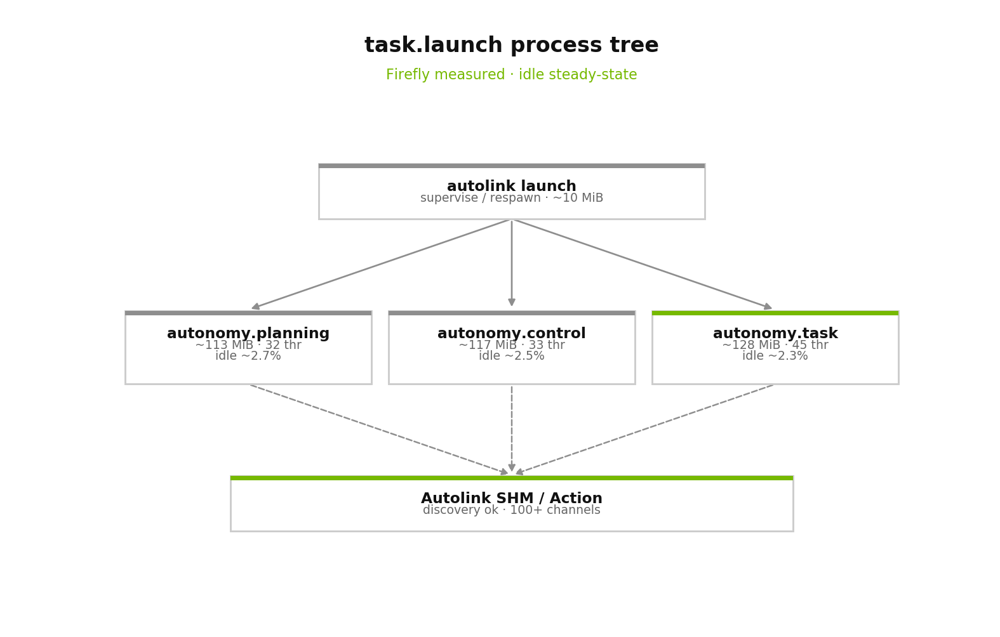
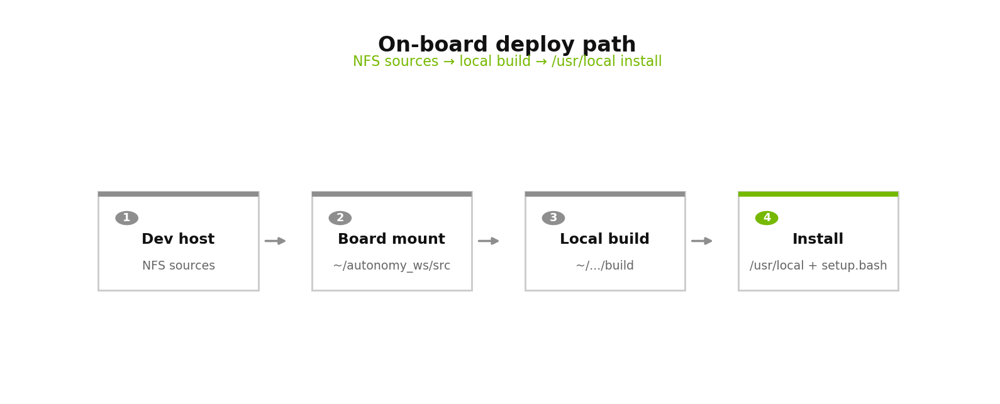
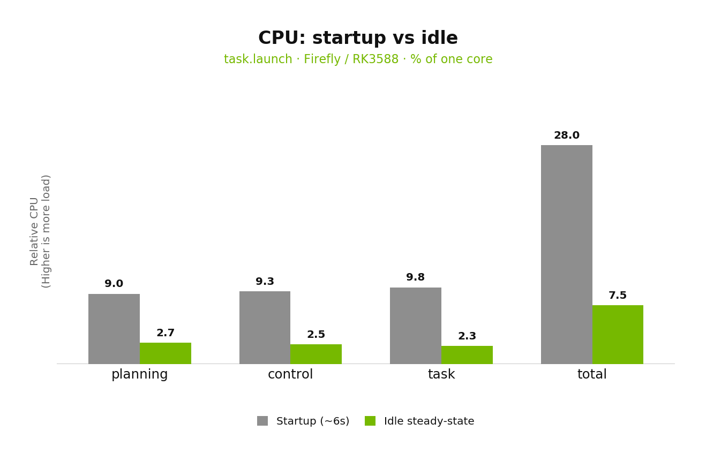
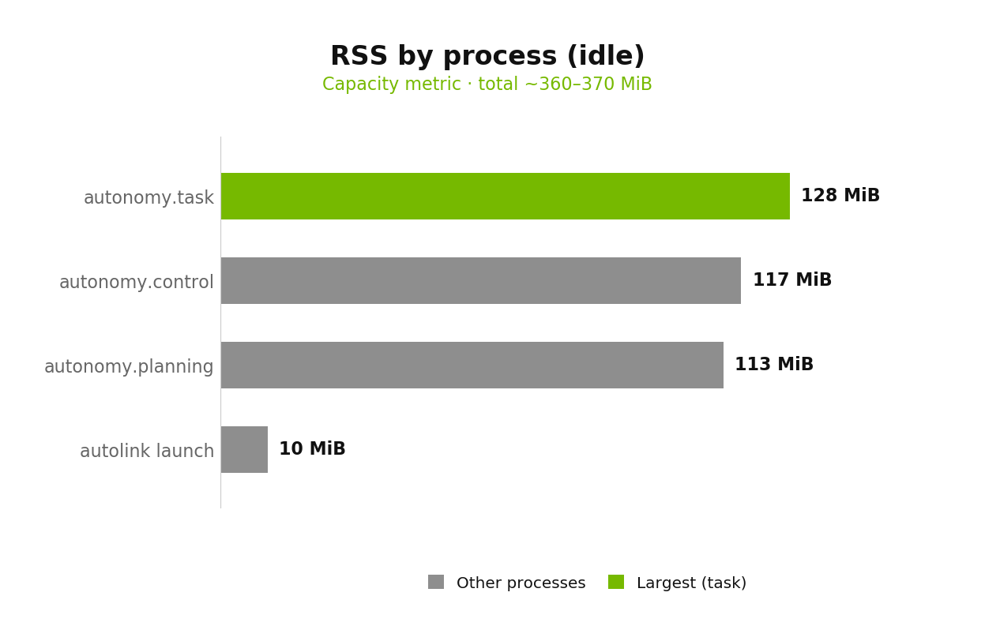
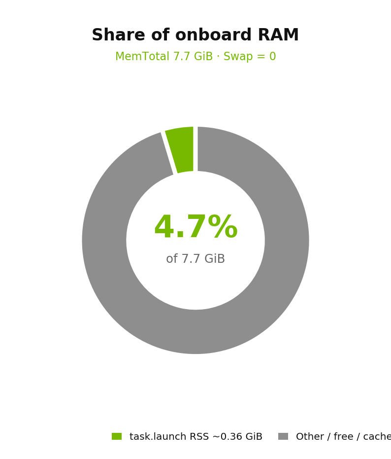
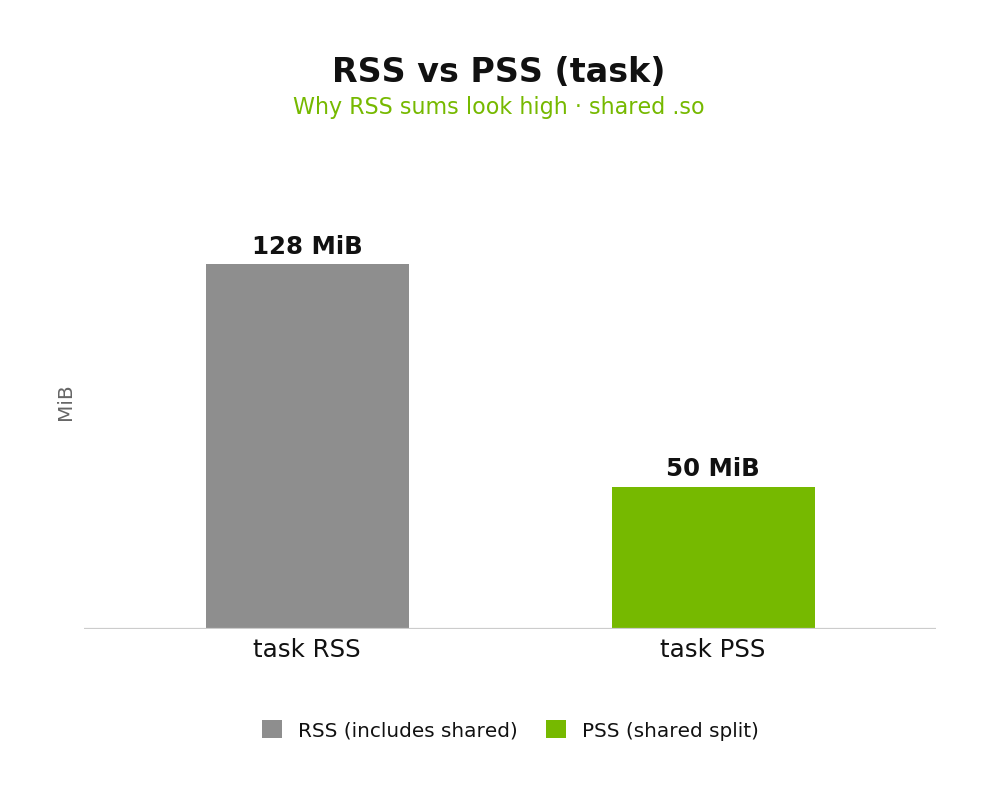
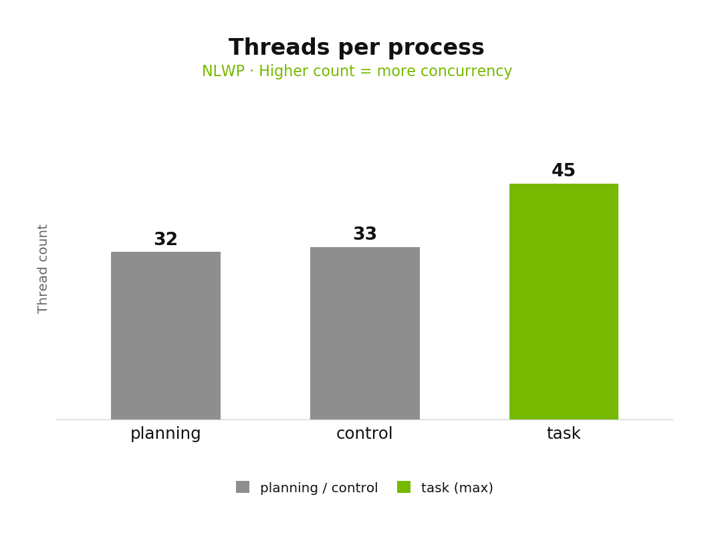
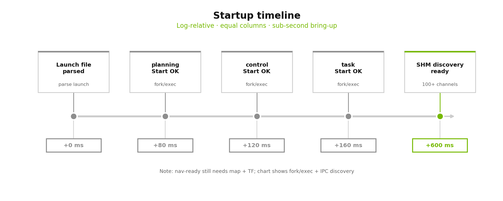

(running-board-task-launch-benchmark)=
# 9. 板端部署资源报告：`task.launch`

Firefly / RK3588（aarch64）上空闲栈实测（**无 map / 无 NavigateToPose**）。

```bash
source /usr/local/share/autonomy/setup.bash
autolink launch start task.launch
```

> **2026-09-20** · Autonomy `feature/library` · 前缀 `/usr/local`  
> 有 map + 导航时 CPU / 延时会升高，按 §9.6 复测。

```{admonition} 结论
:class: tip

空闲三进程合计约 **7–8% 单核 CPU**、**360–370 MiB RSS**（≈ 板载 7.7 GiB 的 **4.5–5%**），拉起 **亚秒级**；**无 Swap**，勿与大 `-j` 编译抢内存。
```



---

## 9.1 被测对象



| 模块 | 二进制 | 作用 |
|------|--------|------|
| planning | `autonomy.planning` | 全局规划 |
| control | `autonomy.control` | 局部跟踪 |
| task | `autonomy.task` | TaskServer + BT |
| 父进程 | `autolink launch` | 拉起 / 监督 / respawn |

部署路径：NFS 源码 → 板端本地 `build` → `cmake --install` 到 `/usr/local` → `source setup.bash`。



---

## 9.2 硬件与测量

| 项 | 值 |
|----|-----|
| 主机 | `firefly` · RK3588 · 8 逻辑核 · `aarch64` |
| 内核 / OS | `5.10.160-rt78-preempt` · Ubuntu 22.04 |
| 内存 | ≈ **7.7 GiB** · **Swap = 0** |
| CPU 含义 | 进程 **单核 %**（与 `top` 一致；8 核上 100% ≈ 1 核） |

| 指标 | 方法 |
|------|------|
| 瞬时 CPU / RSS | `ps -eo pid,%cpu,%mem,rss,vsz,nlwp,etime,cmd` |
| 稳态 CPU | `/proc/<pid>/stat`：`utime+stime` 在 **10 s** 窗口差分 |
| RSS / HWM / PSS | `status` → `VmRSS`/`VmHWM`；`smaps_rollup` → `Pss` |
| 启动时序 | `autolink` 日志时间戳 |

```bash
source /usr/local/share/autonomy/setup.bash
autolink launch start task.launch
ps -eo pid,%cpu,%mem,rss,vsz,nlwp,etime,cmd | \
  grep -E 'autonomy\.(task|planning|control)|autolink launch'
autolink launch stop
```

---

## 9.3 CPU



灰 = 启动约 6 s；绿 = 空闲稳态。合计约 **28% → 7.5%**（约 **3.7×** 回落）。

| 进程 | 启动 ~6 s | 空闲稳态 |
|------|----------|----------|
| `autonomy.task` | ≈ 9.8% | ≈ 2.2–2.4% |
| `autonomy.control` | ≈ 9.3% | ≈ 2.5% |
| `autonomy.planning` | ≈ 9.0% | ≈ 2.5–2.8% |
| **合计** | ≈ **28%** 单核 | ≈ **7–8%** 单核 |

空闲约 **0.08 核**，余量充足；有 map + `NavigateToPose` 时 planning / control 会升至数十 % 单核。整机 load 含厂商后台，勿只看 autonomy。

---

## 9.4 内存与线程





| 进程 | RSS | HWM | 线程 |
|------|-----|-----|------|
| `autonomy.task` | ≈ 124–128 MiB | ≈ 128 MiB | **45** |
| `autonomy.control` | ≈ 114–117 MiB | ≈ 117 MiB | **33** |
| `autonomy.planning` | ≈ 111–113 MiB | ≈ 113 MiB | **32** |
| `autolink launch` | ≈ 10–11 MiB | ≈ 11 MiB | 1 |
| **合计** | ≈ **360–370 MiB** | — | ≈ **110+** |



RSS 加总偏悲观（共享 `.so` 重复计），作 OOM 余量；PSS 更接近真实增量（`task` PSS ≈ 42–66 MiB）。



安装体积量级：`libautonomy_task.so` ≈ 25 MiB，`libautolink.so` ≈ 10 MiB；`ldd autonomy.task` 依赖 **260+**，需 `setup.bash` 含 `/usr/local/lib` 与 ROS lib。无 Swap：编译用 `-j1/-j2`。

---

## 9.5 启动时序



| 相对时间 | 事件 |
|----------|------|
| +0 ms | 解析 launch |
| ~80 / 120 / 160 ms | planning / control / task Start OK |
| ~600 ms | SHM discovery（百余 channel） |

进程拉起 **亚秒级**；导航就绪仍需 map + TF。无 map 时的 `no map received` 是 costmap 告警，不是 launch 卡顿，此时勿测规划/控制延时。

有图后建议补测：Goal→首条 path、控制周期、BT tick。

---

## 9.6 复测清单

1. `source setup.bash` → `autolink launch start task.launch`，等 ≥ 30 s  
2. 记录 `ps` / `smaps_rollup` / 10 s CPU  
3. 加载 map + TF，再采 60 s；下发 `NavigateToPose`，记峰值与 goal→path  
4. `autolink launch stop`，确认无残留 `autonomy.*`（勿 `pkill -f` 误杀 shell）

---

## 9.7 相关文档

- [§2 快速运行](02_quickstart.md) · [§3 多进程栈](03_autonomy_process.md)
- [环境 / setup.bash](../02_Installation/07_environment.md) · [板端构建安装](../02_Installation/09_embedded_board.md)
