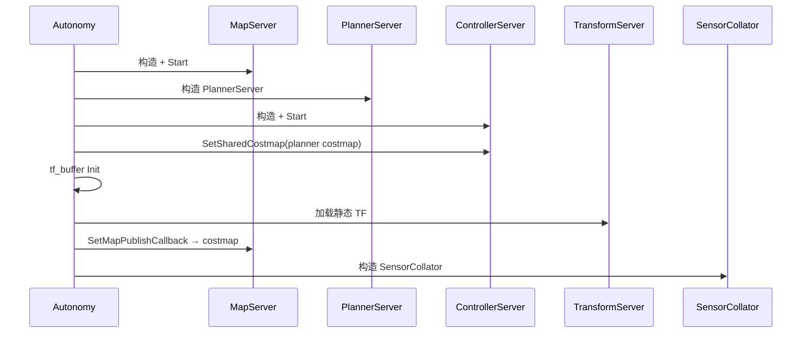

# 3. 框架架构

本文描述 `libautonomy` 应用框架的逻辑分层、启动顺序与数据流。

## 3.1 设计目标

1. **统一入口**：`system::Autonomy` 构造并调度各 Server
2. **配置集中**：单一 `autonomy.lua` 聚合子系统
3. **松耦合通信**：Server 间通过接口 + commsgs 交互，跨进程经 Autolink
4. **插件扩展**：算法实现与 Server 调度分离

## 3.2 分层架构

<div class="plan-arch-diagram">

  <div class="plan-arch-layer plan-arch-app">
    <div class="plan-arch-header">
      <span class="plan-arch-badge">API 层</span>
      <span class="plan-arch-title">system::Autonomy</span>
      <span class="plan-arch-sub">NavigateToPose · ReplanToGoal · 监听器</span>
    </div>
    <div class="plan-arch-body">
      <div class="nav-chip-list">
        <span class="nav-chip">CreateAutonomy</span>
        <span class="nav-chip">Start / Configure / Shutdown</span>
      </div>
    </div>
  </div>

  <div class="plan-arch-pipe"><span>持有与调度</span></div>

  <div class="plan-arch-layer plan-arch-server">
    <div class="plan-arch-header">
      <span class="plan-arch-badge">Server 层</span>
      <span class="plan-arch-title">Map · Planner · Controller · Transform</span>
    </div>
    <div class="plan-arch-body plan-arch-body-cols">
      <div class="nav-body-block">
        <div class="nav-body-label">Server</div>
        <div class="nav-chip-list">
          <span class="nav-chip">MapServer</span>
          <span class="nav-chip">PlannerServer</span>
          <span class="nav-chip">ControllerServer</span>
          <span class="nav-chip">TransformServer</span>
        </div>
      </div>
      <div class="nav-body-block">
        <div class="nav-body-label">编排</div>
        <div class="nav-chip-list">
          <span class="nav-chip">navigator / BT</span>
          <span class="nav-chip">SensorCollator</span>
        </div>
      </div>
    </div>
  </div>

  <div class="plan-arch-pipe"><span>插件接口</span></div>

  <div class="plan-arch-layer plan-arch-plugin">
    <div class="plan-arch-header">
      <span class="plan-arch-badge">插件层</span>
      <span class="plan-arch-title">GlobalPlanner · Controller · BT Nodes</span>
    </div>
    <div class="plan-arch-body">
      <div class="nav-chip-list">
        <span class="nav-chip">PluginManager</span>
        <span class="nav-chip">.so 动态库</span>
        <span class="nav-chip">进程内注册</span>
      </div>
    </div>
  </div>

  <div class="plan-arch-pipe"><span>commsgs + autolink</span></div>

  <div class="plan-arch-layer plan-arch-post">
    <div class="plan-arch-header">
      <span class="plan-arch-badge">基础层</span>
      <span class="plan-arch-title">commsgs · autolink · common</span>
    </div>
  </div>

</div>

## 3.3 启动顺序（`Autonomy::Start`）



`Configure()` 在 `Start()` 之后调用，加载 `navigator_options` 并设置 `use_bt_navigation` 等运行时覆盖。

## 3.4 导航数据流

```
NavigateToPose(goal)
    → [BT] ComputePathToPose → PlannerServer::GetPlan
    → [BT] FollowPath → ControllerServer
    → cmd_vel → 底盘 / 仿真

直驱模式：
    → GetPlan → NotifyPath（不自动 FollowPath）
```

## 3.5 线程模型

| 组件 | 线程策略 |
|------|----------|
| `Autonomy` 主循环 | 单线程 sleep 轮询（main.cpp） |
| MapServer | 地图加载线程（若启用） |
| Costmap 更新 | 独立更新线程 + mutex |
| Autolink 回调 | 调度器协程 / 线程池 |
| BT tick | 单线程 `tickOnce` 循环 |

## 3.6 与 Autolink 的边界

- **Framework**：决定创建哪些 Server、如何传 `*Options`
- **Server 内部**：创建 `autolink::Node`，注册 Writer/Reader/Action
- **应用开发者**：通常调用 `Autonomy` API，而非直接操作 Node

通信细节见 [03 Communication §1.8](../03_Communication/01_architecture.md#18-autonomy-集成)。

## 3.7 相关文档

- [§5 模块 Server](05_module_servers.md)
- [§6 插件系统](06_plugin_system.md)
