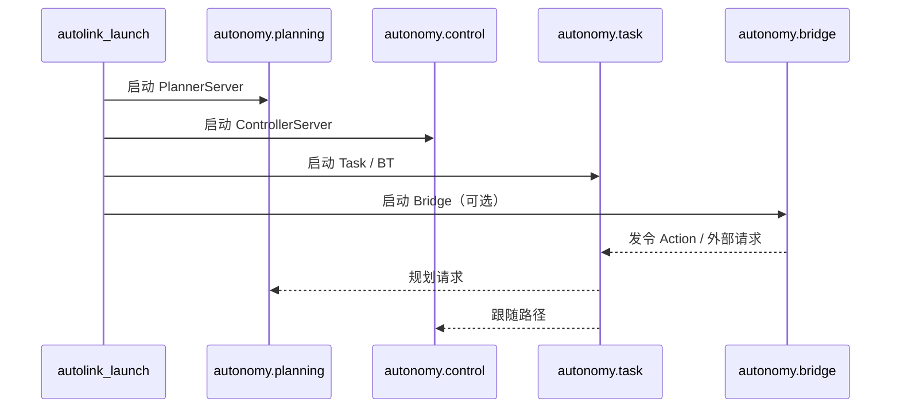

# 3. 框架架构

本文描述 `libautonomy` 应用框架的逻辑分层、多进程启动与数据流。

## 3.1 设计目标

1. **多进程入口**：各 `*_main` 构造并运行对应 Server（planning / control / task …）
2. **配置可共享**：`CreateOptions` 加载 `AutonomyOptions` 快照；模块也可只用本地 conf
3. **松耦合通信**：Server 间通过接口 + commsgs 交互，跨进程经 Autolink
4. **插件扩展**：算法实现与 Server 调度分离

## 3.2 分层架构

<div class="plan-arch-diagram">

  <div class="plan-arch-layer plan-arch-app">
    <div class="plan-arch-header">
      <span class="plan-arch-badge">进程层</span>
      <span class="plan-arch-title">autolink_launch · autonomy.launch</span>
      <span class="plan-arch-sub">planning · control · task · bridge · …</span>
    </div>
    <div class="plan-arch-body">
      <div class="nav-chip-list">
        <span class="nav-chip">CreateOptions</span>
        <span class="nav-chip">*_main → Server</span>
      </div>
    </div>
  </div>

  <div class="plan-arch-pipe"><span>构造与运行</span></div>

  <div class="plan-arch-layer plan-arch-server">
    <div class="plan-arch-header">
      <span class="plan-arch-badge">Server 层</span>
      <span class="plan-arch-title">Map · Planner · Controller · Transform · Task</span>
    </div>
    <div class="plan-arch-body plan-arch-body-cols">
      <div class="nav-body-block">
        <div class="nav-body-label">Server</div>
        <div class="nav-chip-list">
          <span class="nav-chip">MapServer</span>
          <span class="nav-chip">PlannerServer</span>
          <span class="nav-chip">ControllerServer</span>
          <span class="nav-chip">TransformServer</span>
        </div>
      </div>
      <div class="nav-body-block">
        <div class="nav-body-label">编排</div>
        <div class="nav-chip-list">
          <span class="nav-chip">task / BT</span>
          <span class="nav-chip">SensorCollator</span>
        </div>
      </div>
    </div>
  </div>

  <div class="plan-arch-pipe"><span>插件接口</span></div>

  <div class="plan-arch-layer plan-arch-plugin">
    <div class="plan-arch-header">
      <span class="plan-arch-badge">插件层</span>
      <span class="plan-arch-title">GlobalPlanner · Controller · BT Nodes</span>
    </div>
    <div class="plan-arch-body">
      <div class="nav-chip-list">
        <span class="nav-chip">PluginManager</span>
        <span class="nav-chip">.so 动态库</span>
        <span class="nav-chip">进程内注册</span>
      </div>
    </div>
  </div>

  <div class="plan-arch-pipe"><span>commsgs + autolink</span></div>

  <div class="plan-arch-layer plan-arch-post">
    <div class="plan-arch-header">
      <span class="plan-arch-badge">基础层</span>
      <span class="plan-arch-title">commsgs · autolink · common</span>
    </div>
  </div>

</div>

## 3.3 启动顺序（多进程）



各进程独立 `CreateOptions` / 本地 conf，**不是**进程内一次装配整栈。见 [04 Running · 多进程栈](../04_Running/03_autonomy_process.md)。

## 3.4 导航数据流

```
Bridge / Action Client → autonomy.task
    → ComputePathToPose → autonomy.planning (PlannerServer)
    → FollowPath → autonomy.control (ControllerServer)
    → cmd_vel → 底盘 / 仿真
```

## 3.5 线程模型

| 组件 | 线程策略 |
|------|----------|
| 各 `*_main` | 主线程 + `WaitForShutdown` |
| MapServer | 地图加载线程（若启用） |
| Costmap 更新 | 独立更新线程 + mutex |
| Autolink 回调 | 调度器协程 / 线程池 |
| BT tick | task 进程内 `tickOnce` 循环 |

## 3.6 与 Autolink 的边界

- **Framework**：决定各进程创建哪些 Server、如何传 `*Options`
- **Server 内部**：创建 `autolink::Node`，注册 Writer/Reader/Action
- **应用开发者**：通常通过 launch + Bridge / Action，而非进程内聚合 API

通信细节见 [Communication · §1.8 Autonomy 集成](../03_Communication/01_architecture.md#18-autonomy-集成)。

## 3.7 相关文档

- [§5 模块 Server](05_module_servers.md)
- [§6 插件系统](06_plugin_system.md)
