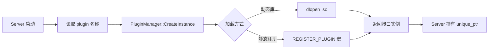

# 6. 插件系统

Autonomy 通过 **PluginManager** 在运行时加载算法实现，与 Server 调度层解耦。

### 6.1 设计原则

1. **接口稳定**：Server 依赖抽象接口（`GlobalPlanner`、`Controller` 等）
2. **配置驱动**：`planner.lua` / `controller.lua` 指定 `plugin` 名称
3. **动态库**：`.so` 通过 `dlopen` 加载，或进程内静态注册

### 6.2 插件类型

| 类型 | 接口 | 配置位置 | 示例 |
|------|------|----------|------|
| 全局规划器 | `planning::GlobalPlanner` | `planner.lua` | `navfn_planner`, `theta_star_planner` |
| 局部控制器 | `control::Controller` | `controller.lua` | `regulated_pure_pursuit` |
| BT 节点 | `BT::TreeNode` | `navigator.lua` | `ComputePathToPose` |
| Costmap 层 | `costmap::Layer` | `map.lua` | `static_layer`, `obstacle_layer` |

### 6.3 PluginManager 流程



### 6.4 规划器插件示例

`config/planner/planner.lua`：

```lua
AUTONOMY_PLANNER = {
  planner_plugins = {"navfn_planner", "theta_star_planner"},
  default_planner = "navfn_planner",
  navfn_planner = { plugin = "navfn_planner/NavfnPlanner", ... },
}
```

`PlannerServer` 构造时：

```cpp
for (const auto& name : options.planner_plugins()) {
    planners_[name] = plugin_manager_.CreateInstance<GlobalPlanner>(
        options.GetPlugin(name));
}
```

### 6.5 控制器插件

与规划器类似，`ControllerServer` 按 `controller_plugins` 列表实例化，默认 ID 由 `default_controller_id` 指定。

### 6.6 开发新插件

1. 实现对应接口（如 `GlobalPlanner::createPlan`）
2. 使用 `PLUGINLIB_EXPORT_CLASS` 或项目内 `REGISTER_PLUGIN` 宏导出
3. 在 CMake 中编译为 `.so` 并安装到 `lib/autonomy/plugins/`
4. 在 Lua 配置中注册 `plugin` 路径与参数

详见各模块文档：

- [08 Planning · 插件架构](../08_Planning/01_architecture.md#14-插件与配置)
- [09 Control · 控制器算法](../09_Control/05_controller_algorithms.md)

### 6.7 相关文档

- [§5 模块 Server](05_module_servers.md)
- [§4 配置管线](04_configuration.md)
