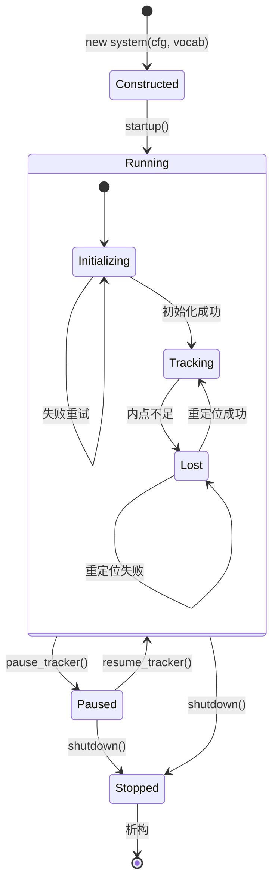
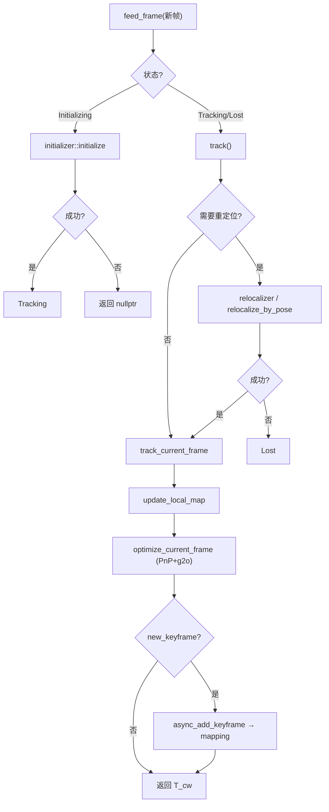
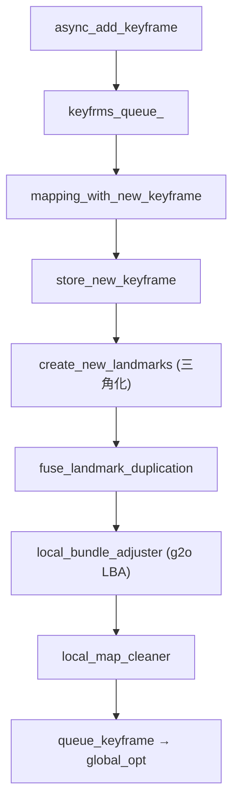
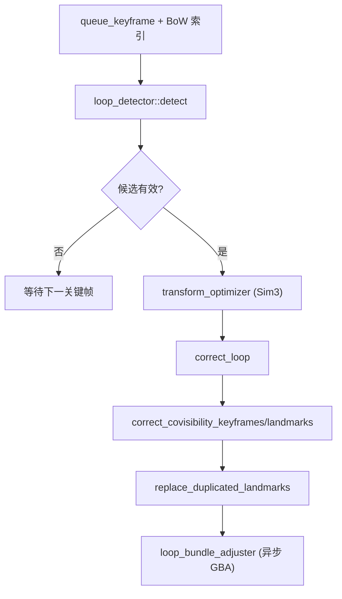

# 5. Localization 模块架构设计

本文描述 `autonomy/localization` 的逻辑架构、Atlas 三线程数据流与核心组件关系。

## 5.1 设计目标

Localization 模块遵循以下设计原则：

1. **多算法可扩展**：Atlas（视觉 SLAM）已实现；AMCL、Cartographer 配置预留，便于插件化接入
2. **经典 SLAM 架构**：Tracking / Mapping / Global Optimization 三线程解耦，跟踪低延迟
3. **多传感器支持**：单目、双目、RGB-D 统一 `system::feed_*` 接口
4. **g2o 统一后端**：位姿优化、LBA、GBA、Sim3 均基于 g2o 图优化
5. **地图持久化**：msgpack / SQLite3 双格式，支持纯定位模式

## 5.2 模块总览

<div class="plan-arch-diagram">

  <div class="plan-arch-layer plan-arch-app">
    <div class="plan-arch-header">
      <span class="plan-arch-badge">应用层</span>
      <span class="plan-arch-title">Navigator / Driver / 可视化</span>
      <span class="plan-arch-sub">外部调用方，不隶属于 localization 包</span>
    </div>
    <div class="plan-arch-body">
      <div class="nav-body-block">
        <div class="nav-body-label">对外接口</div>
        <div class="nav-chip-list">
          <span class="nav-chip">feed_*_frame</span>
          <span class="nav-chip">relocalize_by_pose</span>
          <span class="nav-chip">save/load_map_database</span>
        </div>
      </div>
    </div>
  </div>

  <div class="plan-arch-pipe"><span>图像 / 深度帧</span></div>

  <div class="plan-arch-layer plan-arch-server">
    <div class="plan-arch-header">
      <span class="plan-arch-badge">系统层</span>
      <span class="plan-arch-title">atlas::system</span>
      <span class="plan-arch-sub">SLAM 系统唯一入口 · 生命周期与 I/O 管理</span>
    </div>
    <div class="plan-arch-body plan-arch-body-cols">
      <div class="nav-body-block">
        <div class="nav-body-label">核心职责</div>
        <ul>
          <li>ORB 特征提取（左/右/初始化三套 extractor）</li>
          <li>三模块线程调度与 pause/reset/terminate</li>
          <li>地图与轨迹持久化（msgpack / sqlite3）</li>
          <li>frame_publisher / map_publisher 可视化</li>
        </ul>
      </div>
      <div class="nav-body-block">
        <div class="nav-body-label">共享数据</div>
        <div class="nav-chip-list">
          <span class="nav-chip">map_database</span>
          <span class="nav-chip">bow_database</span>
          <span class="nav-chip">camera_database</span>
        </div>
      </div>
    </div>
  </div>

  <div class="plan-arch-pipe"><span>逐帧调度</span></div>

  <div class="plan-arch-split">
    <div class="plan-arch-layer plan-arch-plugin">
      <div class="plan-arch-header">
        <span class="plan-arch-badge">前端</span>
        <span class="plan-arch-title">tracking_module</span>
      </div>
      <div class="plan-arch-body">
        <div class="nav-body-block">
          <div class="nav-body-label">子模块</div>
          <div class="nav-chip-list">
            <span class="nav-chip">initializer</span>
            <span class="nav-chip">frame_tracker</span>
            <span class="nav-chip">relocalizer</span>
            <span class="nav-chip">keyframe_inserter</span>
          </div>
        </div>
        <div class="nav-body-block">
          <div class="nav-body-label">输出</div>
          <div class="nav-chip-list">
            <span class="nav-chip">T_cw 实时位姿</span>
            <span class="nav-chip">关键帧队列</span>
          </div>
        </div>
      </div>
    </div>

    <div class="plan-arch-link">
      <span class="plan-arch-link-arrow">◄</span>
      <span class="plan-arch-link-text">读写<br/>map_db</span>
      <span class="plan-arch-link-arrow">►</span>
    </div>

    <div class="plan-arch-layer plan-arch-map">
      <div class="plan-arch-header">
        <span class="plan-arch-badge">数据层</span>
        <span class="plan-arch-title">data::map_database</span>
      </div>
      <div class="plan-arch-body">
        <div class="nav-body-block">
          <div class="nav-body-label">实体</div>
          <div class="nav-chip-list">
            <span class="nav-chip">keyframe</span>
            <span class="nav-chip">landmark</span>
            <span class="nav-chip">frame</span>
          </div>
        </div>
        <div class="nav-body-block">
          <div class="nav-body-label">图结构</div>
          <div class="nav-chip-list">
            <span class="nav-chip">共视图</span>
            <span class="nav-chip">spanning tree</span>
          </div>
        </div>
      </div>
    </div>
  </div>

  <div class="plan-arch-pipe"><span>关键帧异步队列</span></div>

  <div class="plan-arch-split">
    <div class="plan-arch-layer plan-arch-post">
      <div class="plan-arch-header">
        <span class="plan-arch-badge">建图层</span>
        <span class="plan-arch-title">mapping_module</span>
        <span class="plan-arch-sub">独立 mapping_thread_</span>
      </div>
      <div class="plan-arch-body">
        <div class="nav-body-block">
          <div class="nav-body-label">流程</div>
          <div class="nav-chip-list">
            <span class="nav-chip">三角化</span>
            <span class="nav-chip">路标融合</span>
            <span class="nav-chip">Local BA</span>
            <span class="nav-chip">local_map_cleaner</span>
          </div>
        </div>
      </div>
    </div>

    <div class="plan-arch-link">
      <span class="plan-arch-link-arrow">◄</span>
      <span class="plan-arch-link-text">BoW<br/>索引</span>
      <span class="plan-arch-link-arrow">►</span>
    </div>

    <div class="plan-arch-layer plan-arch-post">
      <div class="plan-arch-header">
        <span class="plan-arch-badge">全局层</span>
        <span class="plan-arch-title">global_optimization_module</span>
        <span class="plan-arch-sub">独立 global_optimization_thread_</span>
      </div>
      <div class="plan-arch-body">
        <div class="nav-body-block">
          <div class="nav-body-label">流程</div>
          <div class="nav-chip-list">
            <span class="nav-chip">loop_detector</span>
            <span class="nav-chip">Sim3 校正</span>
            <span class="nav-chip">Loop BA</span>
          </div>
        </div>
      </div>
    </div>
  </div>

  <div class="plan-arch-pipe plan-arch-pipe-out"><span>输出：位姿 · 稀疏地图 · TF（桥接）</span></div>

</div>

---

## 5.3 Atlas 三线程架构

### 5.3.1 线程模型

```
┌─────────────────────────────────────────────────────────────┐
│  主线程（调用 feed_*_frame）                                  │
│  ┌─────────────────────────────────────────────────────┐    │
│  │ tracking_module::feed_frame                          │    │
│  │  ORB 提取 → 初始化/跟踪 → PnP → 位姿优化 → 关键帧决策  │    │
│  └─────────────────────────────────────────────────────┘    │
└───────────────────────────┬─────────────────────────────────┘
                            │ async_add_keyframe
              ┌─────────────▼─────────────┐
              │   mapping_thread_         │
              │   mapping_module::run     │
              │   三角化 → LBA → 清理      │
              └─────────────┬─────────────┘
                            │ queue_keyframe (BoW)
              ┌─────────────▼─────────────────────┐
              │   global_optimization_thread_    │
              │   global_optimization_module     │
              │   回环检测 → Sim3 → Loop BA      │
              └──────────────────────────────────┘
```

| 线程 | 同步机制 | 可中断 |
|------|----------|--------|
| Tracking | 同步返回位姿 | `pause_tracker` |
| Mapping | `keyfrms_queue_` + mutex | `abort_local_BA` |
| Global Opt | `keyfrms_queue_` + mutex | `abort_loop_BA` |

### 5.3.2 生命周期状态机



---

## 5.4 Tracking 模块数据流



### 5.4.1 子模块职责

| 子模块 | 文件 | 职责 |
|--------|------|------|
| `initializer` | `module/initializer.*` | 两帧 SfM 初始化 |
| `frame_tracker` | `module/frame_tracker.*` | 帧间特征匹配 |
| `relocalizer` | `module/relocalizer.*` | BoW 检索 + PnP 重定位 |
| `keyframe_inserter` | `module/keyframe_inserter.*` | 关键帧插入策略 |

---

## 5.5 Mapping 模块数据流



**队列背压**：`queue_threshold_ = 2`，队列过长时跳过 LBA（`is_skipping_localBA`）以保证实时性。

---

## 5.6 Global Optimization 模块



---

## 5.7 核心类关系

```
system
├── config_                    # YAML 配置
├── camera_                    # camera::base*
├── map_db_                    # data::map_database
├── bow_vocab_ / bow_db_       # BoW 词袋与索引
├── tracker_                   # tracking_module
├── mapper_                    # mapping_module (+ thread)
├── global_optimizer_          # global_optimization_module (+ thread)
├── extractor_left/right/ini   # feature::orb_extractor
├── frame_publisher_           # 可视化
├── map_publisher_               # 可视化
└── map_database_io_           # io::map_database_io_*

tracking_module
├── initializer_               # module::initializer
├── frame_tracker_             # module::frame_tracker
├── relocalizer_               # module::relocalizer
├── keyfrm_inserter_           # module::keyframe_inserter
└── pose_optimizer_            # optimize::pose_optimizer (g2o)

mapping_module
├── local_bundle_adjuster_     # optimize::local_bundle_adjuster
└── local_map_cleaner_         # module::local_map_cleaner

global_optimization_module
├── loop_detector_             # module::loop_detector
├── loop_bundle_adjuster_      # module::loop_bundle_adjuster
└── graph_optimizer_           # optimize::graph_optimizer
```

---

## 5.8 求解与优化层

| 目录 | 算法 | 用途 |
|------|------|------|
| `solve/pnp_solver` | EPnP + RANSAC | 跟踪 / 重定位位姿 |
| `solve/essential_solver` | 5pt / 8pt + RANSAC | 初始化 |
| `solve/homography_solver` | DLT + RANSAC | 平面初始化 |
| `solve/fundamental_solver` | 8pt | 基础矩阵 |
| `optimize/pose_optimizer_g2o` | g2o SE3 | 单帧位姿优化 |
| `optimize/local_bundle_adjuster_g2o` | g2o BA | 局部窗口优化 |
| `optimize/global_bundle_adjuster` | g2o BA | 全局优化 |
| `optimize/transform_optimizer` | g2o Sim3 | 回环 Sim3 估计 |

---

## 5.9 匹配策略

| 匹配器 | 文件 | 场景 |
|--------|------|------|
| `match/projection` | 投影搜索 | 跟踪局部地图 |
| `match/stereo` | 立体匹配 | 双目/RGB-D 深度 |
| `match/bow_tree` | BoW 加速 | 重定位 / 回环 |
| `match/robust` | 鲁棒匹配 | 重定位请求 |
| `match/fuse` | 路标融合 | 建图去重 |
| `match/area` | 区域匹配 | 大基线匹配 |

---

## 5.10 Cartographer 架构

Cartographer 已集成于 `localization` 二进制，入口 `RunCartographerNode()`。

```
localization_main (--localization_mode=cartographer)
        │
        ▼
CartographerNode (autolink node)
├── MapBuilderBridge          ← cartographer::mapping::MapBuilder
│   ├── LocalTrajectoryBuilder2D/3D   ← 扫描匹配 + 子图
│   └── PoseGraph2D/3D                ← 回环 + 全局优化
├── SensorBridge              ← commsgs → Cartographer 传感器
├── TfBridge                  ← transform::Buffer 查询外参
├── 定时器
│   ├── PublishSubmapList
│   ├── PublishLocalTrajectoryData  → tracked_pose + TF
│   ├── PublishOccupancyGrid        → /map
│   └── SaveMapImage                → data/map.pgm
└── 服务: submap_query / start_trajectory / finish_trajectory / write_state
```

| 组件 | 文件 | 职责 |
|------|------|------|
| `CartographerNode` | `node/cartographer_node.*` | autolink 订阅/发布/服务 |
| `MapBuilderBridge` | `node/map_builder_bridge.*` | 封装 MapBuilder API |
| `SensorBridge` | `node/sensor_bridge.*` | LaserScan/Imu/Odom 转换 |
| `OccupancyGridNode` | `node/occupancy_grid_node.*` | 独立栅格发布 |

配置加载：`LoadOptions(dir, basename)` → Lua 解析 → Protobuf `MapBuilderOptions`。

静态 TF：自动加载 `<basename>_static_transform.yaml`（如 `backpack_2d_static_transform.yaml`）。

---

## 5.11 未来扩展：AMCL 接入点

```
config/localization/localization.lua
        │
        ├── default_algorithm = "amcl"         → [待实现] AmclServer
        ├── localization --localization_mode=cartographer  → 已实现
        └── localization --localization_mode=atlas         → 已实现
```

建议统一 `LocalizationInterface`（`Start` / `Stop` / `GetPose` / `FeedScan` / `FeedImage`），与 `MapInterface` 风格对齐。

---

## 5.12 线程安全与中断

| 操作 | 机制 |
|------|------|
| 地图读写 | `map_database` 内部 mutex |
| 暂停 | 各模块 `async_pause` + promise/future |
| 重置 | `request_reset` → 三模块 `reset` |
| LBA 中断 | `abort_local_BA_` flag |
| Loop BA 中断 | `abort_loop_BA()` |

Tracking 暂停时会 `pause_other_threads()` 同步暂停 Mapping 与 Global Optimization。
