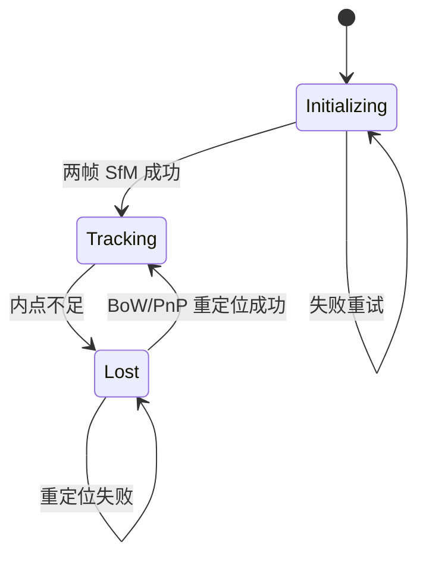

(atlas-guide)=
# Atlas 视觉 SLAM

`autonomy/localization/atlas` 是 Autonomy 集成的 **视觉 SLAM** 引擎，架构源自 **stella_vslam**（ORB-SLAM 系列），支持单目 / 双目 / RGB-D 建图、纯定位、BoW 回环与 g2o 图优化。

> 数学原理见 [§3 数学原理](../03_math.md#311-算法流水线总览)（ORB、对极几何、PnP、BA、Sim3）；三线程架构见 [§5 模块架构](../05_architecture.md#54-tracking-模块数据流)。

---

## 1. 能力概览

| 能力 | 说明 |
|------|------|
| 单目 SLAM | 运动恢复结构，尺度可观需回环/双目 |
| 双目 SLAM | 立体匹配三角化，尺度可观 |
| RGB-D SLAM | 深度图直接生成 3D 观测 |
| 纯定位 | `load_map_database` + 关闭建图 |
| 回环闭合 | BoW 检索 + Sim3 + Loop BA |
| 地图持久化 | msgpack / SQLite3 |
| 轨迹导出 | TUM / KITTI / EUROC 格式 |
| Marker 辅助 | ArUco/AprilTag 约束（可选） |

### 1.1 集成方式

| 方式 | 入口 | 状态 |
|------|------|------|
| **C++ API** | `atlas::system::feed_*_frame()` | **完整实现** |
| **localization 节点** | `--localization_mode=atlas` | 启动/地图 I/O；**尚未订阅相机话题** |
| **可视化** | `frame_publisher` / `map_publisher` | 内存内绘制，供 viewer 集成 |

### 1.2 可执行文件

通过统一 `localization` 二进制切换后端：

```bash
localization --localization_mode=atlas \
  --atlas_config=autonomy/localization/atlas/example/euroc/EuRoC_stereo.yaml \
  --atlas_vocab=/path/to/orb_vocab.fbow
```

---

## 2. 快速开始

### 2.1 准备资源

| 资源 | 说明 |
|------|------|
| **相机 YAML** | `atlas/example/` 下各数据集模板 |
| **ORB 词袋** | `.fbow` 文件（回环检测需要；可为空但无回环） |
| **图像序列** | 单目/双目/RGB-D，按配置 `setup` 对齐 |

### 2.2 C++ 最小示例（单目）

```cpp
#include "autonomy/localization/atlas/system.hpp"
#include "autonomy/localization/atlas/config.hpp"

auto cfg = std::make_shared<autonomy::localization::atlas::config>(
    "autonomy/localization/atlas/example/tum_vi/TUM_VI_mono.yaml");

autonomy::localization::atlas::system slam(cfg, "/path/to/orb_vocab.fbow");
slam.startup();

for (const auto& [timestamp, image] : image_stream) {
    auto pose = slam.feed_monocular_frame(image, timestamp);
    if (pose) {
        // pose 为 T_cw (4×4 Eigen::Matrix4d)
    }
}

slam.save_keyframe_trajectory("traj.txt", "TUM");
slam.save_map_database("map.msgpack");
slam.shutdown();
```

### 2.3 双目（EuRoC）

```cpp
auto cfg = std::make_shared<atlas::config>(
    "autonomy/localization/atlas/example/euroc/EuRoC_stereo.yaml");
atlas::system slam(cfg, vocab_path);
slam.startup();

// 左右图必须已 stereo-rectify
auto pose = slam.feed_stereo_frame(left, right, timestamp);
```

### 2.4 RGB-D（TUM）

```cpp
slam.depthmap_factor_ = 5000.0;  // TUM 深度单位 mm→m
auto pose = slam.feed_RGBD_frame(rgb, depth, timestamp);
```

### 2.5 纯定位（加载已有地图）

```cpp
slam.startup(/*need_initialize=*/false);
slam.load_map_database("saved_map.msgpack");
slam.disable_mapping_module();

// 丢失时注入先验
Mat44_t prior = ...;
slam.relocalize_by_pose(prior);
```

### 2.6 localization 节点模式

```bash
# 建图模式（启动后等待 shutdown，需外部 feed 或未来 bridge）
localization --localization_mode=atlas \
  --atlas_config=autonomy/localization/atlas/example/euroc/EuRoC_stereo.yaml \
  --atlas_vocab=/path/to/orb_vocab.fbow \
  --atlas_map_save=data/atlas_map.msgpack

# 纯定位：先加载地图
localization --localization_mode=atlas \
  --atlas_config=... \
  --atlas_vocab=... \
  --atlas_map_load=data/atlas_map.msgpack
```

`RunAtlasNode()`（`atlas_node_runner.cpp`）流程：加载配置 → `system::startup()` → `WaitForShutdown()` → 可选 `save_map_database`。

---

## 3. 三线程架构

```
                    ┌─────────────────┐
  feed_*_frame ────►│ tracking_module │──► T_cw 实时位姿
  (主线程)           └────────┬────────┘
                              │ 关键帧队列
                    ┌─────────▼─────────┐
                    │  mapping_module   │──► 三角化 + Local BA
                    │  (mapping_thread) │
                    └─────────┬─────────┘
                              │ BoW 索引
                    ┌─────────▼──────────────────┐
                    │ global_optimization_module │──► 回环 + Loop BA
                    │ (global_optimization_thread)│
                    └────────────────────────────┘
```

| 模块 | 线程 | 触发 | 职责 |
|------|------|------|------|
| `tracking_module` | 调用 `feed_*` 的线程 | 每帧 | 初始化、跟踪、PnP、关键帧决策 |
| `mapping_module` | `mapping_thread_` | 关键帧 | 三角化、路标融合、LBA、地图清理 |
| `global_optimization_module` | `global_optimization_thread_` | 关键帧 + BoW | 回环检测、Sim3 校正、GBA |

---

## 4. 命令行参数

`localization_main.cpp` 中 Atlas 相关 gflags：

| 参数 | 默认 | 说明 |
|------|------|------|
| `--localization_mode` | `cartographer` | 设为 `atlas` 启用视觉 SLAM |
| `--atlas_config` | `atlas/example/tum_vi/TUM_VI_mono.yaml` | 相机与系统 YAML |
| `--atlas_vocab` | `""` | ORB 词袋路径（空则无回环） |
| `--atlas_map_load` | `""` | 启动时加载地图（纯定位） |
| `--atlas_map_save` | `""` | 退出时保存地图 |

路径经 `ResolveWorkspacePath()` 解析，支持相对仓库根目录。

---

## 5. YAML 配置结构

配置文件位于 `autonomy/localization/atlas/example/`，按数据集分子目录。

```yaml
Camera:            # 内参、畸变、setup/model
Preprocessing:       # min_size, depthmap_factor, mask_rectangles, num_grid_*
Feature:             # ORB 金字塔
Mapping:             # LBA 后端、基线阈值、时序关键帧
Tracking:            # 跟踪后端、重定位阈值
KeyframeInserter:    # 关键帧插入策略
Relocalizer:         # BoW 重定位
LoopDetector:        # 回环检测
Initializer:         # 初始化 RANSAC 阈值
System:              # map_format, min_num_shared_lms
PangolinViewer:      # 可视化参数（可选）
StereoRectifier:     # 原始标定（EuRoC 等，离线校正用）
```

### 5.1 Camera 块

```yaml
Camera:
  name: "EuRoC stereo"
  setup: "stereo"          # monocular | stereo | rgbd
  model: "perspective"     # perspective | fisheye | equirectangular | RadialDivision
  fx: 435.20
  fy: 435.20
  cx: 367.45
  cy: 252.20
  k1: 0.0                  # 透视模型畸变 k1–k3, p1, p2
  focal_x_baseline: 47.91  # 双目: fx * baseline
  depth_threshold: 40      # RGB-D 最大有效深度
  fps: 20.0
  cols: 752
  rows: 480
  color_order: "Gray"      # Gray | RGB | BGR
```

### 5.2 Preprocessing 块

| 参数 | 默认 | 说明 |
|------|------|------|
| `min_size` | 800 | 图像短边缩放目标 |
| `depthmap_factor` | 1.0 | RGB-D：`真实深度 = 像素值 / factor` |
| `num_grid_cols/rows` | 64/48 | 特征网格（加速投影匹配） |
| `descriptor_type` | `ORB` | 描述子类型 |
| `mask_rectangles` | `[]` | 忽略区域 |

### 5.3 System 块

```yaml
System:
  map_format: "msgpack"    # msgpack | sqlite3
  min_num_shared_lms: 15
  num_grid_cols: 47
  num_grid_rows: 30
```

### 5.4 各模块 backend

`Mapping`、`Tracking`、`LoopDetector` 均支持 `backend: "g2o"`（当前唯一后端）。

---

## 6. 系统 API `atlas::system`

### 6.1 生命周期

| 方法 | 说明 |
|------|------|
| `startup(need_initialize=true)` | 启动 mapping / global_opt 线程 |
| `shutdown()` | 停止线程并 join |
| `print_info()` | 打印配置与版权信息 |

### 6.2 数据输入

| 方法 | 输入 | 返回 |
|------|------|------|
| `feed_monocular_frame(img, t)` | 灰度/RGB 图 | `shared_ptr<Mat44_t>` (T_cw) |
| `feed_stereo_frame(L, R, t)` | 已校正立体对 | 同上 |
| `feed_RGBD_frame(rgb, depth, t)` | 对齐 RGB-D | 同上 |
| `create_*_frame(...)` | 预构造 frame | 自定义 pipeline |

内部：`ORB 提取` → `tracking_module::feed_frame` → 更新 `frame_publisher`。

### 6.3 地图与轨迹 I/O

| 方法 | 说明 |
|------|------|
| `save_map_database(path)` | msgpack / sqlite3 |
| `load_map_database(path)` | 纯定位加载 |
| `save_frame_trajectory(path, format)` | 逐帧轨迹 |
| `save_keyframe_trajectory(path, format)` | 关键帧轨迹 |
| format | `"TUM"` / `"KITTI"` / `"EUROC"` |

### 6.4 运行时开关

| API | 作用 |
|-----|------|
| `enable_mapping_module()` / `disable_mapping_module()` | 开/关局部建图 |
| `enable_loop_detector()` / `disable_loop_detector()` | 开/关回环 |
| `enable_temporal_mapping()` | 时序关键帧模式 |
| `pause_tracker()` / `resume_tracker()` | 暂停/恢复跟踪 |
| `request_reset()` | 重置地图 |
| `relocalize_by_pose(T_cw)` | 注入先验位姿重定位 |
| `request_loop_closure(id1, id2)` | 手动回环 |
| `abort_loop_BA()` | 中断全局 BA |

### 6.5 可视化发布器

```cpp
auto frame_pub = slam.get_frame_publisher();
auto map_pub = slam.get_map_publisher();

// frame_publisher: draw_frame(), get_tracking_state()
// map_publisher: get_current_cam_pose(), get_keyframes(), get_landmarks()
```

用于 Pangolin / 自定义 viewer 集成，**当前未自动发布 autolink 话题**。

---

## 7. 相机模型 `camera/`

```
camera::base
├── perspective       # 针孔 + Brown-Conrady 畸变
├── fisheye           # Kannala-Brandt (k1–k4)
├── equirectangular   # 全景（仅单目）
└── radial_division   # Fitzgibbon 径向分割
```

| 方法 | 作用 |
|------|------|
| `convert_keypoint_to_bearing` | 像素 → 单位 bearing $\mathbf{b} \in S^2$ |
| `undistort_keypoints` | 畸变校正 |
| `triangulate_stereo` | 双目深度（内部由 `match::stereo` 调用） |
| `depth_to_bearing` | RGB-D 深度 → bearing |

工厂：`camera::camera_factory::create(YAML::Node)` 按 `model` 字段实例化。

---

## 8. 跟踪状态机

```cpp
enum class tracker_state_t { Initializing, Tracking, Lost };
```



### 8.1 初始化（`module/initializer`）

1. 缓存参考帧
2. 第二帧匹配 → 估计 $\mathbf{E}$（5pt）与 $\mathbf{H}$（DLT）
3. 选内点更多模型恢复 $R, t$
4. 三角化 → 初始路标 + 两个关键帧

### 8.2 正常跟踪

1. 恒速运动模型预测位姿
2. `frame_tracker` 帧间描述子匹配
3. 局部地图投影搜索（`match/projection`）
4. PnP + `pose_optimizer_g2o`
5. `keyframe_inserter` 决策是否插入关键帧

### 8.3 重定位（`module/relocalizer`）

- BoW 候选检索 → 匹配 → PnP RANSAC
- 或 `relocalize_by_pose()` 在邻近关键帧搜索

---

## 9. 建图与全局优化

### 9.1 mapping_module 流水线

| 步骤 | 说明 |
|------|------|
| `store_new_keyframe` | 写入 map_database |
| `create_new_landmarks` | 共视帧三角化 |
| `fuse_landmark_duplication` | 去重融合 |
| `local_bundle_adjuster` | g2o LBA |
| `local_map_cleaner` | 剔除冗余关键帧/路标 |

三角化条件：基线 $> \max(\tau_b,\, \eta \cdot d_{\mathrm{median}})$，默认 $\eta=0.02$。

队列背压：`queue_threshold_=2` 时跳过 LBA 以保证实时性。

### 9.2 global_optimization_module

1. `loop_detector` BoW 检索候选
2. `transform_optimizer` 估计 Sim3（单目）/ SE3（双目/RGB-D）
3. `correct_loop` 传播校正
4. 异步 `loop_bundle_adjuster` GBA

单目回环使用 **Sim(3)** 校正尺度漂移；`global_optimization_module` 构造时 `fix_scale = (setup != Monocular)`。

---

## 10. 求解与优化

### 10.1 solve/ 几何求解器

| 求解器 | RANSAC | 用途 |
|--------|--------|------|
| `essential_solver` | ✓ 5pt/8pt | 初始化 |
| `homography_solver` | ✓ | 平面场景 |
| `fundamental_solver` | ✓ | 基础矩阵 |
| `pnp_solver` | ✓ EPnP | 跟踪/重定位 |

### 10.2 optimize/ g2o 后端

| 组件 | 作用 |
|------|------|
| `pose_optimizer_g2o` | 单帧位姿优化 |
| `local_bundle_adjuster_g2o` | 局部 BA |
| `global_bundle_adjuster` | 全局 BA |
| `graph_optimizer` | 回环图优化 |
| `transform_optimizer` | Sim3 估计 |

---

## 11. 地图 I/O

| 格式 | 类 | 适用 |
|------|-----|------|
| `msgpack` | `map_database_io_msgpack` | 默认，紧凑 |
| `sqlite3` | `map_database_io_sqlite3` | 可查询、调试 |

工厂：`io::map_database_io_factory::create(map_format)`。

持久化内容：相机库、ORB 参数、关键帧、路标、BoW 向量、共视图。

---

## 12. 示例配置索引

| 数据集 | 路径 | 模式 |
|--------|------|------|
| EuRoC | `example/euroc/EuRoC_stereo.yaml` | 双目 |
| EuRoC | `example/euroc/EuRoC_mono.yaml` | 单目 |
| KITTI | `example/kitti/KITTI_stereo_*.yaml` | 双目 |
| KITTI | `example/kitti/KITTI_mono_*.yaml` | 单目 |
| TUM RGB-D | `example/tum_rgbd/TUM_RGBD_rgbd_*.yaml` | RGB-D |
| TUM RGB-D | `example/tum_rgbd/TUM_RGBD_mono_*.yaml` | 单目 |
| TUM VI | `example/tum_vi/TUM_VI_mono.yaml` | 单目鱼眼 |
| TUM VI | `example/tum_vi/TUM_VI_stereo.yaml` | 双目 |
| AIST | `example/aist/fisheye.yaml` | 鱼眼 |
| AIST | `example/aist/equirectangular.yaml` | 全景 |

---

## 13. 源码结构

```
autonomy/localization/atlas/
├── system.hpp / .cpp              # ★ 系统入口
├── atlas_node_runner.*              # localization 节点封装
├── tracking_module.*                # 前端跟踪
├── mapping_module.*                 # 局部建图
├── global_optimization_module.*     # 回环 + GBA
├── config.hpp                       # YAML 加载
├── type.hpp                         # Eigen 类型别名
├── camera/                          # 相机模型工厂
├── feature/                         # ORB 提取
├── data/                            # frame / keyframe / landmark / map_database
├── match/                           # 投影 / 立体 / BoW / 鲁棒匹配
├── solve/                           # PnP / Essential / Homography
├── initialize/                      # 单目/双目初始化
├── optimize/                        # g2o BA / Sim3
├── module/                          # initializer / relocalizer / loop_detector ...
├── io/                              # msgpack / sqlite3 / trajectory_io
├── publish/                         # frame_publisher / map_publisher
├── marker_model/                    # Marker 约束（可选）
└── example/                         # 各数据集 YAML 模板
```

---

## 14. 与导航栈集成

```
相机驱动 / 数据集
        │
        ▼
  atlas::system::feed_*_frame()     ← 当前主要集成点
        │
        ├── T_cw ──► transform 桥接（待完善）──► TF
        ├── map_database ──► 稀疏 3D 地图
        └── frame/map_publisher ──► 可视化

未来：autolink Image 订阅 → feed_* → /localization/pose
```

| 集成点 | 现状 |
|--------|------|
| C++ 直接调用 | ✓ 完整 |
| `localization --localization_mode=atlas` | ✓ 启动/地图 I/O |
| autolink 相机话题自动 feed | 待 bridge |
| TF / OccupancyGrid 发布 | 待桥接 |

---

## 15. 调参建议

| 现象 | 调整 |
|------|------|
| 初始化失败 | 充分平移；降低 `ini_fast_threshold`；检查纹理 |
| 频繁 Lost | 增大 `max_num_local_keyfrms`；启用 `enable_auto_relocalization` |
| 单目尺度漂移 | 启用回环；或改用双目/RGB-D |
| 双目不三角化 | 检查 `focal_x_baseline`；确认 stereo-rectify |
| RGB-D 深度异常 | 设置正确 `depthmap_factor_`（TUM: 5000） |
| LBA 卡顿 | `abort_local_BA()`；增大队列跳过阈值 |
| 回环误匹配 | 调高 LoopDetector 分数阈值；检查词袋质量 |

---

## 16. 故障排查

| 现象 | 可能原因 | 排查 |
|------|----------|------|
| 词袋加载失败 | 路径错误或格式 | 确认 `.fbow` 与 ORB 参数一致 |
| 无位姿输出 | 未调用 `feed_*` | 节点模式需外部 feed 或 C++ 集成 |
| 地图加载失败 | 格式不匹配 | `System.map_format` 与文件一致 |
| 鱼眼畸变大 | 模型选错 | 用 `fisheye` 而非 `perspective` |
| 全景不支持双目 | 设计限制 | `equirectangular` 仅单目 |
| Loop BA 长时间阻塞 | 大地图 GBA | `abort_loop_BA()` 或 `disable_loop_detector` |

---

## 17. 与 stella_vslam / ORB-SLAM3 对比

| 特性 | Atlas | stella_vslam | ORB-SLAM3 |
|------|-------|--------------|-----------|
| 架构 lineage | stella_vslam | 同源 | ORB-SLAM 系列 |
| 传感器 | 单/双/RGB-D | 同 | + IMU |
| 优化后端 | g2o | g2o | g2o |
| 鱼眼/全景 | ✓ | ✓ | 部分 |
| autolink 集成 | Autonomy 封装 | — | — |
| 许可证 | Apache 2.0 | BSD/MIT 组件 | GPL-3.0 |

Atlas 适合 Apache 生态；需 VI-SLAM 时可扩展 IMU 预积分模块。
