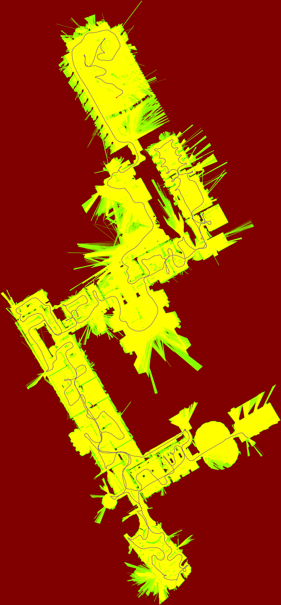

(cartographer-guide)=
# Cartographer 激光 SLAM

`autonomy/localization/cartographer` 是 Autonomy 集成的 **Google Cartographer** 激光 SLAM 引擎，通过 autolink 节点对外提供 2D/3D 建图、纯定位、占据栅格发布与 `.pbstream` 地图持久化。

> 数学原理见 [§3.12 Cartographer](../03_math.md#312-cartographer-子图与位姿图)；架构见 [§5 模块架构](../05_architecture.md#510-cartographer-架构)。

---

## 1. 能力概览

| 能力 | 说明 |
|------|------|
| 2D 激光 SLAM | 子图 + 扫描匹配 + 位姿图优化（默认） |
| 3D 激光 SLAM | `trajectory_builder_3d.lua`（可选） |
| 纯定位 | 加载冻结 `.pbstream`，`pure_localization_trimmer` |
| 占据栅格 | 节点内嵌发布 `/map`，或独立 `cartographer_occupancy_grid_node` |
| 地图导出 | 运行时 PGM/PNG、`cartographer_pbstream_to_map` 离线转换 |
| TF | 发布 `map→odom→base_link`，订阅 `tf` / `tf_static` |

### 1.1 可执行文件

| 二进制 | 作用 |
|--------|------|
| `localization` | 主节点（`--localization_mode=cartographer`，**默认**） |
| `cartographer_occupancy_grid_node` | 独立占据栅格发布（订阅 `submap_list`） |
| `cartographer_pbstream_to_map` | `.pbstream` → `map.pgm` + `map.yaml` |

---

## 2. 快速开始（Backpack 2D 数据集）

与 Cartographer 官方 `backpack_2d` 配置对齐，使用 **MultiEchoLaserScan** 话题 `echoes_1`。

### 2.1 转换 ROS bag → autolink record

```bash
python -m autonomy.tools.bag_convert \
  ~/Downloads/b2-2016-04-27-12-31-41.bag \
  -o ./data/records \
  --backpack-2d
```

`--backpack-2d` 等效于预设 `presets/backpack_2d.json`：

- 导出话题：`imu`、`horizontal_laser_2d`
- 重映射：`horizontal_laser_2d` → `echoes_1`

### 2.2 启动 SLAM（单进程，内嵌 /map）

```bash
export PATH=$PWD/build/bin:$PATH
export AUTOLINK_LAUNCH_PATH=$PWD/autonomy/localization/launch

autolink_launch start cartographer_2d.launch
```

等价命令行：

```bash
localization \
  --configuration_directory=config/localization/cartographer \
  --configuration_basename=backpack_2d.lua
```

### 2.3 回放 record

在另一终端回放转换后的 record（具体命令取决于你的 record 播放工具），确保以下话题到达：

| 话题 | 类型 | 说明 |
|------|------|------|
| `echoes_1` | MultiEchoLaserScan | 水平激光（`backpack_2d.lua` 配置） |
| `imu` | Imu | 当 `use_imu_data=true` 时必需 |
| `tf` | TransformStampeds | 传感器外参（或由静态 TF 提供） |

### 2.4 查看输出

| 输出 | 话题/文件 | 周期 |
|------|-----------|------|
| 占据栅格 | `map` | 1.0 s（可配置） |
| 跟踪位姿 | `tracked_pose` | 20 ms |
| 子图列表 | `submap_list` | 0.3 s |
| TF | `map→odom→base_link` | 随位姿发布 |
| 地图图片 | `data/map.pgm` / `data/map.png` | 10 s（可配置） |

建图结果示例：



---

## 3. 启动模式对照

| 场景 | Launch 文件 | 配置文件 | 进程数 |
|------|-------------|----------|--------|
| **2D SLAM（推荐入门）** | `cartographer_2d.launch` | `backpack_2d.lua` | 1（内嵌 grid） |
| **2D SLAM + 独立 grid** | `localization_server.launch` | `backpack_2d_with_grid.lua` | 2 |
| **纯定位** | `cartographer_2d_localization.launch` | `backpack_2d_localization.lua` | 2 |
| **仅占据栅格** | `cartographer_occupancy_grid.launch` | — | 1（需已有 SLAM） |

### 3.1 多进程模式（SLAM + 独立 OccupancyGrid）

```bash
autolink_launch localization_server.launch
```

- `localization` 使用 `backpack_2d_with_grid.lua`（`publish_occupancy_grid = false`）
- `cartographer_occupancy_grid_node` 订阅 `submap_list`，发布 `map`

适用于 SLAM 与栅格发布解耦、降低主节点负载。

### 3.2 纯定位模式

1. 先完成建图并保存状态：

```bash
localization \
  --configuration_directory=config/localization/cartographer \
  --configuration_basename=backpack_2d.lua \
  --save_state_filename=maps/map.pbstream
```

2. 编辑 `cartographer_2d_localization.launch` 中 `--load_state_filename`，然后：

```bash
autolink_launch cartographer_2d_localization.launch
```

关键配置（`backpack_2d_localization.lua`）：

```lua
TRAJECTORY_BUILDER.pure_localization_trimmer = {
  max_submaps_to_keep = 3,
}
```

加载冻结地图：`--load_frozen_state=true`。

---

## 4. 命令行参数

`localization` 二进制通过 gflags 控制后端与 Cartographer 选项。

### 4.1 模式选择

| 参数 | 默认 | 说明 |
|------|------|------|
| `--localization_mode` | `cartographer` | `cartographer` \| `atlas` |

### 4.2 Cartographer 专用

| 参数 | 默认 | 说明 |
|------|------|------|
| `--configuration_directory` | `config/localization/cartographer` | Lua 配置目录 |
| `--configuration_basename` | `backpack_2d.lua` | 主配置文件名 |
| `--load_state_filename` | `""` | 启动时加载 `.pbstream` |
| `--load_frozen_state` | `true` | 以冻结轨迹加载（纯定位） |
| `--start_trajectory_with_default_topics` | `true` | 自动订阅默认话题 |
| `--save_state_filename` | `""` | 退出时序列化状态 |

### 4.3 Atlas 模式（切换后端时）

| 参数 | 说明 |
|------|------|
| `--atlas_config` | Atlas YAML 配置 |
| `--atlas_vocab` | ORB 词袋路径 |
| `--atlas_map_load` / `--atlas_map_save` | 地图加载/保存 |

示例：切换到 Atlas

```bash
localization --localization_mode=atlas \
  --atlas_config=autonomy/localization/atlas/example/tum_vi/TUM_VI_mono.yaml \
  --atlas_vocab=/path/to/orb_vocab.fbow
```

---

## 5. 配置文件结构

配置目录：`config/localization/cartographer/`

```
config/localization/cartographer/
├── map_builder.lua              # MapBuilder 顶层
├── pose_graph.lua               # 位姿图 / 回环约束
├── trajectory_builder.lua       # 2D/3D 前端聚合
├── trajectory_builder_2d.lua    # 2D 局部 SLAM
├── trajectory_builder_3d.lua    # 3D 局部 SLAM
├── backpack_2d.lua              # ★ 默认 2D SLAM（MultiEcho + 内嵌 grid）
├── backpack_2d_with_grid.lua    # 2D SLAM，grid 由独立节点发布
├── backpack_2d_localization.lua # 纯定位
├── backpack_2d_static_transform.yaml  # 传感器外参（自动加载）
└── map_builder_server.lua       # gRPC 服务（高级）
```

### 5.1 `backpack_2d.lua` 关键项

```lua
options = {
  map_frame = "map",
  tracking_frame = "base_link",
  published_frame = "base_link",
  odom_frame = "odom",
  provide_odom_frame = true,
  num_multi_echo_laser_scans = 1,
  multi_echo_laser_scan_topics = { "echoes_1" },
  num_subdivisions_per_laser_scan = 10,
  publish_occupancy_grid = true,
  occupancy_grid_resolution = 0.05,
  save_map_image = true,
  map_image_save_directory = "data",
  map_image_filestem = "map",
}
MAP_BUILDER.use_trajectory_builder_2d = true
TRAJECTORY_BUILDER_2D.num_accumulated_range_data = 10
```

### 5.2 静态 TF（传感器外参）

与 `backpack_2d.lua` 同目录的 `backpack_2d_static_transform.yaml` 会在启动时**自动加载**：

| 关节 | parent | child | 说明 |
|------|--------|-------|------|
| `imu_link_joint` | `base_link` | `imu_link` | IMU 与基座重合 |
| `horizontal_laser_link_joint` | `base_link` | `horizontal_laser_link` | 水平激光偏移 (0.1007, 0, 0.0558) m |
| `vertical_laser_link_joint` | `base_link` | `vertical_laser_link` | 垂直激光（90° 旋转） |

命名规则：`<config_stem>_static_transform.yaml`（与 Lua 配置 basename 对应）。

### 5.3 2D 前端核心参数（`trajectory_builder_2d.lua`）

| 块 | 关键参数 | 含义 |
|----|----------|------|
| `submaps` | `num_range_data = 90` | 每个子图累积扫描数 |
| | `resolution = 0.05` | 子图栅格分辨率 [m] |
| `ceres_scan_matcher` | `occupied_space_weight` | 占据空间代价权重 |
| `real_time_correlative_scan_matcher` | `linear_search_window` | 实时相关搜索窗口 |
| `motion_filter` | `max_distance_meters` | 运动滤波距离阈值 |
| `pose_extrapolator` | `use_imu_based` | 是否 IMU 外推 |

### 5.4 位姿图（`pose_graph.lua`）

| 参数 | 默认 | 含义 |
|------|------|------|
| `optimize_every_n_nodes` | 90 | 每 N 个节点优化一次 |
| `constraint_builder.min_score` | 0.55 | 回环约束最小分数 |
| `global_localization_min_score` | 0.6 | 全局定位最小分数 |
| `max_num_final_iterations` | 200 | 最终优化迭代次数 |

---

## 6. 话题与服务

定义于 `cartographer/node/node_constants.hpp`。

### 6.1 订阅（输入）

| 话题 | 类型 | 条件 |
|------|------|------|
| `scan` | LaserScan | `num_laser_scans > 0` |
| `echoes_1` … | MultiEchoLaserScan | `num_multi_echo_laser_scans > 0`（backpack 用 `echoes_1`） |
| `points2` | PointCloud2 | `num_point_clouds > 0` |
| `imu` | Imu | 2D/3D 且 `use_imu_data=true` |
| `odom` | Odometry | `use_odometry=true` |
| `fix` | NavSatFix | `use_nav_sat=true` |
| `landmark` | LandmarkList | `use_landmarks=true` |
| `tf` / `tf_static` | TransformStampeds | 外参与子帧变换 |

多激光话题命名：`scan`、`scan_2`… 或 `echoes`、`echoes_2`…；`backpack_2d.lua` 通过 `multi_echo_laser_scan_topics` 显式指定 `echoes_1`。

### 6.2 发布（输出）

| 话题 | 类型 | 说明 |
|------|------|------|
| `map` | OccupancyGrid | `publish_occupancy_grid=true` 时 |
| `submap_list` | SubmapList | 子图元数据 |
| `tracked_pose` | PoseStamped | `publish_tracked_pose=true` 时 |
| `tf` | TransformStampeds | `map→odom`（`provide_odom_frame=true`） |

### 6.3 服务

| 服务名 | 作用 |
|--------|------|
| `submap_query` | 查询子图纹理 |
| `start_trajectory` | 动态启动新轨迹 |
| `finish_trajectory` | 结束轨迹 |
| `write_state` | 序列化 `.pbstream` |

---

## 7. 地图持久化

### 7.1 运行时自动保存

`backpack_2d.lua` 启用：

```lua
save_map_image = true,
map_image_save_period_sec = 10.0,
map_image_save_directory = "data",
map_image_filestem = "map",
```

周期性写出 `data/map.pgm`（及配套元数据）。退出时 `SaveMapImageIfEnabled()` 再保存一次。

### 7.2 序列化 .pbstream

```bash
localization \
  --configuration_directory=config/localization/cartographer \
  --configuration_basename=backpack_2d.lua \
  --save_state_filename=output/map.pbstream
```

或在运行中调用 `write_state` 服务。

### 7.3 离线导出 ROS 地图

```bash
cartographer_pbstream_to_map \
  -pbstream_filename=output/map.pbstream \
  -map_filestem=output/map \
  -resolution=0.05
```

生成 `output/map.pgm` + `output/map.yaml`，可供 `MapServer` 加载。

---

## 8. 源码结构

```
autonomy/localization/cartographer/
├── common/                 # Lua 配置解析、线程池、采样器
├── sensor/                 # Imu / LaserScan / PointCloud 数据结构
├── transform/              # Rigid2d/3d 变换
├── mapping/
│   ├── 2d/                 # 概率栅格、子图、2D 扫描匹配
│   ├── 3d/                 # 3D 子图与匹配
│   ├── internal/           # 局部/全局轨迹构建、位姿图
│   └── pose_extrapolator.* # 位姿外推
├── io/                     # pbstream、PGM/YAML 写出、子图绘制
├── node/                   # ★ Autonomy 集成层
│   ├── cartographer_node.*           # 主节点
│   ├── cartographer_node_runner.*    # 启动入口
│   ├── map_builder_bridge.*          # MapBuilder 桥接
│   ├── sensor_bridge.*               # commsgs → Cartographer 传感器
│   ├── occupancy_grid_node.*         # 独立栅格节点
│   └── pbstream_to_map_main.cpp      # 离线地图工具
└── proto/                  # 服务与消息 Protobuf

autonomy/localization/
├── localization_main.cpp   # localization 二进制入口
└── launch/                 # autolink launch 文件
```

---

## 9. 与导航栈集成

```
record/bag ──► echoes_1 + imu + tf
                    │
                    ▼
            ┌───────────────┐
            │  localization │──► submap_list
            │ (Cartographer)│──► tracked_pose
            └───────┬───────┘──► TF map→odom
                    │
         ┌──────────┴──────────┐
         ▼                     ▼
    /map (内嵌或           map.pbstream
     occupancy_grid)              │
         │                        ▼
         ▼                  MapServer (可选)
    Planning / Control
```

| 集成点 | 说明 |
|--------|------|
| `map` 话题 | 直接供 Planning `static_layer` 或可视化 |
| `map.pbstream` | 纯定位加载；或 `pbstream_to_map` 转 PGM |
| TF | `provide_odom_frame=true` 时发布 `map→odom` |
| `autonomy/driver` | `forward_targets` 可包含 `localization` |

---

## 10. 调参建议

| 现象 | 调整 |
|------|------|
| 建图模糊 / 漂移 | 增大 `ceres_scan_matcher.rotation_weight`；检查 IMU 与外参 |
| 回环不及时 | 减小 `pose_graph.optimize_every_n_nodes` |
| 实时性差 | 增大 `motion_filter.max_distance_meters`；减小 `num_accumulated_range_data` |
| 纯定位丢失 | 启用 `use_online_correlative_scan_matching`；增大 `linear_search_window` |
| 无地图输出 | 确认 `publish_occupancy_grid=true` 或启动 `occupancy_grid_node` |
| 话题无数据 | 检查 `multi_echo_laser_scan_topics` 与 record 重映射是否一致 |

---

## 11. 故障排查

| 现象 | 可能原因 | 排查 |
|------|----------|------|
| 节点启动失败 | Lua 路径错误 | 确认 `--configuration_directory` 相对工作区根目录 |
| 无激光输入 | 话题名不匹配 | `backpack_2d` 需要 `echoes_1`，非 `scan` |
| TF 查找超时 | 缺少外参 | 检查 `backpack_2d_static_transform.yaml` 是否加载 |
| IMU 队列空 | 未回放 imu | bag 转换需包含 `imu` 话题 |
| 地图全灰/全白 | 子图未累积 | 等待足够运动；检查 `min_range`/`max_range` |
| 纯定位跳变 | pbstream 与传感器不一致 | 确认同一机器人配置 |

---

## 12. 与 cartographer_ros 的差异

| 项 | cartographer_ros | Autonomy |
|----|------------------|----------|
| 中间件 | ROS 1/2 | autolink |
| 消息类型 | `sensor_msgs` | `autonomy/commsgs` |
| 配置 | `.lua` | 相同 Lua 格式，目录 `config/localization/cartographer/` |
| 默认配置 | `backpack_2d.lua` | `backpack_2d.lua`（扩展 `echoes_1`、内嵌 grid） |
| 启动 | `roslaunch` | `autolink_launch` |
| bag 回放 | `rosbag play` | `bag_convert` → `.record` 回放 |

Lua 参数语义与上游 Cartographer 保持一致，可直接参考 [Cartographer 官方文档](https://google-cartographer.readthedocs.io/)。
