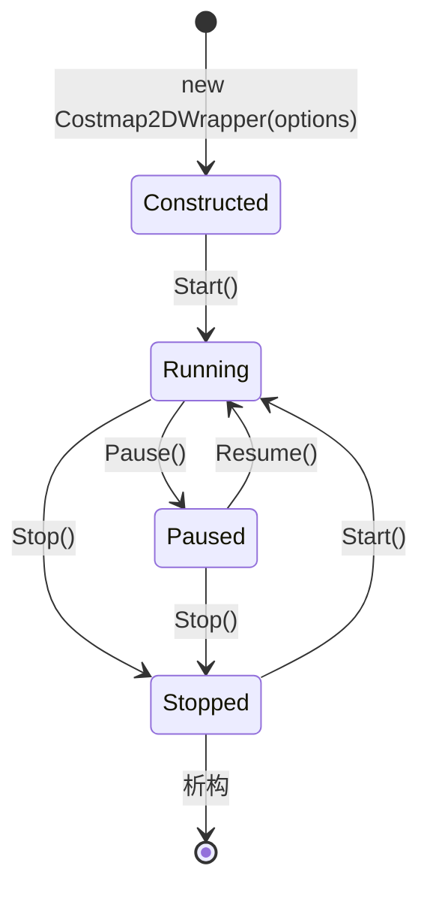
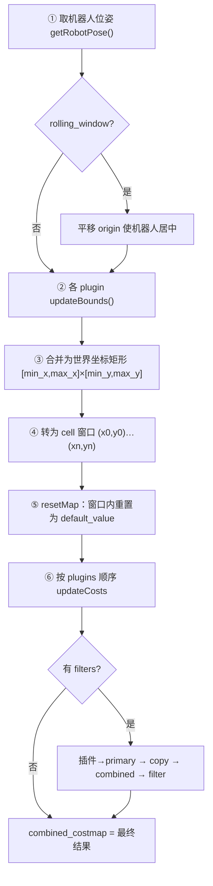
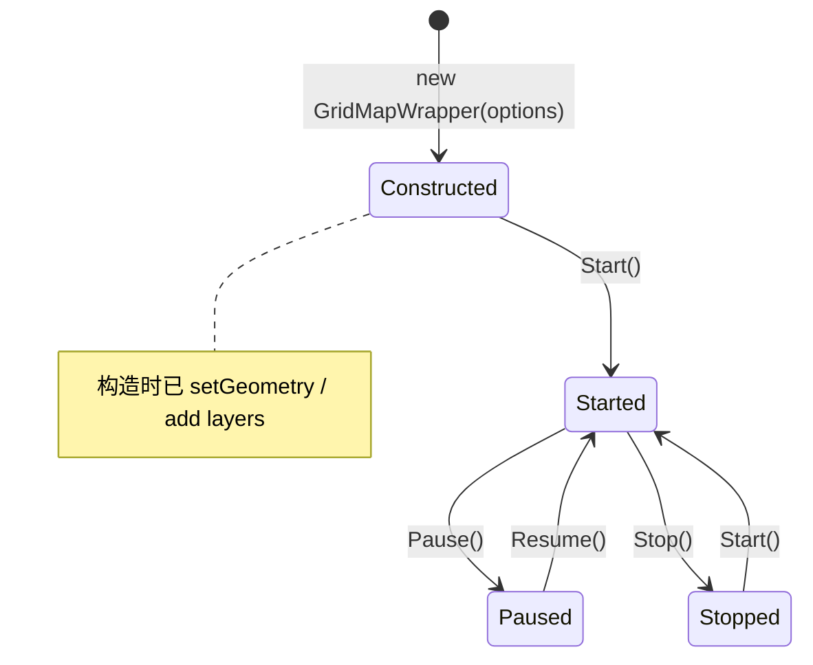
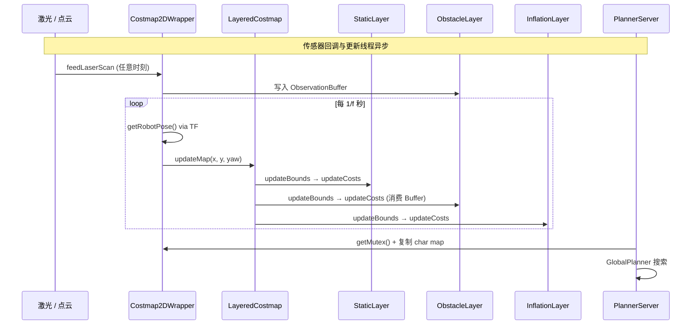

# 1. Map 模块架构设计

本文描述 `autonomy/map` 的逻辑架构、核心组件关系与运行时数据流。

## 1.1 设计目标

Map 模块遵循以下设计原则：

1. **与 Nav2 对齐**：Costmap2D 接口语义、图层插件模式、代价值定义与 Navigation2 `nav2_costmap_2d` 保持一致
2. **插件化图层**：静态、障碍、膨胀等以 Layer 插件形式注册，支持动态库加载
3. **双轨地图**：2D 代价地图（规划/避障）与 2.5D GridMap（地形感知）并行，按需选用
4. **配置驱动**：Lua → Protobuf 的配置管线，便于版本管理与序列化
5. **线程安全**：`recursive_mutex` 保护 costmap 读写，规划端复制快照

## 1.2 模块总览：三条并行管线

`autonomy/map` 不是单一地图类，而是**三条职责分明的管线**，按需组合：

| 管线 | 入口类 | 输出 | 主要消费者 |
|------|--------|------|------------|
| 静态地图 | `MapServer` | `OccupancyGrid` (-1/0/100) | `static_layer`、可视化 |
| 2D 代价地图 | `Costmap2DWrapper` | `uint8` 代价值 0–255 | `PlannerServer`、碰撞检测 |
| 2.5D 多层栅格 | `GridMapWrapper` | `float` 多层矩阵 | 地形感知（需自行接入） |

```
                    ┌──────────────┐
  YAML+PGM ────────►│  MapServer   │──── OccupancyGrid ────┐
                    └──────────────┘                       │
                                                           ▼
  /scan / 点云 ───►┌──────────────────┐            ┌─────────────┐
                   │ Costmap2DWrapper │◄───────────│ static_layer│
                   │  (后台更新线程)    │            └─────────────┘
                   └────────┬─────────┘
                            │ combined_costmap (uint8)
                            ▼
                   ┌──────────────────┐
                   │  PlannerServer   │  ← 已集成
                   └──────────────────┘

  点云 / 深度 ───►┌──────────────────┐
                  │  GridMapWrapper  │──► elevation / slope / ...
                  │  (无自动传感器)    │    需应用层写入
                  └──────────────────┘
                            ✗ 当前未桥接到 Costmap2D
```

---

## 1.3 Costmap2D 架构（重点）

### 1.3.1 解决什么问题

Costmap2D 将**静态环境 + 动态障碍 + 安全膨胀**融合为一张 $N_x \times N_y$ 的 `uint8` 栅格，供规划器判断「哪里能走、离障碍多近」。它是 Autonomy 导航栈中**唯一已与 Planning 打通**的地图。

### 1.3.2 对象组合（从外到内）

```
Costmap2DWrapper                    ← 你直接持有的对象（MapInterface）
├── LayeredCostmap                  ← 管理插件链与双缓冲
│   ├── primary_costmap_  (Costmap2D)   ← 有 filter 时插件写入这里
│   ├── combined_costmap_ (Costmap2D)   ← 对外输出（getCostmap()）
│   ├── plugins_[]                  ← static / obstacle / inflation ...
│   └── filters_[]                  ← keepout / speed / binary
├── TF Buffer                       ← getRobotPose()、坐标变换
├── footprint_                      ← 内切/外接半径 → inflation
└── map_update_thread_              ← Start() 后周期性 updateMap + publishMap
```

**关键认知**：业务代码通常只接触 `Costmap2DWrapper`；`Costmap2D` 是底层栅格存储；`Layer` 是写入逻辑单元。

### 1.3.3 生命周期状态机



| 状态 | 行为 |
|------|------|
| 构造后 | `init()` 读配置、创建 `LayeredCostmap`、加载插件，**尚未更新** |
| `Start()` | 激活插件、启动后台线程：每 $1/f$ 秒执行 `updateMap()` → `publishMap()` |
| `Pause()` | 线程仍运行，但插件可 deactivate（传感器数据仍可 `feed*`） |
| `Stop()` | 停止线程、deactivate 插件 |
| `isReady()` | 至少完成一次 `updateMap()` 后为 true |
| `isCurrent()` | 各图层在超时内更新过 |

### 1.3.4 单次更新：数据如何流过各层

`updateMap()` 在后台线程中被周期性调用，核心逻辑在 `LayeredCostmap::updateMap`：



**各层在⑥中的职责**：

| 顺序 | 图层 | 读入 | 写出 |
|------|------|------|------|
| 1 | `static_layer` | `OccupancyGrid` / 已加载 PGM | LETHAL(254) / FREE(0) |
| 2 | `obstacle_layer` | `ObservationBuffer`（激光/点云） | marking→LETHAL；clearing→FREE |
| 3 | `inflation_layer` | 下层 lethal 种子 | 1–253 指数衰减梯度 |
| 4+ | `denoise_layer` 等 | 下层结果 | 过滤孤立点 |

合并规则多为 `updateWithMax`：取 $\max(c_{\text{master}}, c_{\text{layer}})$。

### 1.3.5 外部数据如何进入

| 入口 API | 时机 | 目标 |
|----------|------|------|
| `applyOccupancyGrid(grid)` | 任意时刻（通常启动时） | `StaticLayer` |
| `loadMap(yaml_path)` | `Start()` 内或手动 | 解析 YAML+PGM → StaticLayer |
| `feedLaserScan(scan)` | 传感器回调（ROS bridge） | `ObstacleLayer::ObservationBuffer` |
| `feedPointCloud2(cloud)` | 同上 | `ObstacleLayer` / `VoxelLayer` |
| `updateMap()` 内 `getRobotPose()` | 每次更新 | TF：`base_link` → `map` |

传感器数据**先缓存**，在 `updateCosts` 阶段统一 marking/clearing，而非即时改栅格。

### 1.3.6 规划器如何读取

```cpp
// PlannerServer 中的典型模式
std::unique_lock lock(costmap_wrapper->getMutex());
Costmap2D* cm = costmap_wrapper->getCostmap();
// 复制 char_map 到本地 buffer
memcpy(local_buf, cm->getCharMap(), size_x * size_y);
lock.unlock();
// 在本地 buffer 上搜索，不阻塞地图更新
```

---

## 1.4 GridMap 2.5D 架构（重点）

### 1.4.1 解决什么问题

GridMap 在 XY 平面维护**多个命名浮点层**（如 `elevation`、`variance`），用层值表达高度等地形信息，适合越野、台阶、坡度分析。它与 Costmap2D **并行存在**，不负责路径规划的障碍表达（除非自行桥接）。

### 1.4.2 2.5D 心智模型

```
俯视图 (XY)                    侧视概念 (XZ)
┌───┬───┬───┐                 elevation 层存 z 值
│0.1│0.1│0.2│  ← 每个 cell     ┌──────────────┐
├───┼───┼───┤    有多个 float   │   ╱╲  台阶   │
│0.1│0.3│0.3│    属性层         │  ╱  ╲        │
├───┼───┼───┤                  └──────────────┘
│0.0│0.0│0.1│
└───┴───┴───┘
  ↑ position_ = 地图中心（世界坐标）
```

不是完整 3D 体素：第三维信息**编码在层值**中，查询 $(x,y)$ 时通过插值得到连续高程。

### 1.4.3 对象组合

```
GridMapWrapper                     ← Autonomy 封装（MapInterface）
└── grid_map::GridMap              ← ETH 核心类
    ├── data_["elevation"]  → Eigen::MatrixXf (rows × cols)
    ├── data_["variance"]   → Eigen::MatrixXf
    ├── layers_             → ["elevation", "variance", ...]
    ├── basicLayers_        → 判定有效性的层（含 NaN 则无效）
    ├── position_           → 地图中心 [m]
    ├── length_             → 物理尺寸 [m]
    ├── resolution_         → [m/cell]
    └── startIndex_         → 循环 buffer 起始（move 时用）
```

**与 Costmap2D 的本质区别**：GridMap 是 `map<string, Matrix>` 的多层浮点结构；Costmap2D 是单层 `uint8[]` + 插件流水线。

### 1.4.4 生命周期（当前实现）



| 与 Costmap2D 的差异 | 说明 |
|---------------------|------|
| **无后台更新线程** | `Start()` 仅设 `stopped_=false`，不自动 `move()` 或融合传感器 |
| **无内置 feed API** | 点云/深度需应用层写入 `Matrix` 或调用 `addDataFrom` |
| **publishMap 未实现** | 日志输出占位，需自行序列化发布 |
| **loadMap 未实现** | 文件加载为 TODO |

因此 GridMap 当前是**数据容器 + 坐标/插值工具**，而非开箱即用的感知流水线。

### 1.4.5 典型数据流（应用层驱动）


### 1.4.6 循环 buffer 与 move()

`move(new_position)` 不改变世界系中的几何数据语义，只**平移 buffer 窗口**：

1. 计算索引偏移 $\Delta \mathbf{i} = \mathrm{round}((\mathbf{p}_{\text{new}} - \mathbf{p}_{\text{map}})/\Delta)$
2. 移出窗口的行/列置 `NaN`
3. 更新 `startIndex_`、`position_`

旧数据在 map frame 中保持 stationary，适合机器人移动时局部更新地形。

---

## 1.5 分层架构（总图）

```
┌─────────────────────────────────────────────────────────────────┐
│                    应用层 (Planning / Control / Navigator)         │
│         getCostmap() / snapshotOccupancyGrid / GridMap 查询        │
└──────────────────────────┬──────────────────────────────────────┘
                           │
┌──────────────────────────▼──────────────────────────────────────┐
│                   封装层 (Wrapper / Server)                       │
│  Costmap2DWrapper          MapServer              GridMapWrapper │
│  · 后台更新线程             · YAML/PGM 加载         · 无自动更新   │
│  · 传感器 feed              · OccupancyGrid 发布    · 应用层写层   │
│  · TF / footprint           · 回调注入              · 插值查询     │
└──────────┬─────────────────────┬──────────────────────┬───────────┘
           │                     │                      │
┌──────────▼──────────┐ ┌────────▼────────┐ ┌─────────▼──────────┐
│  LayeredCostmap     │ │  OccupancyGrid  │ │  grid_map::GridMap │
│  · primary buffer   │ │  -1 / 0 / 100   │ │  float 多层矩阵    │
│  · combined buffer  │ │                 │ │  elevation / ...   │
│  · plugin chain     │ └─────────────────┘ └────────────────────┘
└──────────┬──────────┘
           │
┌──────────▼──────────────────────────────────────────────────────┐
│                        图层插件 (Plugins)                          │
│  static_layer → obstacle_layer → inflation_layer → [filters]     │
└─────────────────────────────────────────────────────────────────┘
```

### 1.5.1 服务层 — `Costmap2DWrapper`

`Costmap2DWrapper` 是 Costmap2D 对外的运行时入口，职责包括：

| 职责 | 实现要点 |
|------|----------|
| 生命周期 | 实现 `MapInterface`：`Start()` 启动 `mapUpdateLoop` |
| 插件加载 | 从 `Costmap2DOptions.plugins` 加载图层 `.so` |
| 传感器接入 | `feedLaserScan` / `feedPointCloud2` / `feedRange` |
| 位姿更新 | `updateRobotPose` 驱动 rolling window |
| 静态地图 | `applyOccupancyGrid` → `StaticLayer` |
| 快照导出 | `snapshotOccupancyGrid` 反向映射为 OccupancyGrid |

### 1.5.2 静态地图层 — `MapServer`

`MapServer` 独立于 Costmap 运行，负责：

- 从 YAML+PGM 文件加载静态地图
- 运行时 `SetStaticMap()` 注入
- 通过 `MapPublishCallback` 周期性或一次性发布 `OccupancyGrid`
- 消费者（`static_layer` 或 `Costmap2DWrapper::applyOccupancyGrid`）订阅后写入 costmap

### 1.5.3 多层聚合 — `LayeredCostmap`

`LayeredCostmap` 管理插件链与双缓冲：

| 缓冲区 | 用途 |
|--------|------|
| `primary_costmap_` | 插件写入目标 |
| `combined_costmap_` | 最终输出（filter 处理后） |

无 filter 时二者合一；有 filter 时：插件 → primary → copy → combined → filter 修改 combined。

### 1.5.4 GridMapWrapper 补充说明

`GridMapWrapper` 封装 ETH `grid_map::GridMap`：

- 多层浮点数据（`elevation`、`variance` 等）
- 循环 buffer 实现高效滑动窗口
- 与 Costmap2D **无运行时自动同步**（桥接模块 `grid_map_costmap_2d` 当前未实现）

## 1.6 图层系统

### 1.6.1 类层次

```
Layer (abstract)
├── CostmapLayer : Layer + Costmap2D
│   ├── StaticLayer          # 静态 SLAM 地图
│   ├── ObstacleLayer        # 激光/点云障碍
│   └── VoxelLayer           # 3D 体素 → 2D 投影
├── InflationLayer           # 膨胀（无内部 costmap）
├── DenoiseLayer             # 连通域去噪
├── RangeSensorLayer         # 距离传感器
└── CostmapFilter : Layer
    ├── KeepoutFilter        # 禁行区
    ├── SpeedFilter          # 速度限制区
    └── BinaryFilter         # 二值过滤
```

### 1.6.2 默认插件链

```lua
plugins = {"static_layer", "obstacle_layer", "inflation_layer"}
```

更新顺序严格按 `plugins` 列表：`updateBounds` 累加更新矩形 → `resetMap` → 按序 `updateCosts`。

### 1.6.3 外部插件加载

```
planner.lua
  costmap.plugins = { "static_layer", "obstacle_layer", ... }
  costmap.obstacle_layer.plugin = "libautonomy_map_layers_obstacle_layer.so"
        │
        ▼
PluginManager::LoadPlugin(.so)
        │
        ▼
Layer::onInitialize() → updateBounds / updateCosts
```

## 1.7 端到端数据流

### 1.7.1 Costmap 更新时序



### 1.7.2 单次 updateMap 步骤

1. **Rolling window**（若 `rolling_window_ == true`）：
   $$x_0^{\text{new}} = x_{\text{robot}} - W/2,\quad y_0^{\text{new}} = y_{\text{robot}} - H/2$$
   调用 `Costmap2D::updateOrigin()` 平移窗口。

2. 各 plugin/filter 调用 `updateBounds()` 扩展更新矩形 $[min_x, max_x] \times [min_y, max_y]$。

3. 转为 cell 边界 $(x_0, y_0, x_n, y_n)$，`resetMap` 后按序 `updateCosts()`。

4. 若有 filter：primary → copy → combined → filter `updateCosts()`。

### 1.7.3 静态地图注入

```
YAML + PGM
    │
    ▼
MapServer::LoadMap()
    │
    ▼
OccupancyGrid (-1/0/100)
    │
    ├── MapPublishCallback → /map 话题
    │
    └── Costmap2DWrapper::applyOccupancyGrid()
            │
            ▼
        StaticLayer::loadOccupancyGrid()
            │
            ▼
        Trinary / Scale 模式 → LETHAL / FREE
```

## 1.8 配置管线

```
config/planner/planner.lua
        │
        ▼
LuaParameterDictionary
        │
        ▼
map::CreateCostmap2DOptions()  →  proto::Costmap2DOptions
        │
        ▼
Costmap2DWrapper(options)
        │
        ├── options.plugins()           → 图层插件链
        ├── options.static_layer()      → StaticLayer 参数
        ├── options.obstacle_layer()    → ObstacleLayer 参数
        ├── options.inflation_layer()   → InflationLayer 参数
        └── options.footprint()         → 机器人 footprint
```

`Costmap2DOptions` proto 主要字段：

| 字段 | 类型 | 说明 |
|------|------|------|
| `resolution` | `double` | 栅格分辨率 [m/cell] |
| `width` / `height` | `double` | 地图物理尺寸 [m] |
| `update_frequency` | `double` | 更新频率 [Hz] |
| `rolling_window` | `bool` | 是否滑动窗口 |
| `plugins` | `repeated string` | 图层插件列表 |
| `footprint` | `repeated Point` | 机器人轮廓 |
| `robot_radius` | `double` | 圆形近似半径 |

## 1.9 Costmap2D 与 GridMap 对比

```
┌─────────────────┐     ┌─────────────────┐
│  Costmap2D      │     │  GridMap        │
│  uint8 0–255    │     │  float 多层     │
│  左下角原点      │     │  中心原点        │
│  规划 / 避障     │     │  地形 / 高程     │
└────────┬────────┘     └────────┬────────┘
         │                       │
         │   grid_map_costmap_2d  │
         │   （当前未实现）         │
         └───────────┬───────────┘
                     ▼
              未来：互转 / 融合
```

| 维度 | Costmap2D | GridMap |
|------|-----------|---------|
| 数值类型 | `unsigned char` | `float` |
| 原点 | 左下角 | 中心 |
| 规划集成 | ✅ PlannerServer | ❌ 需自行接入 |
| 桥接 | `grid_map_costmap_2d/` 已注释 | 同上 |

## 1.10 与系统其他模块的集成

```
config/autonomy.lua
  planning = AUTONOMY_PLANNER
        │
        ▼
system::Autonomy
  planner_ = PlannerServer(options_.planner_options())
        │
        ├── planner_.costmap_ = Costmap2DWrapper
        ├── Navigator（间接消费 costmap）
        └── Visualization（订阅 costmap 快照）
```

独立 MapServer 通常在系统启动时单独构造，通过话题或回调与 Costmap 连接。

## 1.11 线程与并发

| 场景 | 策略 |
|------|------|
| 地图更新 vs 规划 | 规划时 `unique_lock` costmap mutex，复制后解锁 |
| 多传感器写入 | `ObservationBuffer` 缓存，`updateCosts` 时合并 |
| GridMap 读写 | Eigen 矩阵无内置锁，外部需同步 |
| 后台更新 | `mapUpdateLoop` 独立线程，按 `update_frequency` 周期调用 `updateMap` |

## 1.12 扩展自定义图层

实现步骤：

1. 继承 `CostmapLayer`（有内部 costmap）或 `Layer`（如 InflationLayer）
2. 实现 `onInitialize()`、`updateBounds()`、`updateCosts()`
3. 编译为 `.so`，在 `plugins` 和对应配置块中注册
4. 在 `map_2d_option.proto` 中添加配置字段（如需）

最小接口示例：

```cpp
class MyLayer : public CostmapLayer {
public:
    void onInitialize() override { /* 读配置 */ }
    void updateBounds(double rx, double ry, double ryaw,
                      double* min_x, double* min_y,
                      double* max_x, double* max_y) override { /* 扩展边界 */ }
    void updateCosts(Costmap2D& master, int min_x, int min_y,
                     int max_x, int max_y) override { /* 写入 master */ }
};
```

## 1.13 相关文档

- [Map 地图模块指南](00_guide.md)
- [Costmap2D 代价地图](03_costmap2d.md)
- [GridMap 2.5D 栅格地图](04_grid_map.md)
- [Planning 架构设计](../08_Planning/01_architecture.md)
