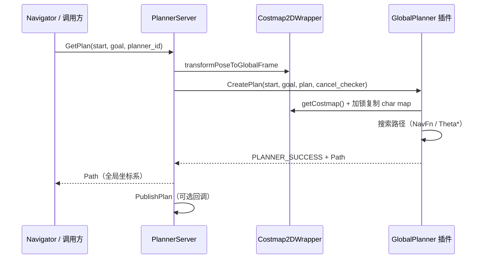

# Planning 模块架构设计

本文描述 `autonomy/planning` 的逻辑架构、核心组件关系与运行时数据流。

## 1. 设计目标

Planning 模块遵循以下设计原则：

1. **与 nav2 对齐**：接口语义、插件模式、代价地图使用方式与 Navigation2 保持一致，降低迁移成本
2. **插件化扩展**：算法以 `GlobalPlanner` 插件形式注册，支持进程内与动态库两种加载方式
3. **配置驱动**：Lua → Protobuf 的配置管线，便于版本管理与序列化
4. **线程安全**：规划时复制代价地图快照，避免与地图更新线程竞争

## 2. 分层架构

```
┌─────────────────────────────────────────────────────────────┐
│                    应用层 (Navigator / BT)                   │
│         compute_path_to_pose / GetPlan / is_path_valid       │
└──────────────────────────┬──────────────────────────────────┘
                           │
┌──────────────────────────▼──────────────────────────────────┐
│                   PlannerServer（服务层）                      │
│  · 插件加载与管理                                              │
│  · 坐标变换（→ costmap global frame）                        │
│  · 路径发布回调 / 指标统计                                     │
│  · is_path_valid 碰撞检测服务                                 │
└──────────┬───────────────────────────────┬──────────────────┘
           │                               │
┌──────────▼──────────┐         ┌──────────▼──────────────────┐
│  GlobalPlanner 插件  │         │  Costmap2DWrapper（地图层）   │
│  Navfn / Dijkstra   │◄────────│  static + obstacle + inflate │
│  Theta* / 外部插件   │         │  TF / footprint / robot pose │
└──────────┬──────────┘         └─────────────────────────────┘
           │
┌──────────▼──────────┐
│   路径后处理（可选）   │
│  PathSimplifier      │
│  SimpleSmoother      │
└─────────────────────┘
```

### 2.1 服务层 — `PlannerServer`

`PlannerServer` 是模块对外的唯一服务入口，职责包括：

| 职责 | 实现要点 |
|------|----------|
| 生命周期管理 | 构造时启动 costmap、加载插件；析构时停止 costmap |
| 插件注册表 | `std::unordered_map<std::string, GlobalPlanner::SharedPtr>` |
| 规划调度 | `GetPlan()` 根据 `planner_id` 分发到对应插件 |
| 结果码映射 | 插件返回 `PlannerResultCode`，服务层转换为 C++ 异常 |
| 路径校验 | `IsPathValid()` 从机器人最近路径点开始做 footprint/radius 碰撞检测 |

关键常量（`constants.hpp`）：

| 常量 | 值 | 用途 |
|------|-----|------|
| `kPlannerServerNodeName` | `"planner_server"` | autolink 节点名 |
| `kCostmapTopicName` | `"/global_costmap"` | 全局代价地图话题 |
| `kIsPathValidServiceName` | `"is_path_valid"` | 路径有效性服务 |
| `kPlanTopicName` | `"plan"` | 路径发布（通过回调） |

### 2.2 算法层 — `GlobalPlanner` 插件接口

所有规划器继承 `common::GlobalPlanner`：

```cpp
class GlobalPlanner {
public:
    virtual uint32 CreatePlan(
        const PoseStamped& start,
        const PoseStamped& goal,
        planning_msgs::Path& plan,
        std::function<bool()> cancel_checker) = 0;
};
```

**约定：**

- `start` / `goal` 可在任意坐标系，插件内部或 `PlannerServer` 负责变换到 costmap 全局坐标系
- `cancel_checker` 返回 `true` 时规划应尽快中止，返回 `PLANNER_CANCELED`
- 返回值使用 `proto::PlannerResultCode` 枚举，而非 `bool`

### 2.3 地图层 — `Costmap2DWrapper`

每个 `PlannerServer` 实例持有一个共享的 `Costmap2DWrapper`：

- 所有已加载插件共享同一 costmap 实例
- 规划前通过 `getMutex()` 加锁，复制 `getCharMap()` 到本地缓冲区
- 起点格通常被强制设为 `FREE_SPACE`，避免机器人当前位置被标记为障碍

### 2.4 后处理层

| 组件 | 类型 | 说明 |
|------|------|------|
| `PathSimplifier` | 工具函数 | Douglas-Peucker 路径简化，`epsilon <= 0` 时跳过 |
| `SimpleSmoother` | `Smoother` 插件 | 基于数据项+平滑项的迭代优化 |
| 自动平滑 | 配置项 | `auto_smooth_after_plan` 控制规划后是否自动平滑 |

## 3. 插件系统

### 3.1 内置插件

| 插件 ID | C++ 类名 | 基类 | 说明 |
|---------|----------|------|------|
| `navfn_planner` | `NavfnPlanner` | `GlobalPlanner` | NavFn 导航势场，可选 A* |
| `dijkstra_planner` | `DijkstraPlanner` | `NavfnPlanner` | 强制 Dijkstra 模式 |
| `theta_star_planner` | `ThetaStarPlanner` | `GlobalPlanner` | Theta* 任意角规划 |

注册方式（进程内）：

```cpp
pm->RegisterInProcessClass<common::GlobalPlanner>("NavfnPlanner");
pm->RegisterInProcessClass<common::GlobalPlanner>("DijkstraPlanner");
pm->RegisterInProcessClass<common::GlobalPlanner>("ThetaStarPlanner");
```

动态库插件通过 `AUTOLINK_PLUGIN_MANAGER_REGISTER_PLUGIN` 宏导出，并在 XML 描述文件中声明。

### 3.2 插件配置格式

`planner_plugins` 支持两种条目格式：

```
"navfn_planner"                    # id 与类型同名，走别名解析
"my_planner:MyCustomPlanner"       # 显式指定 id 与 C++ 类名
```

别名表（`planner_server.cpp`）：

```cpp
{"navfn_planner", "NavfnPlanner"},
{"dijkstra_planner", "DijkstraPlanner"},
{"theta_star_planner", "ThetaStarPlanner"},
```

### 3.3 外部插件加载流程

```
planner.lua
  planner_plugin_libraries = { "path/to/plugin.xml" }
        │
        ▼
PluginManager::LoadPlugin(xml)
        │
        ▼
libmy_planner_plugin.so  (AUTOLINK_PLUGIN_MANAGER_REGISTER_PLUGIN)
        │
        ▼
CreateInstance<GlobalPlanner>("MyCustomPlanner")
```

参考模板：`config/planning/plugins/example_planner_plugin.xml`

## 4. 规划数据流



### 4.1 NavFn 系列规划流程

1. 世界坐标 → 栅格坐标（`worldToMap`）
2. 复制 costmap，清除起点障碍标记
3. `NavFn::setCostmap()` 转换代价值（ROS 格式 → NavFn 内部格式）
4. **反向传播**：从 goal 格出发计算导航势场（`calcNavFnDijkstra` 或 `calcNavFnAstar`）
5. **目标容差搜索**：若 goal 不可达，在 `tolerance` 范围内找最近可达点
6. **梯度跟踪**：`calcPath()` 沿势场梯度从 start 走向 goal
7. **末端平滑**：`smoothApproachToGoal()` 修正离散化伪影

### 4.2 Theta* 规划流程

1. 复制 costmap，标记起点为自由空间
2. 优先队列 A* 搜索，扩展时执行 Line-of-Sight 检测
3. 若父节点与邻居之间存在视线，直接更新 g 值（任意角路径）
4. 回溯 parent 数组，生成路径并设置朝向

## 5. 配置管线

```
config/planner/planner.lua
        │
        ▼
LuaParameterDictionary
        │
        ▼
planning::LoadOptions()  →  proto::PlannerOptions
        │
        ▼
PlannerServer(options)
        │
        ├── options.costmap()      → Costmap2DWrapper
        ├── options.navfn()        → NavfnPlanner::InitFromOptions
        ├── options.dijkstra()     → DijkstraPlanner 构造
        ├── options.theta_star()   → ThetaStarPlanner::InitFromOptions
        └── options.simple_smoother() → SimpleSmoother
```

`PlannerOptions` proto 主要字段：

| 字段 | 类型 | 说明 |
|------|------|------|
| `planner_plugins` | `repeated string` | 启用的规划器列表 |
| `default_planner_id` | `string` | 默认规划器 ID |
| `costmap` | `Costmap2DOptions` | 全局代价地图配置 |
| `expected_planner_frequency` | `double` | 期望规划频率（用于超时告警） |
| `path_simplify_epsilon` | `double` | DP 简化阈值，0 禁用 |
| `auto_smooth_after_plan` | `bool` | 规划后自动平滑 |

## 6. 错误处理

`PlannerResultCode` 枚举（`planning_options.proto`）：

| 码值 | 名称 | 对应异常 |
|------|------|----------|
| 0 | `PLANNER_SUCCESS` | 无 |
| 51 | `PLANNER_CANCELED` | `PlannerCancelled` |
| 54 | `PLANNER_BLOCKED_START` | `StartOccupied` |
| 55 | `PLANNER_BLOCKED_GOAL` | `GoalOccupied` |
| 56 | `PLANNER_NO_PATH_FOUND` | `NoValidPathCouldBeFound` |
| 57 | `PLANNER_PAT_EXCEEDED` | `PlannerTimedOut` |
| 59 | `PLANNER_TF_ERROR` | `PlannerTFError` |
| 61 | `PLANNER_INVALID_PLUGIN` | `InvalidPlanner` |

`PlannerServer::GetPlan()` 在收到非 SUCCESS 码时通过 `ThrowOnPlannerResultCode()` 抛出对应异常。

## 7. 与系统其他模块的集成

```
config/autonomy.lua
  planning = AUTONOMY_PLANNER
        │
        ▼
system::Autonomy
  planner_ = make_shared<PlannerServer>(options_.planner_options())
        │
        ├── Navigator（行为树调用 GetPlan）
        ├── Visualization（订阅 /planning/path）
        └── Control（跟踪规划路径）
```

## 8. 线程与并发

| 场景 | 策略 |
|------|------|
| 地图更新 vs 规划 | 规划时 `unique_lock` costmap mutex，复制后解锁再计算 |
| 多规划器实例 | 共享 costmap wrapper，各自持有独立算法状态 |
| 取消检查 | 每 `terminal_checking_interval`（默认 5000）次扩展检查一次 |

## 9. 扩展自定义规划器

实现步骤：

1. 继承 `common::GlobalPlanner`，实现 `CreatePlan()`
2. 在构造函数中接收 `PlannerOptions`、插件名、`Costmap2DWrapper`
3. 使用 `AUTOLINK_PLUGIN_MANAGER_REGISTER_PLUGIN` 注册
4. 编写 XML 插件描述文件
5. 在 `planner.lua` 的 `planner_plugins` 和 `planner_plugin_libraries` 中添加条目

最小接口示例：

```cpp
class MyPlanner : public common::GlobalPlanner {
public:
    MyPlanner(const proto::PlannerOptions& options,
              const std::string& name,
              std::shared_ptr<Costmap2DWrapper> costmap)
        : GlobalPlanner(options, name, std::move(costmap)) {}

    uint32 CreatePlan(const PoseStamped& start, const PoseStamped& goal,
                      Path& plan, std::function<bool()> cancel_checker) override {
        // 实现规划逻辑
        return proto::PlannerResultCode::PLANNER_SUCCESS;
    }
};

AUTOLINK_PLUGIN_MANAGER_REGISTER_PLUGIN(MyPlanner, GlobalPlanner);
```

## 10. 相关文档

- [Planning 路径规划指南](guide.md)
- [NavFn 规划器](navfn.md)
- [Dijkstra 规划器](dijkstra.md)
- [Theta* 规划器](theta_star.md)
- [路径规划综述](survey.md)
