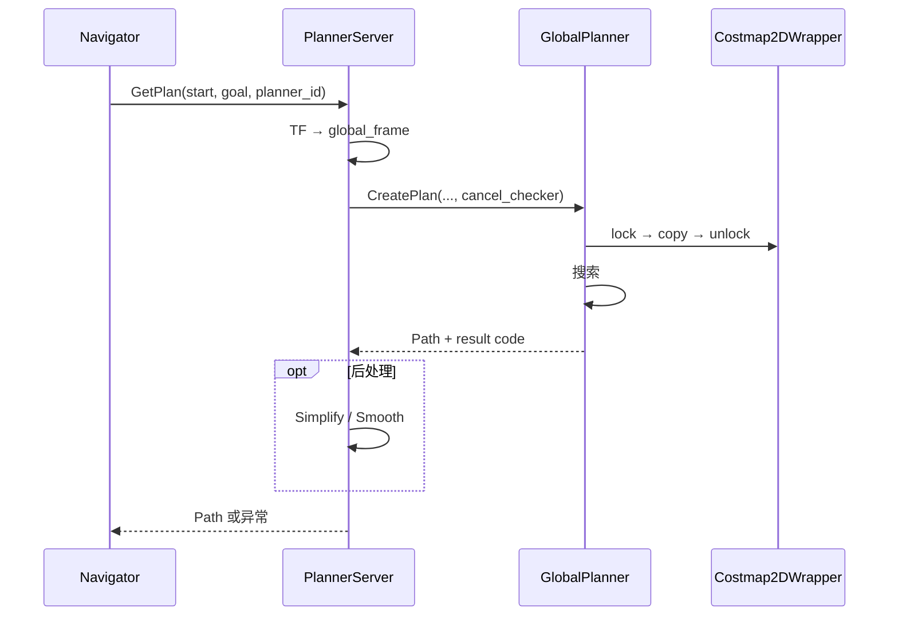

(planning-architecture)=
# 1. Planning 模块架构

> 上手与配置见 [§0](00_guide.md)；算法见 [§2–§5](02_planner_algorithms.md)。本文只写 **边界、分层、GetPlan 数据流、插件加载、错误与扩展**。

---

## 1.1 在导航栈中的位置

```
Navigator ──GetPlan──► PlannerServer ──CreatePlan──► GlobalPlanner 插件
                           │                              │
                           │                              ▼
                           │                    Costmap2DWrapper（快照）
                           ▼
                      Path ──► Control
                           ▲
                    map 更新 /global_costmap
```

| 边界 | 说明 |
|------|------|
| 上游 | Navigator（`compute_path_to_pose` / `GetPlan`） |
| 地图 | `map/costmap_2d`，`/global_costmap` |
| 下游 | Control、Visualization |
| 入口 | `Autonomy` 构造 `PlannerServer`（`AUTONOMY_PLANNER`） |

设计约束：**nav2 对齐** · **GlobalPlanner 插件化** · **`planner.lua` → PlannerOptions** · 规划前 **复制 costmap 快照**（不长期持锁）。

---

## 1.2 分层与组件

```
Navigator → PlannerServer → GlobalPlanner ──读快照── Costmap2DWrapper
                │                │
                └─ 后处理 ───────┘ PathSimplifier / SimpleSmoother（可选）
```

| 层 | 组件 | 职责 |
|----|------|------|
| 服务 | `PlannerServer` | `GetPlan` / `IsPathValid`、插件调度、TF、结果码→异常 |
| 算法 | `GlobalPlanner` | `CreatePlan(start, goal, plan, cancel_checker)` |
| 地图 | `Costmap2DWrapper` | 共享 wrapper；插件内 `lock → copy char map → unlock` |
| 后处理 | `PathSimplifier` / `SimpleSmoother` | 见 [§0.6](00_guide.md#06-路径后处理) |

节点 `planner_server` · 地图 `/global_costmap` · 服务 `is_path_valid`（`constants.hpp`）。

**`GlobalPlanner` 约定**：起终点可任意 frame（变换到 costmap 系）；`cancel_checker()==true` 时返回 `PLANNER_CANCELED`；返回 `PlannerResultCode` 而非 `bool`。

### 1.2.1 地图层 — `Costmap2DWrapper`

- 规划线程只读快照，与地图更新线程解耦（详见 §1.5）
- 起点格常强制 `FREE_SPACE`，避免脚下被标障
- 代价值语义见 [§0.4](00_guide.md#04-代价地图)；图层见 [Map · Costmap2D](../07_Map/03_costmap2d.md)

---

## 1.3 单次规划流程



| 阶段 | 位置 | 说明 |
|------|------|------|
| 坐标变换 | `PlannerServer` | 起终点 → costmap `global_frame` |
| 地图快照 | `GlobalPlanner` | 加锁复制，搜索阶段只读 |
| 搜索 | 插件 | NavFn / Dijkstra / Theta*，见 §3–§5 |
| 后处理 | `PlannerServer` | `path_simplify_epsilon`、`auto_smooth_after_plan` |
| 返回 | `PlannerServer` | 非 SUCCESS → 异常（§1.5） |

### 1.3.1 NavFn 势场约定

NavFn 系插件代码 API 与用户语义**对调**，文档统一如下：

| 用户语义 | 代码 | 含义 |
|----------|------|------|
| 起点 $q_s$ | `setGoal` + `initCost(0)` | 势场零点 |
| 终点 $q_g$ | `setStart` | 传播终止 / 路径提取起点 |
| 路径 | `calcPath` | 自 $q_g$（或 $q^*$）梯度跟踪至 $q_s$ |

算法细节：[§3 NavFn §5](03_navfn.md#5-求解) · [§4 Dijkstra §4](04_dijkstra.md#4-求解) · [§5 Theta* §5](05_theta_star.md#5-求解)。

---

## 1.4 插件与配置

### 1.4.1 内置插件

| 插件 ID | C++ 类 | 说明 |
|---------|--------|------|
| `navfn_planner` | `NavfnPlanner` | NavFn，可选 A* |
| `dijkstra_planner` | `DijkstraPlanner` | 强制 Dijkstra |
| `theta_star_planner` | `ThetaStarPlanner` | Theta* |

### 1.4.2 加载链

```
planner.lua → PlannerOptions → PlannerServer
    → planner_plugin_libraries → PluginManager::LoadPlugin(xml)
    → CreateInstance<GlobalPlanner>()
```

条目格式：`"navfn_planner"` 或 `"my_id:MyClass"`。字段说明与 API 见 [§0.5](00_guide.md#05-配置与-api)。

---

## 1.5 错误处理与并发

| 码 | 结果 | 异常 |
|----|------|------|
| 0 | `PLANNER_SUCCESS` | — |
| 51 | `PLANNER_CANCELED` | `PlannerCancelled` |
| 54 / 55 | `PLANNER_BLOCKED_*` | `StartOccupied` / `GoalOccupied` |
| 56 | `PLANNER_NO_PATH_FOUND` | `NoValidPathCouldBeFound` |
| 57 | `PLANNER_PAT_EXCEEDED` | `PlannerTimedOut` |
| 59 | `PLANNER_TF_ERROR` | `PlannerTFError` |
| 61 | `PLANNER_INVALID_PLUGIN` | `InvalidPlanner` |

| 场景 | 策略 |
|------|------|
| 地图更新 vs 规划 | 快照复制，搜索不持 costmap 锁 |
| 多插件 | 共享 wrapper，算法状态各自独立 |
| 取消 | 每 `terminal_checking_interval`（默认 5000）步检查 `cancel_checker` |

现象排查见 [§0.8](00_guide.md#08-故障排查)。

---

## 1.6 扩展自定义规划器

1. 继承 `GlobalPlanner`，实现 `CreatePlan()`
2. `AUTOLINK_PLUGIN_MANAGER_REGISTER_PLUGIN(MyPlanner, GlobalPlanner)`
3. `planner.lua` 注册 id + XML 库路径

```cpp
class MyPlanner : public common::GlobalPlanner {
    uint32 CreatePlan(const PoseStamped& start, const PoseStamped& goal,
                      Path& plan, std::function<bool()> cancel_checker) override;
};
AUTOLINK_PLUGIN_MANAGER_REGISTER_PLUGIN(MyPlanner, GlobalPlanner);
```

步骤摘要亦见 [§0.7](00_guide.md#07-插件扩展)。

---

## 1.7 相关文档

- [§0 指南](00_guide.md) · [§2 规划器](02_planner_algorithms.md) · [§6 综述](06_survey.md)
- [NavFn](03_navfn.md) · [Dijkstra](04_dijkstra.md) · [Theta*](05_theta_star.md)
